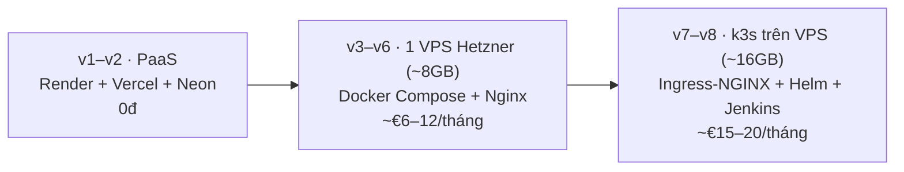

# PixelMart — Lộ trình học

PixelMart là dự án học tập theo kiểu Project-Based Learning. Đi hết lộ trình, bạn sẽ có:

1. **Một sản phẩm hoàn chỉnh:** nền tảng **multi-vendor e-commerce** gồm web (storefront, admin, seller) và mobile (Expo), chạy production trên domain thật.
2. **Kiến thức vững** về Redis, Nginx, RabbitMQ, Kafka, Docker, Kubernetes, GitHub Actions, Jenkins, Prometheus, Grafana và microservices. Bạn phải hiểu được **vì sao** cần từng thứ, không chỉ biết **cách** dùng.

## Cách dùng bộ tài liệu

```
docs/
├── README.md          ← bạn đang ở đây: bản đồ lộ trình
├── rules/             ← quy trình làm việc, áp dụng cho MỌI version
├── knowledge/         ← sổ tay tra cứu nhanh từng công nghệ
└── vN/
    ├── README.md      ← vì sao có version này, kiến trúc trước → sau, outcome, ngoài phạm vi
    ├── sprints/       ← "làm gì": ticket + Acceptance Criteria (nguồn để tạo Jira)
    └── plans/         ← "làm thế nào": khái niệm, hướng tiếp cận, gợi ý 3 cấp, bẫy, cách kiểm chứng
```

Thứ tự đọc khi bắt đầu một version:

1. `vN/README.md`: hiểu bài toán và nắm bức tranh tổng.
2. Các file `knowledge/*.md` được liệt kê trong mục "Kiến thức cần đọc trước".
3. Mỗi sprint: đọc `sprints/sprint-NN.md` (cái cần đạt), rồi `plans/sprint-NN.md` (cách tiếp cận). **Tự làm trước**, chỉ mở gợi ý khi đã kẹt hơn 30 phút.
4. Quy trình branch, PR, Jira, release luôn theo [`rules/`](rules/README.md).

## Lộ trình

| Ver | Chủ đề | Bài toán (vì sao phải học) | Công nghệ chính | Sprint | Trạng thái |
|---|---|---|---|---|---|
| [v1](v1/README.md) | MVP single-store | Bán hàng được end-to-end | NestJS monolith, Next.js, Vite admin, Docker cơ bản, GitHub Actions, Render/Vercel/Neon, Sentry | 1–7 | Đang làm · sprints + plans ✅ |
| [v2](v2/README.md) | Marketplace multi-vendor | Seller đăng ký mở shop, tồn kho theo shop, một giỏ hàng nhiều shop, tách đơn theo shop, hoa hồng, chi trả cho seller | Modular monolith, RBAC + ownership, aggregate Order/VendorOrder, double-entry ledger. *Không thêm infra* | 8–12 | Sẵn sàng · sprints + plans ✅ |
| [v3](v3/README.md) | Self-host | Chi phí và giới hạn của PaaS, muốn tự kiểm soát hạ tầng | Docker chuyên sâu, Compose production, **Nginx** (TLS qua Cloudflare, load balance, gzip, rate limit), Postgres tự host + backup off-site, GHCR + deploy qua SSH | 13–15 | Sẵn sàng · sprints + plans ✅ |
| v4 | Performance & Observability | Flash sale chậm và oversell. Muốn tối ưu thì phải đo trước | **Prometheus**, **Grafana**, Alertmanager, k6, **Redis** (cache, rate limit phân tán, giữ tồn kho atomic) | 16–18 | Chưa viết |
| v5 | Async processing | Checkout chậm vì gửi email, đơn chưa thanh toán phải tự hủy | **RabbitMQ**: worker, retry, DLQ, delayed message, idempotent consumer, outbox | 19–21 | Chưa viết |
| v6 | Mobile app | Khách mua hàng trên điện thoại, nhận push notification | Expo (React Native), dùng lại `contracts`/`api-client`, push qua worker | 22–25 | Chưa viết |
| v7 | Kubernetes & Jenkins | Một VPS chạy compose không scale được, không có staging | **K8s** (k3s/k3d), Ingress-NGINX, HPA, Helm, cert-manager, **Jenkins** CD staging → prod | 26–29 | Chưa viết |
| v8 | Microservices & Kafka | Tải và team tăng, cần tách module độc lập | **Microservices** (strangler fig, saga, CQRS), **Kafka**, OpenTelemetry, API gateway | 30–34 | Chưa viết |

> Số sprint của v2–v8 là ước lượng, sẽ được chốt khi viết chi tiết từng version. Không có lịch cố định: mỗi sprint 2 tuần, khoảng 9–10 story points.

## Nguyên tắc sư phạm

1. **Problem-first:** công nghệ chỉ xuất hiện khi sản phẩm gặp đúng bài toán của nó. Mỗi version mở đầu bằng một tình huống thực tế.
2. **Đo trước, tối ưu sau:** có monitoring (Prometheus/Grafana) rồi mới thêm cache (Redis), để chứng minh hiệu quả bằng số liệu.
3. **Mỗi lần đổi một biến:** học Kubernetes trên ứng dụng đã quen (v7), rồi mới đổi kiến trúc sang microservices trên platform đã quen (v8).
4. **Xen kẽ product và infra** để giữ động lực: v2 product → v3–v5 infra → v6 product → v7–v8 infra + kiến trúc.
5. **Thủ công trước, tự động hóa sau:** tự viết `nginx.conf` trước khi dùng Ingress, tự deploy qua SSH trước khi dùng Jenkins/Helm.

## Hạ tầng qua các version



- Domain: dùng domain đã mua, DNS quản lý qua Cloudflare. Mỗi thành phần một subdomain (`api.`, `shop.`, `admin.`, `seller.`, `grafana.`, `jenkins.`…).
- Giá VPS là ước tính (Hetzner tăng giá từ 04/2026). Kiểm tra lại trang giá khi đặt máy, chi tiết ở [v3](v3/README.md#hạ-tầng--chi-phí).
- PaaS tự host (Coolify…) **không** nằm trong lộ trình vì nó che mất đúng những thứ ta cần học. Xem phần so sánh trong knowledge base (v3).

## Công nghệ ↔ version

| Công nghệ | Xuất hiện | Vai trò trong PixelMart |
|---|---|---|
| Docker | v1 → v3 → v7 | v1: image API · v3: Compose production · v7: image cho K8s |
| GitHub Actions | v1 → v8 | CI cho mọi PR. v1–v6 làm cả CD |
| Nginx | v3 → v7 | v3: reverse proxy tự viết · v7: Ingress-NGINX |
| Prometheus | v4 → v8 | Metrics API/DB/Redis, alert |
| Grafana | v4 → v8 | Dashboard, đọc số liệu trước/sau tối ưu |
| Redis | v4 | Cache, rate limit, giữ tồn kho flash sale |
| RabbitMQ | v5 → v8 | Task queue: email, auto-cancel đơn, push |
| Kubernetes | v7 → v8 | Orchestration, staging/prod namespace |
| Jenkins | v7 → v8 | CD: build → staging → approve → prod |
| Kafka | v8 | Event backbone giữa các service |
| Microservices | v8 | Tách notification, search, analytics, payment |

Chi tiết từng công nghệ: [`knowledge/`](knowledge/README.md).

## Quy ước

- **Sprint đánh số liên tục toàn dự án:** v1 = sprint 1–7, v2 bắt đầu từ `sprint-08.md`. Mã ticket tạm `S8-01` = sprint 8, ticket 01. Jira key tăng liên tục.
- **Release:** sprint cuối của version lộ trình N → tag `vN.0.0`. Các sprint trước đó của version N tăng minor từ version trước. Ví dụ v2 (sprint 8–12): sprint 8–11 → `v1.1.0` … `v1.4.0`, sprint 12 → `v2.0.0`. **Major = mốc lộ trình**, không phải SemVer thuần, chi tiết ở [rule 01](rules/01-git-branching.md#quy-tắc-đánh-version-semver).
- **Sprint đánh dấu *draft*** phải được refine (cập nhật AC, estimate lại) trước khi kéo vào sprint. Xem [`rules/04-sprint-lifecycle.md`](rules/04-sprint-lifecycle.md).
- Quyết định kiến trúc → `docs/adr/`. Retro → `docs/retro/`. Hai thư mục này dùng chung cho mọi version.
