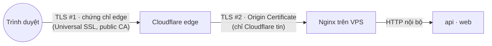
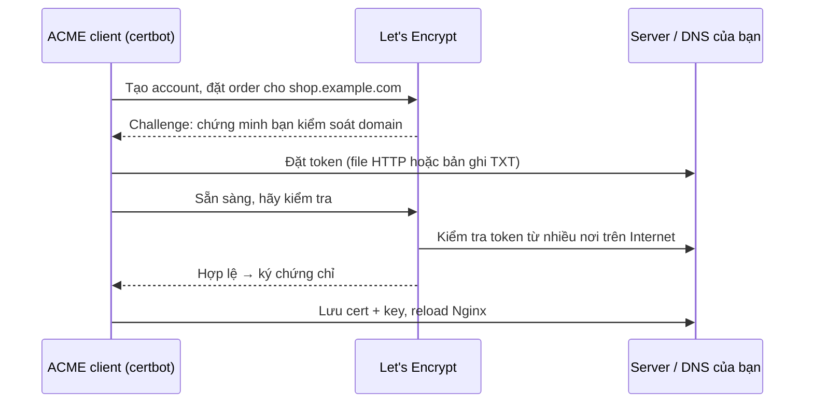

# DNS & TLS

> **TL;DR:** **DNS** biến tên miền (`shop.example.com`) thành địa chỉ IP. **TLS** mã hóa kết nối và chứng minh "server này đúng là `shop.example.com`" bằng chứng chỉ do một CA ký. PixelMart quản lý DNS ở Cloudflare từ v1. Ở v3, Cloudflare proxy traffic, dùng **Origin Certificate** giữa Cloudflare và VPS với chế độ **Full (strict)** (S13-05). Phần ACME/Let's Encrypt (mục 4) dành cho lúc bạn tự cấp chứng chỉ mà không có Cloudflare, và là nền cho cert-manager ở v7.

## 1. Nó là gì & giải quyết vấn đề gì

**Vấn đề 1: tìm ra server.** Máy tính nói chuyện bằng IP (`203.0.113.10`), con người nhớ tên. Khi đổi VPS, IP đổi. Nếu khách lưu IP thì mọi thứ hỏng. **DNS** là danh bạ phân tán: tên → IP, đổi một chỗ là cả Internet dần nhận ra.

**Vấn đề 2: nói chuyện an toàn.** HTTP gửi dữ liệu dạng rõ: mật khẩu, cookie đăng nhập đi qua Wi-Fi quán cà phê, qua nhà mạng, ai ở giữa cũng đọc và sửa được. Kẻ tấn công còn có thể giả làm server. **TLS** giải quyết hai việc:
- **Mã hóa** để người ở giữa không đọc/sửa được.
- **Xác thực** server: chứng chỉ chứa tên miền và public key, được một **CA** (Certificate Authority) mà trình duyệt tin cậy ký. Không có chứng chỉ hợp lệ cho đúng tên miền thì trình duyệt cảnh báo.

**So sánh đời thường:** DNS là **danh bạ điện thoại**: tra tên ra số. TLS là **gọi điện có xác minh danh tính và nói bằng mật mã**: CA giống cơ quan cấp căn cước. Ai cũng có thể in một tấm thẻ, nhưng chỉ thẻ do cơ quan được tin cậy cấp mới được chấp nhận.

## 2. Mô hình tư duy

**DNS**

| Khái niệm | Ý nghĩa |
|---|---|
| **Registrar vs DNS provider** | Registrar là nơi bạn mua domain. DNS provider là nơi giữ các bản ghi (nameserver). PixelMart mua domain ở registrar, trỏ nameserver về Cloudflare |
| **Bản ghi `A` / `AAAA`** | Tên → IPv4 / IPv6 |
| **`CNAME`** | Tên → tên khác (alias). Không đặt được ở apex (`example.com`) theo chuẩn. Cloudflare có "CNAME flattening" để làm được |
| **`TXT`** | Chuỗi văn bản, dùng để chứng minh quyền sở hữu domain (ACME DNS-01, xác minh Google…), SPF/DKIM cho email |
| **`CAA`** | Khai báo CA nào được phép cấp chứng chỉ cho domain. Không có bản ghi CAA nghĩa là CA nào cũng được |
| **`NS`** | Nameserver chịu trách nhiệm cho domain |
| **TTL** | Resolver được phép cache câu trả lời bao lâu (giây). TTL cao: ít truy vấn, nhưng đổi IP lâu thấm. **"DNS propagation" thực chất là chờ cache hết TTL** |
| **Resolver** | Máy đi hỏi thay bạn (của nhà mạng, `1.1.1.1`, `8.8.8.8`), có cache |

**Cloudflare: DNS only (đám mây xám) vs Proxied (đám mây cam)**

| | DNS only | Proxied |
|---|---|---|
| DNS trả về | IP thật của server | IP anycast của Cloudflare |
| Traffic | Đi thẳng client → server | Client → Cloudflare edge → server (origin) |
| TLS cho trình duyệt | Server tự lo chứng chỉ public | Cloudflare edge lo (Universal SSL, phủ apex + `*.example.com` một level) |
| Lộ IP origin | Có | Không (nếu bạn không lộ ở chỗ khác) |
| Đổi IP origin | Chờ hết TTL ở resolver | Gần như tức thì (resolver vẫn trỏ về Cloudflare, chỉ Cloudflare đổi đích). TTL hiển thị là "Auto" |
| Chỉ cho HTTP(S) | Không, mọi giao thức | Chỉ HTTP/HTTPS trên các cổng Cloudflare hỗ trợ. **SSH không đi qua proxy được** |

**TLS**

| Khái niệm | Ý nghĩa |
|---|---|
| **Cặp khóa** | Private key (bí mật tuyệt đối, nằm trên server) và public key (nằm trong chứng chỉ) |
| **Chứng chỉ (certificate)** | Public key + tên miền (SAN) + thời hạn + chữ ký của CA |
| **Chuỗi tin cậy (chain)** | Leaf cert ← intermediate CA ← root CA (có sẵn trong trình duyệt/OS). Server phải gửi **leaf + intermediate** (`fullchain`) |
| **SNI** | Client gửi tên miền ngay trong handshake để server có nhiều cert trên một IP chọn đúng cert |
| **Wildcard** | `*.example.com` phủ `shop.example.com` nhưng **không** phủ `example.com` và **không** phủ `a.b.example.com` (chỉ một level) |
| **HSTS** | Header bảo trình duyệt "chỉ dùng HTTPS với domain này trong N giây". Bật rồi thì khó quay lại HTTP |



**Các chế độ SSL/TLS của Cloudflare** (TLS #2 trong sơ đồ):

| Chế độ | Cloudflare → origin | Đánh giá |
|---|---|---|
| Off / Flexible | HTTP thường | ❌ Đoạn Cloudflare → VPS không mã hóa. Flexible còn gây vòng lặp redirect nếu origin ép HTTPS |
| Full | HTTPS, **không kiểm tra** chứng chỉ | ⚠️ Mã hóa nhưng ai chặn giữa đường cũng giả được origin |
| **Full (strict)** | HTTPS, chứng chỉ phải **hợp lệ, còn hạn, đúng hostname**, do public CA hoặc Cloudflare Origin CA ký | ✅ Chọn cái này |

**Origin Certificate** là chứng chỉ do Cloudflare Origin CA ký, **chỉ Cloudflare tin**, trình duyệt thì không. Ưu điểm: tạo trong vài giây, thời hạn dài (chọn được nhiều mức, mặc định 15 năm), không cần ACME. Nhược điểm: chỉ dùng được khi record là **proxied**. Tắt proxy (đám mây xám) là trình duyệt báo lỗi chứng chỉ ngay.

## 3. Lệnh / cấu hình hay dùng

**DNS**

| Lệnh | Dùng khi | Ghi chú |
|---|---|---|
| `dig shop.example.com +short` | Xem tên phân giải ra IP gì | Proxied → thấy IP Cloudflare |
| `dig shop.example.com @1.1.1.1` | Hỏi một resolver cụ thể | So sánh nhiều resolver khi "chỗ này thấy, chỗ kia không" |
| `dig shop.example.com +trace` | Đi từ root → TLD → nameserver | Kiểm tra nameserver đã trỏ về Cloudflare chưa |
| `dig example.com NS` / `CAA` / `TXT` | Xem bản ghi theo loại | |
| `dig shop.example.com` (xem cột số) | Xem TTL còn lại trong cache của resolver | Số giảm dần mỗi lần hỏi |
| `nslookup shop.example.com` | Trên Windows khi không có `dig` | `Resolve-DnsName` trong PowerShell |

**TLS**

| Lệnh | Dùng khi |
|---|---|
| `curl -vI https://shop.example.com` | Xem handshake, chứng chỉ, issuer, header |
| `openssl s_client -connect <ip>:443 -servername shop.example.com </dev/null` | Xem chứng chỉ origin trả về cho một SNI cụ thể (bỏ qua Cloudflare) |
| `openssl x509 -in origin.pem -noout -subject -issuer -dates -ext subjectAltName` | Xem tên miền phủ và hạn của một file chứng chỉ |
| `curl --resolve shop.example.com:443:<ip> https://shop.example.com -k -v` | Gọi thẳng origin với đúng SNI (cần `-k` vì Origin Cert không được trình duyệt tin) |

**Nginx dùng Origin Certificate**

```nginx
server {
    listen 443 ssl;
    http2 on;
    server_name shop.example.com;
    ssl_certificate     /etc/nginx/certs/origin.pem;   # mount từ host, không nằm trong image
    ssl_certificate_key /etc/nginx/certs/origin.key;   # quyền đọc chặt (chỉ root/nginx)
    ssl_protocols TLSv1.2 TLSv1.3;
}
```

**Chỉ cho Cloudflare vào origin:** danh sách IP ở https://www.cloudflare.com/ips-v4 và https://www.cloudflare.com/ips-v6 (hoặc API `https://api.cloudflare.com/client/v4/ips`). Đưa vào firewall của nhà cung cấp VPS cho cổng 80/443, và vào `set_real_ip_from` của Nginx (xem [nginx.md](nginx.md)).

## 4. ACME & Let's Encrypt: cần biết khi không dùng Cloudflare

PixelMart v3 dùng Origin Certificate nên **không cần** phần này để hoàn thành sprint. Nhưng bạn sẽ gặp nó ở hầu hết công ty: server không đứng sau Cloudflare, Caddy/Traefik tự xin chứng chỉ, và cert-manager trên Kubernetes (v7) chính là một ACME client.

### ACME là gì

**ACME** (RFC 8555) là giao thức để một chương trình (ACME client) **tự động** xin chứng chỉ từ CA. **Let's Encrypt** là CA miễn phí phổ biến nhất nói ACME (ngoài ra còn ZeroSSL, Google Trust Services…). Luồng rút gọn:



### Ba loại challenge

| Challenge | CA kiểm tra gì | Yêu cầu | Wildcard | Dùng khi |
|---|---|---|---|---|
| **HTTP-01** | `http://<domain>/.well-known/acme-challenge/<token>` trả đúng nội dung | **Cổng 80** mở ra Internet, domain trỏ về server | ❌ | Phổ biến nhất, một server, có cổng 80 |
| **DNS-01** | Bản ghi `TXT _acme-challenge.<domain>` có đúng giá trị | Client có quyền sửa DNS qua API | ✅ **Bắt buộc** cho wildcard | Wildcard, server không mở cổng 80, server nội bộ |
| **TLS-ALPN-01** | Handshake TLS trên **cổng 443** trả chứng chỉ đặc biệt | Client kiểm soát được TLS ở cổng 443 | ❌ | Caddy/Traefik dùng. **Không chạy** sau proxy kết thúc TLS (Cloudflare proxied) |

Let's Encrypt đã công bố kế hoạch thêm phương thức **DNS-PERSIST-01** (bản ghi TXT không phải đổi mỗi lần gia hạn). Kiểm tra docs hiện hành trước khi dùng.

### Các ACME client hay gặp

| Client | Đặc điểm |
|---|---|
| **certbot** | Của EFF, phổ biến nhất, có plugin cho Nginx và nhiều DNS provider (`certbot-dns-cloudflare`) |
| **acme.sh** | Shell script thuần, hỗ trợ rất nhiều DNS API, không cần Python |
| **lego** | Binary Go, dễ đưa vào container/CI |
| **Caddy, Traefik** | Web server/proxy **tích hợp sẵn** ACME: khai báo domain là có HTTPS |
| **cert-manager** | Controller trên Kubernetes, quản lý chứng chỉ như một resource (v7) |

### Webroot vs standalone (với certbot + HTTP-01)

| Chế độ | Cách làm | Ưu/nhược |
|---|---|---|
| `--webroot -w /var/www/acme` | Certbot ghi token vào một thư mục, **Nginx đang chạy** phục vụ thư mục đó qua `location /.well-known/acme-challenge/` | Không downtime. Nginx trong container phải mount chung thư mục đó |
| `--standalone` | Certbot tự mở một web server ở cổng 80 | Phải **dừng Nginx** lúc xin/gia hạn → downtime, dễ quên |
| `--nginx` | Certbot tự sửa config Nginx | Tiện, nhưng sửa file của bạn. Không hợp khi config nằm trong image |

### Gia hạn tự động

- Chứng chỉ Let's Encrypt hiện mặc định có hạn **90 ngày**, và đang được rút ngắn dần: Let's Encrypt công bố sẽ giảm tối đa xuống **45 ngày vào khoảng tháng 2/2028** (theo quy định chung của ngành, tối đa 47 ngày từ năm 2029). Ngoài ra đã có chứng chỉ **6 ngày** (short-lived) tùy chọn. Kết luận: **gia hạn thủ công là không thể**, phải tự động hóa ngay từ đầu.
- Certbot cài từ gói thường kèm systemd timer chạy `certbot renew` mỗi ngày hai lần. Nó chỉ gia hạn khi gần hết hạn.
- **Reload web server sau khi gia hạn:** Nginx chỉ đọc file chứng chỉ lúc start/reload. Gia hạn mà không reload thì Nginx vẫn dùng cert cũ cho tới khi hết hạn. Dùng `--deploy-hook "systemctl reload nginx"` (hoặc `docker compose exec edge nginx -s reload` nếu Nginx chạy trong container).
- **Let's Encrypt đã ngừng gửi email nhắc hết hạn từ 04/06/2025.** Muốn được nhắc thì phải tự giám sát (uptime monitor kiểm tra hạn chứng chỉ, dịch vụ theo dõi certificate).
- Client mới hỗ trợ **ARI** (ACME Renewal Information): CA gợi ý thời điểm nên gia hạn, ví dụ khi cần thu hồi hàng loạt.
- Let's Encrypt **đã ngừng OCSP** (tắt OCSP responder theo lịch 06/08/2025), chuyển sang CRL. Với website thì không ảnh hưởng. Bỏ `ssl_stapling` khỏi config cũ nếu Nginx log cảnh báo.

### Rate limit và môi trường staging

Let's Encrypt giới hạn số chứng chỉ để chống lạm dụng. Một số giới hạn chính (kiểm tra trang rate limits hiện hành, số có thể thay đổi):

| Giới hạn | Mức |
|---|---|
| Chứng chỉ mới cho một registered domain (`example.com` và mọi subdomain) | 50 / 7 ngày |
| Chứng chỉ trùng **đúng** bộ tên miền | 5 / 7 ngày (không xin nới được) |
| Xác minh thất bại cho một tên miền, một account | 5 / giờ |

Hệ quả: script xin chứng chỉ bị lỗi chạy lặp lại trong CI có thể khóa domain của bạn cả tuần. **Luôn thử bằng môi trường staging** (`certbot --staging`, hoặc URL `https://acme-staging-v02.api.letsencrypt.org/directory`) cho tới khi mọi thứ chạy đúng, rồi mới đổi sang production. Chứng chỉ staging không được trình duyệt tin, đó là bình thường.

### ACME khi domain nằm sau Cloudflare proxy

| Cách | Có chạy không | Ghi chú |
|---|---|---|
| HTTP-01 qua record proxied | Thường chạy (Cloudflare chuyển request `/.well-known/acme-challenge/` về origin) | Rule redirect/WAF/cache của Cloudflare có thể làm hỏng. Khó debug |
| TLS-ALPN-01 qua record proxied | ❌ | Cloudflare kết thúc TLS ở edge, CA không thấy handshake của origin |
| **DNS-01 với API token của Cloudflare** | ✅ Ổn định nhất | Token **chỉ** có quyền `Zone → DNS → Edit` trên **đúng một zone**. Không dùng Global API Key |

### CAA

Bản ghi `CAA` giới hạn CA được cấp chứng chỉ, ví dụ `example.com. CAA 0 issue "letsencrypt.org"`. Nếu bạn thêm CAA mà quên CA của Cloudflare (Universal SSL dùng nhiều CA khác nhau), edge certificate có thể không gia hạn được. Cloudflare có cơ chế tự thêm CAA cho CA của nó khi zone đã có CAA. Hãy kiểm tra lại sau khi sửa.

## 5. Khi nào nên / không nên dùng

| Cách cấp TLS cho origin | Nên dùng khi | Không nên khi |
|---|---|---|
| **Cloudflare proxy + Origin Certificate** | Mọi traffic web đều qua Cloudflare, muốn ẩn IP origin, không muốn lo gia hạn | Cần truy cập thẳng origin bằng trình duyệt, hoặc muốn rời Cloudflare dễ dàng |
| **Let's Encrypt (HTTP-01)** | Server một mình có cổng 80, không đứng sau proxy | Cần wildcard, hoặc không mở được cổng 80 |
| **Let's Encrypt (DNS-01)** | Wildcard, server nội bộ, nhiều server cùng tên | DNS provider không có API |
| **Caddy/Traefik tự lo** | Muốn HTTPS "không phải nghĩ", ít service | Muốn hiểu và điều khiển từng bước (mục tiêu của v3) |
| **Chứng chỉ trả phí (OV/EV)** | Yêu cầu hợp đồng/pháp lý cụ thể | Hầu hết web app: không đem lại thêm bảo mật so với DV miễn phí |

**Cloudflare proxy nói chung:** nên dùng khi muốn CDN, chống DDoS cơ bản, ẩn IP origin, đổi origin tức thì. Cân nhắc khi: Cloudflare thấy được toàn bộ traffic đã giải mã (vì nó kết thúc TLS), có giới hạn thời gian request (lỗi 524), và upload lớn bị giới hạn kích thước ở gói free.

## 6. Bẫy fresher/junior hay gặp

| Triệu chứng | Nguyên nhân | Cách sửa |
|---|---|---|
| Cloudflare báo **526 Invalid SSL certificate** | Full (strict) nhưng origin trả cert tự ký, hết hạn, hoặc không phủ hostname | Dùng Origin Certificate phủ đúng tên. Kiểm tra bằng `openssl s_client -servername` |
| **525 SSL handshake failed** | Origin không nói TLS ở cổng 443, hoặc không có `server` khớp SNI | Kiểm tra `listen 443 ssl` và `server_name` |
| **521 / 522** | 521: origin từ chối kết nối (Nginx không chạy). 522: timeout (firewall chặn IP Cloudflare, sai IP trong record) | Kiểm tra container `edge`, firewall, IP trong DNS |
| Vòng lặp redirect vô tận | Chế độ **Flexible** (Cloudflare gọi origin bằng HTTP) + origin redirect HTTP → HTTPS | Chuyển sang Full (strict) |
| `shop.next.example.com` báo lỗi chứng chỉ | Universal SSL và Origin Cert mặc định chỉ phủ **một level** `*.example.com` | Đặt tên một level (`next-shop.example.com`), hoặc tạo cert riêng cho level sâu hơn (trả phí ở edge) |
| Tắt proxy (đám mây xám) để debug → trình duyệt báo cert không tin cậy | Origin Certificate chỉ Cloudflare tin | Bật lại proxy, debug bằng `curl -k --resolve` |
| Đổi IP trong DNS nhưng một số người vẫn vào server cũ hàng giờ | Record DNS only có TTL cao, resolver còn cache | Hạ TTL xuống thấp (ví dụ 60–300 giây) **trước** khi đổi ít nhất bằng TTL cũ. Record proxied thì đổi origin gần như tức thì |
| IP origin bị lộ dù đã bật proxy | Còn record DNS only cũ trỏ thẳng IP (`direct.`, `ftp.`), hoặc email gửi từ server ghi IP trong header, hoặc lịch sử DNS công khai | Chỉ cho IP Cloudflare vào 80/443 ở firewall. Lộ IP thì cũng không vào được |
| Commit nhầm `origin.key` lên GitHub | Để key trong thư mục repo | Thu hồi (revoke) cert ngay ở Cloudflare, tạo cert mới. Key nằm ngoài repo, quyền `600` |
| Let's Encrypt báo `too many certificates` / `too many failed authorizations` | Thử nghiệm trên production, script lặp | Dùng staging. Chờ hết khung thời gian của rate limit |
| Gia hạn thành công nhưng trình duyệt vẫn thấy cert cũ sắp hết hạn | Không reload Nginx sau khi gia hạn | `--deploy-hook` reload |
| HTTP-01 thất bại | Cổng 80 bị firewall chặn, redirect sai, `location` acme không khớp, DNS chưa trỏ về server | `curl http://<domain>/.well-known/acme-challenge/test` từ máy ngoài |
| Bật HSTS `includeSubDomains; preload` rồi một subdomain nội bộ chỉ có HTTP không truy cập được nữa | HSTS áp dụng cho mọi subdomain, preload rất khó gỡ | Bắt đầu HSTS với `max-age` ngắn, chỉ thêm `includeSubDomains`/`preload` khi chắc chắn mọi subdomain đều có HTTPS |

## 7. Debug nhanh

**"Website không vào được"** theo thứ tự:
1. **DNS:** `dig shop.example.com +short`. Có ra IP không? Proxied thì ra IP Cloudflare, DNS only thì ra IP VPS đúng không?
2. **Cloudflare:** mã lỗi 52x trên trang lỗi của Cloudflare cho biết lỗi nằm ở đoạn nào (bảng mục 6).
3. **Origin có sống không:** từ máy của bạn (nếu firewall cho phép) hoặc từ chính VPS: `curl -k --resolve shop.example.com:443:127.0.0.1 https://shop.example.com/ -v`.
4. **Chứng chỉ origin:** `openssl s_client -connect <ip>:443 -servername shop.example.com` → xem `subject`, `issuer`, hạn, SAN.
5. **Firewall:** quét cổng từ máy bên ngoài. Dải IP Cloudflare trong firewall có đủ IPv4 và IPv6 không?

**Đổi DNS mà chưa thấy tác dụng:**
1. `dig @1.1.1.1` và `dig @8.8.8.8`: hai resolver lớn đã thấy giá trị mới chưa?
2. Xem TTL còn lại. Chờ hết TTL cũ.
3. Cache trên máy: `ipconfig /flushdns` (Windows), trình duyệt (`chrome://net-internals/#dns`).

**Chứng chỉ Let's Encrypt không gia hạn:**
1. `certbot renew --dry-run` (chạy với staging, không tốn rate limit).
2. `systemctl list-timers | grep certbot`: timer có chạy không?
3. Log ở `/var/log/letsencrypt/`.

## 8. Trong PixelMart

| Version | Dùng thế nào | Ticket/plan |
|---|---|---|
| v1 | Domain trỏ nameserver về Cloudflare. `api.` → Render, `shop.`, `admin.` → Vercel (record DNS only, nền tảng tự cấp cert) | PXM-13 ([plan Sprint 1](../v1/plans/sprint-01.md)) |
| v3 | Record **proxied** cho các hostname preview `next-shop.`, `next-admin.`, `next-seller.`, `next-api.` (một level, để wildcard phủ được). Origin Certificate phủ `<domain>` + `*.<domain>`, key nằm trên VPS. Chế độ **Full (strict)** | S13-05 ([plan Sprint 13](../v3/plans/sprint-13.md)) |
| v3 | Firewall chỉ cho dải IP Cloudflare vào 80/443. Authenticated Origin Pulls (mTLS giữa Cloudflare và origin) là phần mở rộng tùy chọn | S14-03 ([plan Sprint 14](../v3/plans/sprint-14.md)) |
| v3 | Cutover: hạ TTL các record production đang DNS only **trước** 24–48 giờ, chuyển sang record proxied trỏ VPS. Sau khi proxied, đổi origin gần như tức thì | S15-03 ([plan Sprint 15](../v3/plans/sprint-15.md)) |
| v7 | cert-manager (ACME client trên Kubernetes) với DNS-01 qua API Cloudflare, hoặc tiếp tục dùng Origin Certificate dưới dạng Secret | v7 |

## 9. Câu hỏi phỏng vấn hay gặp

1. Gõ `https://shop.example.com` vào trình duyệt thì DNS và TLS diễn ra thế nào?
<details><summary>Gợi ý trả lời</summary>

Trình duyệt hỏi resolver (có cache theo TTL). Resolver đi từ root → TLD `.com` → nameserver của `example.com` để lấy bản ghi A/AAAA. Trình duyệt mở TCP tới IP, bắt đầu TLS handshake gửi kèm SNI `shop.example.com`. Server gửi chứng chỉ + intermediate. Trình duyệt kiểm tra chuỗi tới root tin cậy, tên miền, thời hạn. Hai bên thỏa thuận khóa phiên, rồi HTTP request đi trong kênh mã hóa.
</details>

2. Vì sao DNS "propagation" mất thời gian, và làm sao để cutover nhanh?
<details><summary>Gợi ý trả lời</summary>

Không có quá trình lan truyền chủ động nào. Các resolver cache câu trả lời cũ cho tới khi hết TTL. Muốn đổi nhanh thì hạ TTL trước ít nhất bằng TTL cũ, rồi mới đổi. Với Cloudflare proxied, resolver luôn thấy IP của Cloudflare nên đổi origin có hiệu lực gần như ngay.
</details>

3. Full và Full (strict) của Cloudflare khác nhau thế nào?
<details><summary>Gợi ý trả lời</summary>

Cả hai đều dùng HTTPS từ Cloudflare tới origin. Full không kiểm tra chứng chỉ origin, nên kẻ chặn giữa Cloudflare và origin có thể giả origin. Full (strict) yêu cầu chứng chỉ hợp lệ, còn hạn, đúng hostname, do public CA hoặc Cloudflare Origin CA ký.
</details>

4. HTTP-01 và DNS-01 khác nhau thế nào? Khi nào bắt buộc dùng DNS-01?
<details><summary>Gợi ý trả lời</summary>

HTTP-01 chứng minh quyền kiểm soát bằng một file phục vụ qua cổng 80 của domain. DNS-01 bằng bản ghi TXT. Wildcard bắt buộc DNS-01. DNS-01 cũng hợp khi server không mở cổng 80 hoặc là server nội bộ. Đổi lại, client cần API token sửa DNS, nên token phải được giới hạn quyền chặt.
</details>

5. Vì sao chứng chỉ ngày càng ngắn hạn? Ảnh hưởng gì tới vận hành?
<details><summary>Gợi ý trả lời</summary>

Chứng chỉ ngắn hạn giới hạn thiệt hại khi private key bị lộ và giảm phụ thuộc vào cơ chế thu hồi (vốn kém hiệu quả). Ngành đang đi tới tối đa 47 ngày, Let's Encrypt 45 ngày. Hệ quả: gia hạn bắt buộc tự động, phải có giám sát hạn chứng chỉ và reload server sau khi gia hạn.
</details>

6. Wildcard `*.example.com` có phủ `example.com` và `a.b.example.com` không?
<details><summary>Gợi ý trả lời</summary>

Không phủ cả hai. Wildcard chỉ khớp đúng một label ở vị trí `*`. Apex phải được thêm riêng vào SAN, và `a.b.example.com` cần `*.b.example.com`.
</details>

7. Làm sao ngăn người khác truy cập thẳng origin, bỏ qua Cloudflare?
<details><summary>Gợi ý trả lời</summary>

Firewall chỉ cho dải IP Cloudflare vào 80/443. Thêm Authenticated Origin Pulls (Cloudflare trình chứng chỉ client, origin kiểm tra bằng mTLS), tốt nhất là chứng chỉ riêng cho zone thay vì chứng chỉ dùng chung của Cloudflare. Hoặc dùng Cloudflare Tunnel để origin không mở cổng vào nào.
</details>

## 10. Tài liệu chính thức

- Cloudflare: proxy status: https://developers.cloudflare.com/dns/proxy-status/
- Cloudflare: SSL/TLS encryption modes: https://developers.cloudflare.com/ssl/origin-configuration/ssl-modes/
- Cloudflare: Origin CA: https://developers.cloudflare.com/ssl/origin-configuration/origin-ca/
- Cloudflare: Authenticated Origin Pulls: https://developers.cloudflare.com/ssl/origin-configuration/authenticated-origin-pull/
- Cloudflare: mã lỗi 5xx: https://developers.cloudflare.com/support/troubleshooting/http-status-codes/cloudflare-5xx-errors/
- Cloudflare IP ranges: https://www.cloudflare.com/ips/
- Let's Encrypt: How it works: https://letsencrypt.org/how-it-works/
- Let's Encrypt: challenge types: https://letsencrypt.org/docs/challenge-types/
- Let's Encrypt: rate limits: https://letsencrypt.org/docs/rate-limits/
- Let's Encrypt: staging environment: https://letsencrypt.org/docs/staging-environment/
- Let's Encrypt: certificate lifetimes: https://letsencrypt.org/docs/cert-lifetimes/
- Let's Encrypt: ending OCSP: https://letsencrypt.org/2024/12/05/ending-ocsp/
- Let's Encrypt: ending expiration emails: https://letsencrypt.org/2025/01/22/ending-expiration-emails/
- Certbot docs: https://eff-certbot.readthedocs.io/
- RFC 8555 (ACME): https://www.rfc-editor.org/rfc/rfc8555
