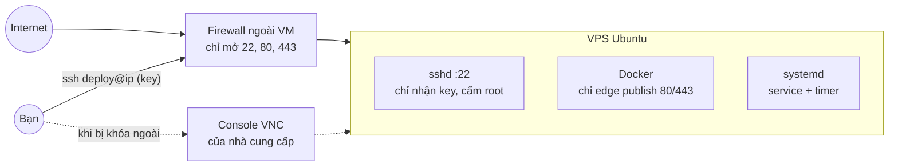

# Linux VPS

> **TL;DR:** VPS (Virtual Private Server) là một máy ảo Linux bạn thuê theo tháng/giờ, có IP public và toàn quyền root. Bạn tự lo mọi thứ PaaS từng lo: đăng nhập an toàn, firewall, cập nhật bảo mật, ổ đĩa, process, log. PixelMart dùng một VPS (ví dụ trong tài liệu là Hetzner, Ubuntu 24.04) từ v3 để chạy toàn bộ stack bằng Docker Compose, và nâng lên k3s ở v7.

## 1. Nó là gì & giải quyết vấn đề gì

**Vấn đề:** PaaS (Render, Vercel, Neon) tiện nhưng có giới hạn: app ngủ khi idle, không chạy được Prometheus/Redis/RabbitMQ trên gói free, không đặt được firewall hay rate limit theo ý mình, và giá tăng nhanh khi lớn lên.

**VPS giải quyết bằng cách:** cho bạn một máy Linux "trắng". Muốn chạy gì cũng được, chi phí cố định, nhưng **mọi trách nhiệm vận hành chuyển sang bạn**.

**So sánh đời thường:** PaaS giống **ở khách sạn**: có người dọn phòng, sửa điện, bảo vệ, nhưng không được đục tường. VPS giống **thuê một căn hộ trống**: muốn sắp xếp gì cũng được, nhưng khóa cửa, sửa ống nước, đổ rác là việc của bạn. Quên khóa cửa (SSH bằng mật khẩu, port DB mở ra Internet) thì sẽ có người vào.

**Nếu không có những kiến thức trong file này:** một VPS mới với SSH bằng mật khẩu sẽ bị dò mật khẩu (brute force) liên tục ngay trong vài phút sau khi có IP. Port Postgres lỡ mở ra ngoài sẽ bị quét và tấn công trong vài giờ.

## 2. Mô hình tư duy

| Khái niệm | Ý nghĩa |
|---|---|
| **SSH key** | Cặp khóa: private key nằm trên máy bạn (không bao giờ chia sẻ), public key đặt trong `~/.ssh/authorized_keys` trên server. An toàn hơn mật khẩu rất nhiều |
| **`sshd`** | Dịch vụ nhận kết nối SSH. Cấu hình ở `/etc/ssh/sshd_config` **và** các file trong `/etc/ssh/sshd_config.d/` |
| **User & sudo** | Không làm việc hằng ngày bằng `root`. Tạo user riêng (ví dụ `deploy`), dùng `sudo` khi cần quyền root |
| **Firewall ngoài VM** | Firewall của nhà cung cấp (Hetzner Cloud Firewall, firewall trong hPanel của Hostinger…), lọc traffic **trước khi** nó tới máy |
| **Firewall trong VM** | `ufw`/`iptables`/`nftables` chạy trong chính máy. **Docker tự ghi rule iptables và vượt qua UFW** với các port đã publish |
| **systemd** | Trình quản lý service của Ubuntu. Service (`.service`) chạy liên tục, timer (`.timer`) chạy định kỳ thay cho cron |
| **journald** | Log của systemd, đọc bằng `journalctl` |
| **Swap** | Vùng ổ đĩa dùng như RAM dự phòng. Không làm máy nhanh hơn, nhưng giúp tránh bị OOM killer giết process khi RAM đột ngột tăng |
| **Console của nhà cung cấp** | Màn hình VNC/serial trên web. Là **cửa sau** khi bạn tự khóa mình khỏi SSH |



## 3. Lệnh / cấu hình hay dùng

**SSH từ máy bạn**

| Lệnh | Dùng khi | Ghi chú |
|---|---|---|
| `ssh-keygen -t ed25519 -C "ban@laptop"` | Tạo cặp khóa | Đặt passphrase cho key cá nhân. Key cho CI thì tạo riêng |
| `ssh-copy-id deploy@<ip>` | Đưa public key lên server | Hoặc dán vào `~/.ssh/authorized_keys` (quyền `600`, thư mục `.ssh` quyền `700`) |
| `ssh -v deploy@<ip>` | Debug không kết nối được | `-vvv` để xem chi tiết hơn |
| `ssh-keygen -R <ip>` | Xóa host key cũ sau khi dựng lại VPS | Chỉ làm khi **chắc chắn** server đã được dựng lại |
| `ssh -L 5433:localhost:5432 deploy@<ip>` | Mở tunnel để dùng công cụ DB trên máy bạn mà không mở port 5432 ra Internet | Postgres trong Docker phải publish ở `127.0.0.1` của VPS, hoặc dùng `docker compose exec` |

`~/.ssh/config` giúp gõ ngắn:

```
Host pixelmart
  HostName <ip>
  User deploy
  IdentityFile ~/.ssh/id_ed25519
```

→ `ssh pixelmart`.

**Hardening `sshd`**

| Việc | Lệnh / cấu hình |
|---|---|
| Xem cấu hình **thực tế** đang áp dụng | `sudo sshd -T \| grep -Ei 'permitrootlogin\|passwordauthentication'` |
| Tìm file ghi đè | `ls /etc/ssh/sshd_config.d/` (Ubuntu cloud image thường có `50-cloud-init.conf`) |
| Đặt cấu hình của bạn | Tạo file **số nhỏ** như `/etc/ssh/sshd_config.d/00-hardening.conf` với `PermitRootLogin no`, `PasswordAuthentication no`, `KbdInteractiveAuthentication no` |
| Kiểm tra cú pháp trước khi áp dụng | `sudo sshd -t` |
| Áp dụng | `sudo systemctl reload ssh` (trên Ubuntu 24.04 tên unit là `ssh`) |

> Với OpenSSH, **giá trị đọc được đầu tiên thắng**. Các file trong `sshd_config.d/` được `Include` ở đầu `sshd_config`, nên chúng thắng các dòng bên dưới của file chính, và file `00-…` thắng file `50-…`. Luôn xác nhận bằng `sshd -T`, đừng đoán theo tên file.

**User, quyền file**

| Lệnh | Dùng khi |
|---|---|
| `adduser deploy && usermod -aG sudo deploy` | Tạo user có sudo |
| `usermod -aG docker deploy` | Cho chạy Docker không cần sudo. ⚠️ Nhóm `docker` **tương đương root** (xem mục 6) |
| `chmod 600 .env` / `chown deploy:deploy .env` | File chứa secret chỉ chủ sở hữu đọc được |
| `ls -la` / `stat <file>` | Xem quyền, chủ sở hữu |

**Cập nhật, giờ, swap**

| Lệnh | Dùng khi |
|---|---|
| `sudo apt update && sudo apt upgrade` | Cập nhật lần đầu |
| `sudo apt install unattended-upgrades && sudo dpkg-reconfigure unattended-upgrades` | Tự cài bản vá bảo mật |
| `cat /var/run/reboot-required` | File tồn tại = có bản vá kernel cần reboot |
| `sudo timedatectl set-timezone UTC` | Đặt UTC để log, cron, backup thống nhất |
| `sudo fallocate -l 2G /swapfile && sudo chmod 600 /swapfile && sudo mkswap /swapfile && sudo swapon /swapfile` | Tạo swap. Thêm `/swapfile none swap sw 0 0` vào `/etc/fstab` để giữ sau reboot |

**systemd & log**

| Lệnh | Dùng khi |
|---|---|
| `systemctl status docker` | Service đang chạy không, lỗi gần nhất |
| `sudo systemctl enable --now <unit>` | Bật và chạy ngay, tự chạy khi boot |
| `systemctl list-timers` | Xem các timer, lần chạy trước/sau |
| `sudo systemctl start pg-backup.service` | Chạy thử job của timer ngay lập tức |
| `journalctl -u pg-backup.service -n 100 --no-pager` | Log của một unit |
| `journalctl -f` / `journalctl -p err -b` | Theo dõi log / chỉ lỗi từ lần boot này |
| `systemd-analyze calendar "*-*-* 02:30:00"` | Kiểm tra biểu thức `OnCalendar` trước khi dùng |

Khung một timer (chạy service cùng tên):

```ini
# /etc/systemd/system/pg-backup.timer
[Timer]
OnCalendar=*-*-* 02:30:00
# máy tắt lúc 02:30 thì chạy bù khi bật lại (systemd không cho comment cùng dòng với giá trị)
Persistent=true

[Install]
WantedBy=timers.target
```

**Tài nguyên, mạng, process**

| Lệnh | Dùng khi |
|---|---|
| `df -h` | Ổ đĩa còn bao nhiêu |
| `sudo du -sh /var/lib/docker/* \| sort -h` | Cái gì chiếm chỗ |
| `free -h` | RAM, swap |
| `htop` / `top` | CPU, RAM theo process. Cột `st` (steal) cao = VPS bị chia CPU cho khách khác |
| `sudo ss -tlnp` | Port nào đang listen, process nào. Thấy `0.0.0.0:5432` là có vấn đề |
| `uptime` | Load average |
| `systemd-detect-virt` / `uname -m` | Loại ảo hóa (`kvm`?), kiến trúc (`x86_64`?) |

**Firewall**

| Lệnh | Dùng khi |
|---|---|
| `nmap -Pn -p 1-65535 <ip>` | **Từ một máy khác** (laptop, không phải VPS): xem thật sự port nào mở ra Internet |
| `sudo ufw status verbose` | Xem rule UFW. ⚠️ Không phản ánh các port Docker đã publish |
| `sudo iptables -L DOCKER-USER -n -v` | Xem rule bạn chèn trước rule của Docker |

## 4. Dùng thế nào cho hiệu quả

1. **Đăng nhập bằng key từ lúc tạo máy.** Hầu hết nhà cung cấp cho chọn SSH key khi tạo VPS. Khi đó root chưa từng có mật khẩu, bớt hẳn một giai đoạn nguy hiểm.
2. **Luôn giữ một phiên SSH đang mở** khi sửa `sshd` hoặc firewall. Mở phiên thứ hai để thử đăng nhập. Phiên thứ hai không vào được thì sửa lại bằng phiên thứ nhất. Thoát cả hai thì chỉ còn cách dùng console.
3. **Firewall ngoài VM là lớp chính** cho máy chạy Docker. Lớp này nằm ngoài máy nên Docker không ghi đè được. Chỉ mở 22, 80, 443. Sau v3/S14-03, 80/443 chỉ mở cho dải IP của Cloudflare.
4. **Chỉ publish port của `edge`.** Mọi service khác nằm trong mạng nội bộ của Compose. Thật sự cần truy cập từ host thì publish ở `127.0.0.1:5432:5432`, không phải `5432:5432`.
5. **Kiểm chứng từ bên ngoài.** Sau mọi thay đổi firewall, chạy `nmap` từ máy khác. `ufw status` và cảm giác "chắc là đóng rồi" đều không đáng tin.
6. **Timezone UTC** cho server, log, cron, tên file backup. Chỉ đổi sang giờ Việt Nam khi hiển thị cho người dùng.
7. **Ghi lại mọi lệnh đã chạy** thành runbook (S13-01). Một VPS bạn không dựng lại được từ ghi chép là một VPS bạn không thật sự kiểm soát.
8. **Cập nhật bảo mật tự động + reboot có kế hoạch.** `unattended-upgrades` cài bản vá, nhưng kernel mới chỉ có hiệu lực sau reboot. Kiểm tra `/var/run/reboot-required` hằng tuần, reboot vào giờ thấp điểm.
9. **Theo dõi ổ đĩa.** Nguyên nhân sập số một của VPS nhỏ: log Docker không giới hạn, image cũ, file dump. Giới hạn log trong `daemon.json`, `docker image prune` sau deploy.
10. **Snapshot trước thay đổi lớn** (nâng Ubuntu, đổi cấu hình Docker). Snapshot **không thay** được backup Postgres: snapshot lúc DB đang ghi có thể không nhất quán, và nó nằm cùng nhà cung cấp.

### Khi nhà cung cấp không có firewall ngoài VM

Một số VPS (nhiều nhà cung cấp ở Việt Nam) không có firewall ngoài VM. Khi đó bạn phải chặn trong máy:

- Port của Docker: chèn rule vào chain **`DOCKER-USER`** (Docker xử lý chain này trước rule của nó). Gói tin tới đây đã qua DNAT, nên muốn lọc theo port gốc trên host phải dùng `conntrack` (`-m conntrack --ctorigdstport 443`), xem docs Docker ở mục 10.
- Port của host (SSH): dùng UFW như bình thường.
- Rule `iptables` mất sau reboot nếu không lưu (`iptables-persistent`/`netfilter-persistent`). Hãy viết rule thành script, đưa vào runbook.
- ⚠️ Chặn nhầm là tự khóa mình ra ngoài. Chuẩn bị console VNC trước, thử trên máy mới dựng, và kiểm chứng bằng `nmap` từ ngoài.

Khung ý tưởng (không phải cấu hình hoàn chỉnh, đọc kỹ docs trước khi dùng):

```
DOCKER-USER: cho phép kết nối đã thiết lập (ESTABLISHED,RELATED)
DOCKER-USER: cho phép port gốc 80/443 từ các dải IP được phép
DOCKER-USER: chặn mọi kết nối mới từ interface Internet (ví dụ eth0) tới container
```

## 5. Khi nào nên / không nên dùng

**Nên dùng VPS khi:**
- Cần chạy nhiều thành phần (DB, cache, queue, monitoring) với chi phí cố định, thấp.
- Muốn học hoặc cần kiểm soát hạ tầng: Nginx, firewall, log, backup theo ý mình.
- Tải ổn định, chấp nhận một điểm lỗi duy nhất (một máy).

**Không nên khi:**
- Không có ai chịu trách nhiệm vận hành (vá bảo mật, xử lý lúc 2 giờ sáng).
- Cần high availability thật (nhiều máy, failover tự động): cần K8s nhiều node hoặc dịch vụ managed.
- Dữ liệu quá quan trọng mà chưa có quy trình backup/restore đã diễn tập.

Chi tiết so sánh với PaaS và Coolify: [paas-vs-self-host.md](paas-vs-self-host.md).

### Checklist chọn VPS (không phụ thuộc nhà cung cấp)

| Yêu cầu | Vì sao | Cách kiểm tra |
|---|---|---|
| Ảo hóa **KVM** | Docker cần kernel riêng. VPS OpenVZ/LXC rẻ thường không chạy Docker được hoặc chạy lỗi | `systemd-detect-virt` → `kvm` |
| **x86_64** | Image build trên runner GitHub mặc định là amd64 | `uname -m` → `x86_64` |
| Có **IPv4** | Runner GitHub-hosted không có kết nối IPv6 ra Internet, nên không SSH được vào VPS chỉ có IPv6 | Trang quản lý VPS |
| **Console VNC/serial** trên web | Cửa sau duy nhất khi lỡ khóa SSH/firewall | Mở thử ngay ngày đầu |
| **Firewall ngoài VM** (nên có) | Docker vượt qua UFW | Trang quản lý VPS. Không có → làm theo mục "Khi nhà cung cấp không có firewall ngoài VM" |
| Snapshot | Lưới an toàn trước thay đổi lớn | Trang quản lý VPS |
| RAM ≥ 8 GB, ổ ≥ 80 GB SSD/NVMe | v4 thêm Prometheus, Grafana, Redis; v5 thêm RabbitMQ | |
| CPU không bị chia quá nặng | Gói giá rẻ thường bán một CPU cho nhiều khách | `top`, cột `st` nên gần 0% khi máy rảnh |

### So sánh nhanh ba lựa chọn hay gặp

| | Hetzner (ví dụ trong v3) | Hostinger (KVM 2) | VPS Việt Nam |
|---|---|---|---|
| Cấu hình ~8 GB | 4 vCPU / 8 GB | **2 vCPU** / 8 GB / 100 GB NVMe | Tùy nhà |
| Cách tính tiền | **Theo giờ**, xóa máy là ngừng tính | Giá rẻ khi trả trước 24–48 tháng, giá gia hạn cao hơn nhiều | Thường theo tháng, có hóa đơn VAT |
| Firewall ngoài VM | ✅ Cloud Firewall | ✅ trong hPanel | ⚠️ nhiều nhà không có |
| Snapshot | ✅ nhiều bản | ⚠️ chỉ 1 bản, tạo mới đè bản cũ | Tùy nhà |
| Độ trễ tới người dùng VN | EU: cao (~200–300 ms mỗi lượt). Có datacenter Singapore | Có datacenter châu Á | Thấp nhất |
| Băng thông quốc tế | Tốt | Tốt | Thường thấp hơn trong nước, bị ảnh hưởng khi đứt cáp quang biển: pull image GHCR, upload backup R2 chậm hơn |
| Lưu ý riêng | Giá tăng từ 04/2026, có lúc hết hàng | **Đừng chọn template Coolify**, chọn Ubuntu trắng | Hỏi rõ loại ảo hóa (KVM) |

> Giá và tính năng thay đổi liên tục. Kiểm tra trang của nhà cung cấp lúc đặt máy.

## 6. Bẫy fresher/junior hay gặp

| Triệu chứng | Nguyên nhân | Cách sửa |
|---|---|---|
| Đã đặt `PasswordAuthentication no` mà vẫn đăng nhập được bằng mật khẩu | File trong `sshd_config.d/` (ví dụ `50-cloud-init.conf` ghi `yes`) được đọc trước và thắng | Kiểm tra bằng `sshd -T`. Đặt cấu hình ở file `00-…` hoặc sửa file ghi đè |
| Sửa `sshd`/firewall xong, thoát ra, không vào lại được | Không giữ phiên dự phòng, không thử trước | Dùng console VNC để sửa. Lần sau giữ một phiên mở và thử ở phiên thứ hai |
| `ufw deny 5432` rồi mà từ ngoài vẫn kết nối được Postgres | Docker ghi rule iptables ở bảng `nat`, gói tin không đi qua chain của UFW | Không publish port DB. Dùng firewall ngoài VM. Lọc trong `DOCKER-USER` nếu bắt buộc |
| User `deploy` bị lộ key là mất cả máy | Nhóm `docker` chạy được `docker run -v /:/host …`, tức là có root | Coi key của `deploy` như key root. Key CI chỉ dùng cho deploy, có thể giới hạn lệnh bằng `command=` trong `authorized_keys` |
| Máy "tự nhiên" sập sau vài tuần | Ổ đầy vì log Docker hoặc image cũ | `df -h`, `docker system df`. Giới hạn log, prune định kỳ |
| Process Postgres/Node bị kill không rõ lý do | Hết RAM, OOM killer ra tay | `dmesg -T \| grep -i oom`. Thêm swap, đặt giới hạn bộ nhớ cho container, giảm pool |
| Backup chạy giờ lạ, tên file lệch ngày | Server không ở UTC, hoặc nhầm múi giờ trong `OnCalendar` | `timedatectl`, đặt UTC |
| GitHub Actions không SSH được vào VPS | VPS chỉ có IPv6, hoặc firewall chỉ cho IP của bạn vào port 22 | Có IPv4. Port 22 mở cho Internet nhưng chỉ nhận key (hoặc dùng VPN, để backlog) |
| `REMOTE HOST IDENTIFICATION HAS CHANGED!` | Dựng lại VPS cùng IP → host key mới. Hoặc **thật sự** có tấn công MITM | Xác nhận đã dựng lại, rồi `ssh-keygen -R <ip>`. Cập nhật `known_hosts` trong secret của CI |
| Cron/timer không chạy mà không ai biết | Không có cảnh báo khi job im lặng | Dead man's switch (healthchecks.io…), xem S14-04 |
| `sudo` hỏi mật khẩu trong script CI và treo | User CI cần sudo không mật khẩu | Thiết kế để script deploy **không cần** sudo (chỉ cần nhóm docker). Đừng cấp `NOPASSWD: ALL` |
| `.env` chứa secret đọc được bởi mọi user | Quyền mặc định `644` | `chmod 600`, đúng chủ sở hữu |

## 7. Debug nhanh

**Không SSH được:**
1. Ping/nmap port 22 từ máy bạn: có mở không? Không → firewall ngoài VM, hoặc VPS đang tắt.
2. `ssh -vvv`: dừng ở bước nào? `Permission denied (publickey)` → sai key, sai user, sai quyền `~/.ssh` (phải `700`/`600`).
3. Vào console VNC: `systemctl status ssh`, `journalctl -u ssh -n 50`, `sshd -t`.

**Dịch vụ không truy cập được từ ngoài:**
1. Trong VPS: `curl -I http://localhost` (qua `edge`) có chạy không?
2. `sudo ss -tlnp`: có process listen 80/443 không, trên `0.0.0.0` hay `127.0.0.1`?
3. `docker compose ps`: `edge` có `healthy` không?
4. Firewall ngoài VM có mở 80/443 (cho đúng nguồn) không? Kiểm tra bằng `nmap` từ ngoài.

**Máy chậm / sắp sập:**
1. `uptime` (load), `free -h` (RAM, swap), `df -h` (ổ).
2. `htop`: process nào ăn CPU/RAM? Cột `st` cao → vấn đề từ phía nhà cung cấp.
3. `docker stats`: container nào?
4. `dmesg -T | tail`: có OOM, lỗi ổ đĩa không?

## 8. Trong PixelMart

| Version | Dùng thế nào | Ticket/plan |
|---|---|---|
| v3 | Dựng VPS, hardening SSH, user `deploy`, firewall ngoài VM, unattended-upgrades, swap, cài Docker | S13-01 ([plan Sprint 13](../v3/plans/sprint-13.md)) |
| v3 | Chỉ `edge` publish port, kiểm chứng bằng `nmap` từ ngoài | S13-03, S13-04 |
| v3 | Firewall 80/443 chỉ cho Cloudflare | S14-03 ([plan Sprint 14](../v3/plans/sprint-14.md)) |
| v3 | Backup Postgres bằng systemd timer, dead man's switch | S14-04 |
| v3 | Runbook: ổ đầy, container restart liên tục, xoay SSH key | S15-05 ([plan Sprint 15](../v3/plans/sprint-15.md)) |
| v7 | Cài k3s trên VPS lớn hơn. Kiến thức user/firewall/systemd ở đây dùng lại nguyên vẹn | v7 |

## 9. Câu hỏi phỏng vấn hay gặp

1. Vì sao nên tắt đăng nhập SSH bằng mật khẩu và đăng nhập root?
<details><summary>Gợi ý trả lời</summary>

Mật khẩu có thể bị dò (brute force) hoặc bị lộ. Key ed25519 gần như không dò được. Tắt root buộc kẻ tấn công phải đoán thêm tên user, và mọi thao tác quyền cao đi qua `sudo` nên có log. Kết hợp với firewall và cập nhật bảo mật để có phòng thủ nhiều lớp.
</details>

2. Bạn đã chặn port 5432 bằng UFW nhưng vẫn bị truy cập từ ngoài. Vì sao?
<details><summary>Gợi ý trả lời</summary>

Port được Docker publish. Docker chèn rule iptables ở bảng `nat` (DNAT), gói tin bị chuyển hướng tới container trước khi đi qua chain INPUT mà UFW quản lý. Cách sửa: không publish port DB (hoặc chỉ publish ở `127.0.0.1`), dùng firewall ngoài VM, hoặc thêm rule vào chain `DOCKER-USER`.
</details>

3. Thêm user vào nhóm `docker` có rủi ro gì?
<details><summary>Gợi ý trả lời</summary>

Nhóm `docker` điều khiển được Docker daemon chạy bằng root. User đó có thể chạy container mount `/` của host và sửa mọi file, tức là tương đương root. Phải bảo vệ key của user đó như key root. Rootless Docker là một hướng giảm rủi ro.
</details>

4. Cron và systemd timer khác nhau thế nào? Khi nào chọn timer?
<details><summary>Gợi ý trả lời</summary>

Timer chạy một unit systemd, nên có log trong journald, có trạng thái (`systemctl status`), có `Persistent=true` để chạy bù khi máy tắt đúng giờ, giới hạn tài nguyên, phụ thuộc vào service khác. Cron đơn giản hơn nhưng log và theo dõi lỗi kém hơn. Với job quan trọng như backup, timer dễ vận hành hơn.
</details>

5. Server hết dung lượng ổ. Bạn điều tra theo thứ tự nào?
<details><summary>Gợi ý trả lời</summary>

`df -h` xem phân vùng nào đầy. `du -sh` theo thư mục để thu hẹp (thường là `/var/lib/docker`, `/var/log`). `docker system df` để xem image/container/volume/build cache. Dọn có chọn lọc (prune image cũ, log). Rồi xử lý gốc rễ: giới hạn log, prune sau deploy, retention cho backup cục bộ, cảnh báo khi ổ quá 80%.
</details>

6. Snapshot VPS có thay được backup database không?
<details><summary>Gợi ý trả lời</summary>

Không. Snapshot lúc DB đang ghi có thể không nhất quán. Snapshot nằm cùng nhà cung cấp (mất tài khoản là mất hết). Restore snapshot là restore cả máy, không lấy riêng được dữ liệu. Backup DB cần dump nhất quán, lưu off-site, và đã diễn tập restore.
</details>

7. SSH báo "REMOTE HOST IDENTIFICATION HAS CHANGED". Bạn làm gì?
<details><summary>Gợi ý trả lời</summary>

Dừng lại, không bỏ qua cảnh báo. Xác minh xem server có được dựng lại hoặc đổi host key không (hỏi người vận hành, xem fingerprint qua console của nhà cung cấp). Chỉ khi chắc chắn mới xóa key cũ (`ssh-keygen -R`) và cập nhật `known_hosts` ở mọi nơi (kể cả secret của CI). Nếu không giải thích được thì có thể là tấn công man-in-the-middle.
</details>

## 10. Tài liệu chính thức

- Ubuntu Server docs (OpenSSH, users, firewall): https://documentation.ubuntu.com/server/
- `sshd_config` manual: https://man.openbsd.org/sshd_config
- Docker và firewall (UFW, `DOCKER-USER`): https://docs.docker.com/engine/network/packet-filtering-firewalls/
- Cài Docker Engine trên Ubuntu: https://docs.docker.com/engine/install/ubuntu/
- systemd timer: https://www.freedesktop.org/software/systemd/man/latest/systemd.timer.html
- Unattended upgrades (Ubuntu): https://documentation.ubuntu.com/server/how-to/software/automatic-updates/
- Hetzner Cloud Firewall: https://docs.hetzner.com/cloud/firewalls/overview/
