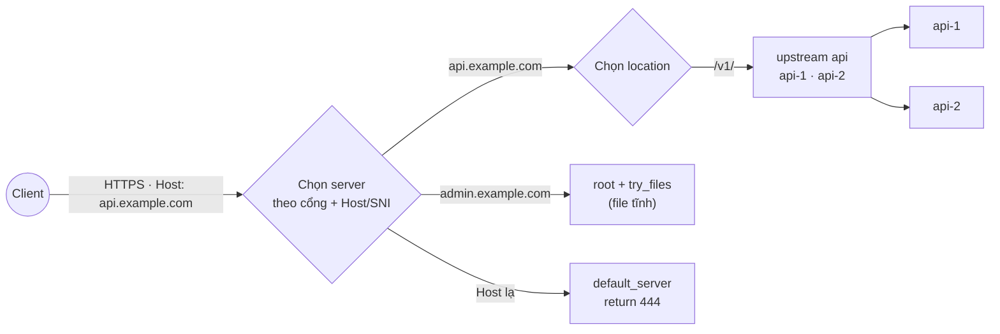

# Nginx

> **TL;DR:** Nginx là web server và **reverse proxy** hiệu năng cao: đứng trước ứng dụng, nhận mọi request từ Internet rồi chuyển tới đúng nơi (API, Next.js, file tĩnh), đồng thời lo TLS, nén, cache header, load balancing và rate limit. PixelMart tự viết `nginx.conf` cho container `edge` trên VPS ở v3 (S13-04, S14-03, S15-01), rồi chuyển sang Ingress-NGINX trên Kubernetes ở v7.

## 1. Nó là gì & giải quyết vấn đề gì

**Vấn đề:** Trên một VPS ta có nhiều thứ cần phục vụ ra ngoài: API NestJS (2 replica, cổng 3000), Next.js (cổng 3000 của container khác), hai SPA tĩnh (admin, seller). Nhưng Internet chỉ gõ cửa ở **cổng 443 của một IP**. Ai sẽ quyết định `api.example.com` đi tới API còn `admin.example.com` trả file tĩnh? Ai lo TLS, gzip, chặn người spam login? Nếu bắt từng app tự làm, mỗi app phải tự giữ chứng chỉ, tự nén, tự rate limit, và không app nào biết app kia đang tải ra sao.

**Nginx giải quyết bằng cách:** làm **một cổng vào duy nhất** (edge/gateway). Nó đọc `Host` và đường dẫn của request, rồi:
- trả **file tĩnh** trực tiếp từ đĩa (rất nhanh, không tốn Node),
- hoặc **proxy** request tới ứng dụng phía sau (upstream), chia đều giữa nhiều replica,
- và làm các việc "xuyên suốt": TLS, nén, cache header, giới hạn kích thước body, rate limit, log.

**So sánh đời thường:** Nginx là **quầy lễ tân của một tòa nhà văn phòng**. Khách chỉ vào một cửa chính. Lễ tân xem khách tìm công ty nào (Host), phát tài liệu có sẵn ở quầy (file tĩnh), dẫn khách lên đúng tầng (proxy), chia khách cho hai nhân viên tư vấn đang rảnh (load balancing), và từ chối người cứ 5 giây lại hỏi một lần (rate limit).

**Không có nó thì sao?** Mở thẳng cổng của API ra Internet, tự xử lý TLS trong Node, mỗi service một port lạ (`:3001`, `:3002`). Không có chỗ nào tập trung để chặn, đo và đổi routing.

## 2. Mô hình tư duy

| Khái niệm | Ý nghĩa |
|---|---|
| **Master / worker** | Master đọc config, mở socket. Worker xử lý request theo kiểu event loop (một worker giữ hàng nghìn kết nối). `nginx -s reload` khởi động worker mới với config mới, worker cũ xử lý xong request đang dở rồi mới thoát: **reload không rớt kết nối** |
| **Context** | Config lồng nhau: `main` → `events` / `http` → `server` → `location`. Directive khai báo ở ngoài được kế thừa vào trong, **trừ khi** bên trong khai báo lại (xem bẫy `add_header`) |
| **`server` (virtual host)** | Một khối cấu hình cho một tên miền + cổng. Nginx chọn `server` theo cổng rồi theo `server_name` khớp với header `Host` (hoặc SNI khi TLS) |
| **`default_server`** | `server` được dùng khi `Host` không khớp ai. Nếu không khai báo, `server` **đầu tiên** của cổng đó được dùng, nên người truy cập bằng IP sẽ thấy site đầu tiên |
| **`location`** | Khối cấu hình cho một nhóm đường dẫn trong `server`. Thứ tự chọn có quy tắc riêng (bảng dưới) |
| **`upstream`** | Nhóm server phía sau (ví dụ `api-1:3000`, `api-2:3000`). Mặc định chia round-robin, có thể dùng `least_conn`, `ip_hash` |
| **`proxy_pass`** | Chuyển request tới upstream. Nginx là client mới với upstream, nên phải tự truyền lại thông tin gốc (IP, scheme) qua header |
| **Biến (`$host`, `$remote_addr`…)** | Giá trị của request, dùng trong config và log. Biến được tính lúc xử lý request, không phải lúc đọc config |

**Thứ tự chọn `location`** (hay hỏi phỏng vấn, và hay sai):

| Ưu tiên | Kiểu | Ví dụ | Ghi chú |
|---|---|---|---|
| 1 | Khớp chính xác `=` | `location = /healthz` | Khớp là dừng ngay |
| 2 | Prefix dài nhất có `^~` | `location ^~ /_next/static/` | Nếu prefix dài nhất có `^~` thì **bỏ qua** regex |
| 3 | Regex `~` (phân biệt hoa thường) / `~*` (không phân biệt) | `location ~* \.(js\|css)$` | Xét **theo thứ tự xuất hiện** trong file, cái đầu tiên khớp thắng |
| 4 | Prefix dài nhất (thường) | `location /v1/` | Chỉ dùng nếu không regex nào khớp |



## 3. Lệnh / cấu hình hay dùng

**Lệnh**

| Lệnh | Dùng khi | Ghi chú |
|---|---|---|
| `nginx -t` | Kiểm tra cú pháp config **trước** khi reload | Luôn chạy trước `reload`. Trong Docker: `docker compose exec edge nginx -t` |
| `nginx -T` | In ra **toàn bộ** config đã gộp (mọi file `include`) | Dùng để xem config thật sau khi template được thay biến |
| `nginx -s reload` | Áp dụng config mới không rớt kết nối | Config lỗi thì master giữ config cũ và ghi lỗi vào log |
| `nginx -V` | Xem phiên bản và module được build kèm | Kiểm tra có `http_realip_module`, `http_v2_module`… không |
| `docker compose logs -f edge` | Xem access/error log (image chính thức log ra stdout/stderr) | |
| `curl -I -H "Host: admin.example.com" http://127.0.0.1` | Test routing theo Host mà chưa cần DNS | `-I` chỉ lấy header |
| `curl --resolve shop.example.com:443:<ip> https://shop.example.com -v` | Test TLS + SNI tới đúng IP mà không sửa DNS | Rất hữu ích trước cutover |

**Reverse proxy + upstream có keepalive**

```nginx
upstream api_backend {
    server api-1:3000 max_fails=3 fail_timeout=10s;
    server api-2:3000 max_fails=3 fail_timeout=10s;
    keepalive 32;                       # giữ sẵn kết nối tới upstream
}

server {
    listen 443 ssl;
    server_name api.example.com;

    location /v1/ {
        proxy_pass http://api_backend;  # KHÔNG có "/" ở cuối: giữ nguyên URI /v1/...
        proxy_http_version 1.1;         # keepalive tới upstream cần HTTP/1.1
        proxy_set_header Connection ""; # xóa "Connection: close" mặc định
        proxy_set_header Host $host;
        proxy_set_header X-Real-IP $remote_addr;
        proxy_set_header X-Forwarded-For $proxy_add_x_forwarded_for;
        proxy_set_header X-Forwarded-Proto $scheme;
        proxy_connect_timeout 5s;
        proxy_read_timeout 30s;
    }
}
```

**Bẫy dấu `/` ở cuối `proxy_pass`** (request là `/v1/products`):

| Cấu hình | URI gửi tới upstream |
|---|---|
| `location /v1/ { proxy_pass http://api; }` | `/v1/products` (giữ nguyên) |
| `location /v1/ { proxy_pass http://api/; }` | `/products` (phần khớp `/v1/` bị **thay** bằng `/`) |
| `location /api/ { proxy_pass http://api/v1/; }` | `/v1/products` khi request là `/api/products` |

**SPA fallback + cache header**

```nginx
server {
    listen 443 ssl;
    server_name admin.example.com;
    root /usr/share/nginx/html/admin;

    location / {
        try_files $uri $uri/ /index.html;            # route phía client không 404
    }
    location = /index.html {
        add_header Cache-Control "no-cache";          # luôn hỏi lại để nhận bản build mới
    }
    location /assets/ {
        add_header Cache-Control "public, max-age=31536000, immutable";  # file có hash trong tên
        try_files $uri =404;                          # asset thiếu → 404 thật, không trả index.html
    }
}
```

**Nén, rate limit, IP thật, body size**

```nginx
http {
    gzip on;
    gzip_types text/css application/javascript application/json image/svg+xml;
    gzip_min_length 1024;

    # Cloudflare đứng trước: chỉ tin header từ dải IP của Cloudflare
    set_real_ip_from 173.245.48.0/20;   # ... đủ danh sách từ https://www.cloudflare.com/ips-v4 và ips-v6
    real_ip_header CF-Connecting-IP;

    limit_req_zone $binary_remote_addr zone=auth:10m rate=5r/m;
    limit_req_status 429;

    server {
        client_max_body_size 1m;
        location /v1/auth/ {
            limit_req zone=auth burst=5 nodelay;
            proxy_pass http://api_backend;
            # ... các proxy_set_header như trên
        }
    }
}
```

`rate=5r/m` + `burst=5 nodelay`: cho phép tối đa 6 request ngay lập tức (1 theo rate + 5 trong burst), sau đó mỗi 12 giây mới "hồi" một lượt. Thiếu `nodelay` thì request trong burst bị **xếp hàng chờ** thay vì trả ngay, client cảm thấy chậm.

**Default server từ chối host lạ**

```nginx
server {
    listen 80 default_server;
    listen 443 ssl default_server;
    server_name _;
    ssl_reject_handshake on;   # từ chối TLS handshake, không lộ chứng chỉ của site thật
    return 444;                # 444: đóng kết nối, không gửi response (chỉ có ở Nginx)
}
```

**Log dạng JSON** (dễ đọc bằng máy, dùng lại ở v4 khi gom log):

```nginx
log_format json escape=json '{"time":"$time_iso8601","ip":"$remote_addr","host":"$host",'
  '"req":"$request","status":$status,"rt":$request_time,'
  '"urt":"$upstream_response_time","ua_addr":"$upstream_addr"}';
access_log /dev/stdout json;
```

**Template của image chính thức:** image `nginx` chạy `envsubst` lúc khởi động trên mọi file `/etc/nginx/templates/*.template`, ghi kết quả vào `/etc/nginx/conf.d/` (bỏ đuôi `.template`). Nhờ vậy cùng một image dùng được cho nhiều hostname, chỉ cần đổi biến môi trường. Đổi thư mục/đuôi/bộ lọc bằng `NGINX_ENVSUBST_TEMPLATE_DIR`, `NGINX_ENVSUBST_TEMPLATE_SUFFIX`, `NGINX_ENVSUBST_OUTPUT_DIR`, `NGINX_ENVSUBST_FILTER`.

```nginx
# /etc/nginx/templates/api.conf.template
server {
    server_name ${API_HOST};          # thay bằng env API_HOST lúc container start
    location / { proxy_set_header Host $host; }   # $host là biến của Nginx, phải giữ nguyên
}
```

## 4. Dùng thế nào cho hiệu quả

1. **Một cổng vào duy nhất.** Chỉ container Nginx publish cổng ra host. Mọi service khác nằm trong mạng nội bộ. Bề mặt tấn công nhỏ, và mọi request đều đi qua một chỗ có log.
2. **Luôn `nginx -t` trước `reload`, và chạy `nginx -t` trong CI/lúc build image.** Một dấu `;` thiếu có thể làm deploy hỏng. Bắt lỗi ở CI rẻ hơn bắt trên production.
3. **Truyền đủ header proxy** (`Host`, `X-Forwarded-For`, `X-Forwarded-Proto`) và cấu hình app tin proxy đúng số lớp (`trust proxy` trong Express/NestJS). Thiếu thì app thấy mọi request đến từ IP của Nginx, cookie `Secure` không được set vì app tưởng đang chạy HTTP.
4. **Keepalive tới upstream** (`keepalive` + `proxy_http_version 1.1` + `Connection ""`). Không có thì mỗi request mở một kết nối TCP mới tới Node: tốn CPU, tăng latency, có thể cạn cổng tạm (ephemeral port) khi tải cao.
5. **Phục vụ file tĩnh bằng Nginx, không bằng Node.** Asset có hash trong tên → cache 1 năm + `immutable`. `index.html` → `no-cache`. Đây là cách deploy bản mới mà người dùng không bị kẹt bản cũ.
6. **Chỉ tin IP thật từ nguồn tin cậy.** `set_real_ip_from` chỉ liệt kê dải IP của proxy phía trước (Cloudflare). Nếu tin header từ mọi nơi, kẻ tấn công tự gửi `CF-Connecting-IP` giả để né rate limit.
7. **Rate limit ở Nginx cho thứ thô (số request/IP), để logic nghiệp vụ cho app.** Nginx chặn spam rẻ hơn Node nhiều. Nhưng "5 lần sai mật khẩu thì khóa tài khoản" là nghiệp vụ, thuộc về API.
8. **Đặt timeout có chủ đích.** `proxy_read_timeout` mặc định 60 giây. Request nào lâu hơn mức hợp lý nên được cắt và log lại, thay vì giữ worker và kết nối.
9. **Default server trả `444`** để bot quét IP không thấy site thật, và để chặn tấn công Host header.
10. **Ghi `request_time` và `upstream_response_time` vào log.** Khi trang chậm, hai số này cho biết chậm ở Nginx/mạng hay chậm ở app.

## 5. Khi nào nên / không nên dùng

**Nên dùng khi:**
- Tự host trên VPS và cần một reverse proxy làm TLS, routing theo domain, load balancing.
- Cần phục vụ file tĩnh hiệu năng cao.
- Muốn hiểu tận gốc reverse proxy trước khi dùng thứ tự động hóa (Ingress, Traefik).

**Không nên / không cần khi:**
- Dùng PaaS (Vercel, Render): nền tảng đã có proxy riêng. Thêm Nginx chỉ thêm một lớp.
- Muốn TLS tự động, config tối giản, ít thời gian: Caddy tiện hơn.
- Cần service discovery động (container lên xuống liên tục, nhiều host): Traefik hoặc Ingress controller hợp hơn.

| | Nginx | Caddy | Traefik | HAProxy | Cloudflare Tunnel |
|---|---|---|---|---|---|
| Thế mạnh | Hiệu năng, phổ biến nhất, tài liệu nhiều | HTTPS tự động (ACME sẵn), config ngắn | Tự phát hiện service qua Docker label / K8s | Load balancer L4/L7 rất mạnh, health check chủ động | Không mở cổng vào nào, Cloudflare kéo traffic qua tunnel |
| TLS tự động | Không (cần certbot/acme.sh) | Có | Có | Không (bản free) | Cloudflare lo ở edge |
| Config | File tĩnh, reload | Caddyfile/JSON, API | Label/CRD, động | File tĩnh | Dashboard/CLI |
| Health check chủ động | Không (bản open source chỉ có passive) | Có | Có | Có | Không áp dụng |
| Học được gì | Bản chất reverse proxy | Ít thấy chi tiết hơn | Service discovery | Load balancing sâu | Zero-trust ingress |

Ở v3 ta chọn Nginx vì nó phổ biến nhất ở doanh nghiệp, buộc ta hiểu từng mảnh, và là nền cho Ingress-NGINX ở v7.

## 6. Bẫy fresher/junior hay gặp

| Triệu chứng | Nguyên nhân | Cách sửa |
|---|---|---|
| API nhận path sai (`/products` thay vì `/v1/products`) | `proxy_pass http://api/;` có dấu `/` ở cuối nên phần prefix bị thay | Bỏ dấu `/` để giữ nguyên URI, hoặc viết rõ path đích |
| Sau khi recreate container API, Nginx trả **502** cho tới khi restart Nginx | Nginx phân giải tên `api-1` thành IP **một lần lúc start**. Container mới có IP mới | Reload Nginx sau khi recreate upstream. Hoặc dùng `resolver 127.0.0.11 valid=10s;` (DNS nội bộ của Docker) với `server api-1:3000 resolve;` trong `upstream` có `zone` (open source từ 1.27.3/1.28), hoặc `proxy_pass` bằng biến |
| Nginx không start: `host not found in upstream "api-1"` | Container API chưa tồn tại lúc Nginx start | `depends_on` + healthcheck, hoặc dùng tham số `resolve` như trên |
| Thêm `add_header` cho một `location` thì **mất** hết security header khai báo ở `server` | `add_header` chỉ kế thừa khi level hiện tại **không có** `add_header` nào | Gom header vào một file và `include` ở mọi level có `add_header` riêng. Bản Nginx mới có directive điều khiển kế thừa, kiểm tra docs của phiên bản bạn dùng |
| Header không xuất hiện trên response lỗi 404/500 | `add_header` mặc định chỉ thêm cho status 2xx/3xx | Thêm tham số `always` |
| Reload `admin.example.com/products/1` → 404 | SPA không có file `/products/1` trên đĩa | `try_files $uri $uri/ /index.html;` |
| Asset JS thiếu nhưng trả `index.html` với status 200, trình duyệt báo lỗi MIME | Fallback SPA áp dụng cho cả `/assets/` | `location /assets/ { try_files $uri =404; }` |
| Deploy bản mới mà người dùng vẫn thấy bản cũ | `index.html` bị cache lâu | `index.html` → `no-cache`. Chỉ asset có hash mới cache dài |
| Log API mọi request đều từ `172.18.0.x` | Thiếu `X-Forwarded-For` hoặc app chưa bật `trust proxy` | Truyền header và cấu hình app tin đúng số proxy |
| Rate limit chặn **mọi người** cùng lúc | Sau Cloudflare, `$binary_remote_addr` là IP của Cloudflare | `set_real_ip_from` dải IP Cloudflare + `real_ip_header CF-Connecting-IP` |
| Kẻ tấn công né được rate limit | Tin `X-Forwarded-For`/`CF-Connecting-IP` từ mọi nguồn | Chỉ `set_real_ip_from` dải tin cậy, và chặn ở firewall chỉ cho Cloudflare vào |
| POST tạo đơn bị thực hiện **2 lần** khi một replica lỗi | `proxy_next_upstream` thử lại request trên replica khác | Mặc định Nginx **không** retry request non-idempotent (POST, PATCH). Đừng bật `non_idempotent`. API vẫn nên có idempotency key cho checkout |
| Template: `$host` bị thay thành chuỗi rỗng | Có biến môi trường trùng tên (`host`), hoặc dùng `envsubst` tự viết thay hết mọi `$...` | Dùng template của image chính thức (chỉ thay biến môi trường có tồn tại), đặt tên biến env viết HOA riêng biệt, dùng `NGINX_ENVSUBST_FILTER` |
| Upload báo `413 Request Entity Too Large` | `client_max_body_size` mặc định 1m | Tăng ở đúng `location` cần upload, không tăng toàn cục |
| Response streaming/SSE bị dồn lại rồi mới về một lúc | `proxy_buffering on` (mặc định) | `proxy_buffering off` cho đúng location cần streaming |

## 7. Debug nhanh

**502 Bad Gateway** (Nginx không nói chuyện được với upstream):
1. `docker compose logs edge | grep error`: dòng `connect() failed (111: Connection refused)` hay `no live upstreams`?
2. Upstream còn sống không? `docker compose ps` xem `api-1`, `api-2` có `healthy`.
3. Từ trong container Nginx gọi thử: `docker compose exec edge wget -qO- http://api-1:3000/v1/health`.
4. App có listen `0.0.0.0` không (listen `127.0.0.1` trong container thì Nginx không gọi vào được)?
5. Vừa recreate container upstream? Có thể Nginx đang giữ IP cũ → `nginx -s reload` (xem bẫy DNS ở trên).

**504 Gateway Timeout:**
1. Log có `upstream timed out`? So sánh `$upstream_response_time` với `proxy_read_timeout`.
2. App chậm thật (query DB chậm, deadlock) hay bị treo? Xem log app ở cùng thời điểm.
3. Sau Cloudflare: 524 là Cloudflare chờ origin quá lâu (giới hạn của Cloudflare, khoảng 100 giây ở gói free), khác với 504 của Nginx.

**Routing sai (vào nhầm site, 404 lạ):**
1. `nginx -T | less`: xem config thật đã gộp, đặc biệt sau khi template thay biến.
2. `curl -v -H "Host: …" http://127.0.0.1/path` để loại DNS/Cloudflare ra khỏi phép thử.
3. Liệt kê các `location` và tự chạy thuật toán chọn location ở mục 2. Regex đứng trước thường là thủ phạm.

**Config không áp dụng:**
1. Đã `reload` chưa? `nginx -t` có báo lỗi không (reload lỗi thì Nginx âm thầm giữ config cũ)?
2. File có được `include` không? `nginx -T | grep server_name`.

## 8. Trong PixelMart

| Version | Dùng thế nào | Ticket/plan |
|---|---|---|
| v3 | Container `edge`: server block theo host (`api.`, `shop.`, `admin.`, `seller.`), upstream `api-1`/`api-2` có keepalive, SPA fallback cho admin/seller, cache asset có hash, gzip, header proxy + `trust proxy` ở API, default server trả 444 | S13-04 ([plan Sprint 13](../v3/plans/sprint-13.md)) |
| v3 | IP thật từ Cloudflare (`set_real_ip_from` + `CF-Connecting-IP`), `limit_req` cho `/v1/auth/*`, security headers, `client_max_body_size`, timeout | S14-03 ([plan Sprint 14](../v3/plans/sprint-14.md)) |
| v3 | Maintenance mode bật/tắt bằng file cờ trên VPS, trả 503 + `Retry-After`, người vận hành vẫn vào được | S15-01 ([plan Sprint 15](../v3/plans/sprint-15.md)) |
| v4 | Log JSON làm nguồn số liệu, expose metric của Nginx cho Prometheus | v4 |
| v7 | Ingress-NGINX: cùng các khái niệm (host, path, upstream, annotation rate limit) nhưng khai báo bằng manifest Kubernetes | v7 |

## 9. Câu hỏi phỏng vấn hay gặp

1. Forward proxy và reverse proxy khác nhau thế nào?
<details><summary>Gợi ý trả lời</summary>

Forward proxy đứng phía client, đại diện client đi ra Internet (proxy công ty, VPN). Server không biết client thật. Reverse proxy đứng phía server, đại diện server nhận request. Client không biết có bao nhiêu server phía sau. Nginx trong PixelMart là reverse proxy.
</details>

2. Nginx chọn `location` theo thứ tự nào?
<details><summary>Gợi ý trả lời</summary>

Khớp chính xác `=` trước. Sau đó tìm prefix dài nhất. Nếu prefix đó có `^~` thì dùng luôn. Nếu không thì xét các regex theo thứ tự xuất hiện, regex đầu tiên khớp thắng. Không regex nào khớp thì dùng prefix dài nhất đã nhớ.
</details>

3. Vì sao reload Nginx không làm rớt kết nối?
<details><summary>Gợi ý trả lời</summary>

Master đọc config mới, khởi động worker mới, rồi báo worker cũ ngừng nhận kết nối mới. Worker cũ xử lý xong request đang dở rồi thoát. Socket lắng nghe do master giữ nên không bị đóng. Nếu config mới lỗi, master giữ nguyên worker cũ.
</details>

4. App đứng sau Nginx lấy IP thật của client bằng cách nào, và có rủi ro gì?
<details><summary>Gợi ý trả lời</summary>

Nginx thêm `X-Forwarded-For`/`X-Real-IP`, app bật `trust proxy` để đọc. Rủi ro: header do client tự gửi được. Chỉ tin header khi request đến từ proxy tin cậy (số lớp proxy cố định, hoặc danh sách IP), nếu không kẻ tấn công giả IP để né rate limit hoặc ghi log sai.
</details>

5. Passive health check và active health check khác nhau thế nào? Nginx open source có gì?
<details><summary>Gợi ý trả lời</summary>

Passive: đánh dấu upstream hỏng dựa trên request thật bị lỗi (`max_fails`, `fail_timeout`). Active: chủ động gọi endpoint health định kỳ. Nginx open source chỉ có passive. Active có ở NGINX Plus, HAProxy, Traefik, Kubernetes (readiness probe).
</details>

6. Vì sao asset có hash được cache 1 năm còn `index.html` thì không?
<details><summary>Gợi ý trả lời</summary>

Tên asset đổi khi nội dung đổi (hash), nên cache vĩnh viễn an toàn. `index.html` giữ nguyên tên nhưng trỏ tới asset mới sau mỗi deploy. Nếu cache nó, người dùng sẽ tải bản cũ trỏ tới asset cũ (có thể đã bị xóa).
</details>

7. `proxy_next_upstream` có nguy hiểm gì?
<details><summary>Gợi ý trả lời</summary>

Nó gửi lại request tới upstream khác khi upstream đầu lỗi. Với request không idempotent (POST tạo đơn), nếu upstream đầu đã xử lý xong nhưng chết trước khi trả lời, request bị thực hiện hai lần. Nginx mặc định không retry POST/PATCH/LOCK, và không nên bật `non_idempotent`.
</details>

## 10. Tài liệu chính thức

- Beginner's guide: https://nginx.org/en/docs/beginners_guide.html
- Cách Nginx xử lý request (chọn server/location): https://nginx.org/en/docs/http/request_processing.html
- `ngx_http_proxy_module`: https://nginx.org/en/docs/http/ngx_http_proxy_module.html
- `ngx_http_upstream_module` (keepalive, `resolve`, `max_fails`): https://nginx.org/en/docs/http/ngx_http_upstream_module.html
- `ngx_http_limit_req_module`: https://nginx.org/en/docs/http/ngx_http_limit_req_module.html
- `ngx_http_realip_module`: https://nginx.org/en/docs/http/ngx_http_realip_module.html
- Image Docker chính thức (mục "Using environment variables in nginx configuration"): https://hub.docker.com/_/nginx
- Cloudflare IP ranges: https://www.cloudflare.com/ips/
