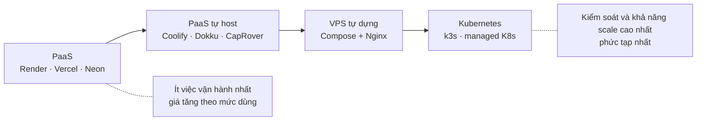

# PaaS vs Self-host

> **TL;DR:** Có bốn cách chính để chạy một web app: **PaaS** (Render, Vercel, Neon: đẩy code lên là chạy), **VPS tự dựng** (bạn tự cài Docker, Nginx, Postgres), **PaaS tự host** (Coolify, Dokku, CapRover: giao diện kiểu PaaS cài trên VPS của bạn) và **Kubernetes**. Mỗi cách đổi tiền lấy công vận hành theo một tỷ lệ khác nhau. PixelMart đi theo lộ trình PaaS (v1–v2) → VPS tự dựng (v3–v6) → k3s (v7–v8), và cố ý bỏ qua Coolify.

## 1. Nó là gì & giải quyết vấn đề gì

**Vấn đề:** code chạy trên laptop rồi, giờ đưa nó lên Internet bằng cách nào? Ai lo TLS, restart khi crash, backup DB, vá bảo mật hệ điều hành?

Mọi lựa chọn đều phải trả lời cùng một danh sách việc. Khác nhau ở chỗ **ai làm**:

| Việc | PaaS | PaaS tự host (Coolify…) | VPS tự dựng | Kubernetes tự vận hành |
|---|---|---|---|---|
| Vá hệ điều hành | Nhà cung cấp | **Bạn** | **Bạn** | **Bạn** (node) |
| TLS, domain | Nhà cung cấp | Công cụ tự làm | **Bạn** (Nginx, Cloudflare) | cert-manager, Ingress |
| Build, deploy | Nhà cung cấp | Công cụ tự làm | **Bạn** (CI + script) | CI + Helm/Argo |
| Restart khi crash | Nhà cung cấp | Docker | Docker | Kubernetes |
| Backup DB | Nhà cung cấp (DB managed) | Công cụ hỗ trợ, bạn cấu hình | **Bạn** | **Bạn** (operator) |
| Scale nhiều máy | Nhà cung cấp | Hạn chế | Không (một máy) | Kubernetes |

**So sánh đời thường:**
- PaaS = **đi taxi**: không cần biết lái xe, trả theo cuốc, đắt khi đi nhiều.
- VPS tự dựng = **mua xe số sàn**: rẻ khi đi nhiều, phải tự lái, tự bảo dưỡng, hiểu xe.
- PaaS tự host = **xe số tự động**: đỡ mệt hơn, nhưng hỏng hộp số thì bạn không biết bên trong có gì.
- Kubernetes = **quản lý cả đội xe**: rất mạnh khi có nhiều xe và nhiều tài xế, quá mức cần thiết cho một chiếc.

## 2. Mô hình tư duy

| Khái niệm | Ý nghĩa |
|---|---|
| **Shared responsibility** | Mỗi nền tảng chia trách nhiệm vận hành giữa bạn và nhà cung cấp. Đọc kỹ ranh giới đó trước khi chọn |
| **Abstraction leak** | Công cụ che bớt chi tiết. Khi nó hỏng, bạn phải hiểu đúng phần bị che để sửa |
| **Chi phí cố định vs theo mức dùng** | VPS: trả cố định, dùng nhiều hay ít cũng vậy. PaaS: rẻ/miễn phí lúc nhỏ, tăng theo traffic, seat, compute |
| **Chi phí ẩn** | Thời gian của bạn: vá bảo mật, backup, xử lý sự cố lúc nửa đêm, học công cụ |
| **Vendor lock-in** | Mức độ khó chuyển đi. Dùng Docker + Postgres chuẩn thì dễ chuyển. Dùng tính năng độc quyền (edge function, branch DB…) thì khó hơn |
| **Single point of failure** | Một VPS chết là cả hệ thống chết. PaaS và K8s nhiều node giảm rủi ro này |

## 3. Lệnh / cấu hình hay dùng

File này là so sánh, không có cheat sheet lệnh riêng. Khi cần làm thật:

| Muốn làm | Xem |
|---|---|
| Dựng và bảo vệ VPS | [linux-vps.md](linux-vps.md) |
| Viết Compose production, image | [docker.md](docker.md) |
| Reverse proxy, TLS | [nginx.md](nginx.md), [dns-tls.md](dns-tls.md) |
| Deploy tự động | [github-actions.md](github-actions.md) |

**Bảng tính chi phí nên tự lập (S15-04):**

| Dòng | PaaS (v2) | VPS (v3) |
|---|---|---|
| Compute API | Render: free (ngủ khi idle) hoặc gói trả phí | Gồm trong VPS |
| Frontend | Vercel Hobby (chỉ dùng cá nhân, phi thương mại) hoặc Pro theo seat | Gồm trong VPS |
| Database | Neon free (giới hạn dung lượng, compute) hoặc gói trả phí | Gồm trong VPS + R2 cho backup |
| Thời gian vận hành mỗi tháng | ~0 giờ | Bạn tự đo: vá, theo dõi, xử lý sự cố |
| Tổng | | |

> Số liệu free tier thay đổi thường xuyên (ví dụ Neon đổi cách tính giá đầu năm 2026). Luôn lấy số trên trang giá chính thức tại thời điểm viết ADR.

## 4. Dùng thế nào cho hiệu quả

1. **Bắt đầu bằng PaaS** khi sản phẩm còn chưa rõ. Thời gian của bạn nên dành cho tính năng, không phải cho Nginx. PixelMart v1–v2 làm đúng vậy.
2. **Chuyển khi có lý do đo được**: cold start làm mất khách, hóa đơn PaaS vượt giá VPS nhiều lần, cần chạy thành phần mà PaaS không cho (Prometheus, Redis, RabbitMQ). Ghi lý do vào ADR.
3. **Giữ ứng dụng "portable"**: Docker image, cấu hình qua env, Postgres chuẩn, không phụ thuộc tính năng độc quyền. Nhờ vậy chuyển đi chuyển lại chỉ tốn công hạ tầng, không phải viết lại code.
4. **Tính cả giờ công.** 5 giờ/tháng vận hành × giá giờ làm của bạn có thể đắt hơn hóa đơn PaaS. Với dự án học, giờ công đó lại chính là bài học.
5. **Tách quyết định cho từng thành phần.** Không bắt buộc "tất cả PaaS" hoặc "tất cả tự host". Công ty thật hay chạy app trên VPS/K8s nhưng giữ DB managed, vì DB là thứ khó vận hành nhất và mất dữ liệu thì không sửa được.
6. **Self-host thì phải có backup đã diễn tập, cập nhật bảo mật tự động, và cảnh báo** ngay từ ngày đầu, không phải "để sau".
7. **Ghi lại điều kiện quay về managed**: ví dụ "DB > X GB, hoặc cần RPO < 1 giờ, hoặc không ai trực được sự cố → chuyển Postgres sang dịch vụ managed".

## 5. Khi nào nên / không nên dùng

| Lựa chọn | Nên dùng khi | Không nên khi | Cái nó che đi |
|---|---|---|---|
| **PaaS** (Render, Vercel, Neon) | MVP, team nhỏ, chưa có ai lo hạ tầng, traffic thấp/không đều | Cần chạy dịch vụ nền tùy ý, hóa đơn đã lớn, cần kiểm soát mạng/log | Build, TLS, load balancer, restart, scale, backup |
| **VPS tự dựng** (PixelMart v3) | Muốn chi phí cố định thấp, cần nhiều thành phần, muốn hiểu hạ tầng | Không có người vận hành, cần HA thật | Không che gì: bạn thấy và chịu trách nhiệm mọi thứ |
| **PaaS tự host** (Coolify, Dokku, CapRover) | Muốn trải nghiệm kiểu PaaS trên VPS rẻ, đã hiểu những gì nó tự động hóa | Đang học hạ tầng (nó che mất bài học), cần cấu hình Nginx/proxy tinh chỉnh | Reverse proxy (thường Traefik/Caddy), TLS, build, deploy, phần lớn Docker |
| **Kubernetes** (k3s, managed K8s) | Nhiều service, nhiều team, cần rolling/scale/self-healing chuẩn hóa | Một app nhỏ, một người vận hành, chưa thành thạo Docker/Linux | Lập lịch container, service discovery, rolling update (nhưng lộ ra cả một lớp phức tạp mới) |

### Vì sao lộ trình PixelMart bỏ qua Coolify

Coolify là công cụ tốt, nhưng với **mục tiêu học** thì nó che đúng những thứ v3 muốn bạn tự làm:

| Bài học v3 | Coolify làm hộ |
|---|---|
| Viết `nginx.conf`: routing theo host, load balancing, cache, rate limit | Proxy tự sinh cấu hình |
| TLS, Origin Certificate, Full (strict) | Tự xin chứng chỉ |
| Compose production: network, healthcheck, giới hạn tài nguyên | Giao diện tạo service |
| CI → GHCR → SSH, rolling update, rollback | Webhook tự build và deploy |

Sau v3, khi đã tự làm từng thứ một lần, dùng Coolify cho dự án cá nhân là lựa chọn hợp lý: bạn biết nó đang làm gì và sửa được khi nó hỏng.

## 6. Bẫy fresher/junior hay gặp

| Triệu chứng | Nguyên nhân | Cách sửa |
|---|---|---|
| Chuyển sang VPS để "tiết kiệm", 3 tháng sau mất dữ liệu | Không có backup off-site, hoặc có nhưng chưa từng restore thử | Backup off-site + restore drill trước khi đưa dữ liệu thật lên (S14-04) |
| Tưởng VPS rẻ hơn, thực tế tốn nhiều giờ mỗi tuần | Không tính giờ công vận hành | Ghi lại thời gian thật, đưa vào bảng chi phí |
| Dùng Vercel Hobby cho dự án có doanh thu | Hobby chỉ dành cho dùng cá nhân, phi thương mại | Dùng gói Pro hoặc tự host phần frontend |
| Khách chờ cả phút ở request đầu tiên | Render free spin down sau một khoảng không có traffic, khởi động lại mất khoảng một phút | Gói trả phí hoặc tự host. Đừng "giữ thức" bằng cron ping để lách điều khoản |
| Dùng Coolify, một ngày proxy lỗi mà không biết sửa | Chưa từng hiểu reverse proxy/TLS bên dưới | Học thủ công trước (v3), dùng công cụ sau |
| Lên Kubernetes cho một app một người dùng | Làm theo xu hướng | Dùng Compose trên VPS. K8s khi có bài toán thật (v7) |
| Chuyển hạ tầng mà phải sửa nhiều code | App phụ thuộc tính năng độc quyền (biến môi trường, file system, edge runtime của PaaS) | Cấu hình qua env, Docker image, Postgres chuẩn |
| Tự host DB trên VPS nhưng không vá, không theo dõi | Nghĩ "Docker lo hết" | Unattended-upgrades cho host, cập nhật image Postgres theo minor, cảnh báo ổ đĩa và backup |
| So sánh giá VPS với PaaS mà quên phần phụ | Bỏ qua IPv4, backup, snapshot, băng thông vượt mức, giá gia hạn | Lập bảng đủ dòng như mục 3 |

## 7. Debug nhanh

"Nên chuyển hạ tầng không?" — trả lời theo thứ tự:
1. **Vấn đề cụ thể là gì?** Cold start, chi phí, giới hạn kỹ thuật hay nhu cầu học? Không gọi tên được vấn đề thì chưa nên chuyển.
2. **Có số liệu không?** Hóa đơn hiện tại, thời gian phản hồi, dung lượng DB.
3. **Ai vận hành?** Có người vá bảo mật và xử lý sự cố không? Có runbook không?
4. **Dữ liệu an toàn chưa?** Backup off-site, đã restore thử, RPO/RTO chấp nhận được.
5. **Đường lui là gì?** Nếu chuyển thất bại thì quay về bằng cách nào, trong bao lâu (S15-02, S15-03).

## 8. Trong PixelMart

| Version | Lựa chọn | Lý do | Ticket/plan |
|---|---|---|---|
| v1–v2 | PaaS: Render + Vercel + Neon, 0đ | Tập trung vào sản phẩm, deploy được từ sprint 1 | [v1](../v1/README.md), [v2](../v2/README.md) |
| v3–v6 | Một VPS + Compose + Nginx tự viết | Hết cold start, chạy được Prometheus/Redis/RabbitMQ, học hạ tầng | [v3](../v3/README.md), so sánh chi phí trong ADR-0011 (S15-04) |
| v7–v8 | k3s trên VPS lớn hơn, Helm, Jenkins | Nhiều service hơn, cần staging, rolling/scale chuẩn hóa | v7 |
| Không dùng | Coolify, Dokku, CapRover | Che mất bài học. Chỉ so sánh ở file này | — |

## 9. Câu hỏi phỏng vấn hay gặp

1. Khi nào bạn chọn PaaS, khi nào tự host?

Gợi ý trả lời

PaaS khi cần ra sản phẩm nhanh, team nhỏ, chưa có người lo hạ tầng, traffic thấp. Tự host khi chi phí PaaS đã lớn, cần chạy thành phần mà PaaS không hỗ trợ, cần kiểm soát mạng/log, và **có người vận hành**. Quyết định nên dựa trên số liệu và ghi thành ADR, có thể khác nhau cho từng thành phần (ví dụ app tự host, DB managed).

2. "Tự host rẻ hơn" có luôn đúng không?

Gợi ý trả lời

Không. Tiền máy thì rẻ hơn, nhưng phải cộng giờ công vá bảo mật, backup, theo dõi, xử lý sự cố, và rủi ro mất dữ liệu hoặc downtime. Với team nhỏ, giờ của kỹ sư thường đắt hơn hóa đơn PaaS. Tự host rẻ hơn thật khi quy mô đủ lớn hoặc đã có sẵn năng lực vận hành.

3. Vì sao nhiều công ty tự chạy app nhưng vẫn dùng database managed?

Gợi ý trả lời

Database là phần khó vận hành nhất: backup, point-in-time recovery, replication, failover, nâng cấp major version. Lỗi ở app thì deploy lại được, mất dữ liệu thì không. Dịch vụ managed mua lại sự an toàn đó với chi phí hợp lý.

4. Coolify/Dokku giải quyết vấn đề gì? Nhược điểm?

Gợi ý trả lời

Cho trải nghiệm kiểu PaaS (push để deploy, TLS tự động, giao diện quản lý) trên VPS của bạn, với chi phí của VPS. Nhược điểm: vẫn là một máy (single point of failure), bạn vẫn phải vá OS và lo backup, thêm một lớp phần mềm có thể lỗi, và khi lỗi thì cần hiểu Docker/proxy bên dưới để sửa.

5. Làm sao giảm vendor lock-in khi dùng PaaS?

Gợi ý trả lời

Đóng gói bằng Docker, cấu hình qua biến môi trường, dùng Postgres chuẩn thay vì tính năng độc quyền, giữ CI/CD trong repo (GitHub Actions) thay vì chỉ dựa vào build của nền tảng, và tách logic nghiệp vụ khỏi API riêng của nhà cung cấp.

6. Một VPS là single point of failure. Bạn giảm rủi ro thế nào mà chưa cần nhiều máy?

Gợi ý trả lời

Backup off-site đã diễn tập, runbook dựng lại máy từ đầu (hạ tầng dạng code), snapshot trước thay đổi lớn, uptime monitor + cảnh báo, restart policy và healthcheck cho container, đo RTO thực tế. Chấp nhận rủi ro một cách có ý thức và ghi vào ADR, kèm điều kiện để nâng lên nhiều máy.

## 10. Tài liệu chính thức

- Render free tier: https://render.com/docs/free
- Vercel Hobby plan: https://vercel.com/docs/plans/hobby
- Neon pricing: https://neon.com/pricing
- Coolify: https://coolify.io/docs/
- Dokku: https://dokku.com/docs/
- CapRover: https://caprover.com/docs/
- The Twelve-Factor App (nền tảng cho app dễ chuyển hạ tầng): https://12factor.net/
