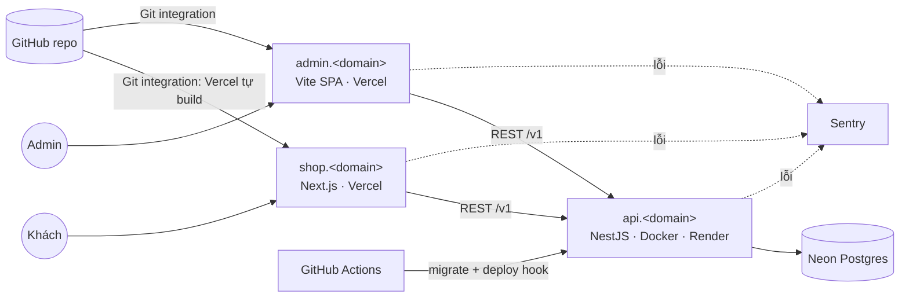

# v1 — MVP single-store · Release v1.0.0

- Jira project: **PixelMart**, key **`PXM`** (Scrum, team-managed): https://nquocbao37.atlassian.net/jira/software/projects/PXM/boards/134
- Epics: PXM-1 Platform & DevOps · PXM-2 Identity & Auth · PXM-3 Catalog · PXM-4 Storefront & Cart · PXM-5 Checkout & Orders · PXM-6 Release v1.0
- Lịch dự kiến: Sprint 1 bắt đầu 12/10/2026, nghỉ 21/12 – 03/01, Sprint 7 kết thúc 31/01/2027
- Sprint: 2 tuần · Capacity: 6–8 giờ/tuần ≈ **9–10 story points/sprint** (1 pt ≈ 1,5 giờ, sẽ hiệu chỉnh sau Sprint 2 bằng velocity thật)
- Tổng v1: **68 pts · 7 sprint ≈ 14 tuần**

## Vì sao có version này

Một cửa hàng nhỏ muốn bán hàng online: khách xem sản phẩm, thêm vào giỏ, đặt hàng; chủ shop quản lý danh mục và xác nhận đơn. Chưa có vendor thứ hai, chưa có hàng nghìn request mỗi giây.

Vì vậy v1 **cố tình giữ đơn giản về hạ tầng** (PaaS miễn phí, một monolith) để bạn dồn sức vào nền tảng mà mọi version sau đều dựa vào:
- Full-stack TypeScript với contract dùng chung giữa frontend và backend.
- Auth làm đúng (hash, JWT, refresh rotation): đây là phần hay bị làm sai nhất.
- Quy trình chuyên nghiệp: Jira → branch → PR → review → CI → release có tag → deploy tự động.

Redis, queue, Kubernetes… **chưa cần**, và thêm vào lúc này chỉ làm chậm. Chúng sẽ xuất hiện khi sản phẩm thật sự gặp vấn đề (xem [lộ trình](../README.md)).

## Kiến trúc: trước → sau

**Trước:** chưa có gì, chỉ có repo trống.

**Sau v1:**

## Học xong bạn làm được

1. Dựng monorepo pnpm + Turborepo có cache, chia sẻ config và contract giữa nhiều app.
2. Viết pipeline CI chặn merge khi lint/test fail, và CD tự deploy khi merge vào `main` (kèm migration DB chạy trước).
3. Đóng gói API thành Docker image multi-stage, chạy bằng non-root, dung lượng nhỏ.
4. Tự thiết kế và cài đặt auth: argon2id, JWT access ngắn hạn, refresh token rotation có reuse detection, cookie an toàn, phân quyền theo role.
5. Viết integration test với DB thật cho happy path, lỗi validation và lỗi phân quyền.
6. Chuẩn hóa lỗi API theo RFC 9457 và theo dõi lỗi production bằng Sentry.
7. Xử lý tiền đúng cách (số nguyên minor units, snapshot giá), idempotency khi tạo đơn, chống IDOR.
8. Vận hành đầy đủ một vòng Scrum: planning → release có tag → demo → retro.

## Kiến thức cần đọc trước

- [Docker](../knowledge/docker.md): trước Sprint 1 (PXM-11)
- [GitHub Actions](../knowledge/github-actions.md): trước Sprint 1 (PXM-12, PXM-13)
- Quy trình: [`rules/`](../rules/README.md), đặc biệt [01 branching](../rules/01-git-branching.md) và [05 làm việc với Claude](../rules/05-working-with-claude.md)

## Hạ tầng & chi phí

| Thành phần | Dịch vụ | Chi phí |
|---|---|---|
| API (Docker) | Render free web service | 0đ (có cold start ~30–60 giây sau khi idle) |
| Web, Admin | Vercel Hobby | 0đ |
| Postgres | Neon free | 0đ |
| Error tracking | Sentry Developer | 0đ |
| CI/CD | GitHub Actions (repo public) | 0đ |
| Domain | Domain bạn đã mua | phí gia hạn hằng năm |

> Thay đổi so với blueprint (6 sprint): khi estimate từng ticket, tổng là ~68 pts. Nhồi vào 6 sprint sẽ vượt capacity ~20%, nên ta tách thành 7 sprint thay vì cắt scope. Đây đúng là việc team thật làm ở planning: **estimate xong mới cam kết timeline, không làm ngược lại.**

## Epics

| Epic | Phạm vi | Sprint |
|---|---|---|
| **Platform & DevOps** | Monorepo, CI/CD, Docker, DB, observability, error format | 1–2 |
| **Identity & Auth** | Register/login, JWT + refresh rotation, guards, UI đăng nhập | 3–4 |
| **Catalog** | Category/Product API + admin UI | 4–5 |
| **Storefront & Cart** | Landing, list, detail, giỏ hàng | 5–6 |
| **Checkout & Orders** | Tạo đơn, PaymentProvider, đơn của tôi, admin xác nhận | 6–7 |
| **Release v1.0** | Security hardening, polish, docs, release | 7 |

## Lộ trình sprint

| Sprint | Plan | Version | Sprint Goal | Pts |
|---|---|---|---|---|
| [1](sprints/sprint-01.md) | [plan](plans/sprint-01.md) | v0.1.0 | Monorepo + API & web hello-world tự deploy lên domain thật | 11 |
| [2](sprints/sprint-02.md) | [plan](plans/sprint-02.md) | v0.2.0 | DB + migration trong pipeline, admin shell online, lỗi chuẩn hóa + Sentry | 10 |
| [3](sprints/sprint-03.md) | [plan](plans/sprint-03.md) | v0.3.0 | Auth API hoàn chỉnh (JWT + refresh rotation + phân quyền), có integration test | 10 |
| [4](sprints/sprint-04.md) | [plan](plans/sprint-04.md) | v0.4.0 | Đăng nhập trên shop & admin; API category/product sẵn sàng | 10 |
| [5](sprints/sprint-05.md) | [plan](plans/sprint-05.md) | v0.5.0 | Admin quản lý catalog; khách duyệt landing/list/detail | 10 |
| [6](sprints/sprint-06.md) | [plan](plans/sprint-06.md) | v0.6.0 | Giỏ hàng, checkout, đơn hàng của tôi | 9 |
| [7](sprints/sprint-07.md) | [plan](plans/sprint-07.md) | **v1.0.0** | Admin xác nhận đơn, hardening, phát hành v1.0 | 8 |

Bản trực quan của các sprint (tìm kiếm, lọc theo label, checklist): [`sprints/playbook.html`](sprints/playbook.html), mở bằng trình duyệt.

### Quy ước trong các file sprint

- Mã tạm `S1-01` = Sprint 1, ticket 01. Sau khi tạo trên Jira, ticket được ghi bằng key thật (bảng mapping bên dưới).
- Type: `Story` (có giá trị trực tiếp cho người dùng) / `Task` (kỹ thuật).
- Sprint 4–7 là bản **draft**: refine lại AC ở buổi refinement giữa sprint trước (xem [`rules/04-sprint-lifecycle.md`](../rules/04-sprint-lifecycle.md)).

## Ngoài phạm vi

| Không làm ở v1 | Lý do / thuộc version nào |
|---|---|
| Multi-vendor (seller, tách đơn, hoa hồng) | v2 |
| Inventory/tồn kho | v2 (theo vendor), v4 (flash sale với Redis) |
| Redis, cache | v4. Chưa có số liệu chứng minh cần cache |
| Message queue, gửi email bất đồng bộ | v5 |
| Mobile app | v6 (trước đây ghi là v1.1, đã dời theo lộ trình mới) |
| Tự host, Nginx, Kubernetes | v3, v7 |
| Microservices | v8 |
| Stripe/thanh toán thật, upload ảnh (R2), variants | Ngoài lộ trình học. Dùng `FakePaymentProvider` và URL ảnh |
| Môi trường staging | v7 (namespace staging trên K8s) |

> Câu "lập backlog v1.1 (mobile)" trong PXM-44 được hiểu theo lộ trình mới: **lập backlog cho v2**. Tương tự, "Bearer fallback cho mobile v1.1" ở PXM-24 nghĩa là chuẩn bị cho mobile ở v6.

## Exit criteria

- [ ] Mọi ticket PXM-7 → PXM-44 Done theo [Definition of Done](../rules/06-definition-of-ready-and-done.md)
- [ ] Khách đăng ký, duyệt sản phẩm, đặt hàng, xem đơn trên `shop.<domain>`. Admin quản lý catalog và xác nhận đơn trên `admin.<domain>`
- [ ] Tag `v1.0.0` + GitHub Release có changelog đầy đủ
- [ ] Người lạ clone repo và chạy được local chỉ bằng README
- [ ] Không còn vấn đề bảo mật mức High. securityheaders.com ≥ A
- [ ] `docs/retro/v1.md` đã viết, backlog v2 đã lập trên Jira

## Mapping Jira

| Mã | Jira | Mã | Jira | Mã | Jira |
|---|---|---|---|---|---|
| S1-01 | PXM-7 | S3-01 | PXM-21 | S5-01 | PXM-31 |
| S1-02 | PXM-8 | S3-02 | PXM-22 | S5-02 | PXM-32 |
| S1-03 | PXM-9 | S3-03 | PXM-23 | S5-03 | PXM-33 |
| S1-04 | PXM-10 | S3-04 | PXM-24 | S5-04 | PXM-34 |
| S1-05 | PXM-11 | S3-05 | PXM-25 | S5-05 | PXM-35 |
| S1-06 | PXM-12 | S4-01 | PXM-26 | S6-01 | PXM-36 |
| S1-07 | PXM-13 | S4-02 | PXM-27 | S6-02 | PXM-37 |
| S2-01 | PXM-14 | S4-03 | PXM-28 | S6-03 | PXM-38 |
| S2-02 | PXM-15 | S4-04 | PXM-29 | S6-04 | PXM-39 |
| S2-03 | PXM-16 | S4-05 | PXM-30 | S7-01 | PXM-40 |
| S2-04 | PXM-17 | | | S7-02 | PXM-41 |
| S2-05 | PXM-18 | | | S7-03 | PXM-42 |
| S2-06 | PXM-19 | | | S7-04 | PXM-43 |
| S2-07 | PXM-20 | | | S7-05 | PXM-44 |

Việc ngoài sprint plan: **PXM-45**, tái cấu trúc docs theo version + lộ trình học v1 → v8.
