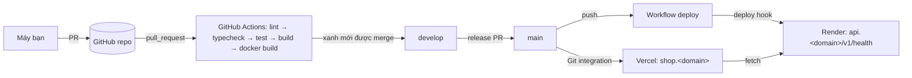

# Plan Sprint 1 — Foundation · v0.1.0

> Sprint: [sprint-01.md](../sprints/sprint-01.md) · Tổng quan v1: [README](../README.md)
>
> **Cách dùng plan:** với mỗi ticket, đọc "Khái niệm cần nắm" và "Hướng tiếp cận", rồi **tự làm**. Kẹt quá 30 phút thì mở Hint 1. Vẫn kẹt thì mới mở Hint 2, rồi Hint 3. Tự nghĩ test case trước khi mở đáp án tham khảo. Mở hint không có gì sai; bỏ qua bước tự nghĩ mới là mất bài học.

## 0. Trước khi bắt đầu

**Kiến thức nên đọc trước**
- [Docker](../../knowledge/docker.md): mục 1, 2, 4 (trước PXM-11)
- [GitHub Actions](../../knowledge/github-actions.md): mục 1, 2, 4 (trước PXM-12)
- [Quy trình branch](../../rules/01-git-branching.md) và [commit/PR](../../rules/02-commits-and-pull-requests.md)

**Cài đặt trên máy**
- Node.js 24 LTS (qua `fnm` hoặc `nvm-windows`), `corepack enable` để dùng đúng pnpm version trong `packageManager`
- Git, GitHub CLI (`gh auth login`), Docker Desktop (bật WSL2 backend nếu dùng Windows)
- Tài khoản: GitHub, Jira (đã có), Render, Vercel, Cloudflare (quản lý DNS cho domain của bạn)

**Lưu ý trên Windows:** đặt `git config --global core.autocrlf input` và thêm `.gitattributes` với `* text=auto eol=lf`. File `.sh` hoặc Dockerfile có CRLF là nguồn gốc của rất nhiều lỗi "file not found" trong container.

## 1. Bức tranh tổng

Hết sprint này, một commit vào `main` sẽ tự đi tới production:



Đây là sprint "đường ống": chưa có tính năng nào cho người dùng, nhưng mọi sprint sau đều chạy trên đường ống này. **Đầu tư đúng ở đây thì mỗi sprint sau tiết kiệm hàng giờ.**

## 2. Thứ tự & phụ thuộc

```
PXM-7 (repo, rules) ──▶ PXM-8 (monorepo) ──▶ PXM-9 (API) ──┬──▶ PXM-11 (Docker) ──▶ PXM-12 (CI) ──▶ PXM-13 (CD)
                                          └─▶ PXM-10 (web) ─┘
```

- **Rủi ro lớn nhất:** PXM-13 (DNS, nhiều nền tảng, nhiều thứ có thể sai mà không do code). Cố gắng bắt đầu PXM-13 trước ngày 9 của sprint.
- Nếu trễ: PXM-11 phần `docker-compose` có thể dời sang Sprint 2 (khi thật sự cần Postgres), nhưng **Dockerfile thì không thể dời** vì Render cần nó.
- PXM-9 và PXM-10 có thể làm song song sau khi PXM-8 xong.

---

## 3.1 PXM-7 · Khởi tạo GitHub repo & quy tắc branch

### Khái niệm cần nắm
- **Branch ruleset** (GitHub → Settings → Rules → Rulesets): cách mới, linh hoạt hơn "branch protection rules" cũ (áp dụng nhiều branch theo pattern, có thể bật/tắt). Cả hai đều chặn push trực tiếp, bắt buộc PR, bắt buộc status check.
- **Default branch = `develop`:** PR mới sẽ mặc định nhắm vào `develop`, nên không lỡ tay mở PR vào `main`.
- **GitHub for Jira:** app đồng bộ branch/commit/PR có chứa `PXM-xx` vào panel Development của ticket. Nó hoạt động dựa trên **tên**: thiếu key thì không liên kết.
- **`.editorconfig` và `.nvmrc`:** thống nhất cách xuống dòng/indent giữa các editor, và version Node giữa máy bạn, CI và Docker.

### Hướng tiếp cận
1. Repo đã có `main`/`develop`. Kiểm tra default branch đã là `develop` chưa.
2. Tạo một ruleset áp dụng cho `main` và `develop` theo đúng danh sách trong [rule 01](../../rules/01-git-branching.md#branch-protection-github--settings--rules). Status check `ci` **chưa thể chọn** vì job chưa chạy lần nào: quay lại bước này sau PXM-12.
3. Thêm `.gitignore` (Node, `.env*` trừ `.env.example`, `.turbo`, `dist`, `.next`), `.editorconfig`, `.nvmrc`, `.gitattributes`.
4. Cài GitHub for Jira, kết nối với repo, thử tạo một branch có key và xem nó hiện trong ticket.
5. Bật "Automatically delete head branches" và chỉ cho phép "Squash merge" + "Merge commit" (tắt "Rebase merge" để lịch sử nhất quán với rule 02).

### File dự kiến tạo/sửa
`.gitignore`, `.editorconfig`, `.nvmrc`, `.gitattributes`, `.github/pull_request_template.md` (đã có).

### Tự nghĩ test case trước
Bạn sẽ kiểm tra "ruleset hoạt động" bằng những thao tác nào? Hãy nghĩ cả trường hợp **chính bạn** (admin repo) cố vượt rào.

<details><summary>Đáp án tham khảo</summary>

- `git push origin develop` trực tiếp → bị từ chối (kể cả với tài khoản admin, nếu không bật bypass).
- `git push --force` lên `develop` → bị từ chối.
- Mở PR → template hiện ra.
- Sau PXM-12: PR có check `ci` đỏ → nút Merge bị khóa.
- Xóa branch `develop` trên GitHub → bị chặn.
</details>

### Gợi ý
<details><summary>Hint 1: hướng đi</summary>

Ruleset có danh sách "Bypass list". Nếu bạn để mình trong đó, mọi rule đều vô nghĩa với chính bạn. Để trống bypass list thì chính bạn cũng phải đi qua PR.
</details>

<details><summary>Hint 2: khái niệm/API</summary>

Trong ruleset: Target branches → "Include by pattern" → `main`, `develop`. Bật: "Restrict deletions", "Block force pushes", "Require a pull request before merging", "Require status checks to pass" (thêm `ci` sau), "Require branches to be up to date before merging".
</details>

<details><summary>Hint 3: khung</summary>

`.gitattributes` tối thiểu:
```
* text=auto eol=lf
*.png binary
*.jpg binary
```
`.nvmrc`: một dòng ghi major version Node, ví dụ `24`.
</details>

### Bẫy thường gặp
| Triệu chứng | Nguyên nhân | Cách tránh |
|---|---|---|
| Vẫn push thẳng lên `develop` được | Bạn nằm trong bypass list, hoặc ruleset đang ở chế độ "Evaluate" | Đặt Enforcement status = **Active**, để trống bypass list |
| Không tìm thấy check `ci` để chọn | Check chỉ xuất hiện sau khi workflow đã chạy ít nhất một lần | Làm PXM-12 trước, rồi quay lại thêm |
| Branch không hiện trong Jira | Tên branch thiếu key, viết thường `pxm-7`, hoặc app chưa được cấp quyền truy cập repo | Viết đúng `PXM-7`, kiểm tra cấu hình app trên Jira |
| Ruleset không có tác dụng với repo private | GitHub Free chỉ enforce cho repo public | Giữ repo public (rule 01) |

### Kiểm chứng AC
- [ ] Push trực tiếp bị từ chối: `git switch develop && git commit --allow-empty -m "test" && git push`. Kết quả mong đợi là `GH013: Repository rule violations`. Sau đó `git reset --hard origin/develop`.
- [ ] Mở một PR nháp → template hiện ra.
- [ ] Ticket PXM-7 trên Jira có branch trong panel Development.

### Đọc thêm
- About rulesets: https://docs.github.com/en/repositories/configuring-branches-and-merges-in-your-repository/managing-rulesets/about-rulesets
- GitHub for Jira: https://support.atlassian.com/jira-cloud-administration/docs/integrate-with-github/

---

## 3.2 PXM-8 · Scaffold monorepo pnpm + Turborepo

> Bạn đang làm ticket này. Plan chỉ có gợi ý, **không có `turbo.json` hoàn chỉnh**. Hãy so sánh những gì bạn đã làm với các câu hỏi bên dưới.

### Khái niệm cần nắm
- **pnpm workspace:** nhiều package trong một repo, liên kết với nhau qua `workspace:*`. pnpm dùng một content-addressable store và symlink, nên **nghiêm ngặt**: package chỉ import được những gì nó khai báo trong `dependencies` của chính nó. Đây là điều tốt, vì nó bắt lỗi "phantom dependency" từ sớm.
- **Turborepo task graph:** `dependsOn: ["^build"]` nghĩa là "build các package mà tôi phụ thuộc trước". Dấu `^` = các dependency. Không có `^` = task khác của **chính package đó**.
- **Cache:** Turbo băm (hash) **input** (file source, `package.json`, lockfile, env được khai báo) → nếu hash trùng thì **khôi phục output** (`outputs`) và log, thay vì chạy lại. `FULL TURBO` = mọi task đều cache hit.
- **Internal package (Just-in-Time):** `contracts`/`api-client` export thẳng file `.ts`, không build ra `dist`. App tiêu thụ sẽ tự compile. Ưu: không cần watch/build package. Nhược: mọi app phải có bundler/TS config đọc được TS từ `node_modules`.
- **Shared config package:** `packages/config` chứa tsconfig base, ESLint flat config, Prettier. Mỗi package `extends` từ đó, nên sửa ở một nơi là áp dụng cho mọi nơi.

### Hướng tiếp cận
1. Root: `package.json` (private, `packageManager`, scripts gọi `turbo run …`), `pnpm-workspace.yaml` (`apps/*`, `packages/*`), `turbo.json`.
2. `packages/config`: `tsconfig/base.json` (strict), các biến thể cho node/next/vite nếu cần, `eslint/` (flat config), `prettier/`.
3. `packages/contracts`, `packages/api-client`: `package.json` có `exports` trỏ tới `./src/index.ts`, script `lint`/`typecheck`, một export placeholder.
4. Chạy `pnpm turbo lint typecheck build` hai lần, lần hai phải thấy `FULL TURBO`.
5. Tự hỏi: **task nào cần `outputs`, task nào không? task nào không nên cache?**

### File dự kiến tạo/sửa
`package.json`, `pnpm-workspace.yaml`, `turbo.json`, `.prettierrc`, `.prettierignore`, `packages/config/**`, `packages/contracts/{package.json,tsconfig.json,eslint.config.js,src/index.ts}`, `packages/api-client/**` (cùng cấu trúc).

### Tự nghĩ test case trước
AC nói "chạy lần 2 hiển thị FULL TURBO". Còn những tình huống nào **phải** làm cache miss? Những tình huống nào **không được** làm cache miss?

<details><summary>Đáp án tham khảo</summary>

- Sửa một file trong `contracts` → typecheck của `contracts` **và** của mọi app phụ thuộc vào nó phải chạy lại (miss). Package không liên quan vẫn hit.
- Sửa `README.md` ở root → không được làm miss các task build (nếu `inputs` mặc định hợp lý).
- Đổi version trong lockfile → miss.
- Đổi biến env mà build phụ thuộc (sau này: `NEXT_PUBLIC_API_URL`) → **phải** miss. Nếu không khai báo trong `env` của task, Turbo không biết nên sẽ trả về build cũ với URL cũ, và đây là một bug rất khó tìm.
- Xóa `.turbo` → miss toàn bộ (cache local đã mất).
</details>

### Gợi ý
<details><summary>Hint 1: hướng đi</summary>

Bắt đầu với `turbo.json` thật tối thiểu, chỉ gồm `build`, `lint`, `typecheck`, `test`, `dev`. Sau đó tự hỏi từng task: "nó có sinh ra file không?" (cần `outputs`), "nó có cần package phụ thuộc làm trước không?" (`dependsOn`), "nó có chạy mãi không?" (`persistent`, `cache: false`).
</details>

<details><summary>Hint 2: khái niệm/API</summary>

- `turbo run build --dry=json` cho xem hash và input của từng task, rất hữu ích để hiểu vì sao bị miss.
- `turbo run typecheck --summarize` ghi file tóm tắt vào `.turbo/runs/`.
- Với internal package, `typecheck` của app cần `dependsOn: ["^typecheck"]` hay không? Hãy nghĩ: app tự compile source của package, vậy lỗi type trong package sẽ lộ ra ở đâu?
- ESLint flat config dùng chung: export một mảng config từ `packages/config/eslint`, và mỗi package viết `eslint.config.js` import rồi spread mảng đó ra.
</details>

<details><summary>Hint 3: khung</summary>

Khung suy nghĩ (không phải đáp án):
```
task "dev"       → không cache, chạy mãi
task "build"     → phụ thuộc build của dependency; outputs = thư mục build của từng loại app
task "lint"      → có cần chờ ai không?
task "typecheck" → có cần chờ ai không?
task "test"      → cần gì chạy trước? outputs = coverage?
```
Kiểm tra cuối: `pnpm turbo lint typecheck build` → chạy lại → dòng cuối phải có `>>> FULL TURBO`.
</details>

### Bẫy thường gặp
| Triệu chứng | Nguyên nhân | Cách tránh |
|---|---|---|
| Không bao giờ thấy `FULL TURBO` | Task sinh file nằm trong input của chính nó, hoặc `outputs` sai/thiếu, hoặc có task `cache: false` trong danh sách | Dùng `--dry=json` để xem input. Đưa thư mục output vào `.gitignore` |
| Build ra web nhưng gọi sai API URL | Env không được khai báo trong `turbo.json` nên cache trả về bản build cũ | Khai báo `env` (hoặc `globalEnv`) cho mọi biến ảnh hưởng tới output |
| `Cannot find module '@pixelmart/contracts'` trong app | Quên thêm `"@pixelmart/contracts": "workspace:*"` vào `dependencies` của app (pnpm nghiêm ngặt) | Khai báo dependency rõ ràng, chạy lại `pnpm install` |
| Typecheck pass ở package nhưng fail ở app | Internal package dùng option TS mà app không bật (ví dụ `moduleResolution`) | Mọi tsconfig kế thừa cùng một base, chỉ override phần khác biệt |
| ESLint báo "no config found" | Flat config cần `eslint.config.js` ở **mỗi** package chạy lint | Mỗi package một file ngắn import từ `@pixelmart/config` |

### Kiểm chứng AC
- [ ] `pnpm turbo lint typecheck build` → toàn bộ xanh.
- [ ] Chạy lại lệnh trên → `FULL TURBO`.
- [ ] `grep -r '"extends"' packages/*/tsconfig.json` → tất cả trỏ về `@pixelmart/config/...`.
- [ ] Thử phá: sửa một type trong `contracts` cho sai → `pnpm turbo typecheck` báo lỗi đúng chỗ.

### Đọc thêm
- Turborepo, Configuring tasks: https://turborepo.com/docs/crafting-your-repository/configuring-tasks
- Turborepo, Internal packages: https://turborepo.com/docs/core-concepts/internal-packages
- Turborepo, Caching: https://turborepo.com/docs/crafting-your-repository/caching
- pnpm workspaces: https://pnpm.io/workspaces
- ESLint flat config: https://eslint.org/docs/latest/use/configure/configuration-files

---

## 3.3 PXM-9 · NestJS API skeleton

### Khái niệm cần nắm
- **NestJS module/controller/provider:** module gom nhóm tính năng, controller nhận HTTP request, provider (service) chứa logic và được inject qua DI.
- **Global prefix `/v1`:** version API nằm ngay trong URL, nên sau này muốn có `/v2` thì không phá client cũ.
- **Fail fast khi thiếu env:** app phải **từ chối khởi động** khi config sai, thay vì chạy rồi lỗi lúc 3 giờ sáng ở request đầu tiên dùng tới biến đó. Zod parse `process.env` ngay lúc boot.
- **Structured logging (JSON):** log là dữ liệu, không phải chuỗi để đọc bằng mắt. JSON thì máy lọc được (`reqId = abc`), nền tảng log index được.
- **Correlation ID (`reqId`):** mỗi request có một ID xuyên suốt mọi dòng log. Client gửi `x-request-id` thì dùng lại, để lần theo được một request đi qua nhiều hệ thống (sẽ rất quan trọng ở v8).
- **ESM:** repo dùng `"type": "module"`. Import tương đối trong code TS phải có đuôi `.js` (`./app.module.js`), giống như trong docs NestJS hiện hành.

### Hướng tiếp cận
1. Tạo `apps/api` (bằng Nest CLI hoặc tay). Cho tsconfig kế thừa từ `packages/config`. Thêm script `dev`, `build`, `start`, `lint`, `typecheck`, `test`.
2. `main.ts`: `setGlobalPrefix('v1')`, `enableShutdownHooks()`, listen `0.0.0.0` với port lấy từ env.
3. Module `config`: một schema Zod cho env (`NODE_ENV`, `PORT`, `LOG_LEVEL`… sau này thêm `DATABASE_URL`). Parse một lần, export object đã có type. Lỗi thì in danh sách biến sai rồi `process.exit(1)`.
4. Gắn `nestjs-pino`: `LoggerModule.forRoot` với `genReqId` (đọc `x-request-id`, không có thì sinh UUID), trả lại header `x-request-id` trong response. Dùng `bufferLogs: true` + `app.useLogger(app.get(Logger))`.
5. `HealthController`: `GET /v1/health` → `{ status: 'ok', version, uptime }`. `version` lấy từ env (`APP_VERSION` hoặc git SHA, được set ở PXM-13).
6. Viết `.env.example` liệt kê mọi biến, kèm giá trị giả.

### File dự kiến tạo/sửa
`apps/api/{package.json,tsconfig.json,nest-cli.json,eslint.config.js,.env.example}`, `apps/api/src/{main.ts,app.module.ts}`, `apps/api/src/config/env.ts`, `apps/api/src/health/health.controller.ts`.

### Tự nghĩ test case trước
Với "fail fast", bạn sẽ kiểm tra những kiểu config sai nào? Với `reqId`, kiểm tra những gì?

<details><summary>Đáp án tham khảo</summary>

- Thiếu biến bắt buộc → exit code ≠ 0, log nêu **tên** biến.
- Biến sai kiểu (`PORT=abc`) → exit, log nêu lý do.
- Biến có default (`LOG_LEVEL`) → không có vẫn chạy, dùng default.
- Request không có `x-request-id` → response có header `x-request-id` mới, log có `reqId` trùng với header đó.
- Request có `x-request-id: test-123` → log và response dùng đúng `test-123`.
- (Bảo mật) `x-request-id` dài 10.000 ký tự hoặc chứa ký tự xuống dòng → nên giới hạn/validate trước khi tin.
</details>

### Gợi ý
<details><summary>Hint 1: hướng đi</summary>

Validate env **trước** khi `NestFactory.create`, hoặc dùng `ConfigModule.forRoot({ validate })` của `@nestjs/config` với hàm validate gọi Zod. Cả hai cách đều được, miễn là ứng dụng không khởi động khi config sai.
</details>

<details><summary>Hint 2: khái niệm/API</summary>

- `z.object({...}).safeParse(process.env)` trả về `{ success, error }`. `error.issues` chứa `path` và `message` của từng biến.
- `z.coerce.number()` cho `PORT` vì mọi env đều là string.
- nestjs-pino: `LoggerModule.forRoot({ pinoHttp: { genReqId: (req, res) => …, level: … } })`. Trong `genReqId`, đặt luôn `res.setHeader('x-request-id', id)`.
- Dev muốn log dễ đọc: `pino-pretty` qua `transport`, **chỉ** khi `NODE_ENV=development`.
</details>

<details><summary>Hint 3: khung (boilerplate, được phép có code)</summary>

```ts
// apps/api/src/config/env.ts
import { z } from 'zod';

const envSchema = z.object({
  NODE_ENV: z.enum(['development', 'test', 'production']).default('development'),
  PORT: z.coerce.number().int().positive().default(3000),
  LOG_LEVEL: z.enum(['fatal', 'error', 'warn', 'info', 'debug', 'trace']).default('info'),
  APP_VERSION: z.string().default('dev'),
});

export type Env = z.infer<typeof envSchema>;

export function loadEnv(source: NodeJS.ProcessEnv = process.env): Env {
  const parsed = envSchema.safeParse(source);
  if (!parsed.success) {
    const lines = parsed.error.issues.map((i) => `  - ${i.path.join('.')}: ${i.message}`);
    console.error(`Invalid environment variables:\n${lines.join('\n')}`);
    process.exit(1);
  }
  return parsed.data;
}
```
Phần còn lại (gắn vào module, dùng trong `main.ts`, `genReqId`) bạn tự viết.
</details>

### Bẫy thường gặp
| Triệu chứng | Nguyên nhân | Cách tránh |
|---|---|---|
| Chạy local được, lên Docker/Render thì không truy cập được | Listen `localhost`/`127.0.0.1` | `app.listen(port, '0.0.0.0')` |
| `ERR_MODULE_NOT_FOUND ./app.module` | Dự án ESM nhưng import thiếu `.js` | Import tương đối luôn có `.js`, hoặc cấu hình `moduleResolution` phù hợp |
| Log lúc boot không có format JSON | Logger được gắn sau khi Nest đã log | `bufferLogs: true` + `app.useLogger(app.get(Logger))` |
| Log production khó đọc, chậm | Dùng `pino-pretty` cả ở production | Chỉ bật transport pretty khi dev |
| Test ghi đè `process.env` rồi rò sang test khác | Mutate env toàn cục | Hàm `loadEnv(source)` nhận object env làm tham số, test truyền object riêng |

### Kiểm chứng AC
- [ ] `PORT=abc pnpm --filter api start` → thoát ngay, log có `PORT`. (Với biến bắt buộc không có default, xóa biến rồi chạy lại.)
- [ ] `curl -i localhost:3000/v1/health` → `200`, có header `x-request-id`, body có `status`, `version`, `uptime`.
- [ ] `curl -H 'x-request-id: abc' localhost:3000/v1/health` → dòng log của request đó có `"reqId":"abc"`.

### Đọc thêm
- NestJS first steps: https://docs.nestjs.com/first-steps
- NestJS logger (`bufferLogs`, `useLogger`): https://docs.nestjs.com/techniques/logger
- nestjs-pino: https://github.com/iamolegga/nestjs-pino
- Zod: https://zod.dev
- 12-Factor App, Config: https://12factor.net/config

---

## 3.4 PXM-10 · Next.js web skeleton + contract đầu tiên

### Khái niệm cần nắm
- **Contract dùng chung:** `healthResponseSchema` (Zod) nằm trong `packages/contracts`. API dùng nó để định hình response, web dùng nó để parse response. **Một nguồn sự thật duy nhất**: đổi tên field thì typecheck báo lỗi ở cả hai phía. Đây chính là AC 1.
- **Typed API client:** `packages/api-client` bọc `fetch`, parse response bằng schema, trả về dữ liệu đã có type. App không gọi `fetch` thẳng tới API.
- **React Server Component (RSC):** trang `/` chạy trên server, gọi API rồi trả về HTML. Không cần `useEffect`, không lộ logic gọi API ra browser.
- **Caching của `fetch` trong Next.js:** ở các bản Next.js hiện hành, `fetch` trong Server Component **không** được cache mặc định. Trang health nên luôn lấy dữ liệu mới. Kiểm tra docs đúng với version Next.js bạn cài.
- **Xử lý lỗi khi API chết:** trang không được trắng xóa. Hiển thị trạng thái "API không khả dụng".

### Hướng tiếp cận
1. Tạo `apps/web` bằng `create-next-app` (App Router, TypeScript, Tailwind), xóa phần thừa, cho tsconfig kế thừa base. Chạy `shadcn init`.
2. Trong `contracts`: tạo `healthResponseSchema` + `type HealthResponse = z.infer<…>`, export từ `index.ts`.
3. Trong `api-client`: tạo hàm `getHealth(baseUrl)`: gọi fetch, kiểm tra `res.ok`, parse bằng schema. Lỗi mạng hoặc schema sai thì ném lỗi có ý nghĩa.
4. Dùng schema ở API: kiểu trả về của `HealthController` là `HealthResponse`.
5. Trang `/`: gọi `getHealth`, `try/catch` hoặc `error.tsx`, hiển thị trạng thái.
6. Cấu hình `next.config` để transpile internal packages (`transpilePackages`) nếu cần.

### File dự kiến tạo/sửa
`packages/contracts/src/health.ts`, `packages/contracts/src/index.ts`, `packages/api-client/src/{client.ts,index.ts}`, `apps/web/**` (`app/page.tsx`, `next.config.ts`, `.env.example` có `API_URL`), `apps/api/src/health/health.controller.ts`.

### Tự nghĩ test case trước
`getHealth` có thể thất bại theo những cách nào? Mỗi cách thì UI nên hiển thị gì?

<details><summary>Đáp án tham khảo</summary>

- API tắt (network error/ECONNREFUSED) → "API không khả dụng".
- API trả 500 → cũng là trạng thái lỗi, không parse body như thể thành công.
- API trả 200 nhưng body sai schema (ví dụ API đã đổi field) → lỗi rõ ràng "response không khớp contract", không được hiển thị `undefined`.
- API chậm 30 giây → nên có timeout (`AbortSignal.timeout`).
- Unit test cho `getHealth` với `fetch` giả lập từng trường hợp trên.
</details>

### Gợi ý
<details><summary>Hint 1: hướng đi</summary>

Viết schema trước, rồi để TypeScript dẫn đường: API controller khai báo kiểu trả về theo schema, client trả về `z.infer` của schema. Sau đó thử đổi tên field trong schema và xem TypeScript báo lỗi ở đâu. Nếu chỉ báo một phía thì chưa nối đúng.
</details>

<details><summary>Hint 2: khái niệm/API</summary>

- `schema.parse(json)` ném lỗi khi sai. `safeParse` trả về object `{ success }`.
- Next.js: `error.tsx` bắt lỗi ném ra trong Server Component của segment đó. Hoặc tự `try/catch` trong `page.tsx` để hiển thị trạng thái thay vì trang lỗi.
- URL của API trên server: dùng biến server-only (`API_URL`), không cần `NEXT_PUBLIC_`.
</details>

<details><summary>Hint 3: khung</summary>

```
getHealth(baseUrl):
  res = fetch(baseUrl + "/v1/health", timeout 5s)   // lỗi mạng → ném ApiUnavailableError
  nếu !res.ok → ném ApiError(status)
  body = await res.json()
  return healthResponseSchema.parse(body)           // sai contract → ném lỗi rõ ràng
```
</details>

### Bẫy thường gặp
| Triệu chứng | Nguyên nhân | Cách tránh |
|---|---|---|
| Next.js báo lỗi syntax khi import từ `@pixelmart/contracts` | Next không transpile TS trong `node_modules` | `transpilePackages: ['@pixelmart/contracts', '@pixelmart/api-client']` |
| Đổi field ở API nhưng web không báo lỗi | API trả về object literal không gắn type, hoặc web cast `as any` | Gắn kiểu trả về tường minh. Cấm `any` bằng ESLint |
| Build trên Vercel lỗi vì không gọi được API | Trang bị prerender lúc build và gọi API khi build | Đánh dấu trang là dynamic, hoặc chấp nhận và xử lý lỗi. Hiểu sự khác nhau giữa static và dynamic rendering |
| Lộ URL nội bộ ra client | Dùng `NEXT_PUBLIC_API_URL` cho fetch phía server | Biến `NEXT_PUBLIC_*` được nhúng vào JS gửi xuống browser, chỉ dùng khi client thật sự cần |

### Kiểm chứng AC
- [ ] Đổi `status` thành `state` trong `healthResponseSchema` → `pnpm turbo typecheck` lỗi ở **cả** `api` và `web` (hoặc `api-client`). Sau đó hoàn tác.
- [ ] Tắt API, mở `localhost:3001` → trang hiện trạng thái lỗi, không crash.
- [ ] View source trang `/` → HTML có trạng thái đã render sẵn (RSC).

### Đọc thêm
- Next.js App Router, fetching data: https://nextjs.org/docs/app/getting-started/fetching-data
- Next.js error handling: https://nextjs.org/docs/app/getting-started/error-handling
- `transpilePackages`: https://nextjs.org/docs/app/api-reference/config/next-config-js/transpilePackages
- shadcn/ui với Next.js: https://ui.shadcn.com/docs/installation/next

---

## 3.5 PXM-11 · Docker hóa API + docker-compose local

### Khái niệm cần nắm
- Đọc [knowledge/docker.md](../../knowledge/docker.md) mục 2 và 4.
- **`turbo prune api --docker`:** tạo thư mục `out/` chỉ chứa `api` và các package nó phụ thuộc. `out/json` = các `package.json` + lockfile đã cắt gọn (để cache layer install), `out/full` = source.
- **Multi-stage:** stage `build` có devDependencies + TypeScript, stage `runtime` chỉ có Node + `dist` + production deps.
- **Non-root:** image `node` có sẵn user `node` (uid 1000).
- **Đây là lần đầu bạn viết Dockerfile.** Theo [rule 05](../../rules/05-working-with-claude.md), Dockerfile "lần 2 trở đi" mới giao cho người khác. Hint 3 có Dockerfile mẫu **kèm giải thích từng dòng**: hãy tự viết trước, rồi mới so sánh.

### Hướng tiếp cận
1. Viết `.dockerignore` ở root trước tiên.
2. Stage 1 `prune`: copy repo, chạy `turbo prune api --docker`.
3. Stage 2 `build`: copy `out/json` + lockfile → `pnpm install --frozen-lockfile` → copy `out/full` → `pnpm turbo build --filter=api` → tạo thư mục production chỉ có prod deps (`pnpm deploy --filter=api --prod /prod/api` là cách gọn nhất trong pnpm workspace).
4. Stage 3 `runtime`: `node:24-alpine`, `NODE_ENV=production`, copy từ `/prod/api`, `USER node`, `EXPOSE 3000`, `CMD ["node", "dist/main.js"]`.
5. `compose.yaml` ở root: `postgres:16-alpine` (có healthcheck và volume) + `api` build từ Dockerfile. Xem ví dụ trong knowledge/docker.md mục 3.
6. Đo kích thước: `docker images`, `docker history`.

### File dự kiến tạo/sửa
`.dockerignore`, `apps/api/Dockerfile`, `compose.yaml`.

### Tự nghĩ test case trước
Làm sao chứng minh image "không chứa devDependencies" và "chạy bằng non-root"?

<details><summary>Đáp án tham khảo</summary>

- `docker run --rm --entrypoint sh pixelmart-api -c "whoami"` → `node`.
- `docker run --rm --entrypoint sh pixelmart-api -c "ls node_modules | grep -E 'typescript|@nestjs/cli|vitest'"` → không có kết quả.
- `docker images pixelmart-api` → dưới 300MB.
- Sửa một dòng trong `apps/api/src` rồi build lại → log cho thấy layer `pnpm install` là `CACHED`.
- `docker run` thiếu env bắt buộc → container thoát ngay với log rõ ràng (fail fast của PXM-9 vẫn hoạt động trong container).
</details>

### Gợi ý
<details><summary>Hint 1: hướng đi</summary>

Viết từng stage và build thử từng bước: `docker build --target build -t api-build .` rồi `docker run --rm -it api-build sh` để xem bên trong có gì. Đừng viết cả file một lần rồi mới debug.
</details>

<details><summary>Hint 2: khái niệm/API</summary>

- `corepack enable` trong image để có đúng pnpm version theo `packageManager`.
- `pnpm deploy --filter=<pkg> --prod <dir>`: copy package cùng production deps (kể cả workspace deps) sang thư mục độc lập. Kiểm tra docs pnpm 12 về các yêu cầu của lệnh này (ví dụ `inject-workspace-packages`).
- Internal package export TS source: khi build API bằng `nest build`/`tsc`, code của `contracts` có được compile vào `dist` không? Nếu `dist/main.js` vẫn `import '@pixelmart/contracts'` (file `.ts`) thì Node sẽ không chạy được. Cần quyết định: bundle (ví dụ dùng SWC/tsup/webpack của Nest CLI) hoặc build `contracts` ra JS. **Đây là quyết định đáng ghi ADR.**
</details>

<details><summary>Hint 3: Dockerfile mẫu, giải thích từng dòng (chỉ mở sau khi đã tự thử)</summary>

```dockerfile
# syntax=docker/dockerfile:1
# ↑ bật cú pháp Dockerfile mới nhất (cache mount, heredoc…)

ARG NODE_VERSION=24-alpine
# ↑ khai báo một lần, dùng cho mọi stage; đổi version chỉ sửa 1 chỗ

FROM node:${NODE_VERSION} AS base
RUN corepack enable
# ↑ corepack đọc "packageManager" trong package.json → dùng đúng pnpm version của repo
WORKDIR /repo

# ---------- Stage 1: cắt monorepo chỉ còn phần api cần ----------
FROM base AS prune
COPY . .
RUN pnpm dlx turbo@2 prune api --docker
# ↑ sinh /repo/out/json (package.json + lockfile cắt gọn) và /repo/out/full (source)

# ---------- Stage 2: cài deps + build ----------
FROM base AS build
COPY --from=prune /repo/out/json/ .
# ↑ CHỈ copy manifest trước → layer install dưới đây được cache khi chỉ sửa code
RUN --mount=type=cache,id=pnpm,target=/root/.local/share/pnpm/store \
    pnpm install --frozen-lockfile
# ↑ cache mount: store pnpm được giữ giữa các lần build, nhưng không nằm trong image
COPY --from=prune /repo/out/full/ .
RUN pnpm turbo run build --filter=api
RUN pnpm deploy --filter=api --prod /prod/api
# ↑ thư mục độc lập chỉ có api + production deps

# ---------- Stage 3: image chạy production ----------
FROM node:${NODE_VERSION} AS runtime
ENV NODE_ENV=production
WORKDIR /app
COPY --from=build --chown=node:node /prod/api ./
# ↑ chỉ lấy kết quả; compiler, devDeps, source TS ở lại stage build
USER node
# ↑ không chạy bằng root
EXPOSE 3000
# ↑ chỉ là tài liệu; publish port vẫn do -p / nền tảng quyết định
CMD ["node", "dist/main.js"]
# ↑ dạng exec → node là PID 1 và nhận được SIGTERM để shutdown êm
```
Đường dẫn store của pnpm, đường dẫn `dist/main.js` và cách xử lý internal package (Hint 2) phải được điều chỉnh theo repo thật của bạn. Đừng copy nguyên khối.
</details>

### Bẫy thường gặp
| Triệu chứng | Nguyên nhân | Cách tránh |
|---|---|---|
| `Cannot find module '@pixelmart/contracts'` hoặc `Unknown file extension ".ts"` khi chạy container | `dist` vẫn import source TS của internal package | Bundle internal package vào output, hoặc build nó ra JS (xem Hint 2) |
| Image 1GB+ | Thiếu `.dockerignore`, copy `node_modules` từ host, giữ devDeps | `.dockerignore` + multi-stage + `pnpm deploy --prod` |
| `ERR_PNPM_OUTDATED_LOCKFILE` | Lockfile cắt gọn không khớp, hoặc quên copy lockfile | Dùng đúng `out/json` và lockfile do `turbo prune` sinh ra |
| Container bị Render kill khi deploy, request bị cắt | Không xử lý SIGTERM | `CMD` dạng exec + `enableShutdownHooks()` |
| `exec format error` trên Render | Build image trên máy ARM rồi push | Render tự build từ Dockerfile nên ở v1 sẽ không gặp. Nhớ bẫy này cho v3 |

### Kiểm chứng AC
- [ ] `docker compose up -d --build` → `curl localhost:3000/v1/health` trả 200.
- [ ] `docker images` → image API < 300MB.
- [ ] `whoami` trong container → `node`. Không có `typescript` trong `node_modules`.

### Đọc thêm
- [knowledge/docker.md](../../knowledge/docker.md)
- Turborepo + Docker: https://turborepo.com/docs/guides/tools/docker
- `pnpm deploy`: https://pnpm.io/cli/deploy
- Docker multi-stage: https://docs.docker.com/build/building/multi-stage/

---

## 3.6 PXM-12 · CI pipeline (GitHub Actions)

### Khái niệm cần nắm
- Đọc [knowledge/github-actions.md](../../knowledge/github-actions.md) mục 2, 3, 4.
- **Đây là workflow GitHub Actions đầu tiên của bạn.** Theo [rule 05](../../rules/05-working-with-claude.md), bạn **tự viết**. Plan chỉ đưa khung job và tên step, không có YAML hoàn chỉnh.
- **Test trong NestJS với Vitest:** Vitest dùng esbuild, mà esbuild **không phát ra decorator metadata**, trong khi DI của NestJS cần nó. Cần plugin SWC (`unplugin-swc`) trong `vitest.config`. Nếu thiếu, test sẽ lỗi kiểu "Nest can't resolve dependencies".
- **Supertest:** gọi HTTP vào `app.getHttpServer()` mà không cần mở port thật.
- **Required status check:** sau khi workflow chạy lần đầu, quay lại ruleset (PXM-7) để thêm check `ci`.

### Hướng tiếp cận
1. Viết test đầu tiên trước: `apps/api/test/health.e2e-spec.ts` (hoặc theo cấu trúc bạn chọn). Khởi tạo app như trong `main.ts` (prefix `/v1`!), gọi `GET /v1/health`, kiểm tra status 200 và body khớp `healthResponseSchema`.
2. Cấu hình Vitest + SWC cho `apps/api`, script `test`. Chạy `pnpm turbo test` ở local cho xanh.
3. Viết `.github/workflows/ci.yml`: trigger, `concurrency`, `permissions`, job `ci`.
4. Mở PR → xem workflow chạy → sửa cho tới khi xanh → thêm required check `ci`.
5. Đo thời gian chạy. Mục tiêu dưới 5 phút. Lần chạy thứ hai phải nhanh hơn nhờ cache.

### File dự kiến tạo/sửa
`.github/workflows/ci.yml`, `apps/api/vitest.config.ts`, `apps/api/test/health.e2e-spec.ts`, `apps/api/package.json` (script `test`).

### Tự nghĩ test case trước
Ngoài "health trả 200", pipeline của bạn cần chứng minh được điều gì? Bạn sẽ cố tình phá những gì để chắc rằng CI **thật sự chặn** được?

<details><summary>Đáp án tham khảo</summary>

- Test: `GET /v1/health` → 200, body khớp schema. `GET /health` (thiếu prefix) → 404. Route lạ → 404.
- Thử phá: thêm lỗi lint → CI đỏ. Thêm lỗi type → đỏ. Làm test fail → đỏ. Phá Dockerfile → bước docker build đỏ.
- Khi CI đỏ, nút Merge bị khóa (required check).
- Push thêm commit vào PR → run cũ bị hủy (`concurrency`).
</details>

### Gợi ý
<details><summary>Hint 1: hướng đi</summary>

Pipeline chỉ là **đúng các lệnh bạn chạy ở local**, chạy trên một máy sạch. Viết ra giấy các lệnh đó theo thứ tự trước, rồi mới dịch sang YAML.
</details>

<details><summary>Hint 2: khái niệm/API</summary>

- Trigger: `pull_request` + `push` vào `develop`, `main`.
- Setup: `actions/checkout` → `pnpm/action-setup` (đọc version từ `packageManager`) → `actions/setup-node` với `node-version-file: .nvmrc` và `cache: pnpm`.
- Cache Turborepo: `actions/cache` cho `.turbo`.
- Docker build trong CI: `docker/setup-buildx-action` + `docker/build-push-action` với `push: false`, và `cache-from/cache-to: type=gha` để cache layer giữa các run.
- Vitest + SWC: tìm "NestJS Vitest SWC" trong docs NestJS (recipes → SWC).
</details>

<details><summary>Hint 3: khung (chỉ có cấu trúc, tự điền nội dung)</summary>

```
name: CI
on:        # PR + push develop/main
concurrency:   # group theo workflow + ref, cancel-in-progress
permissions:   # contents: read
jobs:
  ci:                       # ← tên này chính là required check
    runs-on: ubuntu-latest
    timeout-minutes: 15
    steps:
      - checkout
      - setup pnpm
      - setup node (cache pnpm)
      - restore turbo cache
      - pnpm install --frozen-lockfile
      - lint + typecheck
      - test
      - build
      - docker build api (không push, cache gha)
```
</details>

### Bẫy thường gặp
| Triệu chứng | Nguyên nhân | Cách tránh |
|---|---|---|
| Test lỗi "Nest can't resolve dependencies of X (?)" chỉ khi chạy bằng Vitest | esbuild không emit decorator metadata | Dùng `unplugin-swc` trong `vitest.config` |
| Test gọi `/health` thì 404 | App trong test không gọi `setGlobalPrefix('v1')` | Tách hàm `configureApp(app)` dùng chung cho `main.ts` và test |
| CI pass ở local, fail trên runner | Khác OS (phân biệt hoa thường trong tên file), khác Node version, thiếu env | `.nvmrc`, tên file nhất quán, env cho test đặt trong workflow |
| Không thấy check `ci` trong ruleset | Workflow chưa chạy lần nào, hoặc tên job khác `ci` | Chạy workflow một lần, đặt tên job đúng `ci` |
| Mỗi run đều cài lại toàn bộ deps | Thiếu `cache: pnpm` hoặc đặt setup-node trước pnpm/action-setup | Thứ tự: pnpm/action-setup → setup-node (cache pnpm) |

### Kiểm chứng AC
- [ ] PR có lỗi lint → check `ci` đỏ, nút Merge bị khóa.
- [ ] PR có test fail → đỏ, không merge được.
- [ ] PR sạch → xanh trong dưới 5 phút (xem thời gian trong tab Actions).

### Đọc thêm
- [knowledge/github-actions.md](../../knowledge/github-actions.md)
- NestJS + SWC (kèm Vitest): https://docs.nestjs.com/recipes/swc
- NestJS testing (e2e với Supertest): https://docs.nestjs.com/fundamentals/testing
- Docker build-push-action, cache GHA: https://docs.docker.com/build/ci/github-actions/cache/

---

## 3.7 PXM-13 · CD production: Render + Vercel + DNS

### Khái niệm cần nắm
- **Deploy hook:** một URL bí mật; gửi `POST` tới đó thì Render deploy. Ta tắt auto-deploy của Render và để workflow gọi hook **sau khi CI xanh**, nên pipeline của ta là nguồn quyết định duy nhất. **URL hook là secret**: ai có nó đều deploy được.
- **Vercel Git integration:** Vercel tự build mỗi push. Production branch = `main`, các branch khác thành preview. Trong monorepo phải đặt **Root Directory** = `apps/web`.
- **`turbo-ignore`:** "Ignored Build Step" của Vercel. Nếu commit không ảnh hưởng tới `web` (ví dụ chỉ sửa API) thì bỏ qua build, tiết kiệm thời gian và quota.
- **DNS:** `CNAME api → <service>.onrender.com`, `CNAME shop → cname.vercel-dns.com` (giá trị chính xác do Vercel/Render hiển thị). TLS do Render/Vercel cấp tự động sau khi DNS trỏ đúng.
- **Cloudflare proxy (đám mây cam):** khi bật, traffic đi qua Cloudflare. Với Vercel/Render, nên để **DNS only (đám mây xám)** để nền tảng tự cấp chứng chỉ, tránh lỗi redirect loop và lỗi xác minh domain.
- **Release đầu tiên:** theo [rule 04](../../rules/04-sprint-lifecycle.md#release-checklist-ngày-13): PR `develop → main` với merge commit, tag `v0.1.0`, GitHub Release.

### Hướng tiếp cận
1. **Render:** tạo Web Service từ repo, runtime Docker, Dockerfile path `apps/api/Dockerfile`, Docker build context `.`. Tắt Auto-Deploy. Đặt env vars. Health check path `/v1/health`. Copy Deploy Hook URL.
2. **GitHub:** tạo environment `production`, thêm secret `RENDER_DEPLOY_HOOK_URL`.
3. **Workflow deploy:** chạy khi push `main`, `needs` CI (hoặc chạy sau CI bằng `workflow_run`, hoặc gộp vào cùng workflow có job `deploy` với `needs: ci`). Gọi hook bằng `curl -fsS -X POST`. Ghi `APP_VERSION` = SHA, có thể qua env của Render hoặc build arg.
4. **Vercel:** import repo, Root Directory `apps/web`, Production Branch `main`, Ignored Build Step `npx turbo-ignore`, env `API_URL=https://api.<domain>`.
5. **DNS** trên Cloudflare: thêm CNAME theo hướng dẫn của từng nền tảng (DNS only), chờ xác minh và TLS.
6. **Release v0.1.0** theo checklist.

### File dự kiến tạo/sửa
`.github/workflows/deploy.yml` (hoặc thêm job vào `ci.yml`), `apps/web/vercel.json` (nếu cần), README (mục deploy). Không có file secret nào được commit.

### Tự nghĩ test case trước
Những tình huống nào **không được** dẫn tới deploy? Làm sao biết production đang chạy đúng commit nào?

<details><summary>Đáp án tham khảo</summary>

- Push lên `develop` → **không** deploy API.
- CI trên `main` đỏ → **không** gọi deploy hook.
- PR → Vercel tạo preview, production **không** đổi.
- Commit chỉ sửa `apps/api` → Vercel bỏ qua build web (`turbo-ignore`).
- `GET https://api.<domain>/v1/health` → `version` = SHA của commit vừa merge, nhờ đó luôn biết production đang chạy gì.
- `https://shop.<domain>` có HTTPS hợp lệ và hiện trạng thái API "ok".
</details>

### Gợi ý
<details><summary>Hint 1: hướng đi</summary>

Làm thủ công một lần trước (deploy bằng nút trên Render, gán domain bằng tay) để chắc chắn mọi thứ chạy được. Sau đó mới tự động hóa. Debug DNS và pipeline cùng lúc rất khổ.
</details>

<details><summary>Hint 2: khái niệm/API</summary>

- Kiểm tra DNS: `nslookup api.<domain>` hoặc https://dnschecker.org. TTL thấp (Auto/300s) giúp sửa nhanh hơn.
- `curl -fsS`: `-f` làm curl trả exit code lỗi khi HTTP ≥ 400, nên job sẽ đỏ nếu hook lỗi.
- Đặt `environment: production` cho job deploy để secret chỉ có trong job đó.
- Render cold start (free tier): request đầu tiên sau khi idle có thể mất 30–60 giây. Đó không phải bug của bạn.
</details>

<details><summary>Hint 3: khung</summary>

```
job deploy-api:
  needs: ci
  if: push lên main
  environment: production
  steps:
    - POST tới secrets.RENDER_DEPLOY_HOOK_URL (curl -fsS)
    - (tùy chọn) chờ rồi poll https://api.<domain>/v1/health tới khi version == github.sha, timeout vài phút
```
</details>

### Bẫy thường gặp
| Triệu chứng | Nguyên nhân | Cách tránh |
|---|---|---|
| Deploy chạy cả khi CI đỏ | Workflow deploy độc lập, không có `needs` hoặc không kiểm tra kết quả CI | `needs: ci` trong cùng workflow, hoặc `workflow_run` + kiểm tra `conclusion == 'success'` |
| Render deploy 2 lần cho mỗi merge | Quên tắt Auto-Deploy | Tắt Auto-Deploy, chỉ dùng hook |
| `ERR_TOO_MANY_REDIRECTS` hoặc SSL lỗi trên domain | Cloudflare proxy bật + chế độ SSL "Flexible" | DNS only (đám mây xám) cho record trỏ vào Vercel/Render |
| Vercel build lỗi "No Next.js version detected" | Root Directory chưa đặt `apps/web` | Đặt Root Directory. Vercel tự nhận monorepo pnpm |
| Web trên production gọi `localhost:3000` | Chưa đặt `API_URL` trên Vercel, hoặc đặt sai environment (Preview/Production) | Đặt env cho đúng environment, rồi redeploy |
| Lộ deploy hook URL trong log hoặc commit | Hardcode trong YAML | Chỉ đọc từ secret. Nếu đã lộ thì regenerate hook trên Render |

### Kiểm chứng AC
- [ ] Merge PR release `develop → main` → không thao tác tay gì thêm → `https://api.<domain>/v1/health` trả `version` mới, `https://shop.<domain>` cập nhật.
- [ ] Tag `v0.1.0` + GitHub Release (`gh release create v0.1.0 --generate-notes`).
- [ ] `git grep -nE "onrender.com/deploy|hook" -- . ':!docs'` → không có URL hook nào trong repo.

### Đọc thêm
- Render deploy hooks: https://render.com/docs/deploy-hooks
- Render Docker: https://render.com/docs/docker
- Vercel monorepos: https://vercel.com/docs/monorepos
- `turbo-ignore`: https://turborepo.com/docs/reference/turbo-ignore
- Cloudflare, proxy status: https://developers.cloudflare.com/dns/proxy-status/

---

## 4. Tự kiểm tra cuối sprint

Trả lời không nhìn đáp án. Trả lời được 6/8 câu thì bạn đã nắm sprint này.

1. Vì sao lần chạy thứ hai của `turbo build` gần như tức thì? Khi nào Turbo trả về một kết quả **sai** từ cache?
<details><summary>Gợi ý</summary>

Hash input trùng nên Turbo khôi phục output và log. Kết quả sai khi có input ảnh hưởng tới output mà Turbo không biết, điển hình là biến env không khai báo trong `turbo.json`.
</details>

2. Image và container khác nhau thế nào? Vì sao copy lockfile trước source?
<details><summary>Gợi ý</summary>

Image là template bất biến, container là instance đang chạy. Copy lockfile trước để layer install được cache khi chỉ sửa code.
</details>

3. Vì sao app nên crash ngay khi thiếu env, thay vì chạy với giá trị mặc định?
<details><summary>Gợi ý</summary>

Lỗi lộ ra ngay lúc deploy (deploy fail, bản cũ vẫn chạy) thay vì lộ ra lúc có người dùng thật. Default sai còn nguy hiểm hơn thiếu biến.
</details>

4. `reqId` giúp gì khi debug production?
<details><summary>Gợi ý</summary>

Lọc được mọi dòng log của **một** request trong hàng nghìn dòng đan xen nhau. Client hoặc Sentry báo `reqId` là tìm ra đúng chuỗi sự kiện.
</details>

5. Tại sao ta dùng deploy hook thay vì để Render tự deploy mỗi push?
<details><summary>Gợi ý</summary>

Để deploy chỉ xảy ra sau khi CI xanh, và sau này sau khi migration chạy thành công (Sprint 2). Pipeline của ta quyết định, không phải nền tảng.
</details>

6. Contract dùng chung bảo vệ bạn khỏi loại bug nào? Nó **không** bảo vệ khỏi điều gì?
<details><summary>Gợi ý</summary>

Bảo vệ khỏi lệch tên/kiểu field giữa FE và BE **trong cùng một lần deploy**. Không bảo vệ khỏi việc web và API được deploy lệch version (web mới, API cũ), nên vẫn cần thay đổi tương thích ngược.
</details>

7. Vì sao `CMD ["node", "dist/main.js"]` tốt hơn `CMD npm start`?
<details><summary>Gợi ý</summary>

Dạng exec làm node trở thành PID 1 và nhận SIGTERM trực tiếp để shutdown êm. Qua `npm`/shell thì signal có thể không được chuyển tiếp, container bị kill cứng sau timeout.
</details>

8. Branch ruleset có ý nghĩa gì khi bạn làm một mình?
<details><summary>Gợi ý</summary>

Tạo thói quen đúng quy trình, buộc mọi thay đổi đi qua CI, và chống chính mình lúc vội. Đồng thời mô phỏng môi trường công ty.
</details>

## 5. Kịch bản demo

Quay video 3–5 phút:
1. Mở ticket PXM-12 trên Jira → panel Development có branch, PR, commit.
2. Mở một PR cố tình có lỗi lint → check `ci` đỏ, nút Merge bị khóa.
3. Sửa lỗi → check xanh → squash merge.
4. Mở PR release `develop → main` → merge commit → tab Actions: CI → deploy.
5. `curl https://api.<domain>/v1/health` → `version` đúng SHA mới.
6. Mở `https://shop.<domain>` → trạng thái API "ok".
7. GitHub Release `v0.1.0`.
