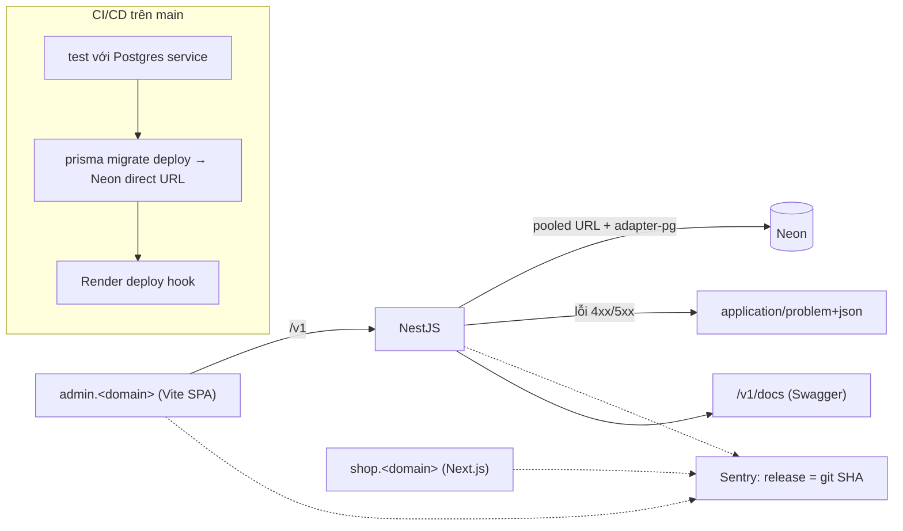

# Plan Sprint 2 — Data layer & Admin shell · v0.2.0

> Sprint: [sprint-02.md](../sprints/sprint-02.md) · Tổng quan v1: [README](../README.md)
>
> **Cách dùng plan:** đọc "Khái niệm" → tự làm → kẹt quá 30 phút mới mở Hint 1 → Hint 2 → Hint 3. Tự nghĩ test case trước khi mở đáp án.

## 0. Trước khi bắt đầu

- Sprint 1 đã xong: CI xanh, `api.<domain>` và `shop.<domain>` chạy được.
- Đọc lại [knowledge/github-actions.md](../../knowledge/github-actions.md) mục 3, phần "Postgres cho integration test".
- Tài khoản: **Neon** (tạo project, region gần Render nhất), **Sentry** (tạo 3 project: api, web, admin).
- Phiên bản: **Prisma ORM 7**. Cấu hình connection đã chuyển từ `schema.prisma` sang `prisma.config.ts`, và client dùng **driver adapter** (`@prisma/adapter-pg`). Tutorial cũ (Prisma 5–6) có `url`/`directUrl` trong `schema.prisma`: **đừng làm theo**.

## 1. Bức tranh tổng



Sau sprint này API có **trí nhớ** (DB), **cách nói lỗi thống nhất** (RFC 9457) và **mắt quan sát** (Sentry). Admin app có mặt trên production, dù chưa có tính năng gì.

## 2. Thứ tự & phụ thuộc

```
PXM-14 (Prisma + Store) ──▶ PXM-15 (migrate trong pipeline)
PXM-16 (errors + Zod pipe) ──▶ PXM-17 (OpenAPI dùng Zod DTO)
PXM-18 (admin shell)        độc lập, làm song song được
PXM-19 (Sentry)             sau PXM-16 (filter lỗi) và PXM-18 (có admin)
PXM-20 (ADR)                cuối sprint, khi các quyết định đã rõ
```

- **Rủi ro lớn nhất:** PXM-14, vì chiến lược DB cho test sẽ ảnh hưởng tới **mọi** sprint sau. Làm kỹ ngay từ đầu.
- PXM-15 phải xong **trước** release cuối sprint, vì chưa có nó thì merge lên `main` sẽ deploy code mới trên schema cũ.

---

## 3.1 PXM-14 · Prisma + Neon + model Store

### Khái niệm cần nắm
- **Migration workflow:** `prisma migrate dev` (local) so sánh schema với DB, sinh file SQL trong `prisma/migrations/`, áp dụng và generate client. `prisma migrate deploy` (CI/production) **chỉ áp dụng** các migration chưa chạy, không bao giờ sinh mới, không reset. **Không bao giờ chạy `migrate dev` trên production.**
- **Pooled vs direct connection (Neon):** URL pooled (qua PgBouncer, host có `-pooler`) dùng cho app khi chạy, vì chịu được nhiều kết nối. URL direct dùng cho migration, vì migration cần session-level features mà pooler ở chế độ transaction không hỗ trợ. Trong Prisma 7: `prisma.config.ts` → `datasource.url` dùng **direct** (cho CLI), còn `PrismaClient` dùng adapter với **pooled**.
- **UUIDv7 sinh ở app:** UUID có phần đầu là timestamp, nên sắp xếp được theo thời gian và insert vào B-tree index hiệu quả hơn UUIDv4 ngẫu nhiên. Sinh ở app nghĩa là biết ID trước khi insert, rất tiện cho idempotency và log. Prisma hỗ trợ `@default(uuid(7))`: giá trị do Prisma Client sinh ra, tức là sinh ở app.
- **Seed idempotent:** chạy N lần cho kết quả như chạy 1 lần. Dùng `upsert` theo một khóa unique (ví dụ `slug`).
- **Chiến lược DB cho integration test:** test cần DB thật (để bắt lỗi constraint, transaction…), nhưng phải **cô lập** giữa các test. v1 chọn: DB riêng cho test, `migrate deploy` một lần trước khi chạy, `TRUNCATE … CASCADE` giữa các test file.

### Hướng tiếp cận
1. Cài `prisma`, `@prisma/client`, `@prisma/adapter-pg` vào `apps/api`. Tạo `prisma.config.ts`, `prisma/schema.prisma` với generator `prisma-client` (có `output`).
2. Model `Store`: `id` UUID (v7), `name`, `slug` unique, `createdAt`, `updatedAt`. Đặt tên bảng/cột theo quy ước (`@@map`/`@map` sang snake_case nếu bạn muốn SQL dễ đọc).
3. `PrismaService`: kế thừa client (hoặc bọc nó), kết nối khi module init, ngắt kết nối khi module destroy. Đăng ký trong một `PrismaModule` global.
4. Mở rộng env schema (PXM-9): `DATABASE_URL` (pooled), `DIRECT_URL`.
5. Seed: tạo store "PixelMart" bằng upsert. Cấu hình `migrations.seed` trong `prisma.config.ts`. Thêm script `db:migrate`, `db:seed`.
6. Hạ tầng test: `compose.yaml` đã có Postgres. Tạo DB `pixelmart_test`. Viết global setup (migrate deploy) và helper `resetDb()` truncate mọi bảng trừ `_prisma_migrations`.
7. CI: thêm `services: postgres` (xem knowledge), env `DATABASE_URL`/`DIRECT_URL` trỏ tới DB test.

### File dự kiến tạo/sửa
`apps/api/prisma.config.ts`, `apps/api/prisma/schema.prisma`, `apps/api/prisma/migrations/**` (sinh tự động), `apps/api/prisma/seed.ts`, `apps/api/src/prisma/{prisma.module.ts,prisma.service.ts}`, `apps/api/src/config/env.ts`, `apps/api/test/{setup.ts,db.ts}`, `apps/api/vitest.config.ts`, `.github/workflows/ci.yml`, `apps/api/.env.example`, `.gitignore` (thư mục client generate).

### Tự nghĩ test case trước
Bạn sẽ test những gì để tin rằng (a) seed idempotent, (b) truncate giữa test thật sự cô lập, (c) ràng buộc unique có tác dụng?

<details><summary>Đáp án tham khảo</summary>

- Chạy seed 2 lần → bảng `stores` có đúng 1 dòng slug `pixelmart`.
- Tạo 2 store cùng `slug` → lỗi unique (Prisma `P2002`).
- Test A tạo dữ liệu, test file B chạy sau → không thấy dữ liệu của A.
- `id` được sinh tự động, đúng định dạng UUID, phiên bản 7 (ký tự thứ 13 là `7`).
- Test chạy song song không giẫm lên nhau (xem bẫy bên dưới).
</details>

### Gợi ý
<details><summary>Hint 1: hướng đi</summary>

Làm cho `pnpm db:migrate` chạy được ở local với Postgres trong Docker trước. Chỉ khi đó mới nối Neon. Neon chỉ là "một Postgres khác", khác URL.
</details>

<details><summary>Hint 2: khái niệm/API</summary>

- Prisma 7: `defineConfig({ schema, migrations: { path, seed }, datasource: { url: env('DIRECT_URL') } })` từ `prisma/config`.
- Client: `new PrismaClient({ adapter: new PrismaPg({ connectionString: env.DATABASE_URL }) })`.
- Truncate tất cả bảng: lấy danh sách bảng từ `pg_tables` (schema `public`, trừ `_prisma_migrations`), rồi `TRUNCATE ... RESTART IDENTITY CASCADE` trong một câu lệnh.
- Vitest mặc định chạy **các file test song song**. Với một DB dùng chung, bật `fileParallelism: false` (đơn giản), hoặc mỗi worker một schema/DB (nhanh hơn, phức tạp hơn).
</details>

<details><summary>Hint 3: khung</summary>

```
prisma.config.ts
  schema: prisma/schema.prisma
  migrations: path prisma/migrations, seed "tsx prisma/seed.ts"
  datasource.url: DIRECT_URL

seed.ts
  upsert store where slug="pixelmart" create {name, slug} update {}

test/setup (globalSetup, chạy 1 lần)
  chạy `prisma migrate deploy` với URL của DB test
test/db.ts
  resetDb(): TRUNCATE mọi bảng public trừ _prisma_migrations CASCADE
  gọi trong beforeEach hoặc beforeAll của mỗi file
```
</details>

### Bẫy thường gặp
| Triệu chứng | Nguyên nhân | Cách tránh |
|---|---|---|
| Làm theo tutorial, `url` trong `schema.prisma` báo lỗi | Tutorial cho Prisma ≤ 6 | Prisma 7: URL nằm trong `prisma.config.ts`, client dùng adapter |
| `migrate deploy` trên Neon bị treo hoặc lỗi prepared statement | Dùng URL pooled cho migration | Migration dùng `DIRECT_URL` |
| Test chập chờn, lúc pass lúc fail | Các file test chạy song song cùng truncate một DB | `fileParallelism: false` hoặc tách DB/schema theo worker |
| Dữ liệu dev biến mất | Test trỏ nhầm vào DB dev | DB test riêng. Kiểm tra trong setup: tên DB phải chứa `test`, sai thì dừng |
| Seed tạo bản ghi trùng | Dùng `create` | `upsert` theo khóa unique |
| Sửa migration đã apply, CI/production lỗi checksum | Sửa file trong `migrations/` sau khi đã chạy | Không sửa migration đã merge. Muốn đổi thì tạo migration mới |
| Client generate bị commit vào git | Output nằm trong `src/` mà không ignore | Thêm vào `.gitignore`, generate trong CI (`prisma generate` trước khi build/typecheck) |

### Kiểm chứng AC
- [ ] `pnpm db:migrate && pnpm db:seed && pnpm db:seed` → `SELECT count(*) FROM stores` = 1.
- [ ] CI log cho thấy Postgres service healthy, integration test chạy với DB thật.
- [ ] Integration test tạo 2 store trùng slug → lỗi unique được bắt đúng.

### Đọc thêm
- Prisma 7 + PostgreSQL: https://www.prisma.io/docs/orm/core-concepts/supported-databases/postgresql
- Prisma config file: https://www.prisma.io/docs/orm/reference/prisma-config-reference
- Development vs production migrations: https://www.prisma.io/docs/orm/prisma-migrate/workflows/development-and-production
- Neon connection pooling: https://neon.com/docs/connect/connection-pooling
- UUIDv7 (RFC 9562): https://www.rfc-editor.org/rfc/rfc9562

---

## 3.2 PXM-15 · Migration trong pipeline deploy

### Khái niệm cần nắm
- **Thứ tự:** migrate → deploy. Code mới cần schema mới. Ngược lại thì code mới chạy trên schema cũ và lỗi.
- **Migration phải tương thích ngược (expand/contract):** trong vài phút deploy, **code cũ đang chạy trên schema mới**. Và nếu rollback code thì DB **không** tự rollback. Đổi tên cột = thêm cột mới (expand) → code ghi vào cả hai/đọc cột mới → xóa cột cũ ở release sau (contract).
- **Fail closed:** migration lỗi thì job dừng, **không** gọi deploy hook, bản cũ tiếp tục chạy.

### Hướng tiếp cận
1. Trong job deploy (PXM-13): thêm các bước checkout, setup, install, rồi `prisma migrate deploy` với `DIRECT_URL` của Neon production (secret trong environment `production`), **trước** bước gọi hook.
2. Bảo đảm không có `continue-on-error` hay `|| true`.
3. Thử nghiệm có chủ đích: tạo một migration lỗi trên branch thử (không merge vào `main` thật) để xác nhận pipeline dừng. Hoặc chạy workflow trên một Neon branch tạm.

### File dự kiến tạo/sửa
`.github/workflows/deploy.yml` (hoặc job deploy trong `ci.yml`), secret `DIRECT_URL` trong environment `production`.

### Tự nghĩ test case trước
Ngoài "migration lỗi → không deploy", còn tình huống nào về thứ tự và đồng thời cần nghĩ tới?

<details><summary>Đáp án tham khảo</summary>

- Migration lỗi → job đỏ, hook không được gọi, `/v1/health` vẫn trả version cũ.
- Migration thành công → schema mới có trên Neon trước khi API mới khởi động.
- Hai lần merge sát nhau → hai deploy chạy chồng lên nhau? Dùng `concurrency` cho job deploy với `cancel-in-progress: false` để chúng xếp hàng.
- Không có migration mới → `migrate deploy` báo "No pending migrations" và tiếp tục.
</details>

### Gợi ý
<details><summary>Hint 1: hướng đi</summary>

Đây chỉ là thêm 1 bước vào job deploy, nhưng **thứ tự** và **điều kiện dừng** mới là bài học. Vẽ lại pipeline trên giấy trước.
</details>

<details><summary>Hint 2: khái niệm/API</summary>

`pnpm --filter api exec prisma migrate deploy`. Prisma 7 đọc URL từ `prisma.config.ts`, nên job phải set env `DIRECT_URL`. `concurrency: { group: deploy-production, cancel-in-progress: false }`.
</details>

<details><summary>Hint 3: khung</summary>

```
job deploy (needs: ci, chỉ main, environment: production, concurrency deploy-production)
  checkout → setup pnpm/node → install --frozen-lockfile
  prisma migrate deploy   (env DIRECT_URL = secret)     ← lỗi thì dừng tại đây
  curl -fsS -X POST $RENDER_DEPLOY_HOOK_URL
```
</details>

### Bẫy thường gặp
| Triệu chứng | Nguyên nhân | Cách tránh |
|---|---|---|
| Migrate chạy nhưng deploy vẫn xảy ra khi migrate lỗi | Hai job song song, hoặc `continue-on-error` | Cùng một job, các bước tuần tự, không nuốt lỗi |
| API mới khởi động trên schema cũ | Render auto-deploy vẫn bật | Tắt auto-deploy (PXM-13) |
| Xóa cột → API cũ (đang chạy) lỗi 500 trong lúc deploy | Migration phá vỡ tương thích | Expand/contract qua 2 release |
| Dùng nhầm DB production cho test | Secret đặt ở cấp repo thay vì environment | Secret production chỉ nằm trong environment `production` |

### Kiểm chứng AC
- [ ] Trên một branch thử, cố tình viết migration SQL lỗi, chạy workflow (hoặc `workflow_dispatch` trỏ tới Neon branch tạm) → job đỏ ở bước migrate, hook không được gọi.
- [ ] Release thật: log cho thấy `migrate deploy` chạy xong trước bước hook. Bảng mới có trên Neon (kiểm tra bằng Neon console).

### Đọc thêm
- Prisma, deploying database changes: https://www.prisma.io/docs/orm/prisma-client/deployment/deploy-database-changes-with-prisma-migrate
- Expand and contract pattern: https://www.prisma.io/dataguide/types/relational/expand-and-contract-pattern
- Neon branching (thử migration an toàn): https://neon.com/docs/introduction/branching

---

## 3.3 PXM-16 · Error handling RFC 9457 + Zod validation

### Khái niệm cần nắm
- **RFC 9457 Problem Details:** một format JSON chuẩn cho lỗi HTTP, `Content-Type: application/problem+json`. Các field chuẩn: `type` (URI định danh loại lỗi), `title` (mô tả ngắn, cố định theo type), `status`, `detail` (mô tả cho lần xảy ra này), `instance` (URI của request/occurrence). Được phép thêm field mở rộng, ví dụ `errors[]` cho lỗi validation, `reqId`.
- **Global exception filter:** một chỗ duy nhất chuyển **mọi** lỗi thành Problem Details. Controller/service chỉ việc `throw`.
- **Lỗi đã biết vs lỗi không lường trước:** `HttpException` (404, 409…) giữ nguyên status và thông điệp. Lỗi lạ (TypeError, lỗi DB…) → 500, `detail` chung chung, **không lộ stack/SQL**, nhưng log đầy đủ kèm `reqId`.
- **`ZodValidationPipe` global (nestjs-zod):** mọi DTO tạo bằng `createZodDto(schema)` được validate tự động. Body sai thì pipe ném `ZodValidationException`, và filter của ta chuyển nó thành 400 với `errors[]`.
- **`ApiError` có type ở client:** `api-client` parse problem+json thành lỗi có `status`, `title`, `errors`, để UI xử lý theo loại lỗi thay vì đọc chuỗi.

### Hướng tiếp cận
1. `packages/contracts/src/common/problem-details.ts`: schema Zod cho Problem Details + `errors: { path: string; message: string }[]` (tùy chọn).
2. Đăng ký `ZodValidationPipe` qua `APP_PIPE`.
3. Viết `ProblemDetailsFilter` (`@Catch()` bắt mọi thứ), đăng ký qua `APP_FILTER`. Phân loại: `ZodValidationException` → 400 + `errors[]`; `HttpException` → giữ status; còn lại → 500 + log error.
4. Đặt header `Content-Type: application/problem+json`, thêm `instance`/`reqId`.
5. `api-client`: khi `!res.ok` và content-type là problem+json → parse → ném `ApiError`.
6. Integration test cho 400 và 404 (route không tồn tại cũng phải ra Problem Details).

### File dự kiến tạo/sửa
`packages/contracts/src/common/problem-details.ts`, `apps/api/src/common/filters/problem-details.filter.ts`, `apps/api/src/app.module.ts`, `packages/api-client/src/errors.ts`, `apps/api/test/errors.e2e-spec.ts`.

### Tự nghĩ test case trước
Liệt kê mọi nguồn lỗi có thể đi qua filter. Mỗi nguồn cần ra status và body thế nào?

<details><summary>Đáp án tham khảo</summary>

- Body sai schema → 400, `errors[].path` đúng field (ví dụ `["email"]`).
- JSON không hợp lệ (`{abc`) → 400, không phải 500.
- Route không tồn tại → 404 dạng problem+json.
- `NotFoundException` từ service → 404 với `detail` của bạn.
- `throw new Error('boom')` → 500, `detail` chung chung, response **không** chứa "boom" hay stack. Log **có** stack và `reqId`.
- Header response là `application/problem+json`.
- (Tạo một route test chỉ bật khi `NODE_ENV=test` để ném lỗi lạ, hoặc dùng controller giả trong test module.)
</details>

### Gợi ý
<details><summary>Hint 1: hướng đi</summary>

Viết test trước: gửi body sai → mong đợi 400 + `errors`. Rồi viết filter tối thiểu để pass, rồi thêm từng nhánh (404, 500).
</details>

<details><summary>Hint 2: khái niệm/API</summary>

- `@Catch()` không có tham số → bắt mọi exception.
- `host.switchToHttp().getResponse()`. Có thể dùng `HttpAdapterHost` để không phụ thuộc Express/Fastify.
- `ZodValidationException#getZodError()` trả về lỗi Zod, `.issues` có `path` và `message`.
- Lỗi JSON parse từ body-parser là một `HttpException` 400 (Nest bọc lại) hoặc có `type === 'entity.parse.failed'`. Hãy kiểm tra thực tế.
- Ví dụ custom error handling trong repo nestjs-zod: `packages/example/src/http-exception.filter.ts`.
</details>

<details><summary>Hint 3: khung</summary>

```
catch(exception, host):
  reqId = lấy từ request (pino-http gắn vào req.id)
  nếu exception là ZodValidationException:
      status 400, title "Validation failed", errors = map issues → {path: path.join('.'), message}
  ngược lại nếu là HttpException:
      status = exception.getStatus(), title theo status, detail = message nếu an toàn
  ngược lại:
      status 500, title "Internal Server Error", detail "Unexpected error"
      logger.error({ err: exception, reqId })
  response.status(status).type('application/problem+json').json({ type, title, status, detail, instance, reqId, errors? })
```
</details>

### Bẫy thường gặp
| Triệu chứng | Nguyên nhân | Cách tránh |
|---|---|---|
| Lỗi 500 trả cả stack trace hoặc câu SQL ra client | Đưa `exception.message` vào `detail` cho mọi lỗi | Chỉ đưa message của lỗi **đã biết**, lỗi lạ thì trả câu chung |
| Lỗi 500 không có trong log | Filter bắt lỗi nhưng quên log | Log ở nhánh 500, kèm `reqId` |
| `type` là chuỗi ngẫu nhiên mỗi lần | Hiểu sai `type` | `type` là URI cố định theo **loại** lỗi (hoặc `about:blank`) |
| Validation trả `errors` nhưng `path` là mảng số/chuỗi khó dùng | Không chuẩn hóa | Thống nhất `path: "items.0.quantity"` (chuỗi), ghi trong contract |
| Filter global không bắt lỗi của guard | Đăng ký sai cách | `APP_FILTER` bắt được lỗi từ guard, pipe, controller |

### Kiểm chứng AC
- [ ] `curl -i -X POST localhost:3000/v1/<route-có-body> -H 'content-type: application/json' -d '{}'` → 400, `content-type: application/problem+json`, có `errors[].path`.
- [ ] Gây lỗi lạ → 500, body không có stack, log có `reqId` và stack.
- [ ] Integration test cho 400 và 404 xanh trong CI.

### Đọc thêm
- RFC 9457: https://www.rfc-editor.org/rfc/rfc9457
- NestJS exception filters: https://docs.nestjs.com/exception-filters
- nestjs-zod: https://github.com/BenLorantfy/nestjs-zod

---

## 3.4 PXM-17 · OpenAPI docs

### Khái niệm cần nắm
- **OpenAPI:** đặc tả máy đọc được của API: endpoint, request/response schema, lỗi. Dùng để sinh tài liệu, sinh client, làm contract test.
- **Một nguồn sự thật:** schema Zod → DTO (`createZodDto`) → validation **và** OpenAPI. Không viết tay `@ApiProperty` lặp lại.
- **`cleanupOpenApiDoc`** của nestjs-zod: hậu xử lý document do `@nestjs/swagger` sinh ra để schema từ Zod hiển thị đúng.

### Hướng tiếp cận
1. Cài `@nestjs/swagger`. Trong `main.ts` (hoặc `configureApp`): `DocumentBuilder` → `SwaggerModule.createDocument` → `cleanupOpenApiDoc` → `SwaggerModule.setup('v1/docs', …)`.
2. Health response dùng DTO tạo từ `healthResponseSchema`, kèm `@ZodSerializerDto` (cần đăng ký `ZodSerializerInterceptor`) hoặc `@ApiOkResponse({ type })`.
3. Mô tả response lỗi chung (Problem Details) cho các endpoint.
4. Quyết định: có bật `/v1/docs` trên production không? Ghi lý do lại (API của ta public, nên bật cũng chấp nhận được).

### File dự kiến tạo/sửa
`apps/api/src/main.ts` (hoặc `configure-app.ts`), `apps/api/src/health/health.dto.ts`, `apps/api/src/health/health.controller.ts`.

### Tự nghĩ test case trước
Làm sao để test được rằng tài liệu **đúng**, chứ không chỉ "có trang"?

<details><summary>Đáp án tham khảo</summary>

- `GET /v1/docs-json` (hoặc đường dẫn JSON bạn cấu hình) → 200, chứa path `/v1/health`.
- Schema response của `/v1/health` có đủ field `status`, `version`, `uptime` với đúng kiểu.
- Đổi field trong contract → OpenAPI đổi theo mà không cần sửa gì khác.
</details>

### Gợi ý
<details><summary>Hint 1: hướng đi</summary>

Làm cho Swagger UI hiện trước, rồi mới lo schema có đúng không. Mở JSON ra đọc, đừng chỉ nhìn UI.
</details>

<details><summary>Hint 2: khái niệm/API</summary>

`SwaggerModule.setup(path, app, document, { jsonDocumentUrl })` cho phép đặt URL của file JSON. Với global prefix, kiểm tra xem path trong document có tự thêm `/v1` không.
</details>

<details><summary>Hint 3: khung (boilerplate)</summary>

```ts
const config = new DocumentBuilder().setTitle('PixelMart API').setVersion(env.APP_VERSION).build();
const document = cleanupOpenApiDoc(SwaggerModule.createDocument(app, config));
SwaggerModule.setup('v1/docs', app, document, { jsonDocumentUrl: 'v1/docs/openapi.json' });
```
</details>

### Bẫy thường gặp
| Triệu chứng | Nguyên nhân | Cách tránh |
|---|---|---|
| Schema trong Swagger rỗng `{}` | Thiếu `cleanupOpenApiDoc` hoặc dùng type thay vì class DTO | `class X extends createZodDto(schema) {}` + cleanup |
| Docs nói một đằng, API trả một nẻo | Response không đi qua serializer | `@ZodSerializerDto` để response bị parse/strip theo schema |
| `/v1/docs` 404 trên production | Setup chỉ chạy khi `NODE_ENV=development` | Quyết định có chủ đích và ghi lại |

### Kiểm chứng AC
- [ ] Mở `https://api.<domain>/v1/docs` → thấy `/v1/health` với schema response đúng 3 field.

### Đọc thêm
- NestJS OpenAPI: https://docs.nestjs.com/openapi/introduction
- nestjs-zod, OpenAPI: https://github.com/BenLorantfy/nestjs-zod#openapi-swagger-support

---

## 3.5 PXM-18 · Admin app skeleton + deploy

### Khái niệm cần nắm
- **SPA (Single Page Application):** server chỉ trả `index.html` + JS. Router chạy trong browser. Hệ quả là server phải trả `index.html` cho **mọi** đường dẫn (`/products`, `/orders`…), nếu không thì reload trang con sẽ 404.
- **TanStack Router, file-based routing:** mỗi file trong `src/routes/` là một route. Plugin Vite sinh file `routeTree.gen.ts` có type đầy đủ (link sai thì lỗi ngay khi compile).
- **TanStack Query:** quản lý server state (cache, refetch, loading/error). Router quản lý URL, Query quản lý dữ liệu.
- **Vite dev proxy:** khi dev, admin chạy ở `:5173` và gọi `/v1` → proxy sang `:3000`. Nhờ vậy cùng origin, không vướng CORS khi dev. Production thì gọi thẳng `https://api.<domain>` (CORS xử lý ở Sprint 3).

### Hướng tiếp cận
1. Tạo `apps/admin` bằng Vite template React + TS, kế thừa tsconfig. Thêm Tailwind, `shadcn init`.
2. Cài TanStack Router + plugin Vite (file-based) + TanStack Query.
3. Route: `__root.tsx` (layout có sidebar), `index.tsx`, `login.tsx`, `categories.tsx`, `products.tsx`, `orders.tsx`. Cấu hình `notFoundComponent`.
4. `vite.config`: plugin router (đặt **trước** plugin React), `server.proxy['/v1'] → http://localhost:3000`.
5. Deploy: Vercel project thứ hai, Root Directory `apps/admin`, framework Vite, rewrite mọi path về `/index.html`. Domain `admin.<domain>`.

### File dự kiến tạo/sửa
`apps/admin/{package.json,vite.config.ts,index.html,tsconfig.json,eslint.config.js,vercel.json}`, `apps/admin/src/{main.tsx,routes/**}`.

### Tự nghĩ test case trước
Với một SPA đã deploy, bạn sẽ kiểm tra những đường dẫn và hành vi nào?

<details><summary>Đáp án tham khảo</summary>

- Truy cập thẳng `https://admin.<domain>/products` (không đi từ trang chủ) → hiển thị đúng trang, **không** 404 của Vercel.
- Reload ở `/orders` → vẫn đúng trang.
- `/khong-ton-tai` → trang 404 **của admin** (không phải của Vercel).
- Link trong sidebar đổi URL mà không reload toàn trang.
- Dev: gọi `/v1/health` từ admin → proxy tới API local.
</details>

### Gợi ý
<details><summary>Hint 1: hướng đi</summary>

Làm theo quickstart file-based của TanStack Router trước, chạy được 2 route rồi mới thêm layout và các route còn lại.
</details>

<details><summary>Hint 2: khái niệm/API</summary>

- Plugin: `tanstackRouter({ target: 'react', autoCodeSplitting: true })` từ `@tanstack/router-plugin/vite`.
- `createRouter({ routeTree, defaultNotFoundComponent })`, kèm khai báo `Register` để có type-safe link.
- Vercel SPA: `vercel.json` với `rewrites: [{ "source": "/(.*)", "destination": "/index.html" }]`.
</details>

<details><summary>Hint 3: khung</summary>

```
src/routes/
  __root.tsx       → <Sidebar/> + <Outlet/>, notFoundComponent
  index.tsx        → Dashboard placeholder
  login.tsx        → placeholder (Sprint 4)
  categories.tsx   → placeholder (Sprint 5)
  products.tsx     → placeholder (Sprint 5)
  orders.tsx       → placeholder (Sprint 7)
```
</details>

### Bẫy thường gặp
| Triệu chứng | Nguyên nhân | Cách tránh |
|---|---|---|
| Reload `/products` trên production → 404 của Vercel | Chưa có rewrite SPA | `vercel.json` rewrites về `index.html` |
| `routeTree.gen.ts` không được sinh, hoặc lỗi type | Plugin router đặt sau plugin React, hoặc dev server chưa chạy | Đặt plugin router trước. File này tự sinh, có thể commit hoặc ignore nhưng phải thống nhất |
| Gọi API được khi dev, production thì không | Proxy chỉ có ở dev server | Production dùng `VITE_API_URL` tuyệt đối. CORS ở Sprint 3 |
| Lộ secret vào bundle | Đặt secret trong biến `VITE_*` | Mọi `VITE_*` đều public trong JS, không bao giờ để secret ở đây |

### Kiểm chứng AC
- [ ] `https://admin.<domain>` hiển thị layout. Bấm qua lại các route được. Reload ở route con vẫn đúng.
- [ ] `https://admin.<domain>/abc` → trang 404 của admin.

### Đọc thêm
- TanStack Router, file-based routing: https://tanstack.com/router/latest/docs/framework/react/routing/file-based-routing
- TanStack Query quick start: https://tanstack.com/query/latest/docs/framework/react/quick-start
- Vite server proxy: https://vite.dev/config/server-options#server-proxy
- Vercel + Vite: https://vercel.com/docs/frameworks/frontend/vite

---

## 3.6 PXM-19 · Sentry cho api/web/admin

### Khái niệm cần nắm
- **Error tracking:** Sentry gom lỗi giống nhau thành một issue, đếm số lần xảy ra và số người bị ảnh hưởng, kèm stack trace, breadcrumbs, release. Log cho biết "chuyện gì xảy ra". Sentry cho biết "**cái gì đang hỏng và hỏng bao nhiêu**".
- **Release = git SHA:** mỗi lỗi gắn với một phiên bản code cụ thể, nên biết bản nào gây lỗi và bản nào đã sửa.
- **Source map:** code production đã được minify/compile. Source map ánh xạ ngược về code TS gốc để stack trace đọc được. Upload source map **lên Sentry**, **không** public chúng trên web.
- **Lọc dữ liệu nhạy cảm:** không gửi password, token, cookie lên Sentry (`beforeSend`, `sendDefaultPii: false`).

### Hướng tiếp cận
1. **API:** `@sentry/nestjs`. File `instrument.ts` khởi tạo Sentry và phải được import **đầu tiên** trong `main.ts`. Thêm `SentryModule.forRoot()`. Lỗi 500 trong filter của PXM-16 → `Sentry.captureException`. Không gửi lỗi 4xx (đó là lỗi của client, không phải bug).
2. **Web:** `@sentry/nextjs` (wizard `npx @sentry/wizard -i nextjs` tạo sẵn file config, nhưng hãy đọc hiểu từng file nó sinh ra).
3. **Admin:** `@sentry/react` + `@sentry/vite-plugin` để upload source map lúc build.
4. **CI/CD:** `SENTRY_AUTH_TOKEN` (secret), `SENTRY_RELEASE=${{ github.sha }}`. Upload source map cho API dùng `sentry-cli sourcemaps inject` + `upload`.
5. DSN qua env (DSN không phải secret, nhưng vẫn để trong env cho mỗi môi trường).
6. Tạo một route/nút "throw test error" chỉ bật ở môi trường không phải production, hoặc bảo vệ bằng flag, để kiểm chứng.

### File dự kiến tạo/sửa
`apps/api/src/instrument.ts`, `apps/api/src/main.ts`, `apps/api/src/common/filters/problem-details.filter.ts`, `apps/web/{instrumentation.ts,sentry.*.config.ts,next.config.ts}`, `apps/admin/{src/main.tsx,vite.config.ts}`, workflow CI/CD, `.env.example` các app.

### Tự nghĩ test case trước
Bạn kiểm chứng "Sentry hoạt động **đúng**" thế nào (không chỉ là "có nhận lỗi")?

<details><summary>Đáp án tham khảo</summary>

- Lỗi thử từ api, web, admin → mỗi lỗi vào đúng project.
- Issue có `release` = SHA của commit đang chạy.
- Stack trace trỏ về **file `.ts` gốc** và đúng dòng, không phải `main.js:1:34567`.
- Lỗi 404/400 **không** tạo issue.
- Event không chứa header `cookie`/`authorization` hay body chứa `password`.
- Source map **không** truy cập được công khai (`https://admin.<domain>/assets/*.map` → 404).
</details>

### Gợi ý
<details><summary>Hint 1: hướng đi</summary>

Làm từng app một, bắt đầu từ admin (Vite) vì đơn giản nhất. Xác nhận nhận được lỗi trước, rồi mới lo source map, release và lọc PII.
</details>

<details><summary>Hint 2: khái niệm/API</summary>

- NestJS: `import './instrument'` (ESM: `'./instrument.js'`) phải là dòng đầu tiên của `main.ts`.
- Vite plugin: `sentryVitePlugin({ org, project, authToken, release: { name } , sourcemaps: { filesToDeleteAfterUpload } })`, và `build.sourcemap: true` (hoặc `'hidden'`).
- `filesToDeleteAfterUpload` giúp không deploy file `.map` lên public.
</details>

<details><summary>Hint 3: khung</summary>

```
API:   instrument.ts → Sentry.init({ dsn, release, environment, sendDefaultPii: false })
       main.ts dòng 1: import instrument
       filter nhánh 500: Sentry.captureException(err)
Admin: Sentry.init trong main.tsx; vite build sourcemap + sentryVitePlugin (upload rồi xóa .map)
CI:    env SENTRY_AUTH_TOKEN (secret), SENTRY_RELEASE = github.sha khi build
```
</details>

### Bẫy thường gặp
| Triệu chứng | Nguyên nhân | Cách tránh |
|---|---|---|
| Stack trace là code đã minify | Source map không được upload, hoặc `release` lúc upload khác `release` lúc chạy | Dùng cùng một giá trị SHA cho cả build/upload và runtime |
| File `.map` công khai trên production | Vite build source map rồi deploy luôn | `filesToDeleteAfterUpload` hoặc `sourcemap: 'hidden'` + xóa |
| Sentry nhận hàng nghìn issue 404 | Gửi mọi exception | Chỉ capture lỗi 5xx/lỗi lạ |
| Hết quota free trong một ngày | Một lỗi lặp trong vòng lặp, hoặc tracing 100% | `tracesSampleRate` thấp (0.1) hoặc tắt. Đặt rate limit/spike protection |
| Auth token Sentry bị commit | Đặt trong `.env` rồi lỡ commit, hoặc `.sentryclirc` | Chỉ để trong secret của CI, `.gitignore` các file config chứa token |

### Kiểm chứng AC
- [ ] Gây lỗi thử ở từng app → issue xuất hiện trong Sentry với đúng release (SHA) và stack trace trỏ về file TS gốc.
- [ ] `curl -I https://admin.<domain>/assets/<file>.js.map` → 404.

### Đọc thêm
- Sentry NestJS: https://docs.sentry.io/platforms/javascript/guides/nestjs/
- Sentry Next.js: https://docs.sentry.io/platforms/javascript/guides/nextjs/
- Sentry React + Vite plugin: https://docs.sentry.io/platforms/javascript/guides/react/sourcemaps/uploading/vite/
- Releases: https://docs.sentry.io/product/releases/

---

## 3.7 PXM-20 · ADR 0001–0005

### Khái niệm cần nắm
- **ADR (Architecture Decision Record):** một trang ghi **một** quyết định: bối cảnh lúc đó, quyết định là gì, đã cân nhắc những gì, hệ quả. Mục đích: 6 tháng sau (hoặc người mới vào) hiểu **vì sao**, không chỉ thấy **cái gì**.
- **ADR không sửa, chỉ thay thế:** quyết định đổi → viết ADR mới với trạng thái "Supersedes ADR-000X", ADR cũ chuyển "Superseded".
- **Alternatives phải trung thực:** liệt kê phương án bị loại kèm **lý do thật** (kể cả "chưa đủ thời gian học"). Một ADR mà mọi phương án khác đều "tệ" là ADR viết để bào chữa.

### Hướng tiếp cận
1. Tạo `docs/adr/README.md` (index + template) và 5 file `0001-…md` → `0005-…md`.
2. Template: Title, Status (Proposed/Accepted/Superseded), Date, Context, Decision, Alternatives considered, Consequences (tích cực **và** tiêu cực).
3. Viết dựa trên những gì **thật sự** đã xảy ra trong Sprint 1–2. Ví dụ ADR-0004 nên nhắc rằng không có staging và hệ quả là integration test càng quan trọng (rule 01 đã có ý này).
4. Cân nhắc thêm ADR cho quyết định "internal package được build thế nào trong Docker" (PXM-11). Đó là một quyết định thật, không nằm trong danh sách 5 cái ban đầu.

### File dự kiến tạo/sửa
`docs/adr/README.md`, `docs/adr/0001-monorepo-pnpm-turborepo.md`, `0002-nestjs.md`, `0003-rest-zod-contracts.md`, `0004-hosting-and-gitflow.md`, `0005-error-format-rfc9457.md`.

### Tự nghĩ test case trước
Một ADR "đạt" phải trả lời được những câu hỏi nào của một người mới vào team?

<details><summary>Đáp án tham khảo</summary>

- "Tại sao không dùng X?" → có trong Alternatives.
- "Nếu muốn đổi sang X thì tốn gì?" → có trong Consequences.
- "Quyết định này còn hiệu lực không?" → Status.
- "Lúc đó có ràng buộc gì?" (solo, free tier, mục tiêu học) → Context.
</details>

### Gợi ý
<details><summary>Hint 1: hướng đi</summary>

Viết Context như kể chuyện cho người mới vào team: "Chúng ta là team 1 người, mục tiêu là học, ngân sách 0đ…". Context tốt thì Decision gần như hiển nhiên.
</details>

<details><summary>Hint 2: khái niệm/API</summary>

Template phổ biến: Michael Nygard's ADR template (Context/Decision/Status/Consequences) hoặc MADR (thêm "Considered Options", "Pros and Cons").
</details>

<details><summary>Hint 3: khung</summary>

```
# ADR-0003: REST + Zod contracts dùng chung
- Status: Accepted · Date: 2026-10-xx
## Context        (ràng buộc, vấn đề)
## Decision       (một đoạn, dứt khoát)
## Alternatives   (tRPC, GraphQL, OpenAPI-first codegen… → vì sao không)
## Consequences   (+ type an toàn hai phía / − phải giữ contracts không phụ thuộc Node…)
```
Có thể nhờ Claude viết nháp (rule 05 cho phép với ADR), nhưng **bạn** phải sửa phần Alternatives và Consequences theo trải nghiệm thật.
</details>

### Bẫy thường gặp
| Triệu chứng | Nguyên nhân | Cách tránh |
|---|---|---|
| ADR chỉ có Decision | Thiếu Context/Alternatives | Template bắt buộc đủ mục |
| ADR mô tả chi tiết cách cài đặt | Nhầm ADR với tài liệu kỹ thuật | ADR nói **vì sao**. "Làm thế nào" nằm trong README/code |
| Sửa nội dung ADR cũ khi đổi ý | Mất lịch sử quyết định | Viết ADR mới, đánh dấu ADR cũ là Superseded |

### Kiểm chứng AC
- [ ] 5 file ADR, mỗi file có đủ Context, Decision, Alternatives, Consequences (`grep -c "^## " docs/adr/000*.md`).

### Đọc thêm
- Michael Nygard, Documenting Architecture Decisions: https://cognitect.com/blog/2011/11/15/documenting-architecture-decisions
- MADR: https://adr.github.io/madr/

---

## 4. Tự kiểm tra cuối sprint

1. `migrate dev` và `migrate deploy` khác nhau thế nào? Vì sao production chỉ dùng cái sau?
<details><summary>Gợi ý</summary>

`dev` sinh migration mới, có thể reset DB, dùng shadow DB. `deploy` chỉ áp dụng các migration đã có, không hỏi gì, không reset. Production cần tính tất định và an toàn.
</details>

2. Vì sao migration cần dùng direct URL, còn app thì dùng pooled URL?
<details><summary>Gợi ý</summary>

Pooler ở chế độ transaction không giữ session, nên migration (advisory lock, prepared statement…) có thể lỗi. App có nhiều kết nối ngắn nên cần pooler để không cạn connection của Postgres.
</details>

3. Giải thích expand/contract bằng ví dụ đổi tên cột `name` → `title`.
<details><summary>Gợi ý</summary>

Release 1: thêm cột `title`, code ghi cả hai cột, đọc `title` (fallback sang `name`), backfill dữ liệu. Release 2: code chỉ dùng `title`. Release 3: xóa `name`. Ở mọi thời điểm, code cũ lẫn mới đều chạy được trên schema hiện tại.
</details>

4. Vì sao lỗi 500 không được trả `exception.message` cho client?
<details><summary>Gợi ý</summary>

Có thể lộ chi tiết nội bộ (SQL, đường dẫn file, tên bảng, đôi khi cả dữ liệu), giúp kẻ tấn công dò hệ thống. Client chỉ cần biết "lỗi phía server" + `reqId` để báo lỗi.
</details>

5. Vì sao test integration chạy song song trên cùng một DB lại chập chờn? Có những cách nào để xử lý?
<details><summary>Gợi ý</summary>

Các file truncate và insert đan xen nhau. Cách xử lý: chạy tuần tự, mỗi worker một DB/schema, hoặc bọc mỗi test trong transaction rồi rollback (khó khi code tự mở transaction).
</details>

6. Vì sao reload một route con của SPA trên Vercel lại 404, và sửa thế nào?
<details><summary>Gợi ý</summary>

Server tìm file `/products` không có. Router chỉ tồn tại trong JS ở browser. Sửa bằng cách rewrite mọi path về `index.html`.
</details>

7. Source map giúp gì, và vì sao không nên public chúng?
<details><summary>Gợi ý</summary>

Giúp stack trace đọc được. Public thì ai cũng xem được source gốc (logic, comment, đôi khi cả URL nội bộ).
</details>

8. ADR khác README/tài liệu kỹ thuật thế nào?
<details><summary>Gợi ý</summary>

ADR ghi lại một quyết định và lý do tại thời điểm đó, không sửa về sau. README mô tả trạng thái hiện tại và cách dùng, được cập nhật liên tục.
</details>

## 5. Kịch bản demo

1. Tạo một migration nhỏ (ví dụ thêm cột `Store.description` nullable) → PR → CI chạy integration test với Postgres.
2. Release → log job deploy: `migrate deploy` chạy **trước** deploy hook. Neon console có cột mới.
3. `curl` một request body sai → 400 `application/problem+json` có `errors[]`.
4. Mở `https://api.<domain>/v1/docs`.
5. Mở `https://admin.<domain>/products`, reload → vẫn đúng trang. `/abc` → 404 của admin.
6. Gây lỗi thử → Sentry hiện issue có release = SHA và stack trace TS gốc.
7. Lướt qua `docs/adr/`.
