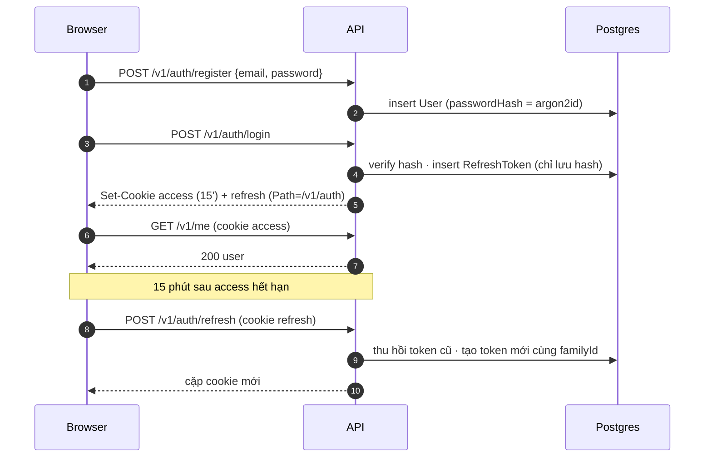
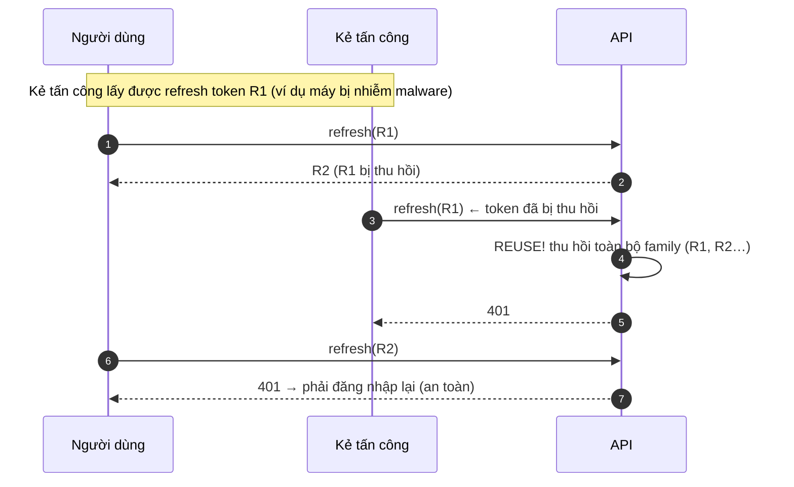

# Plan Sprint 3 — Auth API · v0.3.0

> Sprint: [sprint-03.md](../sprints/sprint-03.md) · Tổng quan v1: [README](../README.md)
>
> **Cách dùng plan:** đọc "Khái niệm" → tự làm → kẹt quá 30 phút mới mở Hint 1 → Hint 2 → Hint 3. Tự nghĩ test case trước khi mở đáp án.
>
> 🔒 **Sprint này là logic auth, phần [rule 05](../../rules/05-working-with-claude.md) yêu cầu bạn tự viết.** Hint 3 chỉ có **pseudo-code**, không có code chạy được. Mọi PR trong sprint phải chạy `/security-review` trước khi merge.

## 0. Trước khi bắt đầu

**Kiến thức nên đọc trước** (đọc kỹ, đây là sprint nặng lý thuyết nhất của v1):
- OWASP Authentication Cheat Sheet: https://cheatsheetseries.owasp.org/cheatsheets/Authentication_Cheat_Sheet.html
- OWASP Password Storage Cheat Sheet: https://cheatsheetseries.owasp.org/cheatsheets/Password_Storage_Cheat_Sheet.html
- JWT cơ bản: https://jwt.io/introduction
- MDN, Set-Cookie: https://developer.mozilla.org/en-US/docs/Web/HTTP/Reference/Headers/Set-Cookie

**Bạn cần trả lời được trước khi code** (hỏi Claude ở mức "giải thích khái niệm" nếu chưa chắc):
1. Hashing khác encryption thế nào? Vì sao password phải **hash** chứ không mã hóa?
2. JWT có bị mã hóa không? Ai đọc được payload?
3. Vì sao cần cả access token **và** refresh token, thay vì một token sống 30 ngày?
4. `HttpOnly`, `Secure`, `SameSite` chống lại những kiểu tấn công nào?

## 1. Bức tranh tổng



Mô hình dữ liệu dự kiến:

```
User          id · email (unique, lowercase) · passwordHash · name · role (CUSTOMER|ADMIN) · createdAt
RefreshToken  id · userId → User · familyId · tokenHash (unique) · expiresAt · revokedAt? · createdAt
```

## 2. Thứ tự & phụ thuộc

```
PXM-21 register ──▶ PXM-22 login + cookie + throttle ──▶ PXM-23 refresh/reuse/logout
                                   └──▶ PXM-24 guards, /me, admin seed ──▶ PXM-25 CORS + ADR
```

- **Rủi ro lớn nhất:** PXM-23 (3 pts, nhiều trạng thái, race condition). Bắt đầu nó trước giữa sprint.
- Mỗi ticket viết **integration test trước** (TDD). Với auth, test chính là bản đặc tả bảo mật.

---

## 3.1 PXM-21 · Đăng ký tài khoản (API)

### Khái niệm cần nắm
- **Password hashing:** hàm một chiều, **cố tình chậm** và tốn bộ nhớ, để kẻ trộm DB không thể đoán hàng tỷ mật khẩu mỗi giây. **argon2id** là lựa chọn được OWASP khuyến nghị hàng đầu. bcrypt chấp nhận được. SHA-256 **không** dùng cho password vì quá nhanh.
- **Salt:** chuỗi ngẫu nhiên riêng cho mỗi password, để hai người cùng mật khẩu có hash khác nhau và rainbow table vô dụng. Thư viện argon2 tự sinh salt và nhúng nó vào chuỗi hash (`$argon2id$v=19$m=…,t=…,p=…$salt$hash`).
- **Chuẩn hóa email:** `trim` + `lowercase` **trước** khi lưu và trước khi so sánh, nếu không `A@x.com` và `a@x.com` sẽ thành hai tài khoản.
- **Response schema chặn rò rỉ:** không trả entity Prisma ra ngoài. Response đi qua `userResponseSchema` (không có `passwordHash`), và nên có `ZodSerializerDto` để **chắc chắn** field lạ bị loại bỏ (CLAUDE.md: "không trả type Prisma ra ngoài").
- **409 Conflict** cho email đã tồn tại. Nhưng hãy nghĩ thêm: chính 409 này cũng cho kẻ tấn công biết email nào đã đăng ký (user enumeration). v1 chấp nhận rủi ro này ở endpoint register (AC yêu cầu 409), còn ở **login** thì tuyệt đối không được lộ.

### Hướng tiếp cận
1. Contract: `registerSchema` (email: trim + lowercase + định dạng email; password: tối thiểu 8, đặt cả giới hạn **tối đa**, ví dụ 128; name), `userResponseSchema`.
2. Prisma: model `User` + enum `Role`, migration.
3. Module `identity` (hoặc `auth` + `users`): `UsersService.create`, `AuthController.register`.
4. Bắt lỗi unique của Prisma (`P2002`) → `ConflictException`. Đừng "check rồi insert" (race condition), hãy để constraint của DB làm hàng rào.
5. Integration test trước, rồi cài đặt.

### File dự kiến tạo/sửa
`packages/contracts/src/auth/{register.ts,user.ts}`, `apps/api/prisma/schema.prisma` + migration, `apps/api/src/identity/{identity.module.ts,auth.controller.ts,auth.service.ts,users.service.ts,password.service.ts}`, `apps/api/test/auth-register.e2e-spec.ts`.

### Tự nghĩ test case trước
Viết ra ít nhất 7 case trước khi mở đáp án. Nghĩ cả về **dữ liệu lưu trong DB**, không chỉ response.

<details><summary>Đáp án tham khảo</summary>

1. Hợp lệ → 201, body có `id`, `email`, `name`, `role: "CUSTOMER"`, **không** có `passwordHash`.
2. Trong DB: `passwordHash` bắt đầu bằng `$argon2id$` và **khác** password gốc.
3. Email `"  Alice@X.com "` → lưu thành `alice@x.com`.
4. Đăng ký lại `ALICE@x.com` → 409.
5. Password 7 ký tự → 400 với `errors[].path = "password"`.
6. Password 10.000 ký tự → 400 (không để server băm chuỗi khổng lồ, đó là một vector DoS).
7. Email sai định dạng → 400.
8. Body gửi thêm `role: "ADMIN"` → user vẫn là `CUSTOMER` (mass assignment).
9. Hai request đăng ký cùng email gửi đồng thời → đúng một cái 201, cái còn lại 409, không có 500.
</details>

### Gợi ý
<details><summary>Hint 1: hướng đi</summary>

Tách một `PasswordService` nhỏ với hai hàm `hash` và `verify`. Service đăng ký chỉ gọi tới đó. Nhờ vậy sau này đổi tham số argon2 chỉ sửa một chỗ, và test dễ hơn.
</details>

<details><summary>Hint 2: khái niệm/API</summary>

- Package `argon2` (node-argon2): mặc định đã là argon2id. Đọc README để biết các tham số `memoryCost`, `timeCost`, `parallelism` và giá trị mặc định. So sánh với khuyến nghị của OWASP.
- Zod: `z.string().trim().toLowerCase().pipe(z.email())`, hoặc dùng API email của Zod 4. Kiểm tra docs Zod 4 cho cú pháp đúng.
- Mass assignment: schema Zod mặc định **strip** field lạ (object không phải `strict`). Hãy tự kiểm chứng bằng test 8.
- Prisma lỗi unique: `Prisma.PrismaClientKnownRequestError` với `code === 'P2002'`.
</details>

<details><summary>Hint 3: pseudo-code</summary>

```
register(input):
  data = registerSchema.parse(input)            // pipe đã làm việc này
  hash = passwordService.hash(data.password)
  try:
    user = db.user.create({ email: data.email, name: data.name, passwordHash: hash })   // role lấy default
  catch lỗi unique trên email:
    throw Conflict("Email already registered")
  return toUserResponse(user)                    // map tường minh, không spread entity
```
</details>

### Bẫy thường gặp
| Triệu chứng | Nguyên nhân | Cách tránh |
|---|---|---|
| Response lộ `passwordHash` | `return user` (entity Prisma) | Map sang response schema + `ZodSerializerDto` |
| Hai tài khoản `A@x.com` và `a@x.com` | Không chuẩn hóa email | `trim().toLowerCase()` trong schema |
| 500 thay vì 409 khi đăng ký trùng đồng thời | "Kiểm tra tồn tại rồi insert", hai request cùng vượt qua bước kiểm tra | Dựa vào unique constraint và bắt `P2002` |
| User tự nâng lên ADMIN | Truyền thẳng body vào `create` | Chỉ lấy đúng các field cho phép |
| CI chạy test auth rất chậm | argon2 với tham số production trong mỗi test | Cho phép cấu hình tham số qua env, giảm ở môi trường `test` (vẫn dùng argon2id) |

### Kiểm chứng AC
- [ ] Test "email đã tồn tại → 409" xanh.
- [ ] Test "response không chứa `passwordHash`" xanh. Kiểm tra cả bằng `expect(body).not.toHaveProperty('passwordHash')`.
- [ ] Test "user mới có role `CUSTOMER`" (kể cả khi body gửi `role: ADMIN`).

### Đọc thêm
- OWASP Password Storage: https://cheatsheetseries.owasp.org/cheatsheets/Password_Storage_Cheat_Sheet.html
- node-argon2: https://github.com/ranisalt/node-argon2
- Prisma error codes: https://www.prisma.io/docs/orm/reference/error-reference

---

## 3.2 PXM-22 · Đăng nhập & phát cookie (API)

### Khái niệm cần nắm
- **Access token (JWT, 15 phút):** chứa `sub` (userId), `role`, `exp`. API kiểm tra **chữ ký**, không cần hỏi DB, nên nhanh. Nhược điểm: không thu hồi được trước khi hết hạn, vì vậy để sống ngắn.
- **JWT không mã hóa**, chỉ ký. Ai cầm token cũng đọc được payload (base64url). Không đặt dữ liệu nhạy cảm vào đó.
- **Refresh token (chuỗi ngẫu nhiên 256-bit, sống lâu):** dùng để xin access token mới. Được lưu trong DB nên **thu hồi được**. DB chỉ lưu **hash** của nó: DB bị lộ thì token vẫn không dùng được. Vì token có entropy cao (256-bit ngẫu nhiên), hash nhanh như SHA-256 là đủ. Không cần argon2 (khác với password do người đặt, entropy thấp).
- **Thuộc tính cookie:**
  - `HttpOnly`: JavaScript không đọc được, nên XSS không lấy cắp được token.
  - `Secure`: chỉ gửi qua HTTPS.
  - `SameSite=Lax`: không gửi cookie trong request cross-site do trang khác tạo (form POST, fetch), nên phần lớn CSRF bị chặn. `shop.<domain>` và `api.<domain>` là **same-site** (cùng registrable domain) nên vẫn gửi được.
  - `Domain=<domain gốc>`: cookie dùng chung cho `shop.`, `admin.`, `api.`.
  - Refresh cookie `Path=/v1/auth`: chỉ được gửi tới các endpoint auth, giảm bề mặt lộ.
- **Cookie gợi ý phiên (`pm_session=1`):** access cookie hết hạn sau 15 phút thì browser **xóa** nó. Khi đó shop (Next.js `proxy.ts`, Sprint 4) không còn cách nào biết người dùng "vẫn đang có phiên" (vì refresh cookie chỉ gửi tới `/v1/auth`) và sẽ đá họ về `/login`. Cách xử lý được chọn: set thêm một cookie **không HttpOnly**, không chứa bí mật, giá trị chỉ là `1`, `Path=/`, `Domain` gốc, **sống bằng refresh token**. Nó chỉ nói "có thể đang đăng nhập, hãy thử refresh", không bao giờ dùng để xác thực. GitHub dùng đúng kiểu cookie này (`logged_in`). Login và refresh set lại nó, logout và reuse detection xóa nó. Ghi lựa chọn này (và các phương án khác: cho access cookie sống lâu hơn JWT, hoặc trang login tự thử refresh trước) vào ADR-0006.
- **User enumeration:** sai email và sai password phải trả **cùng** status, **cùng** thông báo, và **gần cùng thời gian**. Nếu email không tồn tại mà trả ngay (không chạy argon2), kẻ tấn công đo thời gian là biết email nào tồn tại (timing attack).
- **Rate limit:** 5 lần/phút/IP cho login, chống brute force. Phía sau proxy (Render), IP thật nằm trong `X-Forwarded-For`, nên phải cấu hình **trust proxy**.

### Hướng tiếp cận
1. Contract: `loginSchema`. Env: `JWT_ACCESS_SECRET` (đủ dài, ngẫu nhiên), `COOKIE_DOMAIN`, TTL.
2. Model `RefreshToken` (xem mục 1), migration.
3. `AuthService.login`: tìm user → verify (kể cả khi không có user, xem Hint) → ký access JWT → sinh refresh token ngẫu nhiên → lưu hash + `familyId` mới + `expiresAt` → trả về cặp token.
4. Controller set 2 cookie với đầy đủ thuộc tính, body trả user (không trả token trong body cho web).
5. `ThrottlerModule` + `@Throttle` cho route login. `app.set('trust proxy', …)` và guard lấy IP đúng.
6. Test: kiểm tra header `Set-Cookie` chi tiết.

### File dự kiến tạo/sửa
`packages/contracts/src/auth/login.ts`, `apps/api/prisma/schema.prisma` + migration, `apps/api/src/identity/{auth.service.ts,auth.controller.ts,token.service.ts,cookies.ts}`, `apps/api/src/config/env.ts`, `apps/api/src/main.ts`, `apps/api/test/auth-login.e2e-spec.ts`.

### Tự nghĩ test case trước
Viết ra ít nhất 8 case. Nghĩ về: response, cookie, dữ liệu DB, kẻ tấn công.

<details><summary>Đáp án tham khảo</summary>

1. Đúng email/password → 200, 3 header `Set-Cookie` (access, refresh, `pm_session`).
2. Cookie access có `HttpOnly`, `Secure`, `SameSite=Lax`, `Domain`, `Max-Age`/`Expires` khoảng 15 phút.
3. Cookie refresh có `Path=/v1/auth`.
3b. Cookie `pm_session` có giá trị `1`, **không** HttpOnly, `Path=/`, `Max-Age` bằng thời hạn refresh token.
4. DB có 1 bản ghi `RefreshToken` với `tokenHash` **khác** giá trị trong cookie.
5. Sai password → 401, thông báo X. Email không tồn tại → 401, **cùng** thông báo X.
6. Email viết hoa → vẫn đăng nhập được (chuẩn hóa).
7. Lần thứ 6 trong 1 phút từ cùng IP → 429.
8. Access token giải mã ra có `sub`, `role`, `exp`, **không** có email/password.
9. Body response không chứa token.
</details>

### Gợi ý
<details><summary>Hint 1: hướng đi</summary>

Viết test cho `Set-Cookie` trước. Supertest trả `res.headers['set-cookie']` là một mảng chuỗi, nên bạn cần parse từng thuộc tính để assert. Test này là "hợp đồng bảo mật" của bạn.
</details>

<details><summary>Hint 2: khái niệm/API</summary>

- Chống timing: khi không tìm thấy user, vẫn chạy `verify` với một **hash giả** (tạo sẵn một lần lúc khởi động) để thời gian xử lý tương đương.
- Ký JWT: `@nestjs/jwt` (`JwtService.signAsync`) hoặc thư viện `jose`. Đặt `expiresIn` và thuật toán rõ ràng (HS256 với secret mạnh).
- Sinh token ngẫu nhiên: `crypto.randomBytes(32)` → base64url. Hash: `crypto.createHash('sha256')`.
- Cookie: `res.cookie(name, value, { httpOnly, secure, sameSite: 'lax', domain, path, maxAge })` với `@Res({ passthrough: true })`. Cần `cookie-parser` để **đọc** cookie (PXM-23, PXM-24).
- Throttler: `ttl` tính bằng **milliseconds** (dùng helper `minutes(1)`). `@Throttle({ default: { limit: 5, ttl: minutes(1) } })`.
- Local dev qua `http://localhost`: Chrome/Firefox coi `localhost` là secure context, nên cookie `Secure` vẫn hoạt động. Không cần tắt `Secure`.
</details>

<details><summary>Hint 3: pseudo-code</summary>

```
login(email, password):
  user = db.user.findByEmail(normalize(email))
  ok = passwordService.verify(user?.passwordHash ?? DUMMY_HASH, password)
  if !user or !ok: throw Unauthorized("Email hoặc mật khẩu không đúng")

  access  = sign({ sub: user.id, role: user.role }, ttl 15 phút)
  refresh = random 32 bytes → base64url
  db.refreshToken.create({ userId, familyId: newId(), tokenHash: sha256(refresh), expiresAt: now + N ngày })
  return { access, refresh, user }

controller:
  setCookie("access",  access,  httpOnly, secure, lax, domain, path "/",        maxAge 15m)
  setCookie("refresh", refresh, httpOnly, secure, lax, domain, path "/v1/auth", maxAge N ngày)
  setCookie("pm_session", "1", KHÔNG httpOnly, secure, lax, domain, path "/", maxAge N ngày)   // chỉ là gợi ý cho UI
  return toUserResponse(user)
```
</details>

### Bẫy thường gặp
| Triệu chứng | Nguyên nhân | Cách tránh |
|---|---|---|
| Đo được email nào tồn tại qua thời gian phản hồi | Trả 401 ngay khi không có user | Luôn chạy verify (với hash giả) |
| Trên Render, mọi người cùng bị 429 | Throttler thấy IP của proxy Render cho mọi request | `trust proxy` + `getTracker` lấy IP client |
| Cookie không được lưu trên browser | Thiếu `Secure` trên HTTPS, `Domain` không khớp host, hoặc frontend fetch thiếu `credentials: 'include'` | Kiểm tra tab Application → Cookies và cảnh báo trong DevTools |
| JWT secret yếu (`"secret"`) | Copy từ tutorial | Ít nhất 32 byte ngẫu nhiên, validate độ dài trong env schema |
| `ttl: 60` mà rate limit gần như không có tác dụng | Throttler v5+ dùng ms, 60 = 60ms | `minutes(1)` / `60_000` |
| Lưu refresh token gốc trong DB | Không hash | Chỉ lưu SHA-256 |

### Kiểm chứng AC
- [ ] Test: sai email **hoặc** sai password → 401, cùng thông báo.
- [ ] Test: `Set-Cookie` có đủ `HttpOnly; Secure; SameSite=Lax; Domain`, refresh có `Path=/v1/auth`.
- [ ] Test: lần thứ 6 trong 1 phút → 429.
- [ ] `/security-review` trên PR, không còn finding High.

### Đọc thêm
- OWASP Authentication, phần authentication responses: https://cheatsheetseries.owasp.org/cheatsheets/Authentication_Cheat_Sheet.html#authentication-and-error-messages
- OWASP JWT cheat sheet: https://cheatsheetseries.owasp.org/cheatsheets/JSON_Web_Token_for_Java_Cheat_Sheet.html
- NestJS rate limiting: https://docs.nestjs.com/security/rate-limiting
- MDN, Cookies & SameSite: https://developer.mozilla.org/en-US/docs/Web/HTTP/Guides/Cookies

---

## 3.3 PXM-23 · Refresh rotation, reuse detection & logout

### Khái niệm cần nắm
- **Rotation:** mỗi lần refresh, token cũ bị **thu hồi** và một token mới được cấp. Token bị đánh cắp chỉ dùng được **một lần**.
- **Family (`familyId`):** mọi token sinh ra từ cùng một lần đăng nhập thuộc một family.
- **Reuse detection:** nếu một token **đã bị thu hồi** lại được dùng, thì có hai người đang cầm cùng chuỗi token, nghĩa là có kẻ trộm. Không biết ai là chủ thật, nên **thu hồi cả family**: cả kẻ trộm lẫn người dùng thật đều phải đăng nhập lại. Người dùng thật mất một lần đăng nhập, kẻ trộm mất quyền truy cập.



- **Race condition hợp lệ:** hai tab cùng refresh với R1 gần như cùng lúc. Tab thứ hai sẽ bị coi là "reuse" và đá người dùng ra ngoài. Cách giảm thiểu: single-flight phía client (PXM-27) và/hoặc một **grace period** ngắn (vài giây) cho token vừa bị rotate. Đây là đánh đổi **an toàn vs trải nghiệm**: ghi lựa chọn của bạn vào ADR-0006.
- **Cập nhật có điều kiện:** "thu hồi R1 nếu R1 chưa bị thu hồi" phải là **một câu lệnh atomic** (`UPDATE … WHERE id = ? AND revokedAt IS NULL` rồi kiểm tra số dòng bị ảnh hưởng), không phải "đọc rồi ghi" (hai request cùng đọc thấy "chưa thu hồi").
- **Logout:** thu hồi token hiện tại, xóa cả ba cookie (access, refresh, `pm_session`) bằng cách set lại với cùng `Domain`/`Path` và `Max-Age=0`. Refresh thành công thì set lại cả ba. Phát hiện reuse thì cũng xóa cả ba.

### Hướng tiếp cận
1. Viết test kịch bản tấn công (sequence diagram ở trên) **đầu tiên**. Đây là AC quan trọng nhất của v1.
2. `POST /v1/auth/refresh`: đọc cookie refresh → hash → tìm bản ghi.
   - Không tìm thấy hoặc hết hạn → 401.
   - Đã bị thu hồi → **reuse**: thu hồi cả family → 401 → log cảnh báo (security event).
   - Hợp lệ → atomic revoke + tạo token mới cùng `familyId` (trong một transaction) → set cookie mới.
3. `POST /v1/auth/logout`: thu hồi token (nếu có) → xóa cookie → 204. Logout phải chạy được kể cả khi token đã hết hạn.
4. Nghĩ về dọn dẹp: token hết hạn tích tụ trong DB (v1 có thể bỏ qua, nhưng ghi ra như một tech debt).

### File dự kiến tạo/sửa
`apps/api/src/identity/{auth.controller.ts,auth.service.ts,refresh-token.service.ts}`, `apps/api/test/auth-refresh.e2e-spec.ts`.

### Tự nghĩ test case trước
Ít nhất 8 case, bao gồm cả kịch bản tấn công và race condition.

<details><summary>Đáp án tham khảo</summary>

1. Refresh hợp lệ → 200, cookie mới, refresh lần nữa bằng token **cũ** → 401.
2. Kịch bản tấn công đầy đủ: login → R1 → refresh(R1) → R2 → refresh(R1) → 401 → refresh(R2) → 401 (cả family đã bị thu hồi).
3. Family khác (đăng nhập ở thiết bị khác) **không** bị ảnh hưởng khi family này bị thu hồi.
4. Token hết hạn → 401.
5. Không có cookie refresh → 401.
6. Token rác/không tồn tại → 401, không 500.
7. Logout → 204, cả ba cookie bị xóa (`Max-Age=0`), sau đó refresh → 401.
8. Logout khi không có cookie → vẫn 204 (idempotent).
9. Hai request refresh song song với cùng R1 → hành vi đúng như bạn đã quyết định trong ADR (cả hai 401 do reuse, hoặc một cái thành công nếu có grace period), **không** sinh ra hai token hợp lệ cùng lúc mà không bị phát hiện.
10. Access token mới sau refresh vẫn gọi được `/v1/me`.
</details>

### Gợi ý
<details><summary>Hint 1: hướng đi</summary>

Vẽ **state machine** của một refresh token: `active → rotated (revoked, có token kế tiếp) → …`, `active → revoked (logout/reuse)`. Mỗi endpoint là một phép chuyển trạng thái. Mọi request đều phải xử lý được ở mọi trạng thái.
</details>

<details><summary>Hint 2: khái niệm/API</summary>

- Prisma `updateMany({ where: { id, revokedAt: null }, data: { revokedAt: now } })` trả về `{ count }`. `count === 0` nghĩa là có người đã thu hồi trước bạn.
- Thu hồi family: `updateMany({ where: { familyId, revokedAt: null }, … })`.
- Interactive transaction của Prisma để "revoke cũ + tạo mới" là một đơn vị.
- Xóa cookie: `res.clearCookie(name, { domain, path })`. **Phải truyền đúng `domain` và `path`** như lúc set, nếu không browser sẽ không xóa.
</details>

<details><summary>Hint 3: pseudo-code</summary>

```
refresh(rawToken):
  if !rawToken: 401
  rec = db.refreshToken.findByHash(sha256(rawToken))
  if !rec or rec.expiresAt < now: 401
  if rec.revokedAt != null:
      revokeFamily(rec.familyId); log.warn("refresh token reuse", { userId, familyId }); 401

  result = trong transaction:
      n = revoke rec WHERE revokedAt IS NULL          // atomic
      if n == 0: return REUSED                         // ⚠️ KHÔNG throw ở đây (xem bên dưới)
      newRaw = random 32 bytes
      create { userId, familyId: rec.familyId, tokenHash: sha256(newRaw), expiresAt }
      return newRaw
  // transaction đã commit xong
  if result == REUSED:                                 // ai đó vừa dùng token này → coi như reuse
      revokeFamily(rec.familyId); log.warn(...); 401   // thu hồi family NGOÀI transaction, rồi mới trả 401
  access = sign(user)
  return { access, newRaw: result }

logout(rawToken):
  if rawToken: revoke where tokenHash = sha256(rawToken)   // không lỗi nếu không thấy
  clear cookies (đúng domain/path)
  204
```
</details>

### Bẫy thường gặp
| Triệu chứng | Nguyên nhân | Cách tránh |
|---|---|---|
| Kịch bản tấn công không bị phát hiện | Khi gặp token đã thu hồi, chỉ trả 401 mà không thu hồi family | Reuse → thu hồi **cả family** |
| Reuse được phát hiện (trả 401) nhưng family **vẫn còn sống** | `revokeFamily` rồi `throw` **bên trong** `prisma.$transaction(async tx => …)`. Throw trong interactive transaction = **rollback mọi thứ** trong đó, kể cả lệnh thu hồi family | Transaction trả về một giá trị đánh dấu (`REUSED`). Sau khi transaction kết thúc mới thu hồi family và throw 401. Test: sau kịch bản race, query DB kiểm tra mọi token của family đều có `revokedAt` |
| Hai request song song đều refresh thành công | Kiểm tra `revokedAt` bằng `findUnique` rồi mới `update` | Update có điều kiện, kiểm tra `count` |
| Logout xong vẫn còn cookie trên browser | `clearCookie` khác `domain`/`path` so với lúc set | Dùng chung một hàm tạo option cookie |
| Người dùng mở 2 tab hay bị đá ra | Race condition khi refresh đồng thời | Single-flight ở client (PXM-27) + cân nhắc grace period, ghi vào ADR |
| Bảng `RefreshToken` phình mãi | Không dọn token hết hạn | Ghi tech debt. v5 có queue/cron để dọn |

### Kiểm chứng AC
- [ ] Test: refresh hợp lệ → token mới, token cũ không dùng được nữa.
- [ ] Test kịch bản tấn công (case 2 ở trên) xanh.
- [ ] Test: sau logout, refresh → 401.
- [ ] `/security-review` trên PR.

### Đọc thêm
- OAuth 2.0 Security BCP, refresh token rotation (RFC 9700 §4.14): https://www.rfc-editor.org/rfc/rfc9700#name-refresh-token-protection
- Auth0, Refresh token rotation (giải thích reuse detection dễ hiểu): https://auth0.com/docs/secure/tokens/refresh-tokens/refresh-token-rotation
- Prisma transactions: https://www.prisma.io/docs/orm/prisma-client/queries/transactions

---

## 3.4 PXM-24 · Guards, `/me`, admin seed, Bearer fallback

### Khái niệm cần nắm
- **Guard trong NestJS:** chạy **trước** handler, trả `true/false` hoặc ném exception. Thứ tự trong vòng đời request: middleware → **guards** → interceptors → pipes → handler → interceptors → filters.
- **Authentication vs Authorization:** `JwtAuthGuard` trả lời "bạn là ai?" (không biết → **401**). `RolesGuard` trả lời "bạn được làm gì?" (biết bạn là ai nhưng không có quyền → **403**).
- **Metadata + Reflector:** decorator `@Roles('ADMIN')` gắn metadata lên handler/class. Guard đọc metadata qua `Reflector.getAllAndOverride`.
- **Secure by default:** đăng ký `JwtAuthGuard` **global**, rồi đánh dấu route công khai bằng `@Public()`. Quên decorator thì route bị khóa (an toàn), thay vì bị hở (nguy hiểm).
- **Bearer fallback:** web/admin dùng cookie. Mobile (v6) không dùng cookie tiện lợi như browser, nên gửi `Authorization: Bearer <token>`. Guard chấp nhận cả hai, ưu tiên một thứ tự rõ ràng.
- **Seed admin từ env:** không hardcode mật khẩu admin trong code/seed. Đọc `ADMIN_EMAIL`/`ADMIN_PASSWORD` từ env, hash rồi upsert.

### Hướng tiếp cận
1. Decorator `@Public()`, `@Roles(...roles)`, `@CurrentUser()` (param decorator lấy user từ request).
2. `JwtAuthGuard` (global qua `APP_GUARD`): bỏ qua nếu `@Public()`. Lấy token từ cookie `access`, nếu không có thì từ header `Bearer`. Verify (chữ ký, `exp`, thuật toán). Gắn `{ id, role }` vào request.
3. `RolesGuard` (global, đăng ký **sau** JwtAuthGuard): không có `@Roles` thì cho qua, có thì so sánh role.
4. Đánh dấu `@Public()` cho health, register, login, refresh, logout, docs.
5. `GET /v1/me`: trả user hiện tại (đọc từ DB để có dữ liệu mới nhất, map qua response schema).
6. Seed admin: upsert theo email. Quyết định: chạy lại seed có **ghi đè** password không? (Gợi ý: không ghi đè, chỉ tạo nếu chưa có, để đổi mật khẩu admin trên production không bị seed xóa mất.)
7. Một route thử nghiệm yêu cầu `ADMIN` để test 403 (hoặc chờ category API ở Sprint 4, nhưng test phân quyền nên có từ bây giờ).

### File dự kiến tạo/sửa
`apps/api/src/identity/{guards/jwt-auth.guard.ts,guards/roles.guard.ts,decorators/{public,roles,current-user}.decorator.ts,me.controller.ts}`, `apps/api/src/app.module.ts`, `apps/api/prisma/seed.ts`, `apps/api/test/auth-guards.e2e-spec.ts`.

### Tự nghĩ test case trước
Lập một **ma trận**: (không token / token CUSTOMER / token ADMIN / token hết hạn / token sai chữ ký) × (route public / route cần đăng nhập / route ADMIN).

<details><summary>Đáp án tham khảo</summary>

| | Public | Cần đăng nhập | ADMIN |
|---|---|---|---|
| Không token | 200 | 401 | 401 |
| CUSTOMER (cookie) | 200 | 200 | 403 |
| CUSTOMER (Bearer) | 200 | 200 | 403 |
| ADMIN | 200 | 200 | 200 |
| Hết hạn | 200 | 401 | 401 |
| Sai chữ ký / `alg: none` | 200 | 401 | 401 |

Thêm: seed admin chạy 2 lần → 1 admin. `/v1/me` không có `passwordHash`.
</details>

### Gợi ý
<details><summary>Hint 1: hướng đi</summary>

Viết bảng ma trận ở trên thành test dạng `it.each`. Khi bảng xanh hết, ticket gần như xong.
</details>

<details><summary>Hint 2: khái niệm/API</summary>

- `Reflector.getAllAndOverride(KEY, [context.getHandler(), context.getClass()])`.
- `SetMetadata(KEY, value)` để tạo decorator.
- `createParamDecorator((data, ctx) => ctx.switchToHttp().getRequest().user)`.
- Verify JWT: chỉ định rõ `algorithms: ['HS256']` để chặn tấn công `alg: none`/nhầm thuật toán.
- Hai `APP_GUARD` chạy theo thứ tự đăng ký providers.
</details>

<details><summary>Hint 3: pseudo-code</summary>

```
JwtAuthGuard.canActivate(ctx):
  if metadata(PUBLIC): return true
  token = cookie["access"] ?? bearerFromHeader()
  if !token: throw 401
  payload = verify(token, secret, algorithms HS256)   // lỗi → 401
  req.user = { id: payload.sub, role: payload.role }
  return true

RolesGuard.canActivate(ctx):
  required = metadata(ROLES)
  if !required: return true
  return required.includes(req.user.role) else throw 403
```
</details>

### Bẫy thường gặp
| Triệu chứng | Nguyên nhân | Cách tránh |
|---|---|---|
| Route mới tạo bị hở | Guard đặt theo từng controller, quên một chỗ | Guard global + `@Public()` có chủ đích |
| CUSTOMER bị trả 401 thay vì 403 ở route admin | Gộp hai khái niệm, ném cùng một exception | AuthN → 401, AuthZ → 403 |
| `RolesGuard` crash `Cannot read properties of undefined (reading 'role')` | Chạy trước JwtAuthGuard, hoặc route public có `@Roles` | Thứ tự đăng ký đúng. Kiểm tra `req.user` |
| Token `alg: none` được chấp nhận | Không cố định thuật toán | `algorithms: ['HS256']` |
| Đổi password admin xong, deploy lại thì bị reset | Seed ghi đè password | Seed chỉ tạo nếu chưa có |

### Kiểm chứng AC
- [ ] Ma trận test xanh: không token → 401, CUSTOMER vào route admin → 403.
- [ ] Bearer token cho kết quả giống cookie.
- [ ] Seed admin chạy lại không tạo trùng.

### Đọc thêm
- NestJS guards: https://docs.nestjs.com/guards
- NestJS authentication (global guard + `@Public`): https://docs.nestjs.com/security/authentication
- NestJS authorization (RBAC): https://docs.nestjs.com/security/authorization
- Request lifecycle: https://docs.nestjs.com/faq/request-lifecycle

---

## 3.5 PXM-25 · CORS & cookie config production + ADR auth

### Khái niệm cần nắm
- **CORS không bảo vệ server.** Nó là cơ chế của **browser**: browser quyết định trang ở origin A có được **đọc** response từ origin B hay không. curl/Postman/kẻ tấn công không bị CORS chặn. Mục đích của CORS là cho phép đúng các frontend của ta đọc response kèm cookie.
- **`credentials: true` + allowlist:** khi cho phép cookie, `Access-Control-Allow-Origin` **không được** là `*`. Phải là origin cụ thể nằm trong allowlist (`https://shop.<domain>`, `https://admin.<domain>`).
- **CSRF và SameSite: phân biệt "same-site" với "same-origin".**
  - Trang **cross-site** (ví dụ `evil.com`) gửi form POST tới `api.<domain>`: browser **không** gửi cookie `SameSite=Lax` kèm theo, nên request đến API như một request chưa đăng nhập. Với cookie Lax, CSRF từ site khác **đã bị chặn**.
  - Lỗ hổng còn lại là **kẻ tấn công cùng site** (same-site attacker): một subdomain khác dưới `<domain>` bị chiếm hoặc dính XSS (ví dụ `blog.<domain>` hay một preview cũ). Với browser, `blog.<domain>` → `api.<domain>` là **same-site**, nên cookie Lax **vẫn được gửi**. SameSite không bảo vệ được trường hợp này.
  - Lớp phòng thủ thứ hai: bắt buộc `Content-Type: application/json` cho mọi mutation. Form HTML chỉ gửi được `text/plain`/`application/x-www-form-urlencoded`/`multipart/form-data` (các "simple request" không cần preflight), nên sẽ bị từ chối (415). Còn `fetch` JSON từ origin khác (dù same-site) phải qua **preflight CORS**, và preflight bị allowlist chặn. Lớp này cũng giúp phòng thủ chiều sâu cho browser cũ chưa áp dụng SameSite mặc định.
- **Preview deployment của Vercel** (`*.vercel.app`) là cross-site so với `api.<domain>`, nên cookie SameSite=Lax **không** được gửi. Login trên preview sẽ không hoạt động. Hãy biết điều này và ghi lại trong ADR (chấp nhận ở v1).

### Hướng tiếp cận
1. Env `CORS_ORIGINS` (danh sách, validate là URL). `app.enableCors({ origin: allowlist, credentials: true })`.
2. Guard hoặc middleware: với method `POST/PUT/PATCH/DELETE` có body, nếu `Content-Type` không phải `application/json` → 415 Problem Details.
3. Rà lại cấu hình cookie cho production: `Domain` = domain gốc, `Secure` luôn bật.
4. Viết ADR-0006 "JWT access + refresh rotation": quyết định về cookie vs localStorage, TTL, reuse detection, grace period (PXM-23), Bearer cho mobile, hạn chế preview, các phương án đã loại (session server-side, Auth0/Clerk, Better Auth…).

### File dự kiến tạo/sửa
`apps/api/src/main.ts` (hoặc `configure-app.ts`), `apps/api/src/common/guards/json-content-type.guard.ts` (hoặc middleware), `apps/api/src/config/env.ts`, `apps/api/test/cors.e2e-spec.ts`, `docs/adr/0006-jwt-refresh-rotation.md`.

### Tự nghĩ test case trước
Làm sao test CORS bằng Supertest (vốn không phải browser)? Bạn kiểm tra **header** nào?

<details><summary>Đáp án tham khảo</summary>

- Preflight `OPTIONS` với `Origin: https://shop.<domain>` → có `Access-Control-Allow-Origin: https://shop.<domain>` và `Access-Control-Allow-Credentials: true`.
- `Origin: https://evil.com` → **không** có `Access-Control-Allow-Origin` khớp (browser sẽ chặn đọc).
- `POST /v1/auth/login` với `Content-Type: text/plain` → 415.
- `POST` với `application/json; charset=utf-8` → không bị 415 (đừng so sánh chuỗi tuyệt đối).
- `GET` không body → không bị kiểm tra content-type.
</details>

### Gợi ý
<details><summary>Hint 1: hướng đi</summary>

CORS test chính là test **header**. Viết test với Supertest gửi header `Origin` và kiểm tra response headers. "Đọc được hay không" là việc của browser, test của ta kiểm tra server có nói đúng không.
</details>

<details><summary>Hint 2: khái niệm/API</summary>

- `origin` trong `enableCors` nhận mảng chuỗi hoặc một hàm. Mảng là đủ.
- Kiểm tra media type: `req.is('application/json')` (Express) xử lý được cả `; charset=…`.
- 415 = `UnsupportedMediaTypeException` trong NestJS.
</details>

<details><summary>Hint 3: pseudo-code</summary>

```
enableCors({ origin: env.CORS_ORIGINS, credentials: true })

JsonOnlyGuard:
  if method in [POST, PUT, PATCH, DELETE] and request có body (content-length > 0 hoặc transfer-encoding):
      if !is(request, "application/json"): throw 415
  return true
```
</details>

### Bẫy thường gặp
| Triệu chứng | Nguyên nhân | Cách tránh |
|---|---|---|
| Browser báo lỗi CORS dù đã "bật CORS" | `origin: '*'` cùng `credentials: true` (bị cấm) | Allowlist cụ thể |
| Nghĩ rằng CORS chặn được kẻ tấn công gọi API | Hiểu sai CORS | CORS chỉ chặn **browser đọc**. Bảo vệ thật là auth + CSRF defenses |
| Login trên preview Vercel không được | Cookie Lax không gửi cross-site | Biết trước, ghi vào ADR. Test login trên production/local |
| `POST` từ frontend bị 415 | Fetch không đặt `Content-Type` hoặc gửi `FormData` | `api-client` luôn gửi JSON với header đúng |
| Origin có dấu `/` ở cuối không khớp | `https://shop.x.com/` ≠ `https://shop.x.com` | Chuẩn hóa trong env schema |

### Kiểm chứng AC
- [ ] Test: origin lạ → không có `Access-Control-Allow-Origin` tương ứng.
- [ ] Test: `POST` với `Content-Type: text/plain` → 415.
- [ ] `docs/adr/0006-…md` có đủ Context/Decision/Alternatives/Consequences.

### Đọc thêm
- MDN CORS: https://developer.mozilla.org/en-US/docs/Web/HTTP/Guides/CORS
- OWASP CSRF Prevention: https://cheatsheetseries.owasp.org/cheatsheets/Cross-Site_Request_Forgery_Prevention_Cheat_Sheet.html
- NestJS CORS: https://docs.nestjs.com/security/cors
- web.dev, "same-site" vs "same-origin": https://web.dev/articles/same-site-same-origin

---

## 4. Tự kiểm tra cuối sprint

1. Vì sao argon2/bcrypt cho password, nhưng SHA-256 lại đủ cho refresh token?
<details><summary>Gợi ý</summary>

Password do người đặt nên entropy thấp, cần hàm chậm để chống brute force. Refresh token là 256-bit ngẫu nhiên, brute force là bất khả thi, nên hash nhanh là đủ (và rẻ khi tra cứu mỗi request refresh).
</details>

2. Kẻ tấn công lấy được access token. Họ dùng được bao lâu? Còn với refresh token thì sao?
<details><summary>Gợi ý</summary>

Access: tới khi hết hạn (≤ 15 phút), không thu hồi được. Refresh: tới khi người dùng thật refresh (lúc đó reuse bị phát hiện, cả family bị thu hồi) hoặc tới khi hết hạn.
</details>

3. Giải thích reuse detection cho một người không biết kỹ thuật.
<details><summary>Gợi ý</summary>

Mỗi chìa khóa chỉ mở được một lần, mở xong thì được chìa mới. Nếu có ai mang chìa **cũ** tới, nghĩa là chìa đã bị sao chép, nên ta đổi khóa cả nhà, mọi người phải làm chìa lại.
</details>

4. Vì sao cookie `HttpOnly` thay vì lưu token trong localStorage?
<details><summary>Gợi ý</summary>

localStorage đọc được bằng JS, nên một lỗi XSS là mất token. HttpOnly thì JS không đọc được. (XSS vẫn có thể **gửi request** thay người dùng, nên vẫn phải chống XSS.)
</details>

5. 401 và 403 khác nhau thế nào? Cho ví dụ trong PixelMart.
<details><summary>Gợi ý</summary>

401: chưa xác thực hoặc token không hợp lệ (gọi `/v1/me` không có cookie). 403: đã xác thực nhưng không có quyền (CUSTOMER gọi `/v1/admin/categories`).
</details>

6. Vì sao "kiểm tra rồi cập nhật" là sai trong rotation, và sửa bằng cách nào?
<details><summary>Gợi ý</summary>

Hai request cùng đọc được trạng thái "chưa thu hồi" rồi cùng ghi. Sửa bằng update có điều kiện atomic (`WHERE revokedAt IS NULL`) và kiểm tra số dòng bị ảnh hưởng.
</details>

7. CORS có chặn được kẻ tấn công dùng curl gọi API không?
<details><summary>Gợi ý</summary>

Không. CORS chỉ là chính sách của browser về việc trang web đọc response. Bảo vệ API là việc của authentication, authorization, rate limit.
</details>

8. Login trả cùng thông báo cho sai email và sai password. Vì sao như vậy vẫn chưa đủ chống user enumeration?
<details><summary>Gợi ý</summary>

Thời gian phản hồi khác nhau (không chạy argon2 khi email không tồn tại) và endpoint register trả 409. Cần verify với hash giả. Còn register thì v1 chấp nhận rủi ro.
</details>

## 5. Kịch bản demo

Không có UI, nên demo bằng terminal hoặc REST client (Bruno/HTTPie/Postman):
1. Register → 201 (không có `passwordHash`). Register lại → 409.
2. Login → xem 2 `Set-Cookie` và đọc to từng thuộc tính.
3. `/v1/me` với cookie → 200. Với Bearer → 200.
4. **Kịch bản tấn công:** lưu R1 → refresh → R2 → dùng lại R1 → 401 → dùng R2 → 401.
5. Login sai 6 lần → 429.
6. CUSTOMER gọi route admin → 403.
7. Mở ADR-0006.
