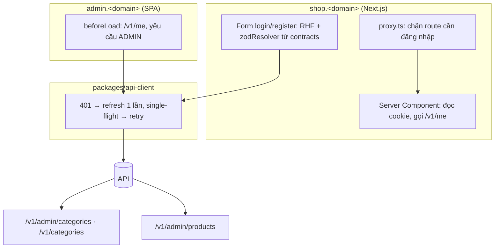
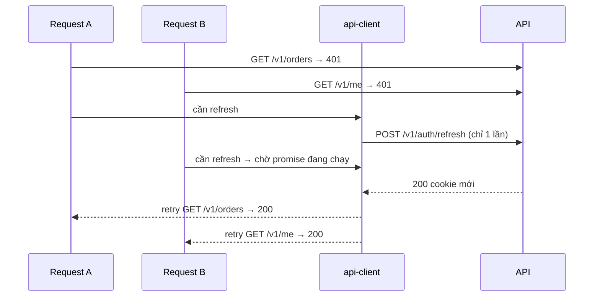

# Plan Sprint 4 — Auth UI & Catalog API · v0.4.0

> Sprint: [sprint-04.md](../sprints/sprint-04.md) *(draft: refine AC ở buổi refinement giữa Sprint 3 trước khi bắt đầu)* · Tổng quan v1: [README](../README.md)
>
> **Cách dùng plan:** đọc "Khái niệm" → tự làm → kẹt quá 30 phút mới mở Hint 1 → Hint 2 → Hint 3. Tự nghĩ test case trước khi mở đáp án.
>
> 🔒 PXM-27 (silent refresh) là logic auth phía client: Hint 3 chỉ có pseudo-code.

## 0. Trước khi bắt đầu

- Sprint 3 xong: login/refresh/logout/`/me` chạy trên production, ADR-0006 đã viết.
- **Next.js 16:** file `middleware.ts` đã được đổi tên thành **`proxy.ts`** (hàm export tên `proxy`, chạy trên Node.js runtime). Tutorial cũ ghi `middleware.ts` thì hiểu là cùng khái niệm.
- **`cookies()`** trong Next.js là hàm **async** (`await cookies()`).
- Đọc lại mục "Preview deployment của Vercel" ở plan Sprint 3, PXM-25: login trên preview sẽ không hoạt động. Hãy test login ở local và production.

## 1. Bức tranh tổng



Hai mạch song song trong sprint:
- **Auth UI** (PXM-26, 27, 28): người dùng thật sự đăng nhập được, và không bị đá ra mỗi 15 phút.
- **Catalog API** (PXM-29, 30): nền dữ liệu cho Sprint 5.

## 2. Thứ tự & phụ thuộc

```
PXM-27 silent refresh (api-client) ──▶ PXM-26 shop login UI
                                   └─▶ PXM-28 admin login + guard
PXM-29 category API ──▶ PXM-30 product API ──▶ (quay lại) test "xóa category còn product → 409"
```

- Làm **PXM-27 trước**: cả shop và admin dựa vào nó. Unit test cho single-flight rất dễ viết khi chưa có UI.
- **Lưu ý phụ thuộc:** AC "xóa category còn product → 409" của PXM-29 cần model `Product`, mà model này được tạo ở PXM-30. Hãy viết test này **sau** PXM-30, hoặc tạo schema `Product` sớm trong PXM-29.

---

## 3.1 PXM-26 · Trang đăng ký / đăng nhập trên shop

### Khái niệm cần nắm
- **Một schema, hai nơi validate:** form dùng `zodResolver(loginSchema)` từ `@pixelmart/contracts`, nên lỗi hiển thị trên form giống hệt rule của API. Nhưng API **vẫn** validate: client validation là để trải nghiệm tốt hơn, không phải để bảo mật.
- **Map lỗi server vào form:** API trả 400 với `errors[].path` (PXM-16) → `setError(path, …)` cho đúng field. 401 → lỗi chung ở đầu form. 409 (email trùng) → lỗi ở field email.
- **Auth state trong RSC:** Server Component đọc cookie bằng `await cookies()` rồi **tự chuyển tiếp** cookie khi gọi API (fetch phía server **không** tự gửi cookie của browser). Header hiển thị tên người dùng ngay từ HTML đầu tiên, không nhấp nháy.
- **`proxy.ts`:** chạy trước khi render. Với các route cần đăng nhập, kiểm tra **cookie gợi ý phiên `pm_session`** (PXM-22), **không** kiểm tra cookie `access`. Lý do: access cookie bị browser xóa sau 15 phút, nếu proxy dựa vào nó thì người dùng vẫn còn refresh token hợp lệ sẽ bị đá về `/login`. Không có `pm_session` → redirect `/login?redirect=…`. Proxy **không** verify gì (không có secret, API là nơi quyết định), nó chỉ là lớp UX.
- **Open redirect:** `?redirect=https://evil.com` → sau khi đăng nhập người dùng bị đưa sang trang lừa đảo. **Chỉ chấp nhận đường dẫn tương đối** bắt đầu bằng `/` và không bắt đầu bằng `//`.
- **Refresh cookie không tới được shop:** cookie refresh có `Path=/v1/auth` trên domain API, nên Server Component của shop **không thể** tự refresh khi access hết hạn. Ba trạng thái SSR cần phân biệt:
  - không có `pm_session` → **chưa đăng nhập**;
  - có `pm_session`, `/v1/me` trả 200 → **đã đăng nhập**;
  - có `pm_session` nhưng `/v1/me` trả 401 (access đã hết hạn) → **đang khôi phục phiên**: render skeleton/trạng thái trung gian, **không** render "chưa đăng nhập" hay redirect. Một Client Component nhỏ gọi api-client (`/v1/me` → 401 → silent refresh, PXM-27), xong thì `router.refresh()`. Refresh thất bại (đã logout ở thiết bị khác, reuse…) thì API xóa `pm_session` và chuyển về login.
  Đây là một quyết định thiết kế, ghi nó vào ADR-0006 cùng với PXM-22.

### Hướng tiếp cận
1. Trang `/register`, `/login` (Client Component cho form): React Hook Form + `zodResolver` + component shadcn `Form`/`Input`/`Button`.
2. Submit gọi `api-client` (`credentials: 'include'`). Thành công → `router.replace(safeRedirect)` + `router.refresh()`.
3. Helper `getCurrentUser()` phía server: đọc cookie, gọi `/v1/me` kèm header `cookie`, trả `null` khi 401.
4. Header (Server Component) hiển thị tên + nút logout (Client Component gọi `/v1/auth/logout` rồi refresh).
5. `proxy.ts` với `matcher` cho các route cần đăng nhập (ví dụ `/account/:path*`, `/checkout`).
6. Hàm `safeRedirect(param)` + unit test.

### File dự kiến tạo/sửa
`apps/web/app/(auth)/{login,register}/page.tsx`, `apps/web/components/auth/{login-form,register-form,logout-button}.tsx`, `apps/web/lib/{auth.ts,safe-redirect.ts}`, `apps/web/proxy.ts`, `apps/web/components/site-header.tsx`, `packages/api-client/src/auth.ts`.

### Tự nghĩ test case trước
Liệt kê case cho form, cho redirect và cho SSR.

<details><summary>Đáp án tham khảo</summary>

- Password 7 ký tự → lỗi hiển thị dưới field **trước** khi gửi (cùng thông điệp với schema).
- API trả 409 → lỗi gắn vào field email.
- Sai password → thông báo chung "Email hoặc mật khẩu không đúng".
- `?redirect=/account/orders` → đăng nhập xong về đúng trang.
- `?redirect=https://evil.com`, `?redirect=//evil.com`, `?redirect=javascript:alert(1)` → về `/`.
- Reload trang sau khi đăng nhập → header vẫn hiển thị tên (view source có tên trong HTML).
- Chưa đăng nhập vào `/account/orders` → bị chuyển sang `/login?redirect=%2Faccount%2Forders`.
- **Access đã hết hạn nhưng refresh còn hạn** (đặt TTL access 30 giây ở local, chờ 1 phút) → **reload** `/account/orders` → **không** bị chuyển về login, trang hiện trạng thái trung gian rồi tự hiển thị đơn hàng.
- Bấm submit 2 lần nhanh → chỉ gửi 1 request (nút disabled khi `isSubmitting`).
</details>

### Gợi ý
<details><summary>Hint 1: hướng đi</summary>

Viết `safeRedirect` + unit test trước (thuần logic, dễ). Rồi làm form login chạy được ở local với API local. Sau cùng mới làm proxy và SSR.
</details>

<details><summary>Hint 2: khái niệm/API</summary>

- `@hookform/resolvers/zod` hỗ trợ Zod 4. Kiểm tra version của resolver tương thích với Zod bạn đang dùng.
- `const cookieStore = await cookies(); cookieStore.toString()` (hoặc `getAll()` rồi ghép chuỗi) → đặt vào header `cookie` khi fetch.
- Proxy: `export function proxy(request: NextRequest)`, `request.cookies.has('pm_session')`, `NextResponse.redirect(new URL('/login?redirect=…', request.url))`, `export const config = { matcher: [...] }`.
- Local dev: shop `localhost:3001`, API `localhost:3000`. Cookie không phân biệt port nên dùng chung được. Ở local, đặt `COOKIE_DOMAIN` rỗng (host-only).
</details>

<details><summary>Hint 3: khung</summary>

```
safeRedirect(value):
  if value không phải string → "/"
  if !value.startsWith("/") or value.startsWith("//") or value.startsWith("/\\") → "/"
  return value

LoginForm:
  form = useForm({ resolver: zodResolver(loginSchema) })
  onSubmit(data):
    try: await api.login(data); router.replace(safeRedirect(searchParams.redirect)); router.refresh()
    catch ApiError e:
      if e.status == 400: e.errors.forEach(err → form.setError(err.path, err.message))
      else if e.status == 401: form.setError("root", "Email hoặc mật khẩu không đúng")
      else: form.setError("root", "Có lỗi, thử lại sau")
```
</details>

### Bẫy thường gặp
| Triệu chứng | Nguyên nhân | Cách tránh |
|---|---|---|
| SSR luôn coi là chưa đăng nhập | Fetch phía server không mang cookie | Chuyển tiếp header `cookie` thủ công |
| Đăng nhập xong header không đổi | Server Component đã render từ trước | `router.refresh()` sau login/logout |
| Open redirect | Dùng thẳng `?redirect=` | `safeRedirect` + test |
| Proxy chạy trên cả file tĩnh, trang chậm | `matcher` quá rộng | Chỉ match các route cần bảo vệ |
| Cứ 15 phút người dùng lại bị đá về login khi reload | Proxy/SSR dựa vào cookie `access` (bị browser xóa khi hết hạn) | Proxy dựa vào `pm_session`. SSR gặp 401 thì để client refresh |
| Đọc tutorial thấy `middleware.ts` | Tutorial trước Next.js 16 | Dùng `proxy.ts` (cùng khái niệm) |
| Login trên preview Vercel không được | Cookie cross-site | Đã biết từ PXM-25, test trên local/production |

### Kiểm chứng AC
- [ ] Nhập password ngắn → thông điệp giống hệt khi API trả 400 (cùng schema).
- [ ] Đăng nhập từ `/login?redirect=/account/orders` → về `/account/orders`.
- [ ] Reload → vẫn đăng nhập (view source thấy tên trong HTML).
- [ ] TTL access 30 giây (local), chờ 1 phút rồi **reload** `/account/orders` → không bị redirect về login (proxy dựa vào `pm_session`, client tự refresh).
- [ ] Unit test `safeRedirect` xanh.

### Đọc thêm
- Next.js authentication guide: https://nextjs.org/docs/app/guides/authentication
- Next.js proxy (trước đây là middleware): https://nextjs.org/docs/app/api-reference/file-conventions/proxy
- `cookies()`: https://nextjs.org/docs/app/api-reference/functions/cookies
- React Hook Form + resolvers: https://react-hook-form.com/docs/useform#resolver
- OWASP Unvalidated Redirects: https://cheatsheetseries.owasp.org/cheatsheets/Unvalidated_Redirects_and_Forwards_Cheat_Sheet.html

---

## 3.2 PXM-27 · Silent refresh trong api-client

### Khái niệm cần nắm
- **Silent refresh:** access token hết hạn → API trả 401 → client tự gọi `/v1/auth/refresh` → thành công thì **gửi lại request gốc**. Người dùng không nhận ra gì.
- **Single-flight:** 5 request cùng nhận 401 cùng lúc thì **chỉ 1** request refresh được gửi. 4 request còn lại **chờ** chính promise đó. Nếu không làm vậy, 5 lần refresh với cùng refresh token sẽ kích hoạt **reuse detection** (PXM-23) và đá người dùng ra ngoài.



- **Chống vòng lặp:** request tới `/v1/auth/refresh` hoặc `/v1/auth/login` bị 401 thì **không** refresh. Request đã retry một lần mà vẫn 401 thì **không** retry nữa.
- **Refresh thất bại:** gọi callback `onAuthFailure` (app tự quyết định chuyển về login), không để api-client biết về router.

### Hướng tiếp cận
1. Viết unit test trước, với `fetch` giả lập (mock/stub có kiểm soát thời điểm resolve).
2. Thêm vào client: biến `refreshPromise: Promise | null`, hàm `refreshOnce()`.
3. Bọc hàm `request()`: 401 + điều kiện cho phép → `await refreshOnce()` → retry đúng một lần.
4. `createApiClient({ baseUrl, onAuthFailure })` để web và admin cấu hình khác nhau.

### File dự kiến tạo/sửa
`packages/api-client/src/{client.ts,refresh.ts}`, `packages/api-client/test/refresh.test.ts`, `packages/api-client/package.json` (script `test`, Vitest).

### Tự nghĩ test case trước
Ít nhất 6 case, trong đó có đồng thời và thất bại.

<details><summary>Đáp án tham khảo</summary>

1. Request 401 → refresh 200 → retry 200 → caller nhận data, fetch được gọi đúng 3 lần.
2. 3 request đồng thời đều 401 → `/refresh` được gọi **đúng 1 lần**, cả 3 cuối cùng thành công.
3. Refresh trả 401 → `onAuthFailure` được gọi đúng 1 lần, cả 3 request đều reject với `ApiError(401)`.
4. Retry vẫn 401 → không refresh lần hai, reject.
5. `POST /v1/auth/login` trả 401 → không gọi refresh.
6. Sau khi một đợt refresh xong, một 401 mới (lâu sau) → được phép refresh lần nữa (promise đã được reset).
7. Request 403/500 → không refresh.
</details>

### Gợi ý
<details><summary>Hint 1: hướng đi</summary>

Mấu chốt là **lưu promise**, không phải lưu cờ boolean. Ai cần refresh mà thấy đã có promise thì `await` chính promise đó.
</details>

<details><summary>Hint 2: khái niệm/API</summary>

- Reset `refreshPromise = null` trong `finally` để lần hết hạn sau có thể refresh tiếp.
- Test đồng thời: tạo một promise "deferred" cho response của `/refresh`, khởi động 3 request, kiểm tra `/refresh` mới được gọi 1 lần, rồi resolve deferred.
- Body của request gốc: nếu là stream thì không gửi lại được. api-client của ta gửi JSON string nên retry an toàn.
</details>

<details><summary>Hint 3: pseudo-code</summary>

```
refreshPromise = null

refreshOnce():
  if refreshPromise == null:
    refreshPromise = rawFetch(POST /v1/auth/refresh)
                      .then(res → res.ok ? true : false)
                      .finally(() → refreshPromise = null)
  return refreshPromise

request(path, init, { retried = false } = {}):
  res = rawFetch(path, init)
  if res.status == 401 and !retried and path không thuộc AUTH_PATHS:
    ok = await refreshOnce()
    if ok: return request(path, init, { retried: true })
    onAuthFailure()
  return handle(res)   // ok → parse; lỗi → ApiError
```
(Cẩn thận: nhiều request cùng thất bại thì `onAuthFailure` có thể bị gọi nhiều lần. Test 3 yêu cầu đúng 1 lần.)
</details>

### Bẫy thường gặp
| Triệu chứng | Nguyên nhân | Cách tránh |
|---|---|---|
| Mở trang có nhiều request → bị logout | Mỗi request tự refresh, trigger reuse detection | Single-flight |
| Vòng lặp vô hạn 401 → refresh → 401 | Refresh cả khi `/refresh` trả 401, hoặc retry không giới hạn | Loại trừ AUTH_PATHS, retry tối đa 1 lần |
| Refresh lần sau không chạy | Quên reset promise | `finally(() => refreshPromise = null)` |
| Test chập chờn | Dùng `setTimeout` thật | Deferred promise/fake timers |
| api-client import router của Next | Trộn trách nhiệm | Callback `onAuthFailure` |

### Kiểm chứng AC
- [ ] Unit test single-flight (case 2) xanh.
- [ ] Đặt TTL access = 30 giây ở local, đăng nhập, chờ 1 phút, thao tác **và cả reload trang** → không bị đá ra (tab Network có một request `/refresh`).
- [ ] Xóa cookie refresh trong DevTools, chờ access hết hạn → bị chuyển về login.

### Đọc thêm
- MDN, Using promises (chia sẻ một promise giữa nhiều nơi chờ): https://developer.mozilla.org/en-US/docs/Web/JavaScript/Guide/Using_promises
- Vitest mocking `fetch`: https://vitest.dev/guide/mocking

---

## 3.3 PXM-28 · Admin login & route guard

### Khái niệm cần nắm
- **`beforeLoad` của TanStack Router:** chạy trước khi route render (và trước loader). Ném `redirect()` để chuyển hướng. Đặt ở route layout bao các trang admin để bảo vệ cả nhánh.
- **Router context:** truyền `queryClient` (và/hoặc `auth`) vào context của router, để `beforeLoad` gọi `queryClient.ensureQueryData(meQuery)`. Dữ liệu `/me` được cache, không gọi lại mỗi lần chuyển trang.
- **Ba trạng thái:** chưa đăng nhập (401) → `/login`. Đã đăng nhập nhưng không phải ADMIN → trang "Không có quyền truy cập". ADMIN → vào trang.
- **Guard ở client chỉ là UX.** Bảo vệ thật nằm ở API (RolesGuard, PXM-24). Ai sửa JS để vượt guard thì vẫn nhận 403 từ API.

### Hướng tiếp cận
1. Tạo layout route có pathless (ví dụ `_authed.tsx`) chứa các route admin. `login.tsx` nằm ngoài layout.
2. `meQueryOptions` dùng api-client. `beforeLoad` của `_authed`: `ensureQueryData` → 401 thì `redirect({ to: '/login', search: { redirect: location.href } })` → role khác `ADMIN` thì `redirect({ to: '/forbidden' })`.
3. Trang login dùng chung `loginSchema`. Đăng nhập xong thì `invalidate` query `me` và điều hướng tới `search.redirect` (đã qua `safeRedirect`).
4. `onAuthFailure` của api-client (PXM-27) → điều hướng về `/login`.

### File dự kiến tạo/sửa
`apps/admin/src/routes/{_authed.tsx,login.tsx,forbidden.tsx}`, di chuyển `categories/products/orders/index` vào dưới `_authed/`, `apps/admin/src/lib/{api.ts,auth.ts}`, `apps/admin/src/main.tsx` (router context).

### Tự nghĩ test case trước
<details><summary>Đáp án tham khảo</summary>

- Chưa đăng nhập vào `/products` → `/login?redirect=/products` → đăng nhập ADMIN → về `/products`.
- Đăng nhập bằng CUSTOMER → trang "Không có quyền truy cập", có nút đăng xuất.
- ADMIN đã đăng nhập vào `/login` → chuyển về `/`.
- Chuyển giữa các trang admin → không gọi `/v1/me` mỗi lần (xem tab Network, nhờ cache).
- Logout → về `/login`, nút back không vào lại được trang admin.
</details>

### Gợi ý
<details><summary>Hint 1: hướng đi</summary>

Đọc ví dụ "authenticated routes" trong docs TanStack Router: cấu trúc layout route + `beforeLoad` đúng như ticket này cần.
</details>

<details><summary>Hint 2: khái niệm/API</summary>

- `createRootRouteWithContext<{ queryClient: QueryClient }>()`.
- `beforeLoad: async ({ context, location }) => { … throw redirect({ to: '/login', search: { redirect: location.href } }) }`.
- `validateSearch` cho route login để `search.redirect` có type.
</details>

<details><summary>Hint 3: khung</summary>

```
_authed.beforeLoad({ context, location }):
  try: me = await context.queryClient.ensureQueryData(meQuery)
  catch ApiError 401: throw redirect(/login, search { redirect: location.href })
  if me.role != "ADMIN": throw redirect(/forbidden)
  return { me }        // các route con đọc từ context
```
</details>

### Bẫy thường gặp
| Triệu chứng | Nguyên nhân | Cách tránh |
|---|---|---|
| Trang admin nhấp nháy nội dung rồi mới redirect | Kiểm tra auth trong component (`useEffect`) | Kiểm tra ở `beforeLoad` |
| Đăng nhập xong vẫn bị đá về login | Query `me` vẫn cache kết quả lỗi cũ | `invalidateQueries(['me'])`/`resetQueries` sau login |
| Cookie không gửi từ admin tới API | Thiếu `credentials: 'include'`, hoặc CORS chưa có `admin.<domain>` | Kiểm tra api-client và `CORS_ORIGINS` |
| Tưởng guard client là đủ an toàn | Hiểu sai trách nhiệm | API luôn kiểm tra role |

### Kiểm chứng AC
- [ ] Chưa đăng nhập → bị chuyển về `/login`.
- [ ] Tài khoản CUSTOMER → trang "Không có quyền truy cập".

### Đọc thêm
- TanStack Router, authenticated routes: https://tanstack.com/router/latest/docs/framework/react/guide/authenticated-routes
- TanStack Router + Query (router context): https://tanstack.com/router/latest/docs/framework/react/guide/external-data-loading

---

## 3.4 PXM-29 · Category CRUD API

### Khái niệm cần nắm
- **Phân tầng:** controller (HTTP, DTO) → service (quy tắc nghiệp vụ: slug, 409) → Prisma. Controller không chứa logic, service không biết HTTP (ném lỗi domain hoặc exception chuẩn).
- **Endpoint admin vs public:** `/v1/admin/categories` (`@Roles('ADMIN')`) và `/v1/categories` (`@Public()`, chỉ đọc). Tách prefix rõ ràng giúp review phân quyền dễ hơn.
- **Slug:** chuỗi thân thiện với URL, sinh từ tên. Tiếng Việt cần **bỏ dấu**: `"Áo thun nữ"` → `"ao-thun-nu"`. Chữ `đ/Đ` **không** bị tách dấu bởi Unicode normalization, phải thay thủ công thành `d`.
- **Unique theo store:** `@@unique([storeId, slug])`. Trùng thì thêm hậu tố `-2`, `-3`… Race condition: hai request cùng tạo "Áo thun" → cả hai cùng thấy slug trống. Unique constraint là hàng rào cuối cùng, gặp lỗi `P2002` thì thử hậu tố tiếp theo (giới hạn số lần thử).
- **Toàn vẹn tham chiếu:** `Product.categoryId` dùng `onDelete: Restrict`. Xóa category còn product → DB từ chối (Prisma `P2003`) → map sang **409 Conflict** với thông điệp dễ hiểu.
- **`storeId`:** v1 chỉ có một store. Lấy store mặc định (seed) trong service, nhưng **vẫn** lưu `storeId` và luôn lọc theo nó. Đây là sự chuẩn bị cho multi-vendor ở v2.

### Hướng tiếp cận
1. Contract: `categorySchema`, `createCategorySchema`, `updateCategorySchema` (partial).
2. Prisma: model `Category` (`storeId`, `name`, `slug`, `parentId` nullable, timestamps, `@@unique([storeId, slug])`), migration.
3. Hàm thuần `slugify(name)` + unit test (tiếng Việt).
4. `CategoriesService`: create (slug unique + retry), list, update (đổi tên có đổi slug không? Hãy quyết định và ghi lại: **giữ slug cũ** để URL không gãy là lựa chọn phổ biến), delete (map `P2003` → 409).
5. Hai controller: admin và public.
6. Integration test: CRUD + 401/403 + 409 (sau PXM-30).

### File dự kiến tạo/sửa
`packages/contracts/src/catalog/category.ts`, `apps/api/prisma/schema.prisma` + migration, `apps/api/src/catalog/{catalog.module.ts,categories.service.ts,admin-categories.controller.ts,categories.controller.ts}`, `apps/api/src/common/slugify.ts` + test, `apps/api/test/categories.e2e-spec.ts`.

### Tự nghĩ test case trước
Nghĩ về: slug, phân quyền, toàn vẹn dữ liệu, input lạ.

<details><summary>Đáp án tham khảo</summary>

- `slugify("Áo thun nữ")` = `ao-thun-nu`. `slugify("Đồ điện tử")` = `do-dien-tu`. `slugify("  C++ & Go!! ")` = `c-go`. `slugify("!!!")` → không rỗng (fallback).
- Tạo "Áo thun" 2 lần → slug `ao-thun`, `ao-thun-2`.
- Không token → 401. CUSTOMER → 403. ADMIN → 201.
- `GET /v1/categories` (public) không cần token.
- Xóa category còn product → 409 (sau PXM-30). Xóa category rỗng → 204.
- Update category không tồn tại → 404.
- Tên rỗng/quá dài → 400.
</details>

### Gợi ý
<details><summary>Hint 1: hướng đi</summary>

Viết `slugify` + unit test trước. Đây là hàm thuần, TDD rất "đã". Sau đó tới service, rồi controller.
</details>

<details><summary>Hint 2: khái niệm/API</summary>

- `str.normalize('NFD').replace(/\p{Diacritic}/gu, '')` bỏ dấu. Sau đó thay `đ→d`, `Đ→D`, lowercase, thay ký tự không phải `[a-z0-9]` bằng `-`, gộp nhiều `-` liên tiếp, bỏ `-` ở hai đầu.
- Prisma lỗi FK: `P2003`. Lỗi unique: `P2002` (`meta.target` cho biết field nào).
- Có thể viết một exception filter hoặc helper nhỏ để map lỗi Prisma → HttpException dùng chung cho mọi module.
</details>

<details><summary>Hint 3: pseudo-code</summary>

```
createCategory(input):
  base = slugify(input.name)
  for i in 1..5:
    slug = i == 1 ? base : `${base}-${i}`
    try: return db.category.create({ storeId: DEFAULT_STORE, name, slug })
    catch P2002 on slug: continue
  throw Conflict("Không tạo được slug duy nhất")

deleteCategory(id):
  try: db.category.delete({ where: { id, storeId } })
  catch P2025 (not found): throw NotFound
  catch P2003 (FK): throw Conflict("Danh mục còn sản phẩm, hãy chuyển hoặc xóa sản phẩm trước")
```
(Vòng lặp thử từng hậu tố đơn giản nhưng có thể chậm khi đã có nhiều slug trùng. Một cách khác là query các slug đang bắt đầu bằng `base` rồi chọn số tiếp theo. Cân nhắc và chọn một.)
</details>

### Bẫy thường gặp
| Triệu chứng | Nguyên nhân | Cách tránh |
|---|---|---|
| `"Đồ chơi"` → `"o-choi"` hoặc `"đo-choi"` | `đ` không bị NFD tách | Thay `đ/Đ` thủ công |
| 500 khi xóa category có product | Không map lỗi FK | `P2003` → 409 |
| Hai request tạo trùng slug → 500 | Chỉ "check rồi insert" | Bắt `P2002` + thử hậu tố |
| Admin store A xóa được category của store B (v2) | Query theo `id` mà không có `storeId` | Luôn lọc theo `storeId` ngay từ bây giờ |
| Đổi tên → slug đổi → link cũ gãy | Tự động sinh lại slug khi update | Giữ slug, hoặc có chủ đích cho phép sửa slug riêng |

### Kiểm chứng AC
- [ ] Test: xóa category còn product → 409.
- [ ] Test: tên trùng → slug có hậu tố `-2`.
- [ ] Test: endpoint admin trả 401/403 đúng.

### Đọc thêm
- NestJS modules/providers: https://docs.nestjs.com/modules
- Prisma referential actions: https://www.prisma.io/docs/orm/prisma-schema/data-model/relations/referential-actions
- MDN, `String.prototype.normalize`: https://developer.mozilla.org/en-US/docs/Web/JavaScript/Reference/Global_Objects/String/normalize

---

## 3.5 PXM-30 · Product CRUD API

### Khái niệm cần nắm
- **Tiền là số nguyên đơn vị nhỏ nhất (`priceMinor`):** 199.000₫ → `199000` (VND không có đơn vị con), $1.99 → `199` cents. Không dùng float (`0.1 + 0.2 !== 0.3`). Lưu `currency` (ISO 4217) cạnh giá. Xem CLAUDE.md, phần "Ranh giới kiến trúc".
- **Validate ở contract:** `priceMinor` là `int` và `>= 0` (giá 0 có hợp lệ không? Hãy quyết định). `imageUrl` phải là URL `https`. Chặn từ biên vào hệ thống.
- **Phân trang offset:** `?page=2&pageSize=20` → `skip = (page-1)*pageSize`, `take = pageSize`, kèm `total` (count). Response `{ items, page, pageSize, total }`. Giới hạn `pageSize` tối đa.
- **Offset vs cursor:** offset đơn giản và nhảy trang được, nhưng chậm khi `page` lớn và có thể trùng/sót bản ghi nếu dữ liệu thay đổi giữa hai lần gọi. Cursor ổn định và nhanh, nhưng không nhảy trang được. Admin cần nhảy trang và dữ liệu nhỏ, nên v1 chọn offset.
- **Generic schema phân trang:** viết một hàm `paginatedSchema(itemSchema)` trong contracts, dùng lại cho mọi danh sách.

### Hướng tiếp cận
1. Contract: `productSchema`, `createProductSchema`, `updateProductSchema`, `listProductsQuerySchema` (`page`, `pageSize`, `categoryId`, coerce từ query string), `paginatedSchema`.
2. Prisma: model `Product` (`storeId`, `categoryId` FK `Restrict`, `name`, `slug`, `description`, `priceMinor Int`, `currency`, `imageUrl`, timestamps, `@@unique([storeId, slug])`, index theo `categoryId`).
3. Service: dùng lại `slugify` và logic slug unique. List chạy `findMany` + `count` (trong `$transaction` để nhất quán).
4. Controller admin CRUD, xóa cứng.
5. Quay lại PXM-29 để hoàn thành test 409.

### File dự kiến tạo/sửa
`packages/contracts/src/catalog/product.ts`, `packages/contracts/src/common/pagination.ts`, `apps/api/prisma/schema.prisma` + migration, `apps/api/src/catalog/{products.service.ts,admin-products.controller.ts}`, `apps/api/test/products.e2e-spec.ts`.

### Tự nghĩ test case trước
<details><summary>Đáp án tham khảo</summary>

- `priceMinor: -1` → 400. `priceMinor: 19.99` → 400. `priceMinor: "199"` (string trong JSON body) → 400 (body không nên coerce).
- `imageUrl: "http://…"` → 400. `"https://…"` → OK. `"javascript:alert(1)"` → 400.
- `categoryId` không tồn tại → 400/422 (đừng để thành 500 do FK).
- List: `page=1&pageSize=2` với 5 sản phẩm → 2 items, `total: 5`. `pageSize=1000` → 400 hoặc bị chặn ở mức tối đa (quyết định một cách). `page=0` → 400.
- Lọc `categoryId` → chỉ trả sản phẩm thuộc category đó.
- 401/403 cho mọi endpoint admin.
- Xóa product → 204. Xóa lại → 404.
</details>

### Gợi ý
<details><summary>Hint 1: hướng đi</summary>

Viết schema trong contracts thật chặt trước (đây là "cửa vào"), rồi viết test 400 cho từng rule. Service sẽ đơn giản hơn nhiều khi dữ liệu vào đã sạch.
</details>

<details><summary>Hint 2: khái niệm/API</summary>

- Zod 4: `z.int().nonnegative()` hoặc `z.number().int().min(0)`. URL https: xem API `z.url()` (Zod 4 có option giới hạn `protocol`). Kiểm tra docs Zod 4.
- Query string luôn là string: dùng `z.coerce.number().int().min(1)` cho `page`, `.max(50)` cho `pageSize`.
- Prisma: `$transaction([findMany, count])` chạy hai query nhất quán.
- `categoryId` không tồn tại: kiểm tra trước, hoặc bắt `P2003` khi create → 422 (giống quy ước PXM-37 sau này).
</details>

<details><summary>Hint 3: khung</summary>

```
paginatedSchema(item) = object { items: array(item), page: int, pageSize: int, total: int }

listProducts({ page, pageSize, categoryId }):
  where = { storeId, ...(categoryId && { categoryId }) }
  [items, total] = transaction([findMany(where, orderBy createdAt desc, skip, take), count(where)])
  return { items: items.map(toProductResponse), page, pageSize, total }
```
</details>

### Bẫy thường gặp
| Triệu chứng | Nguyên nhân | Cách tránh |
|---|---|---|
| Giá lưu thành `19.990000001` | Dùng float/Decimal không có chủ đích | `Int` + đơn vị nhỏ nhất |
| `pageSize=100000` làm sập API | Không giới hạn | `.max(50)` |
| Phân trang trả trùng/thiếu sản phẩm | `orderBy` không ổn định (nhiều bản ghi trùng `createdAt`) | Thêm `id` vào `orderBy` làm tie-breaker |
| `imageUrl` chứa `javascript:` lọt vào ``/`<a>` | Chỉ kiểm tra "là URL" | Giới hạn protocol `https` |
| `categoryId` sai → 500 | Lỗi FK không được map | Map `P2003` → 422 |

### Kiểm chứng AC
- [ ] Test: `priceMinor` âm hoặc thập phân → 400.
- [ ] Test: `imageUrl` không phải https → 400.
- [ ] Test: response list có đúng dạng `{ items, page, pageSize, total }` (parse bằng `paginatedSchema` trong test).

### Đọc thêm
- Martin Fowler, Money pattern: https://martinfowler.com/eaaCatalog/money.html
- Prisma pagination: https://www.prisma.io/docs/orm/prisma-client/queries/pagination
- Zod 4 docs: https://zod.dev/api

---

## 4. Tự kiểm tra cuối sprint

1. Đã validate ở form bằng cùng schema, tại sao API vẫn phải validate?
<details><summary>Gợi ý</summary>

Client có thể bị bỏ qua (curl, sửa JS). Validation ở client là UX, validation ở server là bảo mật và toàn vẹn dữ liệu.
</details>

2. Vì sao Server Component phải tự chuyển tiếp cookie khi gọi API?
<details><summary>Gợi ý</summary>

Fetch chạy trên server Next.js, không phải trong browser, nên không có cookie jar của người dùng. Phải đọc từ request đến (`cookies()`) rồi gắn vào header.
</details>

3. Single-flight refresh giải quyết vấn đề gì, và vấn đề đó liên quan thế nào tới reuse detection?
<details><summary>Gợi ý</summary>

Nhiều request 401 cùng lúc sẽ gửi nhiều refresh với cùng token. Request thứ hai bị server coi là reuse, nên cả family bị thu hồi và người dùng bị đá ra. Single-flight bảo đảm chỉ có một refresh.
</details>

4. Open redirect là gì? Cho ví dụ tấn công cụ thể trên PixelMart.
<details><summary>Gợi ý</summary>

Kẻ tấn công gửi link `shop.<domain>/login?redirect=https://shop-<domain>.evil` qua email. Nạn nhân đăng nhập trên trang thật, rồi bị chuyển sang trang giả, nơi nó yêu cầu "nhập lại mật khẩu".
</details>

5. Guard trong `beforeLoad` của admin có phải là biện pháp bảo mật không?
<details><summary>Gợi ý</summary>

Không, nó là UX. Bảo mật nằm ở API (RolesGuard). Code ở client có thể bị sửa tùy ý.
</details>

6. Vì sao tiền lưu bằng số nguyên? Nếu sau này cần đa tiền tệ thì sao?
<details><summary>Gợi ý</summary>

Float không biểu diễn chính xác số thập phân, nên cộng dồn sẽ sai lệch. Đa tiền tệ: mỗi giá đi kèm `currency`, mỗi tiền tệ có số chữ số thập phân khác nhau (VND 0, USD 2, BHD 3), quy đổi bằng tỷ giá tại một thời điểm và lưu lại tỷ giá đó.
</details>

7. Offset pagination có vấn đề gì khi dữ liệu thay đổi liên tục?
<details><summary>Gợi ý</summary>

Một bản ghi được thêm vào đầu danh sách thì mọi bản ghi lùi xuống một vị trí: trang 2 sẽ lặp lại bản ghi cuối của trang 1. Cursor pagination tránh được vấn đề này.
</details>

8. Vì sao `slugify("Đồ chơi")` cần xử lý riêng chữ `đ`?
<details><summary>Gợi ý</summary>

Trong Unicode, `đ` (U+0111) là một chữ cái riêng, không phải `d` + dấu. NFD không tách nó ra được.
</details>

## 5. Kịch bản demo

1. Shop: đăng ký với password ngắn → lỗi giống hệt API. Đăng ký đúng → đăng nhập → header hiện tên. Reload → vẫn đăng nhập.
2. Vào `/account/orders` khi chưa đăng nhập → login → quay lại đúng trang.
3. (Local, TTL access 30 giây) chờ hết hạn, thao tác → tab Network có đúng một `/refresh`, không bị đá ra.
4. Admin: CUSTOMER đăng nhập → "Không có quyền truy cập". ADMIN → vào được.
5. API (REST client): tạo category "Áo thun" 2 lần → `ao-thun`, `ao-thun-2`. Tạo product. Xóa category → 409. `priceMinor: 19.99` → 400.
