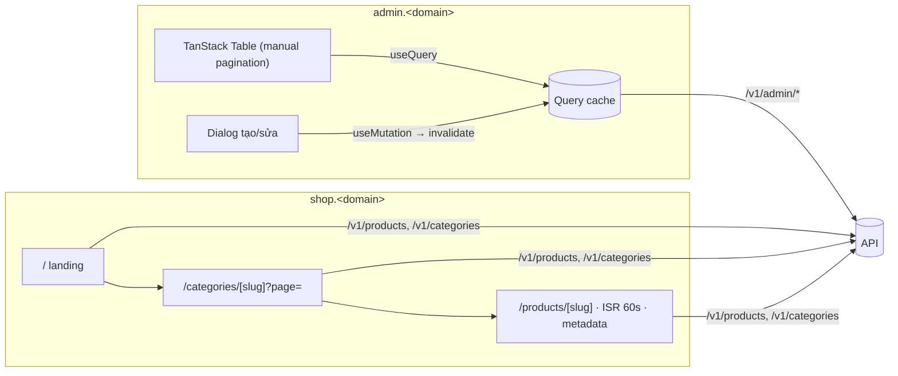

# Plan Sprint 5 — Admin catalog UI & Storefront browsing · v0.5.0

> Sprint: [sprint-05.md](../sprints/sprint-05.md) *(draft: refine AC trước khi bắt đầu)* · Tổng quan v1: [README](../README.md)
>
> **Cách dùng plan:** đọc "Khái niệm" → tự làm → kẹt quá 30 phút mới mở Hint 1 → Hint 2 → Hint 3. Tự nghĩ test case trước khi mở đáp án.

## 0. Trước khi bắt đầu

- Sprint 4 xong: admin đăng nhập được, Category/Product API có test.
- Đây là sprint **UI nặng nhất** của v1. Theo [rule 05](../../rules/05-working-with-claude.md), "component UI lặp lại (sau khi bạn đã tự làm 1 cái)" có thể giao cho Claude: **tự làm trang category (PXM-31) hoàn chỉnh**, sau đó có thể nhờ Claude dựng khung trang product rồi bạn review kỹ.
- **Caching trong Next.js 16:** có hai mô hình. (a) Mô hình "route segment config" (`export const revalidate = 60`). (b) **Cache Components** (bật `cacheComponents` trong `next.config`, dùng `'use cache'` + `cacheLife`). Hai mô hình **không trộn được**: khi bật Cache Components, `export const revalidate` sẽ gây lỗi build. Plan này dùng (a) vì nó gần với khái niệm ISR kinh điển. Nếu dự án đã bật Cache Components thì dùng (b) cho cùng mục tiêu, và ghi lại lựa chọn vào ADR-0007.

## 1. Bức tranh tổng



## 2. Thứ tự & phụ thuộc

```
PXM-33 public catalog API ──▶ PXM-34 landing & list ──▶ PXM-35 product detail
PXM-31 admin category (tự làm hết) ──▶ PXM-32 admin product (dùng lại pattern)
```

- **Rủi ro lớn nhất:** PXM-32 (3 pts): bảng phân trang server-side + form giá tiền + đồng bộ URL.
- PXM-33 nhỏ nhưng chặn cả shop, nên làm **đầu tiên**.

---

## 3.1 PXM-31 · Admin quản lý category

### Khái niệm cần nắm
- **Server state vs client state:** danh sách category là **server state** (nguồn sự thật nằm ở API), để TanStack Query quản lý. Trạng thái dialog mở/đóng là **client state** (`useState`). Đừng copy server state vào `useState`.
- **Query key:** `['categories']` định danh cache. Sau khi tạo/sửa/xóa thành công thì `invalidateQueries({ queryKey: ['categories'] })` để fetch lại.
- **Invalidate vs optimistic update:** invalidate thì đơn giản và chắc chắn đúng, nhưng có độ trễ một round-trip. Optimistic update cho cảm giác tức thì, nhưng phải tự rollback khi lỗi. v1 chọn invalidate.
- **Hiển thị lỗi theo loại:** 409 (còn sản phẩm) → thông báo có hướng dẫn hành động. 400 → lỗi trên field. Lỗi mạng → toast chung.
- **Query options tái sử dụng:** định nghĩa `categoriesQueryOptions()` một lần, dùng cho cả `useQuery` và loader của route.

### Hướng tiếp cận
1. `categoriesQueryOptions`, `useCreateCategory`, `useUpdateCategory`, `useDeleteCategory` trong `apps/admin/src/features/categories/`.
2. Trang `/categories`: bảng (shadcn `Table`), nút "Thêm", mỗi dòng có Sửa/Xóa.
3. Dialog form dùng `createCategorySchema` từ contracts + RHF. Map lỗi 400 vào field (tương tự PXM-26).
4. Xóa: `AlertDialog` xác nhận → mutation → 409 thì hiện thông báo rõ ràng.
5. Trạng thái loading/empty/error cho bảng.

### File dự kiến tạo/sửa
`apps/admin/src/features/categories/{queries.ts,category-form.tsx,category-dialog.tsx,delete-category-dialog.tsx}`, `apps/admin/src/routes/_authed/categories.tsx`, `packages/api-client/src/catalog.ts`.

### Tự nghĩ test case trước
Bạn sẽ test thủ công những luồng nào? Luồng nào đáng viết test tự động (component test)?

<details><summary>Đáp án tham khảo</summary>

- Tạo → bảng có dòng mới mà không cần reload.
- Sửa tên → bảng cập nhật.
- Xóa category rỗng → biến mất khỏi bảng.
- Xóa category còn sản phẩm → thông báo "Danh mục còn sản phẩm…", category vẫn còn trong bảng.
- Submit form rỗng → lỗi dưới field (từ schema), không gửi request.
- API tắt → bảng hiện trạng thái lỗi + nút thử lại.
- Danh sách rỗng → empty state có nút "Thêm danh mục đầu tiên".
- (Tự động) test hàm map `ApiError` → thông điệp hiển thị.
</details>

### Gợi ý
<details><summary>Hint 1: hướng đi</summary>

Làm theo vòng: hiển thị danh sách (query) → tạo (mutation + invalidate) → sửa → xóa → xử lý lỗi. Mỗi bước commit một lần.
</details>

<details><summary>Hint 2: khái niệm/API</summary>

- `queryOptions({ queryKey, queryFn })` giúp chia sẻ key/fn có type.
- `useMutation({ mutationFn, onSuccess: () => queryClient.invalidateQueries({ queryKey: ['categories'] }) })`.
- `mutation.isPending` để khóa nút submit.
- Toast: component `sonner` của shadcn.
</details>

<details><summary>Hint 3: khung</summary>

```
features/categories/queries.ts
  categoriesQueryOptions() → { queryKey: ['categories'], queryFn: api.listCategories }
  useCreateCategory()      → useMutation(api.createCategory, onSuccess invalidate ['categories'])
  useDeleteCategory()      → useMutation(api.deleteCategory, onSuccess invalidate, onError map 409 → toast)

routes/_authed/categories.tsx
  loader: queryClient.ensureQueryData(categoriesQueryOptions())
  component: useSuspenseQuery(...) → <Table/> + <CategoryDialog/>
```
</details>

### Bẫy thường gặp
| Triệu chứng | Nguyên nhân | Cách tránh |
|---|---|---|
| Tạo xong bảng không đổi | Quên invalidate, hoặc key không khớp (`['category']` vs `['categories']`) | Dùng chung query options/key factory |
| Copy data từ query vào `useState` rồi bị lệch | Trộn server state với client state | Đọc thẳng từ query |
| Bấm "Lưu" 2 lần tạo 2 category | Nút không disabled khi pending | `disabled={mutation.isPending}` |
| Lỗi 409 hiện "Request failed with status 409" | Hiển thị thẳng message kỹ thuật | Map status → thông điệp cho người dùng |

### Kiểm chứng AC
- [ ] Tạo/sửa/xóa → bảng cập nhật ngay (không reload).
- [ ] Xóa category còn sản phẩm → thông báo dễ hiểu.

### Đọc thêm
- TanStack Query, mutations & invalidation: https://tanstack.com/query/latest/docs/framework/react/guides/invalidations-from-mutations
- TanStack Query, query options: https://tanstack.com/query/latest/docs/framework/react/guides/query-options
- shadcn/ui Dialog, AlertDialog, Sonner: https://ui.shadcn.com/docs/components

---

## 3.2 PXM-32 · Admin quản lý product

### Khái niệm cần nắm
- **Server-side pagination với TanStack Table:** bảng không tự cắt dữ liệu (`manualPagination: true`). API trả một trang + `total`, bảng chỉ hiển thị và điều khiển `pageIndex`/`pageSize`.
- **URL là nguồn sự thật cho trạng thái bảng:** `?page=2&categoryId=…`. Reload, chia sẻ link, nút back đều giữ đúng trạng thái. TanStack Router có `validateSearch` để search params có type và được validate (dùng Zod).
- **`placeholderData: keepPreviousData`:** khi chuyển trang, giữ dữ liệu trang cũ trong lúc tải trang mới, nên bảng không nhấp nháy về trạng thái rỗng.
- **Nhập giá "199.00" → `priceMinor`:** **không** được làm `Math.round(parseFloat(x) * 100)` một cách ngây thơ (`parseFloat('1.005') * 100 = 100.49999…`). Xử lý **chuỗi**: tách phần nguyên và phần thập phân, kiểm tra số chữ số thập phân đúng với tiền tệ, ghép lại thành số nguyên. Hiển thị ngược lại bằng `Intl.NumberFormat`.
- **Hàm chuyển đổi tiền đặt ở `packages/contracts`** (hoặc một package util dùng chung): web, admin và sau này mobile đều cần nó, và cần unit test thật kỹ.

### Hướng tiếp cận
1. Hàm `parseMoneyInput(input, currency) → number | Error` và `formatMoney(minor, currency, locale)` + unit test (TDD).
2. Route `/products` với `validateSearch` (page, pageSize, categoryId).
3. `productsQueryOptions(search)`: query key chứa toàn bộ search params.
4. TanStack Table: định nghĩa cột, `manualPagination`, `pageCount = ceil(total / pageSize)`, điều hướng cập nhật URL (`navigate({ search })`).
5. Bộ lọc category (select lấy từ `categoriesQueryOptions`).
6. Form tạo/sửa: giá dạng chuỗi → `parseMoneyInput`. Preview ảnh từ `imageUrl` (xử lý ảnh lỗi bằng `onError`).

### File dự kiến tạo/sửa
`packages/contracts/src/common/money.ts` + test, `apps/admin/src/features/products/{queries.ts,columns.tsx,product-table.tsx,product-form.tsx}`, `apps/admin/src/routes/_authed/products.tsx`.

### Tự nghĩ test case trước
Tập trung vào `parseMoneyInput`: hãy liệt kê ít nhất 10 input khó.

<details><summary>Đáp án tham khảo</summary>

USD (2 chữ số thập phân):
- `"199.00"` → 19900 · `"199"` → 19900 · `"199.5"` → 19950 · `"0.01"` → 1
- `"1.005"` → lỗi (quá 2 chữ số), không làm tròn âm thầm
- `"-5"` → lỗi · `"abc"` → lỗi · `""` → lỗi · `"1e3"` → lỗi · `" 12.30 "` → 1230 (trim)
- `"1,234.56"`: chấp nhận hay không? Quyết định và test (gợi ý: v1 không chấp nhận dấu phân cách hàng nghìn).

VND (0 chữ số thập phân):
- `"199000"` → 199000 · `"199000.5"` → lỗi

UI:
- Đổi trang → URL `?page=2`, reload vẫn ở trang 2.
- Lọc category → về trang 1.
- `formatMoney(19900, 'USD', 'en-US')` → `$199.00`. `formatMoney(199000, 'VND', 'vi-VN')` → `199.000 ₫`. Chú ý: `Intl` chèn **khoảng trắng không ngắt dòng** (U+00A0) trước `₫`, nên test `toBe('199.000 ₫')` gõ bằng dấu cách thường sẽ fail. Viết chuỗi mong đợi có ` `, hoặc chuẩn hóa khoảng trắng trước khi so sánh.
</details>

### Gợi ý
<details><summary>Hint 1: hướng đi</summary>

Viết `parseMoneyInput` thuần trước, với bảng test ở trên. Bảng và form sẽ dễ hơn nhiều khi phần "tiền" đã đáng tin.
</details>

<details><summary>Hint 2: khái niệm/API</summary>

- Số chữ số thập phân theo tiền tệ: `new Intl.NumberFormat('en', { style: 'currency', currency }).resolvedOptions().maximumFractionDigits`.
- Regex kiểm tra trước khi tách: `^\d+(\.\d+)?$` (sau khi trim).
- TanStack Table: `useReactTable({ data, columns, manualPagination: true, pageCount, state: { pagination }, onPaginationChange })`.
- Router: `Route.useSearch()`, `navigate({ search: (prev) => ({ ...prev, page: 2 }) })`.
</details>

<details><summary>Hint 3: pseudo-code</summary>

```
parseMoneyInput(raw, currency):
  s = raw.trim()
  if !/^\d+(\.\d+)?$/.test(s): error "Giá không hợp lệ"
  [intPart, frac = ""] = s.split(".")
  digits = fractionDigits(currency)
  if frac.length > digits: error "Tối đa {digits} chữ số thập phân"
  minor = BigInt(intPart) * 10^digits + BigInt(frac.padEnd(digits, "0") || "0")
  if minor > Number.MAX_SAFE_INTEGER: error "Giá quá lớn"
  return Number(minor)
```
</details>

### Bẫy thường gặp
| Triệu chứng | Nguyên nhân | Cách tránh |
|---|---|---|
| Giá `1.15` lưu thành `114` | `parseFloat * 100` + làm tròn xuống | Xử lý chuỗi, không dùng float |
| Reload mất trang hiện tại | Trạng thái phân trang trong `useState` | Lưu trong URL search params |
| Bảng nhấp nháy rỗng mỗi lần đổi trang | Query key đổi nên `data` thành `undefined` | `placeholderData: keepPreviousData` |
| Lọc xong vẫn ở trang 5 (rỗng) | Không reset `page` khi đổi filter | Đổi filter thì `page = 1` |
| `pageCount` sai | Dùng `items.length` thay vì `total` | `Math.ceil(total / pageSize)` |

### Kiểm chứng AC
- [ ] Đổi trang/lọc → URL đổi. Reload → giữ nguyên trạng thái.
- [ ] Nhập `199.00` → API nhận `19900`. Hiển thị lại đúng `$199.00`. Unit test `parseMoneyInput` xanh.

### Đọc thêm
- TanStack Table, pagination (manual): https://tanstack.com/table/latest/docs/guide/pagination
- TanStack Router, search params: https://tanstack.com/router/latest/docs/framework/react/guide/search-params
- MDN `Intl.NumberFormat`: https://developer.mozilla.org/en-US/docs/Web/JavaScript/Reference/Global_Objects/Intl/NumberFormat
- "What every computer scientist should know about floating-point" (bản tóm tắt dễ đọc): https://floating-point-gui.de/

---

## 3.3 PXM-33 · Public catalog API

### Khái niệm cần nắm
- **API public chỉ đọc:** `@Public()`, chỉ trả field cho khách xem (không có dữ liệu nội bộ). Dùng một response schema riêng nếu admin và public cần field khác nhau.
- **`GET /v1/products?ids=a,b,c`:** dành cho giỏ hàng (Sprint 6) lấy giá/tên **mới nhất**. Giới hạn số `ids` và validate từng id là UUID.
- **Lọc theo slug của category** (`?category=ao-thun`) thay vì id: URL storefront dùng slug.
- **404 cho slug không tồn tại**, không trả `null` với 200.

### Hướng tiếp cận
1. Contract: `publicProductSchema`, `listPublicProductsQuerySchema` (`category?`, `page`, `pageSize ≤ 50`, `ids?` dạng chuỗi phân tách bằng dấu phẩy → mảng UUID, tối đa 50 phần tử).
2. Controller public dùng lại `ProductsService` (thêm phương thức tìm theo slug, theo danh sách ids).
3. Integration test.

### File dự kiến tạo/sửa
`packages/contracts/src/catalog/public-product.ts`, `apps/api/src/catalog/{products.controller.ts,products.service.ts}`, `apps/api/test/public-catalog.e2e-spec.ts`.

### Tự nghĩ test case trước
<details><summary>Đáp án tham khảo</summary>

- Không token → 200.
- `?category=ao-thun` → chỉ sản phẩm thuộc category đó. Category không tồn tại → danh sách rỗng hoặc 404 (quyết định và ghi lại).
- `pageSize=51` → 400.
- `/v1/products/khong-ton-tai` → 404 Problem Details.
- `?ids=<uuid1>,<uuid2>` → đúng 2 sản phẩm. `ids` chứa chuỗi không phải UUID → 400. 51 id → 400. Có id đã bị xóa → chỉ trả những sản phẩm còn tồn tại (client tự phát hiện cái nào thiếu).
</details>

### Gợi ý
<details><summary>Hint 1: hướng đi</summary>

Tái sử dụng service và schema phân trang của PXM-30. Phần mới chủ yếu là query params và schema public.
</details>

<details><summary>Hint 2: khái niệm/API</summary>

Zod: `z.string().transform(s => s.split(',')).pipe(z.array(z.uuid()).max(50))` cho `ids` (kiểm tra cú pháp Zod 4). Prisma: `where: { id: { in: ids } }`.
</details>

<details><summary>Hint 3: khung</summary>

```
GET /v1/products?category&page&pageSize&ids
  nếu có ids → findMany({ id in ids, storeId }) → trả { items } (không phân trang)
  ngược lại → list có phân trang, lọc theo category.slug
GET /v1/products/:slug → findUnique({ storeId_slug }) ?? 404
```
</details>

### Bẫy thường gặp
| Triệu chứng | Nguyên nhân | Cách tránh |
|---|---|---|
| `?ids=` với 10.000 id làm chậm DB | Không giới hạn | `.max(50)` |
| Endpoint public lộ field nội bộ | Dùng chung response schema với admin | Schema public riêng |
| `/v1/products/:slug` trùng với route `/v1/products?ids` | Thứ tự khai báo route | Kiểm tra bằng test cả hai |

### Kiểm chứng AC
- [ ] Test: slug không tồn tại → 404.
- [ ] Test: `pageSize=51` → 400.

### Đọc thêm
- NestJS controllers, query params: https://docs.nestjs.com/controllers#query-parameters
- Prisma filtering (`in`): https://www.prisma.io/docs/orm/prisma-client/queries/filtering-and-sorting

---

## 3.4 PXM-34 · Landing & danh sách sản phẩm

### Khái niệm cần nắm
- **Server-side rendering cho SEO:** trang danh sách render HTML trên server, nên bot của Google thấy sản phẩm ngay trong HTML (AC: "xem source có HTML sản phẩm").
- **`searchParams` trong page:** là một **Promise** trong các bản Next.js hiện hành (`const { page } = await searchParams`). Validate bằng Zod (không tin URL).
- **`loading.tsx`:** Next.js tự bọc page trong `<Suspense>`, hiển thị skeleton trong lúc server đang tải dữ liệu.
- **Empty state ≠ error state:** category không có sản phẩm là **bình thường**, cần thông điệp thân thiện. API lỗi là **bất thường**, `error.tsx` lo phần này.
- **Phân trang bằng link:** `<Link href="?page=2">`. Không cần JavaScript để chuyển trang, tốt cho SEO và cho trải nghiệm.

### Hướng tiếp cận
1. Landing `/`: hero + "Sản phẩm mới" (gọi `/v1/products?pageSize=8`).
2. `/categories/[slug]`: lấy `params`, `searchParams` → gọi API → lưới sản phẩm + phân trang.
3. Component `ProductCard` (Server Component), hiển thị giá bằng `formatMoney` (PXM-32).
4. `loading.tsx` (skeleton), empty state, `notFound()` khi category không tồn tại.

### File dự kiến tạo/sửa
`apps/web/app/page.tsx`, `apps/web/app/categories/[slug]/{page.tsx,loading.tsx}`, `apps/web/components/{product-card.tsx,product-grid.tsx,pagination.tsx}`.

### Tự nghĩ test case trước
<details><summary>Đáp án tham khảo</summary>

- View source `/categories/ao-thun` → có tên sản phẩm trong HTML.
- `?page=abc` hoặc `?page=-1` → coi như trang 1 (hoặc 404), không crash.
- `?page=999` → empty state "Không có sản phẩm ở trang này", không crash.
- Category không tồn tại → trang 404.
- Category rỗng → empty state.
- Tắt JavaScript trong browser → vẫn duyệt và chuyển trang được.
</details>

### Gợi ý
<details><summary>Hint 1: hướng đi</summary>

Bắt đầu bằng trang tĩnh với dữ liệu giả để dựng layout, sau đó thay bằng dữ liệu từ api-client.
</details>

<details><summary>Hint 2: khái niệm/API</summary>

- `export default async function Page({ params, searchParams }: { params: Promise<{ slug: string }>, searchParams: Promise<…> })`.
- `notFound()` từ `next/navigation`.
- Zod: `z.coerce.number().int().min(1).catch(1)` để giá trị rác rơi về 1.
</details>

<details><summary>Hint 3: khung</summary>

```
CategoryPage({ params, searchParams }):
  { slug } = await params
  page = parsePage((await searchParams).page)
  data = await api.listProducts({ category: slug, page, pageSize: 12 })   // 404 → notFound()
  if data.items.length == 0 → <EmptyState/>
  else → <ProductGrid items/> + <Pagination page total pageSize/>
```
</details>

### Bẫy thường gặp
| Triệu chứng | Nguyên nhân | Cách tránh |
|---|---|---|
| HTML không có sản phẩm (fetch trong `useEffect`) | Biến trang thành Client Component | Fetch trong Server Component |
| Lỗi type "params is a Promise" | Code theo tutorial cũ | `await params`/`await searchParams` |
| `?page=abc` gây 500 | Không validate search params | Zod với `.catch` |
| Lỗi API hiện thành empty state | Gộp hai trạng thái | Lỗi thì throw (để `error.tsx` xử lý), rỗng thì empty state |

### Kiểm chứng AC
- [ ] View source trang category → thấy HTML sản phẩm.
- [ ] Category rỗng → empty state.

### Đọc thêm
- Next.js, `page.js` (params, searchParams): https://nextjs.org/docs/app/api-reference/file-conventions/page
- Next.js, loading UI: https://nextjs.org/docs/app/api-reference/file-conventions/loading
- Next.js, `notFound`: https://nextjs.org/docs/app/api-reference/functions/not-found

---

## 3.5 PXM-35 · Trang chi tiết sản phẩm

### Khái niệm cần nắm
- **ISR (Incremental Static Regeneration):** trang được cache và phục vụ ngay. Sau `revalidate` giây, request tiếp theo vẫn nhận bản cũ, nhưng kích hoạt render lại ở nền (stale-while-revalidate). AC "admin sửa giá → shop cập nhật trong ≤ 60 giây" chính là đặc tính này. Lưu ý: "≤ 60 giây" chỉ đúng khi có người truy cập. Bản mới chỉ được tạo ra khi có request sau thời điểm hết hạn.
- **Hai mô hình caching của Next.js 16** (xem mục 0): `export const revalidate = 60` **hoặc** `'use cache'` + `cacheLife`.
- **On-demand revalidation (nâng cao, tùy chọn):** API gọi webhook để Next.js chạy `revalidatePath`/`revalidateTag` ngay khi admin sửa giá. Cập nhật tức thì, nhưng thêm độ phức tạp. Ghi lại như một lựa chọn trong ADR, v1 không bắt buộc.
- **`generateMetadata`:** title, description, Open Graph image theo từng sản phẩm, để link chia sẻ lên mạng xã hội hiển thị đẹp.
- **`next/image` với URL tùy ý:** `next/image` tối ưu ảnh (resize, WebP/AVIF), nhưng chỉ cho domain khai báo trong `images.remotePatterns`. Admin nhập URL ảnh từ bất kỳ đâu → ba lựa chọn: (1) cho phép mọi host https (rủi ro: bị dùng làm proxy ảnh miễn phí, tốn quota optimize), (2) `unoptimized` cho ảnh ngoài, (3) giới hạn danh sách host được phép. Đây là nội dung của **ADR-0007**.

### Hướng tiếp cận
1. `/products/[slug]/page.tsx`: fetch sản phẩm theo slug, `notFound()` khi 404.
2. Chọn cơ chế cache (mục 0), đặt thời gian 60 giây.
3. `generateMetadata` dùng cùng hàm fetch. Dùng `cache()` của React để không gọi API hai lần trong một lần render.
4. Ảnh: bạn chọn chiến lược và cấu hình `next.config`. Claude ghi quyết định thành ADR-0007.
5. Kiểm chứng ISR trên production (dev mode không cache giống production).

### File dự kiến tạo/sửa
`apps/web/app/products/[slug]/{page.tsx,not-found.tsx}`, `apps/web/lib/products.ts`, `apps/web/next.config.ts`, `docs/adr/0007-next-image-remote-urls.md`.

### Tự nghĩ test case trước
<details><summary>Đáp án tham khảo</summary>

- Slug không tồn tại → trang `not-found` (status 404).
- Admin sửa giá → trong ≤ 60 giây (và sau một request kích hoạt), F5 thấy giá mới.
- View source có `<title>` và `<meta property="og:image">` đúng sản phẩm.
- Ảnh có URL host lạ → hiển thị đúng theo chiến lược trong ADR, không làm trang lỗi.
- Ảnh URL chết → không vỡ layout (có ảnh thay thế).
- Header response (production) cho thấy trang được cache (`x-vercel-cache: HIT`/`STALE`).
</details>

### Gợi ý
<details><summary>Hint 1: hướng đi</summary>

Làm trang chạy đúng (dynamic) trước, sau đó mới bật cache. Kiểm chứng cache bằng **production build** (`pnpm build && pnpm start`) hoặc trên Vercel, không phải `pnpm dev`.
</details>

<details><summary>Hint 2: khái niệm/API</summary>

- `import { cache } from 'react'` → `const getProduct = cache(async (slug) => …)`, dùng chung cho page và `generateMetadata`.
- `generateStaticParams` trả `[]` để không prerender gì lúc build, mà render theo yêu cầu rồi cache (tránh build gọi API production).
- `images.remotePatterns: [{ protocol: 'https', hostname: '**' }]` nghĩa là "mọi host": hiểu rõ rủi ro trước khi dùng.
</details>

<details><summary>Hint 3: khung</summary>

```
lib/products.ts:   getProductBySlug = cache(slug → api.getProduct(slug))   // 404 → null

page.tsx:
  export const revalidate = 60            // (hoặc 'use cache' + cacheLife nếu bật Cache Components)
  export async function generateStaticParams() { return [] }
  export async function generateMetadata({ params }) → { title, description, openGraph: { images: [imageUrl] } }
  Page({ params }) → product = await getProductBySlug(slug) ?? notFound() → render
```
</details>

### Bẫy thường gặp
| Triệu chứng | Nguyên nhân | Cách tránh |
|---|---|---|
| Giá không bao giờ cập nhật | Trang bị build tĩnh vĩnh viễn, hoặc fetch có cache riêng lâu hơn | Kiểm tra cấu hình cache, xem header `x-vercel-cache` |
| Giá cập nhật ngay ở local nhưng production thì không | `next dev` không cache | Kiểm chứng bằng `next build && next start` |
| Lỗi build khi thêm `export const revalidate` | Dự án đã bật `cacheComponents` | Dùng `'use cache'` + `cacheLife` |
| Lỗi `hostname "x" is not configured under images` | Thiếu `remotePatterns` | Chọn chiến lược ở ADR-0007 |
| Build gọi API production và thất bại | Prerender lúc build | `generateStaticParams` trả `[]`, hoặc chấp nhận gọi API lúc build |

### Kiểm chứng AC
- [ ] Sản phẩm không tồn tại → `not-found`.
- [ ] Admin sửa giá → trên production, sau ≤ 60 giây (và một lần reload kích hoạt), shop hiện giá mới.
- [ ] ADR-0007 đã viết.

### Đọc thêm
- Next.js ISR: https://nextjs.org/docs/app/guides/incremental-static-regeneration
- Next.js, how revalidation works: https://nextjs.org/docs/app/guides/how-revalidation-works
- Next.js Cache Components / `use cache`: https://nextjs.org/docs/app/api-reference/directives/use-cache
- `generateMetadata`: https://nextjs.org/docs/app/api-reference/functions/generate-metadata
- `next/image` remotePatterns: https://nextjs.org/docs/app/api-reference/components/image#remotepatterns

---

## 4. Tự kiểm tra cuối sprint

1. Server state và client state khác nhau thế nào? Cho một ví dụ mỗi loại trong admin.
<details><summary>Gợi ý</summary>

Server state: danh sách sản phẩm (nguồn sự thật ở server, có thể cũ, cần đồng bộ). Client state: dialog mở/đóng, giá trị đang gõ trong input.
</details>

2. Vì sao trạng thái phân trang/lọc nên nằm trên URL?
<details><summary>Gợi ý</summary>

Reload, chia sẻ link, back/forward đều giữ trạng thái. URL là nơi lưu trạng thái điều hướng tự nhiên nhất.
</details>

3. `parseFloat("1.005") * 100` cho ra gì và vì sao?
<details><summary>Gợi ý</summary>

`100.49999999999999`, vì 1.005 không biểu diễn chính xác được trong nhị phân dấu phẩy động. Làm tròn ra 100, sai 1 cent.
</details>

4. ISR khác SSR (render mỗi request) và SSG (build một lần) thế nào?
<details><summary>Gợi ý</summary>

SSR: luôn mới, nhưng mỗi request tốn công render. SSG: nhanh nhất, nhưng dữ liệu cũ cho tới lần build sau. ISR: phục vụ bản cache, tự làm mới ở nền theo chu kỳ, cân bằng giữa hai cái.
</details>

5. Vì sao "admin sửa giá → shop cập nhật trong ≤ 60 giây" không chính xác tuyệt đối với ISR theo thời gian?
<details><summary>Gợi ý</summary>

Bản mới chỉ được tạo khi có request **sau** khi hết hạn. Request đó vẫn nhận bản cũ (stale), request kế tiếp mới nhận bản mới.
</details>

6. Cho phép `next/image` tối ưu ảnh từ mọi host có rủi ro gì?
<details><summary>Gợi ý</summary>

Người khác có thể dùng endpoint tối ưu ảnh của bạn làm proxy ảnh miễn phí, tốn quota và băng thông của bạn. Đồng thời mở đường cho các vấn đề kiểu SSRF/nội dung độc hại tùy cấu hình.
</details>

7. Invalidate và optimistic update khác nhau thế nào, khi nào chọn cái nào?
<details><summary>Gợi ý</summary>

Invalidate: chờ server rồi fetch lại, đơn giản, luôn đúng. Optimistic: cập nhật UI trước, rollback khi lỗi, nhanh nhưng phức tạp. Chọn optimistic khi thao tác rất thường xuyên và hiếm khi lỗi (like, toggle).
</details>

## 5. Kịch bản demo

1. Admin: tạo 2 category, tạo 15 sản phẩm (nhập giá `199.00`), chuyển trang, lọc, reload → giữ trạng thái.
2. Xóa category còn sản phẩm → thông báo rõ ràng.
3. Shop: landing → category → phân trang. View source có HTML sản phẩm.
4. Trang chi tiết: title/OG đúng. Admin sửa giá → chờ 60 giây → reload 2 lần → giá mới.
5. `/products/khong-ton-tai` → 404 đẹp.
