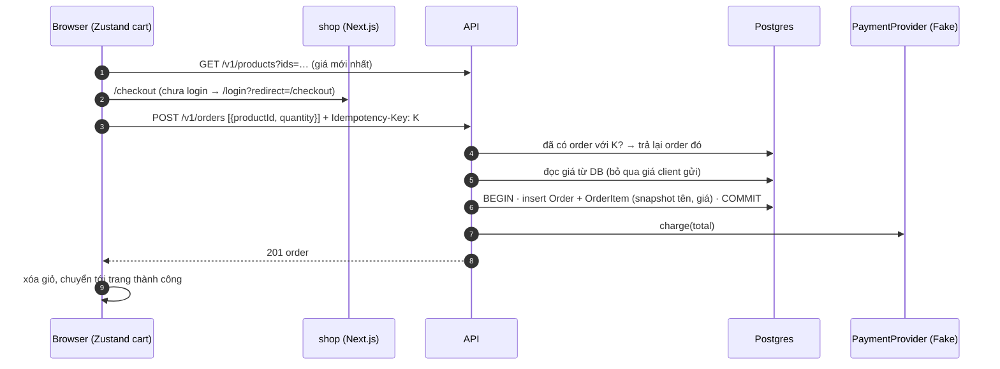
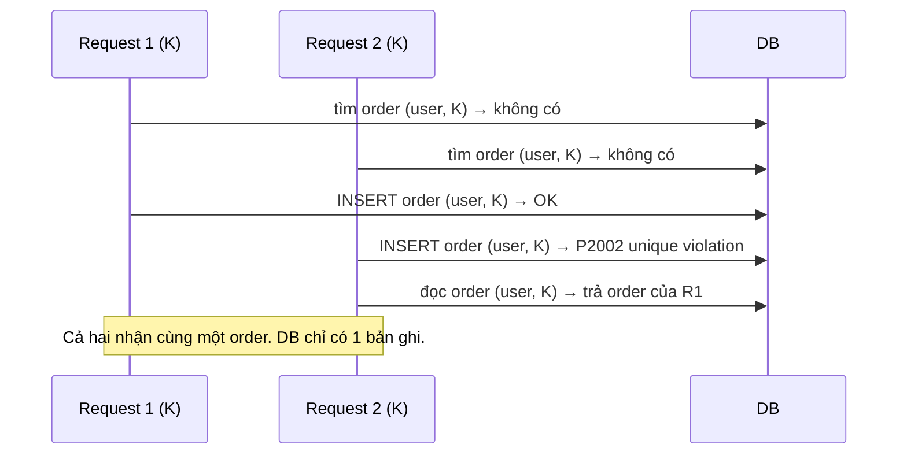

# Plan Sprint 6 — Cart & Checkout · v0.6.0

> Sprint: [sprint-06.md](../sprints/sprint-06.md) *(draft: refine AC trước khi bắt đầu)* · Tổng quan v1: [README](../README.md)
>
> **Cách dùng plan:** đọc "Khái niệm" → tự làm → kẹt quá 30 phút mới mở Hint 1 → Hint 2 → Hint 3. Tự nghĩ test case trước khi mở đáp án.
>
> 🔒 **Logic tạo đơn và tính tiền là business logic** mà [rule 05](../../rules/05-working-with-claude.md) yêu cầu bạn tự viết. Hint 3 chỉ có **pseudo-code**. PR của PXM-37 và PXM-38 phải chạy `/security-review`.

## 0. Trước khi bắt đầu

- Sprint 5 xong: có sản phẩm thật trên shop, `GET /v1/products?ids=` đã sẵn sàng.
- Đọc trước:
  - Stripe, "Idempotent requests" (mô hình tham khảo cho Idempotency-Key): https://docs.stripe.com/api/idempotent_requests
  - OWASP, IDOR: https://cheatsheetseries.owasp.org/cheatsheets/Insecure_Direct_Object_Reference_Prevention_Cheat_Sheet.html
  - Hexagonal architecture (Ports & Adapters): https://alistair.cockburn.us/hexagonal-architecture/

## 1. Bức tranh tổng



Mô hình dữ liệu dự kiến:

```
Order      id · userId → User · status (PENDING|CONFIRMED) · totalMinor · currency · idempotencyKey (unique theo user) · createdAt
OrderItem  id · orderId → Order · productId? → Product (onDelete SetNull) · productName · unitPriceMinor · quantity
```

> **Câu hỏi thiết kế cần quyết định trước:** `idempotencyKey` là unique **toàn cục** hay **theo từng user** (`@@unique([userId, idempotencyKey])`)? Nếu toàn cục, user B có thể "đoán" key của user A và nhận lại order của A, tức là một lỗ IDOR mới. Gợi ý: unique theo user.

## 2. Thứ tự & phụ thuộc

```
PXM-37 API tạo đơn ──▶ PXM-38 trang checkout
PXM-36 giỏ hàng (song song với 37) ─┘
PXM-39 đơn hàng của tôi (sau 37)
```

- **Rủi ro lớn nhất:** PXM-37. Đây là chỗ tiền bạc và đồng thời gặp nhau. Bắt đầu nó **trước tiên** và viết test trước.

---

## 3.1 PXM-36 · Giỏ hàng phía client

### Khái niệm cần nắm
- **Giỏ hàng chỉ lưu `productId` + `quantity`.** **Không** lưu giá làm nguồn sự thật: giá có thể đổi, và client có thể bị sửa. Trang giỏ lấy tên/giá **mới nhất** qua `GET /v1/products?ids=`.
- **Zustand `persist`:** lưu store vào `localStorage`, tự khôi phục khi tải lại trang.
- **Hydration mismatch:** server render HTML **không có** localStorage (giỏ rỗng), còn client render lần đầu **có** dữ liệu (giỏ 3 món) → React báo HTML không khớp. Cách xử lý: chỉ hiển thị phần phụ thuộc giỏ hàng **sau khi** client đã hydrate (`skipHydration` + `rehydrate()` trong `useEffect`, hoặc cờ "đã hydrate").
- **Sản phẩm đã bị xóa:** `?ids=` trả về ít hơn số id gửi lên → loại các id thiếu khỏi giỏ và thông báo cho người dùng.
- **Version store:** `persist` có `version` + `migrate`. Khi đổi cấu trúc giỏ (v2 thêm `vendorId`…), dữ liệu cũ trong localStorage của khách cần được chuyển đổi.

### Hướng tiếp cận
1. Store `useCartStore`: `items: { productId, quantity }[]`, `add`, `setQuantity`, `remove`, `clear`. Gồm `persist` với `name`, `version`, `skipHydration: true`.
2. Component nhỏ `CartHydrator` gọi `useCartStore.persist.rehydrate()` trong `useEffect`, đặt trong layout.
3. Badge số lượng trên header (Client Component), chỉ hiển thị sau khi đã hydrate.
4. Trang `/cart`: lấy `ids` từ store → `useQuery` gọi `?ids=` → ghép với `quantity` → tính tạm tính **để hiển thị**. Phát hiện id thiếu → `remove` + toast.
5. Unit test cho các action của store (thuần logic).

### File dự kiến tạo/sửa
`apps/web/lib/cart/{store.ts,store.test.ts,cart-hydrator.tsx}`, `apps/web/components/{cart-badge.tsx,add-to-cart-button.tsx}`, `apps/web/app/cart/page.tsx`.

### Tự nghĩ test case trước
<details><summary>Đáp án tham khảo</summary>

Store:
- `add(p1)` 2 lần → 1 dòng, `quantity: 2` (không tạo 2 dòng).
- `setQuantity(p1, 0)` → xóa dòng (hoặc chặn: hãy quyết định). Số âm → bị chặn.
- `quantity` vượt mức tối đa (ví dụ 99) → bị giới hạn.
UI:
- Thêm 3 món → reload → vẫn còn 3 món, **không** có cảnh báo hydration trong console.
- Admin xóa một sản phẩm → mở `/cart` → món đó biến mất + có thông báo.
- Admin đổi giá → `/cart` hiện giá mới.
- Tab ẩn danh → giỏ rỗng.
</details>

### Gợi ý
<details><summary>Hint 1: hướng đi</summary>

Viết store + unit test trước (không cần UI). Sau đó gắn persist. Cuối cùng xử lý hydration. Mở DevTools console và quan sát cảnh báo hydration để biết khi nào đã đúng.
</details>

<details><summary>Hint 2: khái niệm/API</summary>

- `create()(persist((set, get) => ({...}), { name: 'pixelmart-cart', version: 1, skipHydration: true }))`.
- `useCartStore.persist.rehydrate()`, `useCartStore.persist.hasHydrated()`, `onFinishHydration`.
- Store Zustand là singleton ở module scope. Trên server (RSC) đừng đọc nó, giỏ hàng chỉ tồn tại ở client.
</details>

<details><summary>Hint 3: pseudo-code</summary>

```
add(productId, qty = 1):
  existing = items.find(productId)
  if existing: existing.quantity = min(existing.quantity + qty, MAX_QTY)
  else: items.push({ productId, quantity: min(qty, MAX_QTY) })

CartPage (client):
  hydrated = useHydrated()
  ids = items.map(i → i.productId)
  { data } = useQuery(['products', 'byIds', ids], () → api.getProductsByIds(ids), enabled: hydrated && ids.length > 0)
  missing = ids không có trong data → remove(missing) + toast "Một số sản phẩm không còn bán"
  hiển thị: tên, giá (formatMoney), quantity, thành tiền tạm tính (chỉ để hiển thị)
```
</details>

### Bẫy thường gặp
| Triệu chứng | Nguyên nhân | Cách tránh |
|---|---|---|
| Console báo "Hydration failed…" | Server render giỏ rỗng, client render giỏ có dữ liệu | `skipHydration` + chỉ hiển thị sau khi hydrate |
| Giá trong giỏ cũ hơn giá thật | Lưu giá trong localStorage làm nguồn sự thật | Chỉ lưu id + quantity, giá luôn lấy từ API |
| Thêm cùng sản phẩm tạo 2 dòng | Không gộp theo `productId` | `add` gộp |
| Đổi cấu trúc store xong, khách cũ bị lỗi | Không có `version`/`migrate` | Đặt `version` ngay từ đầu |

### Kiểm chứng AC
- [ ] Reload → giỏ còn, console không có lỗi hydration.
- [ ] Sản phẩm bị xóa → tự loại khỏi giỏ kèm thông báo.

### Đọc thêm
- Zustand persist: https://zustand.docs.pmnd.rs/integrations/persisting-store-data
- Zustand với Next.js: https://zustand.docs.pmnd.rs/guides/nextjs
- React, hydration errors: https://react.dev/reference/react-dom/client/hydrateRoot#handling-different-client-and-server-content

---

## 3.2 PXM-37 · API tạo đơn hàng

### Khái niệm cần nắm
- **Never trust the client:** client chỉ gửi `productId` + `quantity`. Mọi giá, tổng tiền được **server tính lại từ DB**. Nếu body có `price`/`total`, schema sẽ loại bỏ chúng (Zod strip). AC 1 kiểm tra đúng điều này.
- **Snapshot:** `OrderItem` lưu **bản sao** `productName` + `unitPriceMinor` tại thời điểm mua. Sau này sản phẩm đổi giá, đổi tên hay bị xóa (`productId` → `SetNull`) thì đơn cũ vẫn đúng như lúc khách mua. Đây là yêu cầu pháp lý/kế toán thật, không phải chi tiết kỹ thuật.
- **Transaction:** tạo `Order` + mọi `OrderItem` là **một đơn vị**: hoặc tất cả thành công, hoặc không có gì. Không bao giờ có đơn mà không có item.
- **Idempotency-Key:** mạng chập chờn khiến client gửi lại request "Đặt hàng". Không có idempotency thì khách bị tạo hai đơn. Client sinh một key (UUID) cho **mỗi lần ý định đặt hàng**. Server lưu key cùng order: gặp lại key thì **trả lại order cũ** thay vì tạo mới.
- **Race condition với Idempotency-Key:** hai request cùng key đến **đồng thời** → cả hai cùng thấy "chưa có order với K" → cả hai cùng insert. **Unique constraint** trên `(userId, idempotencyKey)` là hàng rào cuối cùng: request thua nhận lỗi `P2002`, bắt lỗi đó rồi đọc và trả lại order của request thắng.



- **Ports & Adapters cho thanh toán:** service đặt hàng chỉ biết **interface** `PaymentProvider` (port) với `charge(...)`. `FakePaymentProvider` (adapter) luôn thành công (hoặc thất bại theo cấu hình, để test). Sau này thay bằng Stripe thì service không cần sửa. NestJS DI đổi adapter qua một injection token.
- **Status code:** sản phẩm không tồn tại → **422** (request đúng cú pháp nhưng không xử lý được về mặt nghiệp vụ). Thiếu `Idempotency-Key` → 400.

### Hướng tiếp cận
1. Viết test **trước**, đặc biệt test giá giả mạo, test idempotency và test đồng thời.
2. Contract: `createOrderSchema` (`items: { productId: uuid, quantity: int 1..99 }[]`, 1..50 item, không trùng `productId`), `orderSchema`.
3. Prisma: `Order`, `OrderItem`, enum `OrderStatus`, `@@unique([userId, idempotencyKey])`, `productId` nullable với `onDelete: SetNull`. Migration.
4. Port `PaymentProvider` + token + `FakePaymentProvider`. Đăng ký trong `OrdersModule`.
5. `OrdersService.create(userId, key, items)` (xem pseudo-code).
6. Controller `POST /v1/orders`: yêu cầu đăng nhập, đọc header `Idempotency-Key` (validate là UUID), trả 201 khi tạo mới. Khi trả lại order đã có, chọn 200 hoặc 201 và ghi lại lựa chọn.
7. Suy nghĩ: charge thất bại thì sao? (v1 dùng Fake luôn thành công. Hãy ghi lại câu hỏi này cho v5, nơi có queue và outbox.)

### File dự kiến tạo/sửa
`packages/contracts/src/orders/{create-order.ts,order.ts}`, `apps/api/prisma/schema.prisma` + migration, `apps/api/src/orders/{orders.module.ts,orders.service.ts,orders.controller.ts}`, `apps/api/src/payments/{payment-provider.ts,fake-payment.provider.ts}`, `apps/api/test/orders-create.e2e-spec.ts`.

### Tự nghĩ test case trước
Ít nhất 10 case. Đây là endpoint quan trọng nhất của v1.

<details><summary>Đáp án tham khảo</summary>

1. Hợp lệ → 201, `totalMinor` = Σ(giá DB × quantity).
2. Body kèm `unitPriceMinor: 1`/`totalMinor: 1` → bị bỏ qua, tổng tính từ DB.
3. `productId` không tồn tại → 422, **không** có order nào được tạo (kiểm tra DB).
4. `quantity: 0`, `-1`, `1.5`, `1000` → 400.
5. `items: []` → 400. Trùng `productId` trong cùng request → 400 (hoặc gộp: hãy quyết định).
5b. Cùng `Idempotency-Key` nhưng **payload khác** (giỏ khác) → **422** (giống Stripe và bản nháp IETF): lưu hash của payload cùng key, so sánh khi gặp lại key. Không được âm thầm trả order của giỏ cũ.
6. Thiếu `Idempotency-Key` → 400. Key không phải UUID → 400.
7. Gửi 2 lần **tuần tự** cùng key → cùng `order.id`, DB có 1 order.
8. Gửi 2 lần **đồng thời** cùng key (`Promise.all`) → cùng `order.id`, DB có 1 order, không có 500.
9. User B dùng **cùng key** với user A → B tạo order mới của B (không nhận order của A).
10. Snapshot: tạo đơn → admin đổi giá/tên → xóa product → `GET` order vẫn hiện tên và giá cũ, `productId: null`.
11. Không đăng nhập → 401.
12. `FakePaymentProvider` cấu hình thất bại → hành vi đúng như bạn quyết định (ví dụ 402/502, và không để lại order "mồ côi" nếu đó là quyết định của bạn).
</details>

### Gợi ý
<details><summary>Hint 1: hướng đi</summary>

Chia thành các bước nhỏ, mỗi bước một test xanh: (a) tạo đơn đúng tổng tiền → (b) bỏ qua giá client → (c) 422 → (d) snapshot → (e) idempotency tuần tự → (f) idempotency đồng thời. Đừng viết tất cả rồi mới chạy test.
</details>

<details><summary>Hint 2: khái niệm/API</summary>

- Prisma interactive transaction: `prisma.$transaction(async (tx) => { … })`. Mọi query bên trong dùng `tx`.
- Nested create: `tx.order.create({ data: { …, items: { create: [...] } }, include: { items: true } })`.
- DI theo interface: `export const PAYMENT_PROVIDER = Symbol('PAYMENT_PROVIDER')`, `{ provide: PAYMENT_PROVIDER, useClass: FakePaymentProvider }`, `@Inject(PAYMENT_PROVIDER)`.
- Test đồng thời: `await Promise.all([req(), req()])` với Supertest trên cùng app.
- Header: `@Headers('idempotency-key')` (Node đưa tên header về chữ thường).
</details>

<details><summary>Hint 3: pseudo-code</summary>

```
createOrder(userId, key, items):
  existing = findOrder(userId, key)
  if existing: return { order: existing, created: false }

  products = findProducts(ids = items.map(productId), storeId)
  if products.length != unique(ids).length: throw 422 "Sản phẩm không tồn tại"

  lines = items.map(i → { product = products[i.productId];
                          productId, productName: product.name, unitPriceMinor: product.priceMinor, quantity: i.quantity })
  total = sum(lines.unitPriceMinor * quantity)
  // (v1: một store, một currency. Kiểm tra mọi product cùng currency)

  try:
    order = transaction(tx → tx.order.create({ userId, idempotencyKey: key, status: PENDING, totalMinor: total, currency, items: create lines }))
  catch unique violation (userId, idempotencyKey):
    return { order: findOrder(userId, key), created: false }

  paymentProvider.charge({ orderId: order.id, amountMinor: total, currency })   // Fake
  return { order, created: true }
```
Câu hỏi để bạn tự trả lời: gọi `charge` **trong** hay **ngoài** transaction? Mỗi cách sai ở đâu khi charge thất bại, hoặc khi DB commit thất bại sau khi đã charge?
</details>

### Bẫy thường gặp
| Triệu chứng | Nguyên nhân | Cách tránh |
|---|---|---|
| Tổng tiền lấy từ client | Tin body | Schema không có field giá, tính từ DB |
| Đơn cũ đổi giá theo sản phẩm | Join với `Product` khi hiển thị | Snapshot vào `OrderItem` |
| Xóa sản phẩm → lỗi FK hoặc đơn cũ bị xóa theo | `onDelete` sai | `productId` nullable + `SetNull` |
| Double-click tạo 2 đơn | Không có idempotency | Idempotency-Key + unique constraint |
| Hai request đồng thời cùng key → 500 | Không bắt `P2002` | Bắt lỗi rồi trả lại order đã có |
| User B lấy được order của A bằng cách đoán key | Unique key toàn cục | Unique theo `(userId, key)`, luôn lọc theo `userId` |
| Tổng tiền tràn số | Nhiều item × giá lớn | Giới hạn `quantity` và số item. Kiểm tra `Number.isSafeInteger(total)` |
| Charge gọi trong transaction, payment chậm giữ lock DB lâu | Gọi I/O ngoài trong transaction | Giữ transaction ngắn. Câu hỏi này được giải quyết thật sự ở v5 (outbox) |

### Kiểm chứng AC
- [ ] Test giá giả mạo (case 2) xanh.
- [ ] Test product không tồn tại → 422 (case 3) xanh.
- [ ] Test idempotency tuần tự **và** đồng thời (case 7, 8) xanh, DB có 1 order.
- [ ] Test snapshot sau khi xóa product (case 10) xanh.
- [ ] `/security-review` trên PR.

### Đọc thêm
- Stripe idempotent requests: https://docs.stripe.com/api/idempotent_requests
- IETF draft, The Idempotency-Key HTTP Header Field: https://datatracker.ietf.org/doc/draft-ietf-httpapi-idempotency-key-header/
- Prisma interactive transactions: https://www.prisma.io/docs/orm/prisma-client/queries/transactions#interactive-transactions
- NestJS custom providers (injection token): https://docs.nestjs.com/fundamentals/custom-providers

---

## 3.3 PXM-38 · Trang checkout

### Khái niệm cần nắm
- **Một Idempotency-Key cho mỗi *ý định* đặt hàng:** sinh key khi người dùng **vào** checkout (hoặc khi giỏ thay đổi), **không** sinh mới ở mỗi lần bấm. Bấm hai lần hay retry vì mạng lỗi đều dùng cùng key, nên chỉ có một đơn. Đổi giỏ thì đó là một ý định mới, cần key mới.
- **Chống double submit ở UI:** disable nút khi đang gửi. Đây là lớp phòng thủ về UX. Lớp phòng thủ thật là idempotency ở API.
- **Luồng đăng nhập:** `/checkout` nằm trong `matcher` của `proxy.ts` (PXM-26), nên chưa đăng nhập sẽ đi `/login?redirect=/checkout` rồi quay lại.
- **Thất bại thì giữ giỏ:** chỉ `clear()` giỏ **sau khi** API trả thành công.

### Hướng tiếp cận
1. Trang `/checkout`: tóm tắt giỏ (dùng lại phần lấy giá từ `?ids=`), nút "Đặt hàng".
2. Lưu key trong **store giỏ hàng** (Zustand): `checkoutKey` được sinh khi giỏ thay đổi (trong các action `add`/`setQuantity`/`remove`) và bị xóa khi `clear()`. Không dùng `useMemo` hay `useState` để giữ key: React không đảm bảo `useMemo` giữ giá trị (có thể tính lại), còn `useState` mất key khi rời trang checkout rồi quay lại.
3. `useMutation` gọi `api.createOrder(items, key)`. Thành công → `clear()` → `/account/orders/[id]?placed=1` (trang chi tiết đơn hiển thị thông báo "Đặt hàng thành công" khi có `placed=1`). Thất bại → hiển thị lỗi, giữ giỏ. 422 → làm mới giỏ (một sản phẩm vừa bị xóa).
4. Test thủ công (và component test nếu có thể) cho double-click.

### File dự kiến tạo/sửa
`apps/web/app/checkout/page.tsx`, `apps/web/components/checkout/place-order-button.tsx`, `apps/web/app/account/orders/[id]/page.tsx` (thông báo khi `?placed=1`), `apps/web/lib/cart/store.ts` (`checkoutKey`), `apps/web/proxy.ts`, `packages/api-client/src/orders.ts`.

### Tự nghĩ test case trước
<details><summary>Đáp án tham khảo</summary>

- Chưa đăng nhập → login → quay lại `/checkout`, giỏ vẫn còn.
- Double-click nhanh "Đặt hàng" → 1 đơn (kiểm tra DB và trang "Đơn hàng của tôi").
- Tắt API giữa chừng (hoặc DevTools offline) → thông báo lỗi, giỏ vẫn còn. Bật lại, bấm lại → 1 đơn (cùng key).
- API trả 422 → thông báo + giỏ được làm mới.
- Giỏ rỗng → không vào checkout được (hoặc thấy thông báo).
- Đặt xong, bấm Back về checkout → không tạo thêm đơn.
- Đổi giỏ sau khi một lần đặt thất bại → key mới (đọc `checkoutKey` trong DevTools/Redux devtools của Zustand).
</details>

### Gợi ý
<details><summary>Hint 1: hướng đi</summary>

Trả lời câu hỏi "khi nào sinh key mới?" bằng một câu, viết vào mô tả PR. Phần còn lại của ticket sẽ đi theo câu trả lời đó.
</details>

<details><summary>Hint 2: khái niệm/API</summary>

- `crypto.randomUUID()` có sẵn trong browser hiện đại (cần secure context: https hoặc localhost).
- Để key đổi khi giỏ đổi: dùng `useMemo` phụ thuộc vào một "chữ ký" của giỏ (ví dụ chuỗi JSON đã sort), hoặc tạo key mới trong action của store khi giỏ thay đổi.
- `api-client` gửi header `Idempotency-Key`. Retry tự động (nếu có) **phải** dùng lại cùng key.
</details>

<details><summary>Hint 3: pseudo-code</summary>

```
CheckoutPage:
  key = useCartStore(s → s.checkoutKey)        // sinh trong action của store khi giỏ đổi
  mutation = useMutation(() → api.createOrder(items, key), {
    onSuccess(order) → cart.clear(); router.replace(`/account/orders/${order.id}?placed=1`)
    onError(e) → e.status == 422 ? refreshCart() + toast : toast("Đặt hàng thất bại, giỏ hàng vẫn được giữ")
  })
  <Button disabled={mutation.isPending || items.length == 0} onClick={mutation.mutate}>Đặt hàng</Button>
```
</details>

### Bẫy thường gặp
| Triệu chứng | Nguyên nhân | Cách tránh |
|---|---|---|
| Double-click tạo 2 đơn | Key sinh mới mỗi lần bấm | Key gắn với ý định, không gắn với click |
| Lỗi mạng → giỏ bị xóa | `clear()` trước khi có kết quả | Chỉ xóa khi thành công |
| Đổi giỏ rồi đặt lại → nhận về đơn **cũ** | Dùng lại key cũ cho giỏ mới | Key đổi khi giỏ đổi |
| `crypto.randomUUID is not a function` | Trang chạy trên http không phải localhost | Dùng https, hoặc dùng thư viện uuid |

### Kiểm chứng AC
- [ ] Bấm "Đặt hàng" 2 lần liên tiếp → 1 đơn.
- [ ] Lỗi API → thông báo, giỏ giữ nguyên.

### Đọc thêm
- MDN `crypto.randomUUID`: https://developer.mozilla.org/en-US/docs/Web/API/Crypto/randomUUID
- TanStack Query mutations: https://tanstack.com/query/latest/docs/framework/react/guides/mutations

---

## 3.4 PXM-39 · Đơn hàng của tôi

### Khái niệm cần nắm
- **IDOR (Insecure Direct Object Reference):** `GET /v1/orders/123` mà chỉ kiểm tra "đã đăng nhập" chứ không kiểm tra "đơn này có phải của bạn không" → ai cũng xem được đơn của người khác bằng cách đổi id. UUID khó đoán **không** phải là biện pháp bảo vệ (id có thể lộ qua log, URL, ảnh chụp màn hình).
- **Query theo chủ sở hữu:** `findFirst({ where: { id, userId: currentUser.id } })`. Không tìm thấy → 404. Không có nhánh "tìm thấy nhưng không phải của bạn".
- **404 thay vì 403:** 403 xác nhận rằng "đơn này tồn tại nhưng không phải của bạn", tức là lộ thông tin. 404 không cho kẻ dò biết gì.
- **Sắp xếp ổn định:** `orderBy: [{ createdAt: 'desc' }, { id: 'desc' }]`.

### Hướng tiếp cận
1. `GET /v1/orders` (danh sách của chính mình, phân trang, mới nhất trước), `GET /v1/orders/:id`.
2. Test IDOR **trước**: user A tạo đơn, user B gọi `GET /v1/orders/<id của A>` → 404.
3. Trang `/account/orders` (Server Component, chuyển tiếp cookie như PXM-26) và `/account/orders/[id]`, hiển thị snapshot (tên, giá lúc mua) và trạng thái.

### File dự kiến tạo/sửa
`apps/api/src/orders/{orders.controller.ts,orders.service.ts}`, `apps/api/test/orders-read.e2e-spec.ts`, `apps/web/app/account/orders/{page.tsx,[id]/page.tsx}`.

### Tự nghĩ test case trước
<details><summary>Đáp án tham khảo</summary>

- A xem đơn của B → 404 (không phải 403).
- A xem đơn với id không tồn tại → 404 (cùng response như trên, kẻ dò không phân biệt được).
- Id sai định dạng → 400 hoặc 404 (thống nhất một cách).
- Danh sách của A chỉ chứa đơn của A, mới nhất trước.
- Không đăng nhập → 401.
- Chi tiết hiển thị tên/giá snapshot kể cả khi sản phẩm đã bị xóa.
- ADMIN gọi `GET /v1/orders/:id` của khách → vẫn 404 (endpoint này là "của tôi". Admin dùng endpoint riêng ở PXM-40).
</details>

### Gợi ý
<details><summary>Hint 1: hướng đi</summary>

Viết test IDOR đầu tiên và để nó đỏ. Bản cài đặt ngây thơ (`findUnique({ where: { id } })`) sẽ làm test **đỏ**, chứng minh test đang bắt đúng lỗ hổng.
</details>

<details><summary>Hint 2: khái niệm/API</summary>

`findFirst({ where: { id, userId } })` thay cho `findUnique({ where: { id } })`. Đừng lấy đơn ra rồi mới `if (order.userId !== user.id) throw`: cách đó vẫn đúng, nhưng dễ quên và dễ trả nhầm 403.
</details>

<details><summary>Hint 3: pseudo-code</summary>

```
getMyOrder(userId, orderId):
  order = db.order.findFirst({ where: { id: orderId, userId }, include: items })
  if !order: throw NotFound
  return toOrderResponse(order)
```
</details>

### Bẫy thường gặp
| Triệu chứng | Nguyên nhân | Cách tránh |
|---|---|---|
| Xem được đơn người khác | Query chỉ theo `id` | Luôn lọc theo `userId` |
| Trả 403 khi không phải chủ | Phân biệt "không có" và "không phải của bạn" | Trả 404 cho cả hai |
| Danh sách nhảy thứ tự | `orderBy` không ổn định | Thêm `id` làm tie-breaker |
| Trang "Đơn của tôi" trống trên SSR | Quên chuyển tiếp cookie | Dùng helper từ PXM-26 |

### Kiểm chứng AC
- [ ] Test: user A xem đơn của user B → **404**.
- [ ] Test: danh sách sắp xếp mới nhất trước.

### Đọc thêm
- OWASP IDOR prevention: https://cheatsheetseries.owasp.org/cheatsheets/Insecure_Direct_Object_Reference_Prevention_Cheat_Sheet.html
- OWASP API Security Top 10, API1 Broken Object Level Authorization: https://owasp.org/API-Security/editions/2023/en/0xa1-broken-object-level-authorization/

---

## 4. Tự kiểm tra cuối sprint

1. Vì sao server phải tự tính tổng tiền dù client đã tính để hiển thị?
<details><summary>Gợi ý</summary>

Client có thể bị sửa (DevTools, curl). Mọi con số liên quan tới tiền phải được tính ở nơi ta kiểm soát được.
</details>

2. Snapshot trong `OrderItem` giải quyết vấn đề gì? Nếu không có snapshot thì chuyện gì xảy ra khi admin tăng giá?
<details><summary>Gợi ý</summary>

Đơn cũ hiển thị giá mới, sai với số tiền khách đã trả, gây sai lệch kế toán và tranh chấp.
</details>

3. Idempotency-Key và unique constraint bổ trợ cho nhau thế nào?
<details><summary>Gợi ý</summary>

Key cho phép nhận ra request lặp lại. Constraint bảo đảm tính duy nhất kể cả khi hai request đồng thời cùng vượt qua bước "kiểm tra đã tồn tại chưa".
</details>

4. Vì sao unique `(userId, idempotencyKey)` thay vì chỉ `idempotencyKey`?
<details><summary>Gợi ý</summary>

Nếu là toàn cục, user khác gửi cùng key sẽ nhận lại order của người khác (IDOR), hoặc bị chặn tạo đơn của mình.
</details>

5. IDOR là gì? Vì sao UUID không phải là biện pháp phòng chống?
<details><summary>Gợi ý</summary>

Truy cập được object của người khác chỉ bằng cách đổi id. UUID chỉ khó đoán, nhưng id vẫn có thể bị lộ. Phải kiểm tra quyền sở hữu ở mỗi truy vấn.
</details>

6. Ports & Adapters giúp gì cho `PaymentProvider`, cả trong test lẫn khi đổi sang Stripe?
<details><summary>Gợi ý</summary>

Service chỉ phụ thuộc interface. Test dùng Fake (điều khiển được thành công/thất bại), production đổi adapter mà không sửa logic đặt hàng.
</details>

7. Hydration mismatch là gì? Vì sao giỏ hàng trong localStorage gây ra nó?
<details><summary>Gợi ý</summary>

HTML từ server khác với kết quả render lần đầu ở client. Server không có localStorage nên render giỏ rỗng, còn client có dữ liệu nên render giỏ đầy.
</details>

8. Gọi `charge` trong hay ngoài transaction? Mỗi cách có rủi ro gì?
<details><summary>Gợi ý</summary>

Trong: giữ lock DB trong lúc chờ mạng. Payment thành công nhưng transaction rollback thì khách bị trừ tiền mà không có đơn. Ngoài (sau commit): có đơn PENDING nhưng charge thất bại hoặc process chết giữa chừng, cần cơ chế bù trừ/retry. Lời giải bài bản (outbox, saga) ở v5 và v8.
</details>

## 5. Kịch bản demo

1. Ẩn danh: thêm 3 món vào giỏ, reload → còn nguyên, console sạch.
2. Admin xóa 1 sản phẩm → giỏ tự loại món đó và có thông báo.
3. Checkout → bị yêu cầu đăng nhập → quay lại checkout.
4. Double-click "Đặt hàng" → 1 đơn.
5. REST client: gửi `POST /v1/orders` với `unitPriceMinor: 1` → tổng vẫn đúng giá DB. Gửi lại cùng key → cùng order.
6. Đăng nhập user B, gọi `GET /v1/orders/<id của A>` → 404.
7. "Đơn hàng của tôi" hiển thị giá snapshot kể cả sau khi admin đổi giá.
