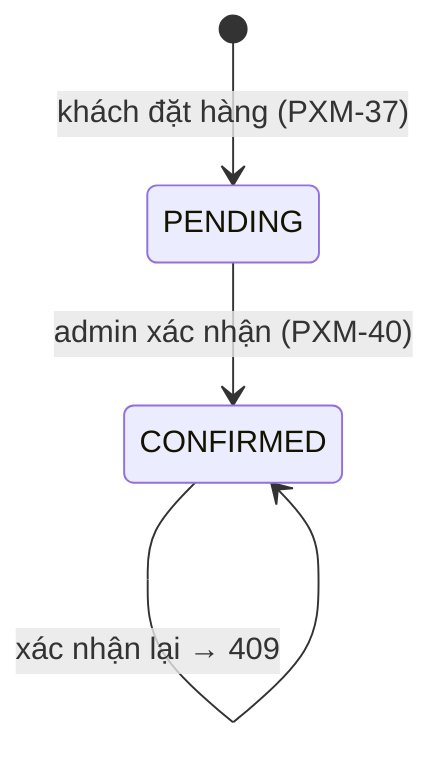

# Plan Sprint 7 — Admin orders & Release · v1.0.0

> Sprint: [sprint-07.md](../sprints/sprint-07.md) *(draft: refine AC trước khi bắt đầu)* · Tổng quan v1: [README](../README.md)
>
> **Cách dùng plan:** đọc "Khái niệm" → tự làm → kẹt quá 30 phút mới mở Hint 1 → Hint 2 → Hint 3. Tự nghĩ test case trước khi mở đáp án.

## 0. Trước khi bắt đầu

- Sprint 6 xong: khách đặt hàng được end-to-end.
- Sprint này giữ **1–2 pts dự phòng** cho việc trễ từ các sprint trước. Nếu còn ticket dở dang từ Sprint 6, làm xong nó **trước** khi bắt đầu hardening.
- Đây là release **major** đầu tiên (`v1.0.0`). Đọc lại [release checklist](../../rules/04-sprint-lifecycle.md#release-checklist-ngày-13) và [DoD cấp sprint](../../rules/06-definition-of-ready-and-done.md).

## 1. Bức tranh tổng



Sprint này **khép vòng** e-commerce (khách đặt → admin xác nhận → khách thấy trạng thái), sau đó chuyển sang chế độ "phát hành": bảo mật, chất lượng, tài liệu, release.

> v2 sẽ mở rộng state machine này (thêm `CANCELLED`, `SHIPPED`…, và tách theo vendor). Thiết kế PXM-40 sao cho thêm trạng thái mới chỉ là thêm một dòng vào bảng chuyển trạng thái.

## 2. Thứ tự & phụ thuộc

```
PXM-40 admin orders ──▶ PXM-41 security hardening ──▶ PXM-42 UX polish ──▶ PXM-43 docs & demo ──▶ PXM-44 release + retro
```

- **PXM-41 trước PXM-42/43:** hardening có thể đổi cấu hình (CORS, header, cookie) và làm vỡ UI. Sửa sớm để còn thời gian test lại.
- **PXM-44 là ngày 13–14 của sprint.** Không có gì được merge vào `develop` sau code freeze.

---

## 3.1 PXM-40 · Admin xem & xác nhận đơn

### Khái niệm cần nắm
- **State machine tường minh:** một bảng `allowedTransitions = { PENDING: ['CONFIRMED'], CONFIRMED: [] }`. Mọi thay đổi trạng thái đều đi qua **một** hàm kiểm tra bảng này. Không có `if/else` rải rác khắp nơi.
- **Race condition khi chuyển trạng thái:** hai admin cùng bấm "Xác nhận" → cả hai đọc thấy `PENDING` → cả hai cập nhật. Dùng **update có điều kiện** `UPDATE … SET status='CONFIRMED' WHERE id=? AND status='PENDING'` rồi kiểm tra số dòng bị ảnh hưởng: 0 dòng → 409 (đã bị chuyển rồi) hoặc 404 (không tồn tại). Cùng kỹ thuật với PXM-23.
- **409 Conflict:** request hợp lệ nhưng xung đột với trạng thái hiện tại của tài nguyên.
- **Endpoint admin tách khỏi endpoint "của tôi":** `/v1/admin/orders` (`@Roles('ADMIN')`, xem mọi đơn) khác `/v1/orders` (chỉ đơn của mình, PXM-39).

### Hướng tiếp cận
1. Hàm thuần `canTransition(from, to)` + unit test.
2. `GET /v1/admin/orders?status=&page=&pageSize=` (dùng lại `paginatedSchema`), kèm thông tin khách (email/tên) cho admin.
3. `PATCH /v1/admin/orders/:id/confirm`: kiểm tra transition → `updateMany` có điều kiện → `count === 0` thì phân biệt 404 và 409 (đọc lại một lần).
4. Admin UI: bảng đơn (dùng lại pattern PXM-32), lọc theo status, nút "Xác nhận" (disable khi pending), toast cho 409.
5. Test: transition hợp lệ, xác nhận lại → 409, đồng thời, 401/403.

### File dự kiến tạo/sửa
`packages/contracts/src/orders/admin-order.ts`, `apps/api/src/orders/{order-status.ts,order-status.test.ts,admin-orders.controller.ts,orders.service.ts}`, `apps/api/test/admin-orders.e2e-spec.ts`, `apps/admin/src/features/orders/**`, `apps/admin/src/routes/_authed/orders.tsx`.

### Tự nghĩ test case trước
<details><summary>Đáp án tham khảo</summary>

- `PENDING → CONFIRMED` → 200, khách thấy `CONFIRMED` trong "Đơn hàng của tôi".
- Xác nhận lại đơn đã `CONFIRMED` → 409.
- Hai request confirm đồng thời → đúng một 200, một 409.
- Id không tồn tại → 404.
- CUSTOMER gọi endpoint admin → 403. Không đăng nhập → 401.
- Lọc `?status=PENDING` → chỉ đơn PENDING. `?status=ABC` → 400.
- `canTransition('CONFIRMED', 'PENDING')` → false.
</details>

### Gợi ý
<details><summary>Hint 1: hướng đi</summary>

Bắt đầu từ bảng chuyển trạng thái và unit test của nó. Endpoint chỉ là lớp mỏng gọi hàm đó cộng với update có điều kiện.
</details>

<details><summary>Hint 2: khái niệm/API</summary>

- Prisma: `updateMany({ where: { id, status: 'PENDING' }, data: { status: 'CONFIRMED' } })` → `{ count }`.
- Enum Prisma được sinh ra dưới dạng type. Dùng `z.enum([...])` trong contracts và giữ cho hai danh sách đồng bộ (test so sánh hai danh sách là một ý hay).
</details>

<details><summary>Hint 3: pseudo-code</summary>

```
TRANSITIONS = { PENDING: [CONFIRMED], CONFIRMED: [] }

confirm(orderId):
  { count } = db.order.updateMany({ where: { id: orderId, status: PENDING }, data: { status: CONFIRMED } })
  if count == 1: return db.order.findUnique(orderId)
  order = db.order.findUnique(orderId)
  if !order: throw 404
  throw 409 `Không thể chuyển từ ${order.status} sang CONFIRMED`
```
</details>

### Bẫy thường gặp
| Triệu chứng | Nguyên nhân | Cách tránh |
|---|---|---|
| Xác nhận 2 lần đều 200 | Đọc rồi ghi | Update có điều kiện |
| Logic trạng thái nằm rải rác | `if` trong controller, service, UI | Một bảng transition, một hàm |
| Enum lệch giữa Prisma và contracts | Hai nguồn định nghĩa | Test đối chiếu, hoặc sinh từ một nguồn |
| Admin dùng nhầm endpoint `/v1/orders/:id` | Không tách endpoint | `/v1/admin/orders/*` riêng |

### Kiểm chứng AC
- [ ] Test: chỉ `PENDING → CONFIRMED`. Xác nhận lại → 409.
- [ ] Khách thấy trạng thái mới trong "Đơn hàng của tôi" (demo thủ công + test API).

### Đọc thêm
- Martin Fowler, State Machine: https://martinfowler.com/bliki/StateMachine.html (và mục "State" trong *Refactoring Guru*: https://refactoring.guru/design-patterns/state)
- Prisma `updateMany`: https://www.prisma.io/docs/orm/reference/prisma-client-reference#updatemany

---

## 3.2 PXM-41 · Security hardening

### Khái niệm cần nắm
- **Security headers (`helmet`):** `Strict-Transport-Security` (chỉ dùng HTTPS), `X-Content-Type-Options: nosniff`, `Content-Security-Policy` (hạn chế nguồn script → giảm tác hại của XSS), `Referrer-Policy`, `X-Frame-Options`/`frame-ancestors` (chống clickjacking). API (trả JSON) và web (trả HTML) cần cấu hình khác nhau. CSP quan trọng nhất ở **web** và **admin**.
- **Headers trên Vercel:** web/admin do Vercel phục vụ, nên cấu hình header ở `next.config` (`headers()`) và `vercel.json` (admin), không phải bằng helmet.
- **Dependency audit:** `pnpm audit` tìm lỗ hổng đã biết trong dependency. Mức High/Critical có đường nâng cấp thì nâng. Không nâng được thì đánh giá xem lỗ hổng có thật sự ảnh hưởng tới mình không, rồi ghi lại.
- **Rà soát có hệ thống:** dùng OWASP API Security Top 10 làm checklist (BOLA/IDOR, broken auth, mass assignment, rate limit…). Hầu hết đã được xử lý ở các sprint trước, sprint này là lúc **kiểm tra lại**.
- **`/security-review`:** chạy trên toàn repo, xử lý mọi finding High.

### Hướng tiếp cận
1. API: `helmet()` với cấu hình phù hợp cho API JSON. Kiểm tra Swagger UI (`/v1/docs`) vẫn chạy được với CSP.
2. Web: `headers()` trong `next.config` đặt HSTS, nosniff, Referrer-Policy, `frame-ancestors 'none'`, CSP (bắt đầu với `Content-Security-Policy-Report-Only` để không làm vỡ trang, rồi mới chuyển sang enforce).
3. Admin: `vercel.json` `headers` tương tự.
4. Rà soát: rate limit (login, register, refresh, tạo đơn), CORS allowlist, cookie flags, body size limit, `pageSize` max, log không chứa secret/password.
5. `pnpm audit --prod`, `/security-review`, ghi kết quả và cách xử lý vào mô tả PR.
6. Kiểm tra bằng https://securityheaders.com cho `shop.` và `admin.`.

### File dự kiến tạo/sửa
`apps/api/src/main.ts` (hoặc `configure-app.ts`), `apps/web/next.config.ts`, `apps/admin/vercel.json`, các guard/throttle còn thiếu.

### Tự nghĩ test case trước
Viết một checklist rà soát của **bạn** trước, rồi so với đáp án.

<details><summary>Đáp án tham khảo</summary>

- [ ] Mọi endpoint ghi dữ liệu yêu cầu auth (trừ register/login/refresh/logout).
- [ ] Mọi endpoint admin có `@Roles('ADMIN')` và có test 403.
- [ ] Mọi truy vấn tài nguyên "của tôi" lọc theo `userId` (IDOR).
- [ ] Rate limit: login, register, refresh, `POST /v1/orders`.
- [ ] Body size limit (Express mặc định 100kb. Có cần đổi không?).
- [ ] Lỗi 500 không lộ stack (PXM-16).
- [ ] Log không chứa password, token, cookie (kiểm tra cấu hình `redact` của pino).
- [ ] Cookie: HttpOnly, Secure, SameSite, Domain đúng.
- [ ] CORS: chỉ `shop.` và `admin.`.
- [ ] Secret: không có trong repo (`git log -p | grep -i secret` hoặc dùng gitleaks).
- [ ] Header: securityheaders.com ≥ A cho web và admin.
- [ ] `pnpm audit --prod` không còn High/Critical chưa xử lý.
</details>

### Gợi ý
<details><summary>Hint 1: hướng đi</summary>

Đi theo OWASP API Security Top 10 từng mục một, mỗi mục ghi "đã xử lý ở đâu (ticket/test)" hoặc "chưa xử lý → sửa". Bảng này đưa thẳng vào mô tả PR.
</details>

<details><summary>Hint 2: khái niệm/API</summary>

- `app.use(helmet())`. Với Swagger UI, có thể cần nới CSP **chỉ** cho route docs.
- Next.js: `async headers() { return [{ source: '/(.*)', headers: [...] }] }`.
- CSP cho Next.js: script inline của Next cần `nonce` hoặc `'unsafe-inline'`. Đọc hướng dẫn CSP của Next.js. Bắt đầu với Report-Only.
- pino-http: `redact: ['req.headers.cookie', 'req.headers.authorization', 'res.headers["set-cookie"]']`.
</details>

<details><summary>Hint 3: khung</summary>

```
API:   helmet() · body limit · redact log · throttle bổ sung cho register/refresh/orders
Web:   next.config headers(): HSTS(max-age=63072000; includeSubDomains), nosniff, Referrer-Policy strict-origin-when-cross-origin,
       CSP (Report-Only → enforce), frame-ancestors 'none'
Admin: vercel.json headers tương tự
Rà soát: bảng OWASP API Top 10 ↔ nơi xử lý ↔ test
```
</details>

### Bẫy thường gặp
| Triệu chứng | Nguyên nhân | Cách tránh |
|---|---|---|
| Bật CSP xong trang trắng | CSP chặn script inline của Next.js | Report-Only trước, nonce theo hướng dẫn Next.js |
| Swagger UI hỏng sau khi thêm helmet | CSP mặc định chặn asset của Swagger | Cấu hình riêng cho route docs |
| HSTS `includeSubDomains` làm hỏng subdomain còn chạy http | Bật HSTS khi chưa mọi subdomain đều HTTPS | Kiểm tra mọi subdomain trước, bắt đầu với `max-age` ngắn |
| Cookie/token xuất hiện trong log Render | Log toàn bộ header | `redact` |
| `pnpm audit` báo lỗi trong devDependency, mất thời gian sửa | Không lọc | `--prod` để ưu tiên dependency chạy trên production |

### Kiểm chứng AC
- [ ] `/security-review` toàn repo: không còn vấn đề High chưa xử lý (link kết quả trong PR).
- [ ] securityheaders.com cho `shop.<domain>` và `admin.<domain>` ≥ A (chụp ảnh đính kèm PR).

### Đọc thêm
- OWASP API Security Top 10 (2023): https://owasp.org/API-Security/editions/2023/en/0x11-t10/
- helmet: https://helmetjs.github.io/
- NestJS security (helmet): https://docs.nestjs.com/security/helmet
- Next.js CSP: https://nextjs.org/docs/app/guides/content-security-policy
- OWASP HTTP Headers Cheat Sheet: https://cheatsheetseries.owasp.org/cheatsheets/HTTP_Headers_Cheat_Sheet.html

---

## 3.3 PXM-42 · UX polish storefront

### Khái niệm cần nắm
- **Ranh giới lỗi trong App Router:** `error.tsx` (lỗi lúc render của một segment, phải là Client Component, có nút `reset`), `not-found.tsx` (khi gọi `notFound()` hoặc route không tồn tại), `global-error.tsx` (lỗi ở root layout).
- **Trạng thái nhất quán:** loading (skeleton giữ đúng bố cục), empty (thông điệp + hành động gợi ý), error (thông điệp + thử lại). Cùng một kiểu ở mọi trang.
- **Core Web Vitals:** LCP (thời gian hiển thị phần tử lớn nhất, thường là ảnh sản phẩm), CLS (độ xô lệch bố cục, ví dụ ảnh không có kích thước), INP (độ trễ phản hồi tương tác). Lighthouse đo trong phòng lab, dữ liệu thật đến từ người dùng.
- **Accessibility cơ bản:** ảnh có `alt` mang nghĩa, form có `label`, tương phản màu đủ, điều hướng được bằng bàn phím (focus thấy được), dùng heading theo thứ tự.

### Hướng tiếp cận
1. Thêm `error.tsx`, `not-found.tsx`, `global-error.tsx` ở các cấp hợp lý.
2. Rà soát mọi trang: loading/empty/error.
3. Chạy Lighthouse (Chrome DevTools, chế độ Incognito, mobile) cho trang chi tiết sản phẩm **trên production**. Sửa theo thứ tự ảnh hưởng: ảnh LCP (`priority`/`preload`, kích thước đúng), font (`next/font`), CLS (đặt `width`/`height`/`sizes` cho ảnh).
4. Accessibility: chạy axe DevTools hoặc Lighthouse a11y, sửa các lỗi được báo.

### File dự kiến tạo/sửa
`apps/web/app/{error.tsx,not-found.tsx,global-error.tsx}`, `apps/web/app/products/[slug]/{error.tsx,page.tsx}`, `apps/web/components/**`.

### Tự nghĩ test case trước
<details><summary>Đáp án tham khảo</summary>

- Tắt API → mọi trang hiển thị error state có nút thử lại, không trang trắng.
- `/abc` → `not-found` đẹp, có link về trang chủ.
- Chỉ dùng bàn phím (Tab/Enter): thêm vào giỏ → checkout được.
- Lighthouse mobile cho `/products/[slug]` trên production: Performance ≥ 90, Accessibility ≥ 90.
- Ảnh sản phẩm có `alt` = tên sản phẩm.
</details>

### Gợi ý
<details><summary>Hint 1: hướng đi</summary>

Đo trước, sửa sau. Chạy Lighthouse, đọc mục "Opportunities" và "Diagnostics", sửa mục có ảnh hưởng lớn nhất, rồi đo lại.
</details>

<details><summary>Hint 2: khái niệm/API</summary>

- `next/image` với `priority` (hoặc `preload` tùy phiên bản) cho ảnh LCP, `sizes` đúng với bố cục.
- `next/font` tự host font, không gây CLS.
- Lighthouse CLI: `npx lighthouse https://shop.<domain>/products/<slug> --preset=desktop` (hoặc mặc định mobile), `--view`.
</details>

<details><summary>Hint 3: khung</summary>

```
app/error.tsx          'use client' · ({ error, reset }) → thông điệp + <Button onClick={reset}>Thử lại</Button>
app/not-found.tsx      thông điệp + link về "/"
app/global-error.tsx   'use client' · phải tự có <html><body>
```
</details>

### Bẫy thường gặp
| Triệu chứng | Nguyên nhân | Cách tránh |
|---|---|---|
| `error.tsx` không bắt được lỗi ở layout cùng cấp | `error.tsx` chỉ bọc page/children, không bọc layout cùng segment | Đặt ở segment cha, hoặc dùng `global-error.tsx` |
| Điểm Lighthouse dao động mạnh | Đo ở dev mode, có extension, máy bận | Production, Incognito, chạy 3 lần lấy trung vị |
| CLS cao | Ảnh không có kích thước, font swap | `width/height` hoặc `fill` + `sizes`, `next/font` |
| Render Free cold start làm điểm Performance thấp | API ngủ, trang chờ API | Đo khi API đã "thức". ISR giúp trang được phục vụ từ cache. Ghi chú hạn chế của free tier |

### Kiểm chứng AC
- [ ] Lighthouse trang chi tiết sản phẩm (production): Performance ≥ 90 và Accessibility ≥ 90 (chụp ảnh kết quả vào PR).

### Đọc thêm
- Next.js error handling: https://nextjs.org/docs/app/getting-started/error-handling
- web.dev, Core Web Vitals: https://web.dev/articles/vitals
- Lighthouse: https://developer.chrome.com/docs/lighthouse/overview
- `next/image`: https://nextjs.org/docs/app/api-reference/components/image

---

## 3.4 PXM-43 · Tài liệu & demo

### Khái niệm cần nắm
- **README là trang chủ của dự án:** người lạ (nhà tuyển dụng, đồng nghiệp mới) phải hiểu dự án làm gì, kiến trúc ra sao, và **chạy được ở local** trong vòng 15 phút.
- **"Clean clone test":** clone repo vào thư mục mới (hoặc máy khác/Codespaces), chỉ làm theo README. Mỗi chỗ bạn phải "biết sẵn" là một lỗ hổng của tài liệu.
- **Bảng biến môi trường:** tên, app nào dùng, bắt buộc hay không, ví dụ, ý nghĩa. `.env.example` của từng app phải khớp với bảng này.
- **Video demo 3–5 phút:** kể câu chuyện người dùng (khách mua hàng → admin xác nhận), không đọc code. Đây là thứ đưa vào portfolio.
- Theo [rule 05](../../rules/05-working-with-claude.md), tài liệu và README là phần có thể giao Claude viết nháp, nhưng **bạn** phải chạy clean clone test.

### Hướng tiếp cận
1. README: giới thiệu (1 đoạn + ảnh chụp màn hình), sơ đồ kiến trúc (lấy từ [v1/README](../README.md)), tech stack, cấu trúc repo, chạy local (yêu cầu → `pnpm install` → `docker compose up -d` → migrate/seed → `pnpm dev`), bảng env, lệnh hay dùng, link OpenAPI, link ADR, link lộ trình.
2. Clean clone test, sửa README tới khi chạy được.
3. Quay video demo theo kịch bản ở mục 5 của các plan Sprint 1–7.

### File dự kiến tạo/sửa
`README.md`, `apps/*/.env.example`, `docs/adr/README.md` (index).

### Tự nghĩ test case trước
<details><summary>Đáp án tham khảo</summary>

- Clone mới → làm theo README → `localhost:3001` hiện sản phẩm seed, đăng nhập được bằng admin seed.
- Mọi biến trong `env.ts` của API đều có trong bảng env và `.env.example`.
- Mọi link trong README đều mở được.
- Một người khác (bạn bè) đọc README trong 2 phút và trả lời được: "dự án này làm gì, dùng công nghệ gì?"
</details>

### Gợi ý
<details><summary>Hint 1: hướng đi</summary>

Làm clean clone test **trước** khi viết lại README. Ghi lại mọi chỗ bị vấp, đó chính là dàn ý của mục "Chạy local".
</details>

<details><summary>Hint 2: khái niệm/API</summary>

GitHub hiển thị được Mermaid trong README. Dùng `gh codespace create` hoặc một thư mục tạm + `git clone` để làm clean clone test.
</details>

<details><summary>Hint 3: khung</summary>

```
# PixelMart
(1 đoạn giới thiệu + screenshot + link demo video + link production)
## Kiến trúc (mermaid)
## Tech stack
## Chạy local (yêu cầu · bước 1..n · tài khoản seed)
## Biến môi trường (bảng)
## Lệnh thường dùng
## Cấu trúc repo
## Tài liệu (docs/README.md lộ trình · ADR · OpenAPI /v1/docs)
```
</details>

### Bẫy thường gặp
| Triệu chứng | Nguyên nhân | Cách tránh |
|---|---|---|
| "Máy mình chạy được" nhưng người khác không | Bước ngầm (đã cài sẵn, đã có `.env`) | Clean clone test |
| `.env.example` thiếu biến mới | Quên cập nhật khi thêm env | DoD có mục `.env.example`. So sánh với `env.ts` |
| README dài, không ai đọc | Viết như tài liệu nội bộ | Phần trên cùng trả lời "là gì / chạy thế nào", chi tiết thì link sang `docs/` |

### Kiểm chứng AC
- [ ] Người lạ (hoặc chính bạn trong một thư mục mới) clone repo chạy được local chỉ bằng README.
- [ ] Video demo 3–5 phút đã upload, có link trong README.

### Đọc thêm
- Make a README: https://www.makeareadme.com/
- GitHub, Mermaid diagrams: https://docs.github.com/en/get-started/writing-on-github/working-with-advanced-formatting/creating-diagrams

---

## 3.5 PXM-44 · Release v1.0.0 & retro tổng

### Khái niệm cần nắm
- **`1.0.0`:** cam kết API public ổn định. Trong SemVer thuần: phá vỡ API → major, tính năng mới → minor, sửa lỗi → patch. PixelMart điều chỉnh một chút: **major = mốc lộ trình** (kết thúc v2 → `v2.0.0`), còn trong một version lộ trình thì **không được phá vỡ API**. Xem [rule 01](../../rules/01-git-branching.md#quy-tắc-đánh-version-semver).
- **Changelog:** liệt kê thay đổi theo nhóm (Features, Fixes, Security…) kèm ticket. `gh release create --generate-notes` sinh từ tiêu đề PR. Tiêu đề PR chuẩn Conventional Commits là lý do changelog đọc được.
- **Retro tổng (`docs/retro/v1.md`):** nhìn lại cả 7 sprint: velocity thực tế so với kế hoạch, ước lượng đúng/sai ở đâu, điều gì sẽ làm khác ở v2. Đây là đầu vào để lập kế hoạch v2.
- **Backlog v2:** theo [lộ trình](../../README.md), version tiếp theo là **v2: Marketplace multi-vendor** (câu "backlog v1.1 mobile" trong file sprint được hiểu là backlog v2, vì mobile đã dời sang v6). Tạo Epic v2 trên Jira.

### Hướng tiếp cận
1. Code freeze → release checklist (rule 04).
2. PR `develop → main`, tiêu đề `release: v1.0.0 (Sprint 7)`, mô tả = changelog đầy đủ v0.1.0 → v1.0.0. Merge commit.
3. Tag `v1.0.0`, GitHub Release. Kiểm tra production (smoke test toàn luồng). Sentry không có lỗi mới.
4. Retro sprint 7 (`docs/retro/sprint-7.md`) **và** retro tổng v1 (`docs/retro/v1.md`): velocity từng sprint (biểu đồ/bảng), 3 điều làm tốt, 3 điều cần đổi, các tech debt đã ghi lại (ví dụ dọn refresh token hết hạn, câu hỏi charge trong/ngoài transaction).
5. Jira: complete sprint, tạo Epic "v2 — Marketplace", đưa tech debt vào backlog.

### File dự kiến tạo/sửa
`docs/retro/sprint-7.md`, `docs/retro/v1.md`, `docs/README.md` (cập nhật trạng thái v1 → "Hoàn thành").

### Tự nghĩ test case trước
Smoke test production cho release lớn gồm những luồng nào?

<details><summary>Đáp án tham khảo</summary>

- `/v1/health` → version `v1.0.0`/SHA đúng.
- Khách: đăng ký → đăng nhập → duyệt → thêm giỏ → checkout → thấy đơn PENDING.
- Admin: đăng nhập → thấy đơn → xác nhận → khách thấy CONFIRMED.
- Admin: tạo/sửa sản phẩm → shop cập nhật (≤ 60 giây).
- Lỗi: trang 404, API 404 Problem Details.
- Sentry: không có issue mới sau 30 phút.
- securityheaders.com vẫn ≥ A.
</details>

### Gợi ý
<details><summary>Hint 1: hướng đi</summary>

Release không phải lúc sửa code. Nếu smoke test phát hiện lỗi: lỗi nhỏ thì ghi ticket cho bản patch, lỗi nặng thì hotfix theo rule 01 hoặc lùi release. Đừng "sửa nhanh" thẳng trên `main`.
</details>

<details><summary>Hint 2: khái niệm/API</summary>

- `gh release create v1.0.0 --title "v1.0.0 — MVP" --generate-notes --notes-start-tag v0.1.0`.
- Velocity: lấy từ Jira (Reports → Velocity chart) hoặc tự tổng hợp từ các retro sprint.
</details>

<details><summary>Hint 3: khung</summary>

```
docs/retro/v1.md
# v1 — MVP single-store · Retro tổng
- Kế hoạch: 68 pts / 7 sprint · Thực tế: … pts / … sprint · Velocity trung bình: …
## Velocity từng sprint (bảng)
## Ước lượng: đúng/sai ở đâu, vì sao
## 👍 Giữ lại (3)
## 👎 Thay đổi (3, mỗi cái thành một hành động cụ thể cho v2)
## 🧾 Tech debt mang sang (link ticket)
## 📚 Học được gì (kỹ thuật + quy trình)
```
</details>

### Bẫy thường gặp
| Triệu chứng | Nguyên nhân | Cách tránh |
|---|---|---|
| Release PR được squash | Bấm nhầm nút merge | `develop → main` luôn dùng **merge commit** (rule 02) |
| Changelog vô nghĩa ("fix", "wip") | Tiêu đề PR không chuẩn | Sửa tiêu đề PR trước khi generate, hoặc viết tay |
| Retro chỉ toàn cảm xúc, không có hành động | Thiếu cấu trúc | Mỗi "thay đổi" phải là một hành động cụ thể, có ticket |
| v2 bắt đầu mà không có backlog | Bỏ qua bước lập kế hoạch | Epic v2 + refinement trước khi Sprint 8 bắt đầu |

### Kiểm chứng AC
- [ ] Tag `v1.0.0`, GitHub Release có changelog đầy đủ.
- [ ] `docs/retro/v1.md` đã viết, Epic v2 đã có trên Jira.

### Đọc thêm
- Semantic Versioning: https://semver.org/
- Keep a Changelog: https://keepachangelog.com/
- GitHub, automatically generated release notes: https://docs.github.com/en/repositories/releasing-projects-on-github/automatically-generated-release-notes
- Atlassian, Sprint retrospective: https://www.atlassian.com/team-playbook/plays/retrospective

---

## 4. Tự kiểm tra cuối sprint

1. Vì sao state machine nên là một bảng tường minh thay vì các câu `if` rải rác?
<details><summary>Gợi ý</summary>

Một nguồn sự thật, dễ review, dễ test toàn bộ, thêm trạng thái chỉ cần thêm một dòng. Các câu `if` rải rác sẽ lệch nhau theo thời gian.
</details>

2. Hai admin cùng bấm xác nhận một đơn. Giải thích chuyện gì xảy ra với cách "đọc rồi ghi" và với "update có điều kiện".
<details><summary>Gợi ý</summary>

Đọc rồi ghi: cả hai đọc thấy PENDING, cả hai ghi CONFIRMED, cả hai nhận 200 (sau này nếu có side effect như gửi email thì sẽ bị gửi hai lần). Update có điều kiện: DB đảm bảo chỉ một câu UPDATE khớp `WHERE status='PENDING'`, request kia thấy `count = 0` và trả 409.
</details>

3. CSP giúp gì khi đã có HttpOnly cookie?
<details><summary>Gợi ý</summary>

HttpOnly chỉ ngăn đọc cookie. XSS vẫn có thể chạy script để gửi request thay người dùng hoặc sửa giao diện. CSP hạn chế được script nào được chạy, giảm khả năng XSS xảy ra ngay từ đầu.
</details>

4. Vì sao chạy Lighthouse ở dev mode cho kết quả sai?
<details><summary>Gợi ý</summary>

Dev mode không minify, không cache, có overlay/HMR, render chậm hơn nhiều. Phải đo trên production build.
</details>

5. Sau `v1.0.0`, một thay đổi đổi tên field trong response thì version tiếp theo là gì?
<details><summary>Gợi ý</summary>

SemVer thuần: phá vỡ API → major. Theo quy ước của PixelMart (rule 01), các sprint giữa v2 không được phá vỡ API, nên làm theo kiểu tương thích ngược: thêm field mới, giữ field cũ và đánh dấu deprecated → minor (`v1.1.0`). Field cũ chỉ được xóa ở sprint cuối của version lộ trình (`v2.0.0`), kèm ghi chú trong changelog.
</details>

6. Retro tổng khác retro sprint ở điểm nào?
<details><summary>Gợi ý</summary>

Nhìn xu hướng qua nhiều sprint (velocity, độ chính xác ước lượng, tech debt tích tụ) và đưa ra quyết định cho cả version sau, không chỉ cho sprint sau.
</details>

## 5. Kịch bản demo

Video **demo v1** (3–5 phút, đưa vào README/portfolio):
1. Giới thiệu 20 giây: PixelMart là gì, kiến trúc (sơ đồ).
2. Khách: đăng ký → duyệt danh mục → chi tiết sản phẩm → thêm giỏ → checkout → đơn PENDING.
3. Admin: đăng nhập → bảng đơn → xác nhận → khách reload thấy CONFIRMED.
4. Admin: sửa giá → shop cập nhật.
5. Kỹ thuật (30 giây): PR → CI xanh → release → tag `v1.0.0` → Sentry, securityheaders A, Lighthouse ≥ 90.
6. Kết: "Tiếp theo: v2 Marketplace multi-vendor".
