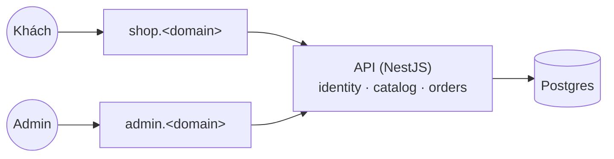
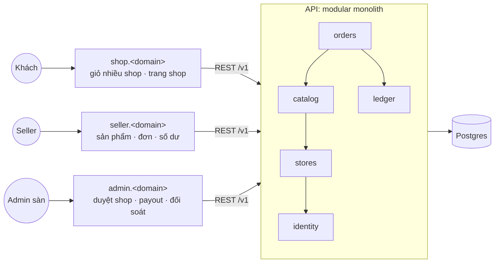
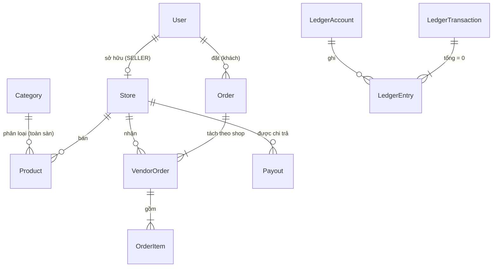

# v2 — Marketplace multi-vendor · Release v2.0.0

- Sprint 8 → 12 · tag `v1.1.0` → `v1.4.0`, kết thúc bằng **`v2.0.0`** (quy ước ở [rule 01](../rules/01-git-branching.md#quy-tắc-đánh-version-semver))
- Tổng ước lượng: **~49 pts · 5 sprint** (khoảng 10 pts/sprint, sẽ chỉnh theo velocity thật của v1)
- Điều kiện bắt đầu: v1 đã phát hành `v1.0.0`, `docs/retro/v1.md` đã có, các sprint dưới đây đã được refine

## Vì sao có version này

PixelMart v1 chỉ là cửa hàng của chính sàn. Bây giờ ta muốn **người bán khác** cũng mở shop trên PixelMart, giống Shopee hay Tiki:

- Một người dùng đăng ký mở shop. Admin sàn duyệt rồi shop mới được bán.
- Mỗi seller chỉ được thấy và sửa **sản phẩm, tồn kho, đơn hàng của shop mình**.
- Khách cho vào giỏ hàng của 3 shop khác nhau, thanh toán **một lần**. Mỗi shop nhận **đơn riêng** của mình để chuẩn bị và giao hàng.
- Sàn thu **hoa hồng** trên mỗi đơn. Tiền của seller được giữ lại cho tới khi khách nhận hàng, sau đó sàn **chi trả** cho seller.

Mỗi yêu cầu này nghe đơn giản nhưng ẩn chứa bài toán khó: **phân quyền theo quyền sở hữu** (seller A sửa sản phẩm của seller B), **chia tiền không lệch một đồng**, **không bán quá tồn kho** khi hai người cùng mua món cuối, và **thay đổi schema trên dữ liệu thật** của v1.

v2 **cố tình không thêm công nghệ hạ tầng nào**. Đây là version để rèn **domain modeling và kiến trúc trong một monolith**. Mọi ranh giới module vẽ ra ở đây sẽ là đường cắt khi tách microservices ở v8.

## Kiến trúc: trước → sau

**Trước (v1):** một shop, một loại người bán.

**Sau (v2):** nhiều shop, ba loại người dùng, modular monolith có ranh giới rõ ràng.

Mũi tên là **chiều phụ thuộc được phép** (kiểm tra trong CI từ S8-01). Không module nào phụ thuộc ngược chiều:
- Catalog cần biết "sản phẩm đã có đơn chưa" → DB bảo vệ bằng FK `Restrict` (S9-01), không import orders.
- Endpoint trang shop (shop + sản phẩm) nằm ở `catalog`, không nằm ở `stores`.
- `ledger` không biết orders. Orders gọi ledger để ghi bút toán. Báo cáo đối soát (S12-04), vốn cần cả dữ liệu đơn lẫn sổ cái, nằm ở `orders`.
- Shop "PixelMart" của v1 được chuyển cho một **tài khoản seller chính hãng** (S8-02). Admin sàn không sở hữu shop và không được mở shop.

Mô hình dữ liệu chính:

## Học xong bạn làm được

1. Thiết kế một **modular monolith**: module có public interface, cấm import chéo vào bên trong module khác, và kiểm tra ranh giới đó tự động trong CI.
2. Cài đặt **phân quyền theo quyền sở hữu** (chống BOLA/IDOR) cho mọi tài nguyên của seller, có test ma trận cho từng endpoint.
3. Viết **migration expand/contract trên dữ liệu thật**: đổi quan hệ Category, thêm chủ sở hữu cho Store, chuyển đơn v1 sang mô hình Order/VendorOrder mà không mất dữ liệu.
4. Mô hình hóa **aggregate Order → VendorOrder**, chia tiền (phí ship, hoa hồng) với quy tắc làm tròn rõ ràng và tổng luôn khớp.
5. **Chống oversell ở tầng DB** bằng update có điều kiện trong transaction, chứng minh bằng test đồng thời.
6. Thiết kế **state machine nhiều tác nhân** (seller xác nhận/giao, khách xác nhận đã nhận).
7. Xây **sổ cái kế toán kép** (double-entry ledger) append-only: số dư luôn được tính từ bút toán, invariant "tổng nợ = tổng có" được kiểm chứng tự động.
8. Áp dụng quy ước **không phá vỡ API trong một version** (deprecate trước, xóa ở `v2.0.0`).

## Kiến thức cần đọc trước

v2 không giới thiệu công nghệ mới, nên không có file knowledge mới. Các khái niệm (modular monolith, BOLA, double-entry ledger…) được giải thích ngay trong từng plan. Nên đọc lại:
- [Plan Sprint 2 v1](../v1/plans/sprint-02.md): mục expand/contract (PXM-15)
- [Plan Sprint 3 v1](../v1/plans/sprint-03.md): update có điều kiện atomic (PXM-23)
- [Plan Sprint 6 v1](../v1/plans/sprint-06.md): idempotency, snapshot, IDOR (PXM-37, PXM-39)
- [Plan Sprint 7 v1](../v1/plans/sprint-07.md): state machine (PXM-40)

## Hạ tầng & chi phí

Giữ nguyên v1 (Render + Vercel + Neon + Sentry, 0đ). Thêm:
- Vercel project thứ ba cho `apps/seller` → `seller.<domain>`.
- `CORS_ORIGINS` của API thêm `https://seller.<domain>`.

## Epics

| Epic | Phạm vi | Sprint |
|---|---|---|
| **Marketplace Foundation** | Modular monolith, role SELLER, đăng ký và duyệt shop, migration Store/Category, seller app | 8 |
| **Seller Catalog** | Sản phẩm và tồn kho theo shop, trang shop, tạm khóa shop | 9 |
| **Multi-vendor Checkout** | Order/VendorOrder, phí ship, hoa hồng, trừ kho atomic, giỏ nhóm theo shop | 10 |
| **Fulfillment** | State machine VendorOrder, seller xử lý đơn, khách xác nhận nhận hàng | 11 |
| **Ledger & Payout** | Sổ cái kép, số dư seller, payout, đối soát | 11–12 |
| **Release v2.0** | Audit phân quyền, xóa API deprecated, release | 12 |

## Lộ trình sprint

| Sprint | Plan | Tag | Sprint Goal | Pts |
|---|---|---|---|---|
| [8](sprints/sprint-08.md) | [plan](plans/sprint-08.md) | v1.1.0 | Nền multi-vendor: ranh giới module, đăng ký và duyệt shop, seller app online | 10 |
| [9](sprints/sprint-09.md) | [plan](plans/sprint-09.md) | v1.2.0 | Seller quản lý sản phẩm và tồn kho của shop mình; khách xem trang shop | 10 |
| [10](sprints/sprint-10.md) | [plan](plans/sprint-10.md) | v1.3.0 | Khách thanh toán giỏ nhiều shop một lần, đơn được tách theo shop, không oversell | 10 |
| [11](sprints/sprint-11.md) | [plan](plans/sprint-11.md) | v1.4.0 | Seller xử lý đơn tới khi khách nhận hàng; mọi khoản tiền được ghi vào sổ cái | 10 |
| [12](sprints/sprint-12.md) | [plan](plans/sprint-12.md) | **v2.0.0** | Seller thấy số dư và được chi trả; hệ thống đối soát khớp; phát hành v2.0.0 | 9 |

Mọi sprint của v2 là **draft**: refine (cập nhật AC, estimate lại theo velocity v1) ở buổi refinement trước khi kéo vào sprint.

## Quy ước tiền trong v2

Áp dụng xuyên suốt, các plan sẽ nhắc lại khi cần:
- Mọi số tiền là **số nguyên đơn vị nhỏ nhất** (`…Minor`), một tiền tệ cho toàn sàn ở v2.
- Tỷ lệ hoa hồng lưu bằng **basis points** (`commissionRateBps`, 1 bps = 0,01%, ví dụ 1000 = 10%).
- Hoa hồng của một VendorOrder = `floor(subtotalMinor × commissionRateBps / 10000)`. Phần lẻ bị làm tròn xuống thuộc về seller. Quy tắc này được ghi trong ADR và có test.
- Hoa hồng tính trên **giá hàng** (subtotal), không tính trên phí ship. Phí ship thuộc về seller.
- Số dư **không bao giờ** được lưu thành một cột rồi `UPDATE`. Số dư = tổng các bút toán trong ledger.

## Ngoài phạm vi

| Không làm ở v2 | Ghi chú |
|---|---|
| Review/rating, tìm kiếm full-text, upload ảnh | Backlog "cân nhắc sau". Search có thể quay lại ở v8 (search service) |
| Hủy đơn, trả hàng, hoàn tiền | Backlog. Cần thêm trạng thái và bút toán đảo trong ledger |
| Nhiều staff cho một shop, phân quyền trong shop | Một seller sở hữu đúng một shop |
| Thanh toán thật, chi trả qua ngân hàng thật | Vẫn dùng `FakePaymentProvider`. Payout chỉ là bút toán + bản ghi |
| Thời gian giữ tiền (hold N ngày) sau khi giao | Tiền chuyển sang available ngay khi VendorOrder `DELIVERED` |
| Phí ship theo cân nặng/khoảng cách | Phí ship cố định cho mỗi VendorOrder |
| Redis, queue, tự host… | v3–v5 theo [lộ trình](../README.md) |

## Exit criteria

- [ ] Mọi ticket sprint 8–12 Done theo [Definition of Done](../rules/06-definition-of-ready-and-done.md)
- [ ] Một người dùng đăng ký mở shop → admin duyệt → seller đăng sản phẩm → khách mua giỏ nhiều shop → từng seller xử lý đơn → khách xác nhận nhận hàng → seller thấy số dư → admin chi trả: chạy được end-to-end trên production
- [ ] Mọi endpoint của seller có test ma trận phân quyền (khách, seller khác shop, seller đúng shop, admin)
- [ ] Test đồng thời: hai khách mua món cuối cùng → đúng một người thành công
- [ ] Báo cáo đối soát: tổng mọi bút toán = 0 và số dư từng seller khớp với lịch sử đơn/payout
- [ ] Kiểm tra ranh giới module chạy trong CI
- [ ] Tag `v2.0.0`, changelog có mục `BREAKING CHANGE` cho các API deprecated đã xóa
- [ ] `docs/retro/v2.md` đã viết

## Mapping Jira

Ticket v2 sẽ được tạo trên Jira ở buổi refinement trước Sprint 8. Khi đó bảng mã tạm `S8-01…S12-06` → key `PXM-…` sẽ được điền ở đây.
