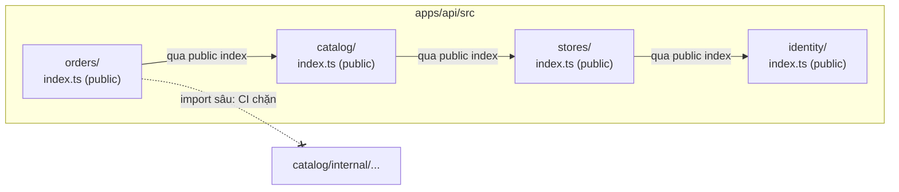
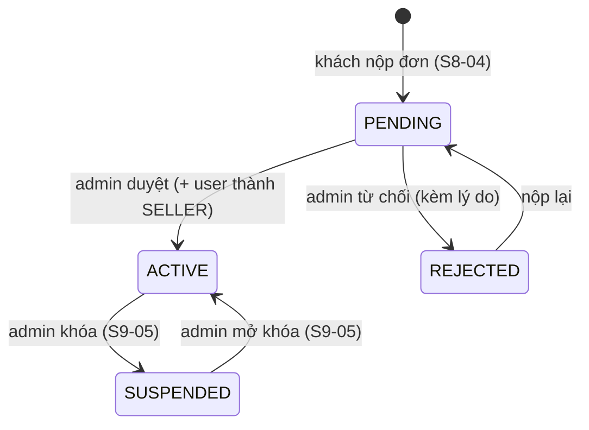

# Plan Sprint 8 — Marketplace Foundation · v1.1.0

> Sprint: [sprint-08.md](../sprints/sprint-08.md) *(draft: refine AC trước khi bắt đầu)* · Tổng quan v2: [README](../README.md)
>
> **Cách dùng plan:** đọc "Khái niệm" → tự làm → kẹt quá 30 phút mới mở Hint 1 → Hint 2 → Hint 3. Tự nghĩ test case trước khi mở đáp án.
>
> 🔒 S8-04 (duyệt shop: đổi role + trạng thái trong một transaction) là business logic: Hint 3 chỉ có pseudo-code.

## 0. Trước khi bắt đầu

- v1 đã phát hành `v1.0.0`. Có dữ liệu thật trên Neon production (sản phẩm, user, đơn).
- **Tạo một Neon branch từ production** để thử mọi migration của sprint này trên dữ liệu thật trước khi merge (Neon branching: https://neon.com/docs/introduction/branching). Đây là "staging của người nghèo" cho tới khi có staging thật ở v7.
- Đọc lại: expand/contract ([plan Sprint 2 v1, PXM-15](../../v1/plans/sprint-02.md)), update có điều kiện ([plan Sprint 3 v1, PXM-23](../../v1/plans/sprint-03.md)).

**Câu hỏi cần trả lời được trước khi code:**
1. Monolith "big ball of mud" khác modular monolith ở điểm nào? Có còn chung database không?
2. RBAC trả lời câu hỏi gì, ownership trả lời câu hỏi gì? Vì sao chỉ có RBAC là không đủ cho marketplace?
3. Vì sao không được sửa một migration đã chạy trên production, và thay vào đó phải làm gì?

## 1. Bức tranh tổng



Luồng mở shop sau sprint này:



## 2. Thứ tự & phụ thuộc

```
S8-01 ranh giới module ──▶ S8-02 role + Store owner ──▶ S8-03 category toàn sàn
                                     └──▶ S8-04 đăng ký/duyệt ──▶ S8-06 admin UI
                                                         └──▶ S8-05 seller app
```

- S8-01 di chuyển nhiều file: merge **sớm**, trước khi ai khác (kể cả chính bạn ở branch khác) sửa API.
- S8-02 và S8-03 là migration trên dữ liệu thật: thử trên Neon branch, ghi kết quả vào mô tả PR.

---

## 3.1 S8-01 · Modular monolith: ranh giới module + kiểm tra trong CI

### Khái niệm cần nắm
- **Modular monolith:** vẫn **một** ứng dụng, **một** lần deploy, **một** database, nhưng code được chia thành module theo **domain** (identity, stores, catalog, orders, ledger). Mỗi module giấu chi tiết bên trong và chỉ lộ ra một **public interface**. Nó cho bạn phần lớn lợi ích "ranh giới rõ ràng" của microservices mà không phải trả giá mạng, triển khai, dữ liệu phân tán.
- **Dependency rule:** module A chỉ được dùng module B qua `B/index.ts`. Mọi import kiểu `../catalog/products/products.repository` từ module khác đều bị cấm. Đổi cấu trúc bên trong một module không làm vỡ module khác.
- **Kiểm tra bằng máy, không bằng thiện chí:** quy ước chỉ ghi trong README sẽ bị vi phạm trong 2 tuần. Một rule trong CI thì không. Công cụ phổ biến: **dependency-cruiser** (rule `forbidden` với group matching `$1`), hoặc ESLint (`eslint-plugin-boundaries`, `no-restricted-imports`).
- **NestJS module ≠ module domain:** Nest `@Module` là đơn vị DI. Module domain là ranh giới **code**. Thường một module domain có một Nest module gốc, export provider cho module khác `imports`. Provider không được export = "nội bộ".
- **Hướng phụ thuộc (bắt buộc, kiểm tra trong CI):** `orders → catalog → stores → identity`, và `orders → ledger` (S11). Orders cần biết sản phẩm, catalog cần biết shop… **Không có chiều ngược lại.** Khi module ở dưới "cần biết" điều gì đó của module ở trên (ví dụ catalog không cho xóa sản phẩm đã có trong đơn), có hai cách đúng:
  - **Để DB bảo vệ:** FK `OrderItem.productId` với `onDelete: Restrict` → xóa sản phẩm đã có đơn thì DB từ chối (`P2003`), catalog map thành 409. Catalog không cần biết orders tồn tại. PixelMart dùng cách này (S9-01).
  - **Dependency inversion:** catalog định nghĩa một interface (port, ví dụ `ProductUsageChecker`) cùng injection token. Orders cung cấp implementation và đăng ký provider. Code catalog chỉ phụ thuộc vào interface của chính nó.
  - **Sai:** catalog import một hàm từ `orders/index.ts`. Dù đi qua public index, đó vẫn là phụ thuộc ngược chiều và tạo vòng (rule `no-circular` sẽ bắt).

### Hướng tiếp cận
1. Vẽ bảng module → trách nhiệm → được phép phụ thuộc vào ai. Đưa vào ADR-0008 (Claude viết ADR theo bảng của bạn).
2. Di chuyển file vào `apps/api/src/<module>/`. Tạo `index.ts` cho mỗi module, chỉ export những thứ module khác cần (Nest module, service public, type).
3. Sửa import trong code cho đi qua `index.ts`. Chạy lại toàn bộ test v1.
4. Cài công cụ kiểm tra (gợi ý: dependency-cruiser), viết rule cấm import sâu chéo module, thêm script `lint:deps` và đưa vào job `ci`.
5. Thử phá: thêm một import sâu → CI phải đỏ với thông báo dễ hiểu.

### File dự kiến tạo/sửa
`apps/api/src/{identity,stores,catalog,orders}/**` (di chuyển), `apps/api/src/*/index.ts`, `apps/api/.dependency-cruiser.cjs` (hoặc cấu hình ESLint tương đương), `apps/api/package.json` (script `lint:deps`), `.github/workflows/ci.yml`, `turbo.json` (task mới nếu cần).

### Tự nghĩ test case trước
Rule của bạn phải **chặn** những gì và **cho phép** những gì? Liệt kê ít nhất 5 trường hợp import.

<details><summary>Đáp án tham khảo</summary>

- `orders/x.ts` import `../catalog` (tức `catalog/index.ts`) → cho phép.
- `orders/x.ts` import `../catalog/products/products.service` → **chặn**.
- `catalog/a.ts` import `./products/b` (trong cùng module) → cho phép.
- `catalog/a.ts` import `../orders` (kể cả qua `index.ts`) → **chặn** (sai hướng phụ thuộc).
- Import type-only (`import type`) sâu chéo module → vẫn nên **chặn** (type nội bộ cũng là chi tiết bên trong).
- `common/` (filter, pipe, helper dùng chung) → mọi module được dùng. `common` **không** được import module domain nào.
- File test của module A import nội bộ module B để dựng dữ liệu → cân nhắc: cho phép trong `test/` hay bắt dùng API public? Quyết định và ghi lại.
</details>

### Gợi ý
<details><summary>Hint 1: hướng đi</summary>

Đừng di chuyển tất cả rồi mới sửa import. Đi từng module, bắt đầu từ module "lá" (không phụ thuộc ai, thường là `identity`), chạy test sau mỗi module.
</details>

<details><summary>Hint 2: khái niệm/API</summary>

- dependency-cruiser: `npx depcruise --init` tạo config. Rule `forbidden` với `from.path: "^src/([^/]+)/"` và `to.path: "^src/[^/]+/.+"`, `to.pathNot: ["^src/$1/", "^src/[^/]+/index\\.ts$", "^src/common/"]`: `$1` là tên module ở phía `from`.
- Bật `tsPreCompilationDeps: true` để bắt cả import type-only. Trỏ `tsConfig` để resolve path alias.
- Chạy: `depcruise src --config .dependency-cruiser.cjs` (exit code ≠ 0 khi vi phạm `error`).
</details>

<details><summary>Hint 3: khung cấu hình (config, được phép có code)</summary>

```js
// apps/api/.dependency-cruiser.cjs (khung — điều chỉnh path theo repo của bạn)
/** @type {import('dependency-cruiser').IConfiguration} */
module.exports = {
  forbidden: [
    {
      name: 'no-deep-import-across-modules',
      comment: 'Module khác chỉ được dùng qua <module>/index.ts',
      severity: 'error',
      from: { path: '^src/([^/]+)/' },
      to: {
        path: '^src/[^/]+/.+',
        pathNot: ['^src/$1/', '^src/[^/]+/index[.]ts$', '^src/common/'],
      },
    },
    {
      name: 'common-is-a-leaf',
      severity: 'error',
      from: { path: '^src/common/' },
      to: { path: '^src/(identity|stores|catalog|orders|ledger)/' },
    },
    { name: 'no-circular', severity: 'error', from: {}, to: { circular: true } },
  ],
  options: {
    tsPreCompilationDeps: true,
    tsConfig: { fileName: 'tsconfig.json' },
    doNotFollow: { path: 'node_modules' },
  },
};
```
Rule hướng phụ thuộc (`orders → catalog → stores → identity`, không chiều ngược) là phần bạn tự viết thêm.
</details>

### Bẫy thường gặp
| Triệu chứng | Nguyên nhân | Cách tránh |
|---|---|---|
| Rule không bắt được gì dù cố tình import sâu | Path trong rule không khớp vì chạy depcruise từ thư mục khác (`src/` vs `apps/api/src/`) | Chạy từ `apps/api`, kiểm tra bằng một vi phạm cố ý |
| Import qua path alias (`@/catalog/...`) lọt qua rule | depcruise không resolve alias | Khai báo `tsConfig` trong options |
| `index.ts` export `*` từ mọi file → ranh giới vô nghĩa | "Barrel" xuất hết mọi thứ | Chỉ export đúng những gì module khác cần, có chủ đích |
| Nest báo `Nest can't resolve dependencies` sau khi tách | Provider không được `exports` từ Nest module của nó, hoặc module kia chưa `imports` | Ranh giới DI phải khớp ranh giới code: export ở module gốc, import ở module dùng |
| Circular dependency giữa hai module, phải dùng `forwardRef` | Thiết kế hai chiều | Đảo chiều phụ thuộc (A cung cấp interface, B gọi), hoặc gộp hai module |
| `common/` phình thành nơi chứa mọi thứ | Không biết đặt ở đâu thì bỏ vào common | `common` chỉ chứa hạ tầng kỹ thuật (filter, pipe, prisma). Logic nghiệp vụ luôn thuộc một module |

### Kiểm chứng AC
- [ ] Thêm `import ... from '../catalog/<file nội bộ>'` trong `orders` → `pnpm --filter api lint:deps` thất bại, CI đỏ, thông báo nêu đúng rule.
- [ ] `pnpm turbo test` → toàn bộ test v1 xanh.
- [ ] ADR-0008 có sơ đồ module và bảng phụ thuộc được phép (bạn cung cấp quyết định, Claude viết).

### Đọc thêm
- Kamil Grzybek, Modular Monolith: A Primer: https://www.kamilgrzybek.com/blog/posts/modular-monolith-primer
- dependency-cruiser rules reference: https://github.com/sverweij/dependency-cruiser/blob/main/doc/rules-reference.md
- NestJS modules (shared modules, exports): https://docs.nestjs.com/modules

---

## 3.2 S8-02 · Role SELLER + chủ sở hữu và trạng thái của Store

### Khái niệm cần nắm
- **Expand/contract trên dữ liệu thật:** cột mới bắt buộc (`ownerId NOT NULL`) không thể thêm thẳng vào bảng đã có dữ liệu. Ba bước trong một hoặc nhiều migration: (1) thêm cột nullable, (2) backfill dữ liệu, (3) thêm ràng buộc NOT NULL/UNIQUE.
- **Sửa SQL migration do Prisma sinh:** `prisma migrate dev --create-only` tạo file SQL mà chưa chạy. Bạn chèn câu `UPDATE` backfill vào giữa, rồi mới chạy. Migration là code: được review như code.
- **Enum trong Postgres:** `ALTER TYPE "Role" ADD VALUE 'SELLER'` có ràng buộc: giá trị mới **không dùng được trong cùng transaction** vừa thêm nó. Prisma chạy mỗi migration trong một transaction, nên tách "thêm giá trị enum" và "dùng giá trị đó (UPDATE/DEFAULT)" ra **hai migration**.
- **Không dựa vào biến môi trường trong migration:** migration chạy ở CI/CD, không có `ADMIN_EMAIL`. Backfill phải tìm admin bằng dữ liệu (`role = 'ADMIN'`). Và phải xử lý trường hợp **DB trống** (môi trường test, local mới): khi đó không có store nào cần backfill.
- **Ai vận hành shop "PixelMart"? (quyết định của v2, ghi vào ADR-0008):** admin **không** được sở hữu shop để bán hàng. Nếu admin là chủ, mọi endpoint seller (yêu cầu role `SELLER`) sẽ không dùng được cho PixelMart, và admin bị "giáng chức" nếu được promote. Cách làm:
  - Migration tạm gán `ownerId` = admin (pha expand, chỉ để thỏa NOT NULL).
  - **Seed** (chạy được nhiều lần, đọc `OFFICIAL_SELLER_EMAIL`/`OFFICIAL_SELLER_PASSWORD` từ env như admin seed ở PXM-24) tạo tài khoản seller chính hãng role `SELLER`, rồi chuyển `ownerId` của store PixelMart sang tài khoản đó.
  - Từ đó PixelMart được vận hành qua `seller.<domain>` như mọi shop khác. Seed là nơi được phép đọc env, migration thì không.
- **Một user một shop:** `ownerId` **unique**. Đây là ràng buộc nghiệp vụ được DB bảo vệ, không chỉ là `if` trong service.
- **Commission bằng basis points:** số nguyên, tránh số thực (`1000` = 10%). Validate trong khoảng `0..10000`.

### Hướng tiếp cận
1. Migration A: thêm `SELLER` vào enum role.
2. Migration B (`--create-only` rồi sửa tay): thêm cột `ownerId` (nullable), `status` (enum mới, default `PENDING`), `commissionRateBps` (default ở DB = `1000`, tức 10%. Đây là **nguồn duy nhất** của giá trị mặc định, admin đổi theo từng shop sau này), `description` → backfill store hiện có: `ownerId` = admin đầu tiên (tạm thời), `status = 'ACTIVE'`, `commissionRateBps = 0` → `ownerId` NOT NULL + UNIQUE.
   - Vì sao contract (NOT NULL/UNIQUE/FK) được làm **ngay trong cùng migration** mà vẫn an toàn: code v1 **không bao giờ insert** `Store` (store duy nhất được tạo bởi seed). Nếu code cũ có ghi bảng này, contract phải đợi tới release sau.
3. Seed: tạo tài khoản seller chính hãng từ env (idempotent), chuyển owner của store PixelMart sang tài khoản đó. Thêm hai biến vào `.env.example` và vào environment production.
4. Cập nhật contracts/response liên quan (chỉ **thêm** field).
5. Chạy migration + seed trên Neon branch có dữ liệu production. Đếm sản phẩm/đơn trước và sau.
6. Viết test integration xác nhận constraint unique `ownerId`.

### File dự kiến tạo/sửa
`apps/api/prisma/schema.prisma`, `apps/api/prisma/migrations/<ts>_add_seller_role/`, `apps/api/prisma/migrations/<ts>_store_owner_status/migration.sql` (sửa tay), `apps/api/prisma/seed.ts` (tài khoản seller chính hãng + chuyển owner), `apps/api/.env.example`, `packages/contracts/src/stores/store.ts`, `apps/api/test/stores-schema.e2e-spec.ts`.

### Tự nghĩ test case trước
Migration có thể hỏng theo những cách nào trên DB thật? Liệt kê trước khi viết.

<details><summary>Đáp án tham khảo</summary>

- DB có dữ liệu v1 → sau migration store "PixelMart" có owner là admin (tạm), `ACTIVE`, `commissionRateBps = 0`. Sau seed → owner là tài khoản seller chính hãng (role `SELLER`). Chạy seed lần hai → không tạo thêm tài khoản, không đổi gì.
- DB trống (CI) → migration vẫn chạy được (không có dòng nào cần backfill).
- DB có store nhưng **không có admin** (dữ liệu bẩn) → migration nên **fail rõ ràng** thay vì gán NULL rồi lỗi khó hiểu ở bước NOT NULL. Quyết định và ghi lại.
- Số lượng product/order trước = sau.
- Insert store thứ hai cùng `ownerId` → lỗi unique (`P2002`).
- `seed` chạy lại sau migration → vẫn idempotent, không tạo store thứ hai cho admin.
- App v1 (code cũ) vẫn chạy được với schema mới trong lúc deploy (cột mới đều có default hoặc nullable trong pha expand).
</details>

### Gợi ý
<details><summary>Hint 1: hướng đi</summary>

Viết migration SQL **bằng tay ra giấy** trước (3 bước expand/backfill/contract), sau đó mới so với file Prisma sinh ra và chèn phần backfill vào.
</details>

<details><summary>Hint 2: khái niệm/API</summary>

- `prisma migrate dev --name store_owner_status --create-only` → sửa `migration.sql` → `prisma migrate dev`.
- Backfill tìm admin: `UPDATE "Store" SET "ownerId" = (SELECT id FROM "User" WHERE role = 'ADMIN' ORDER BY "createdAt" LIMIT 1) WHERE "ownerId" IS NULL;`
- Kiểm tra sau backfill trong chính migration: một câu `DO $$ BEGIN IF EXISTS (SELECT 1 FROM "Store" WHERE "ownerId" IS NULL) THEN RAISE EXCEPTION '...'; END IF; END $$;` để fail sớm với thông báo rõ.
- Tên bảng/cột trong SQL phụ thuộc vào `@@map`/`@map` bạn đã đặt ở v1. Đọc file migration cũ để dùng đúng tên.
</details>

<details><summary>Hint 3: khung migration (SQL migration là code hạ tầng, được phép có khung)</summary>

```sql
-- Migration B (sau khi migration A đã thêm 'SELLER' vào enum role)
-- 1) EXPAND
CREATE TYPE "StoreStatus" AS ENUM ('PENDING', 'ACTIVE', 'SUSPENDED', 'REJECTED');
ALTER TABLE "Store"
  ADD COLUMN "ownerId" TEXT,
  ADD COLUMN "status" "StoreStatus" NOT NULL DEFAULT 'PENDING',
  ADD COLUMN "commissionRateBps" INTEGER NOT NULL DEFAULT 1000,
  ADD COLUMN "description" TEXT;

-- 2) BACKFILL: store của v1 thuộc admin, đang bán, không thu hoa hồng
UPDATE "Store"
SET "ownerId" = (SELECT "id" FROM "User" WHERE "role" = 'ADMIN' ORDER BY "createdAt" LIMIT 1),
    "status" = 'ACTIVE',
    "commissionRateBps" = 0
WHERE "ownerId" IS NULL;

-- (tự viết) fail rõ ràng nếu còn store không có owner

-- 3) CONTRACT
ALTER TABLE "Store" ALTER COLUMN "ownerId" SET NOT NULL;
-- (tự viết) UNIQUE(ownerId), FOREIGN KEY → User, CHECK commissionRateBps BETWEEN 0 AND 10000
```
Tên bảng/cột và kiểu `id` phải khớp schema thật của bạn.
</details>

### Bẫy thường gặp
| Triệu chứng | Nguyên nhân | Cách tránh |
|---|---|---|
| `unsafe use of new value "SELLER" of enum type` | Thêm giá trị enum và dùng nó trong cùng một migration (cùng transaction) | Tách thành hai migration |
| Migration fail ở `SET NOT NULL` với thông báo khó hiểu | Backfill bỏ sót dòng (không có admin) | Kiểm tra tường minh và `RAISE EXCEPTION` có thông điệp |
| Migration chạy được ở local, fail trên production | Local là DB trống/seed, production có dữ liệu khác | Luôn thử trên Neon branch từ production |
| Sửa file migration đã merge để "chữa" | Đổi checksum, các môi trường đã chạy bản cũ sẽ lệch | Tạo migration mới để sửa |
| Code v1 lỗi trong lúc deploy | Pha contract chạy cùng lúc với pha expand khi code cũ vẫn đang chạy | Cột mới có default/nullable. Ràng buộc chặt chỉ thêm khi code mới đã ghi đủ dữ liệu |
| `commissionRateBps` lưu `10.5` | Dùng số thực | `INTEGER` + `CHECK` |

### Kiểm chứng AC
- [ ] Trên Neon branch từ production: `prisma migrate deploy` thành công. Query đếm product/order trước và sau bằng nhau (dán kết quả vào PR).
- [ ] Store "PixelMart": sau migration + seed, owner là tài khoản seller chính hãng, `ACTIVE`, `commissionRateBps = 0`. Đăng nhập tài khoản đó vào `seller.<domain>` được (sau S8-05). Storefront vẫn hiện đủ sản phẩm.
- [ ] Test: tạo store thứ hai cùng `ownerId` → lỗi unique.

### Đọc thêm
- Prisma, customizing migrations: https://www.prisma.io/docs/orm/prisma-migrate/workflows/customizing-migrations
- PostgreSQL `ALTER TYPE` (ghi chú về `ADD VALUE` trong transaction): https://www.postgresql.org/docs/current/sql-altertype.html
- Expand and contract: https://www.prisma.io/dataguide/types/relational/expand-and-contract-pattern

---

## 3.3 S8-03 · Category toàn sàn

### Khái niệm cần nắm
- **Đổi quan hệ có dữ liệu:** `Category` từ "thuộc store" (unique `[storeId, slug]`) thành "toàn sàn" (unique `slug`). Khi gộp, slug của các store khác nhau có thể **trùng nhau**. Ở v2, dữ liệu chỉ có một store nên không trùng, nhưng migration phải **an toàn với trường hợp trùng** (kiểm tra và fail rõ ràng, hoặc tự đổi tên có quy tắc).
- **Deprecate thay vì xóa:** client v1 (web/admin đã deploy) có thể còn đọc `storeId` của category. Giữ field trong response với **kiểu không đổi** (`string`, không thành `string | null`): luôn trả id của store PixelMart. Chỉ **cột trong DB** được phép nullable. Đổi kiểu từ `string` sang `string | null` cũng là phá vỡ API, vì client v1 không xử lý `null`. Đánh dấu `deprecated` trong schema và OpenAPI, xóa ở `v2.0.0` (S12-05).
- **Ai được quản lý category:** chỉ admin sàn. Seller **chọn** category có sẵn cho sản phẩm (S9-01), không tạo mới.

### Hướng tiếp cận
1. Viết câu SQL kiểm tra slug trùng giữa các store, chạy trên Neon branch.
2. Migration: bỏ unique `[storeId, slug]` → thêm unique `slug` → `storeId` thành nullable (pha expand; xóa cột ở contract sau `v2.0.0` nếu muốn).
3. Service category bỏ lọc theo store. Response giữ `storeId` + `.meta({ deprecated: true })` (hoặc cách đánh dấu deprecated mà công cụ OpenAPI của bạn hỗ trợ).
4. Chạy lại test category của v1.

### File dự kiến tạo/sửa
`apps/api/prisma/schema.prisma` + migration, `apps/api/src/catalog/categories.service.ts`, `packages/contracts/src/catalog/category.ts`.

### Tự nghĩ test case trước
<details><summary>Đáp án tham khảo</summary>

- Hai category trùng slug ở hai store (dựng trong test) → migration fail với thông báo liệt kê slug trùng (hoặc xử lý theo quy tắc bạn chọn).
- Sau migration: tạo category trùng slug với category đã có → slug được thêm hậu tố (logic PXM-29 vẫn đúng, giờ là toàn sàn).
- `GET /v1/categories` trả mọi category, vẫn có `storeId`.
- OpenAPI JSON có `deprecated: true` cho `storeId`.
- Seller/khách không tạo được category (401/403).
</details>

### Gợi ý
<details><summary>Hint 1: hướng đi</summary>

Đây là ticket 1 điểm: phần lớn công sức nằm ở việc **chứng minh migration an toàn**, không phải code.
</details>

<details><summary>Hint 2: khái niệm/API</summary>

- Kiểm tra trùng: `SELECT slug, count(*) FROM "Category" GROUP BY slug HAVING count(*) > 1;`
- Zod 4 có `.meta({...})`. Cách nó được phản ánh ra OpenAPI phụ thuộc vào nestjs-zod/cách bạn sinh document: kiểm tra JSON đầu ra.
</details>

<details><summary>Hint 3: khung</summary>

```
migration:
  kiểm tra trùng slug → RAISE EXCEPTION nếu có
  DROP unique(storeId, slug); ADD unique(slug); ALTER storeId DROP NOT NULL
service:
  bỏ điều kiện storeId khi tìm/tạo slug
contract:
  categorySchema.storeId: string() (không nullable, luôn = id store PixelMart) + đánh dấu deprecated
```
</details>

### Bẫy thường gặp
| Triệu chứng | Nguyên nhân | Cách tránh |
|---|---|---|
| Admin web v1 (chưa deploy lại) lỗi khi đọc category | Xóa `storeId` khỏi response | Deprecate trước, xóa ở major |
| Slug suffix logic vẫn tìm theo `storeId` | Quên cập nhật service | Test tạo trùng slug sau migration |
| Thêm unique `slug` fail trên production | Có dữ liệu trùng mà local không có | Chạy câu kiểm tra trên Neon branch trước |

### Kiểm chứng AC
- [ ] Migration chạy trên Neon branch từ production, không lỗi trùng slug.
- [ ] Test category của v1 vẫn xanh (không phá vỡ client).
- [ ] `openapi.json` đánh dấu `storeId` deprecated.

### Đọc thêm
- OpenAPI, deprecated fields: https://spec.openapis.org/oas/v3.1.0#fixed-fields-19
- Zod 4 metadata: https://zod.dev/metadata

---

## 3.4 S8-04 · Đăng ký mở shop

### Khái niệm cần nắm
- **Workflow có trạng thái:** đơn mở shop là một state machine nhỏ (mục 1). Mọi chuyển trạng thái dùng **update có điều kiện** như PXM-40: `UPDATE … SET status='ACTIVE' WHERE id=? AND status='PENDING'`, kiểm tra số dòng bị ảnh hưởng.
- **Hai thay đổi, một transaction:** duyệt = (Store `PENDING → ACTIVE`) **và** (User `CUSTOMER → SELLER`). Nếu chỉ một nửa thành công, hệ thống rơi vào trạng thái vô lý (shop active mà chủ không phải seller). Cả hai nằm trong một transaction.
- **Role trong JWT bị "cũ":** access token đang cầm vẫn ghi `role: CUSTOMER` cho tới khi hết hạn. Lần refresh tiếp theo phải lấy role **từ DB**, không copy role từ token cũ. Kiểm tra lại code refresh của PXM-23.
- **Phân quyền theo ownership từ ngày đầu:** `GET /v1/seller/store` trả shop của **người đang đăng nhập**, không nhận `storeId` từ URL. Không có id thì không có IDOR.
- **Ranh giới module:** duyệt shop thuộc module `stores`, nhưng đổi role thuộc `identity`. `stores` gọi một hàm **public** của `identity` (ví dụ `promoteToSeller(userId, tx)`), không tự update bảng User.
- **Promote có điều kiện:** với một enum role duy nhất, "promote" một ADMIN thành SELLER là **giáng chức**. `promoteToSeller` chỉ đổi khi `role = CUSTOMER` (update có điều kiện, `count = 0` → lỗi). Và ngay từ bước nộp đơn: **ADMIN không được mở shop** (403), vì admin sàn đồng thời bán hàng là xung đột lợi ích. PixelMart dùng tài khoản seller chính hãng (S8-02).
- **Lưu kết quả duyệt:** cần cột mới cho Store: `rejectionReason`, `reviewedAt`, `reviewedBy` (→ User). S8-02 chưa có các cột này, nên ticket này có **migration riêng**.

### Hướng tiếp cận
0. Migration: thêm `rejectionReason` (nullable), `reviewedAt`, `reviewedBy` vào Store.
1. Contract: `createStoreApplicationSchema` (tên, mô tả), `storeSchema` (phía seller), `adminStoreSchema`, `rejectStoreSchema` (lý do bắt buộc).
2. `POST /v1/seller/applications`: đăng nhập bắt buộc, role `ADMIN` → 403. Đã có store `PENDING`/`ACTIVE`/`SUSPENDED` → 409. Có store `REJECTED` → cho nộp lại (cập nhật store đó về `PENDING`, hoặc tạo mới: quyết định và ghi lại). Slug sinh bằng `slugify` (PXM-29).
3. `GET /v1/seller/store`: shop của mình + trạng thái + lý do từ chối.
4. Admin: list theo trạng thái, approve, reject (xem pseudo-code).
5. `identity` export hàm đổi role nhận transaction client từ nơi gọi.
6. Kiểm tra refresh token lấy role từ DB.
7. Test: ma trận phân quyền, 409, đồng thời.

### File dự kiến tạo/sửa
`apps/api/prisma/schema.prisma` + migration (cột duyệt), `packages/contracts/src/stores/*.ts`, `apps/api/src/stores/{stores.module.ts,index.ts,seller-store.controller.ts,admin-stores.controller.ts,store-applications.service.ts}`, `apps/api/src/identity/{index.ts,users.service.ts}`, `apps/api/test/store-applications.e2e-spec.ts`.

### Tự nghĩ test case trước
Ít nhất 10 case, gồm phân quyền, trạng thái và đồng thời.

<details><summary>Đáp án tham khảo</summary>

1. Khách nộp đơn → 201, store `PENDING`, user vẫn `CUSTOMER`.
2. Nộp lần hai khi đang `PENDING` → 409.
3. Chưa đăng nhập → 401.
4. Admin duyệt → store `ACTIVE`, user `SELLER` (kiểm tra cả hai trong DB).
5. Duyệt store đã `ACTIVE` → 409. Từ chối store `ACTIVE` → 409.
6. Hai admin duyệt cùng lúc (`Promise.all`) → một 200, một 409.
7. Làm bước đổi role thất bại (trong test: stub `promoteToSeller` cho nó throw, hoặc dựng sẵn chủ đơn có role `ADMIN` để điều kiện `role = CUSTOMER` không khớp) → store **vẫn** `PENDING` (rollback).
7b. Tài khoản ADMIN nộp đơn mở shop → 403.
8. Sau duyệt: gọi `/v1/auth/refresh` → access token mới có `role: SELLER`.
9. Từ chối không có lý do → 400. Từ chối có lý do → `REJECTED`, seller thấy lý do qua `GET /v1/seller/store`.
10. Bị từ chối rồi nộp lại → được (theo quyết định của bạn).
11. Khách/seller gọi endpoint admin → 403.
12. Tên shop trùng → slug có hậu tố.
</details>

### Gợi ý
<details><summary>Hint 1: hướng đi</summary>

Viết test 4, 6, 7 trước: chúng ép bạn làm đúng transaction và update có điều kiện. Các case còn lại sẽ đi theo.
</details>

<details><summary>Hint 2: khái niệm/API</summary>

- `prisma.$transaction(async (tx) => …)`: truyền `tx` vào hàm public của `identity` để cùng transaction.
- `tx.store.updateMany({ where: { id, status: 'PENDING' }, data: { status: 'ACTIVE' } })` → `{ count }`.
- Nhớ bài học PXM-23: **đừng throw** sau khi đã làm việc cần giữ lại. Ở đây thì ngược lại: muốn rollback cả hai thì throw bên trong transaction là đúng.
</details>

<details><summary>Hint 3: pseudo-code</summary>

```
approveStore(storeId, adminId):
  transaction(tx):
    n = tx.store.updateMany(where { id: storeId, status: PENDING }, data { status: ACTIVE, reviewedAt: now, reviewedBy: adminId }).count
    if n == 0:
      store = tx.store.find(storeId)
      throw store ? Conflict("Shop không ở trạng thái chờ duyệt") : NotFound
    store = tx.store.find(storeId)              // đọc lại sau khi đã cập nhật
    identity.promoteToSeller(store.ownerId, tx) // chỉ CUSTOMER → SELLER; không khớp thì ném lỗi → rollback cả store
  return toAdminStoreResponse(store)

promoteToSeller(userId, tx):                   // trong identity
  n = tx.user.updateMany(where { id: userId, role: CUSTOMER }, data { role: SELLER }).count
  if n == 0: throw Conflict("Tài khoản không thể trở thành seller")

applyForStore(userId, input):
  existing = store theo ownerId = userId
  if existing and existing.status in [PENDING, ACTIVE, SUSPENDED]: throw Conflict
  if existing and existing.status == REJECTED: cập nhật existing về PENDING với dữ liệu mới  (hoặc chính sách bạn chọn)
  else: tạo store PENDING (slug duy nhất)
```
</details>

### Bẫy thường gặp
| Triệu chứng | Nguyên nhân | Cách tránh |
|---|---|---|
| Shop `ACTIVE` nhưng chủ vẫn là `CUSTOMER` | Hai update không cùng transaction | Một transaction, truyền `tx` qua module |
| Seller mới duyệt vẫn bị 403 trên seller app cả 15 phút | Refresh copy role từ token cũ | Refresh đọc role từ DB |
| Hai admin duyệt cùng lúc đều thành công | Đọc trạng thái rồi mới ghi | Update có điều kiện + kiểm tra `count` |
| `stores` import thẳng `identity/users.repository` | Vi phạm ranh giới module (S8-01) | Gọi hàm public trong `identity/index.ts` |
| Khách đoán `storeId` để xem đơn mở shop của người khác | Endpoint nhận id từ URL | Endpoint phía seller luôn lấy theo user hiện tại |

### Kiểm chứng AC
- [ ] Test: đã có shop `PENDING`/`ACTIVE` mà nộp lại → 409.
- [ ] Test: duyệt shop không `PENDING` → 409. Test đồng thời: đúng một thành công.
- [ ] Test: sau duyệt, refresh → token có `role: SELLER`.
- [ ] Test ma trận 401/403 cho endpoint admin.
- [ ] Test: khách B gọi `GET /v1/seller/store` chỉ thấy shop/đơn của chính B (không có endpoint nào nhận id đơn của người khác). ADMIN nộp đơn → 403.

### Đọc thêm
- OWASP API Security, API1 BOLA và API5 Broken Function Level Authorization: https://owasp.org/API-Security/editions/2023/en/0x11-t10/
- Prisma interactive transactions: https://www.prisma.io/docs/orm/prisma-client/queries/transactions#interactive-transactions

---

## 3.5 S8-05 · Seller app skeleton + deploy + route guard

### Khái niệm cần nắm
- **Lần thứ hai làm một SPA:** `apps/admin` đã có toàn bộ pattern (TanStack Router file-based, Query, guard bằng `beforeLoad`, deploy Vercel, SPA rewrite). Theo [rule 05](../../rules/05-working-with-claude.md), lần thứ hai bạn vẫn nên tự dựng, nhưng **có ý thức** về những gì đang bị lặp lại.
- **Tách package UI dùng chung (cân nhắc):** layout, `DataTable`, form field, hook `useMe`, cấu hình api-client xuất hiện ở cả admin và seller. Một `packages/ui` nội bộ giảm lặp. Nhưng tách sớm quá thì package dùng chung bị kéo theo nhu cầu của từng app. Quy tắc "lần thứ 3 mới trừu tượng hóa": lần này có thể chỉ tách những thứ **chắc chắn giống nhau** (component shadcn, theme).
- **Tailwind với package dùng chung:** Tailwind chỉ sinh CSS cho class nó **thấy** trong các file được quét. Component nằm trong `packages/ui` phải được khai báo cho Tailwind của từng app (Tailwind v4: directive `@source`).
- **Guard nhiều trạng thái:** không chỉ "có quyền / không có quyền". Seller app có ít nhất 4 trạng thái: chưa đăng nhập, khách chưa có shop, shop `PENDING`/`REJECTED`, shop `ACTIVE`/`SUSPENDED`.

### Hướng tiếp cận
1. Tạo `apps/seller` theo cấu trúc admin (Vite, router plugin, Query, Tailwind, shadcn, ESLint/tsconfig kế thừa `packages/config`).
2. (Tùy chọn) Tách `packages/ui` cho component shadcn + theme dùng chung với admin.
3. `beforeLoad` ở layout `_authed`: `/v1/me` → 401 thì về `/login`. Gọi `/v1/seller/store` → phân nhánh: không có shop → `/apply`, `PENDING`/`REJECTED` → `/status`, `ACTIVE`/`SUSPENDED` → cho vào (SUSPENDED hiển thị banner ở S9-05).
4. Trang `/apply` dùng form gọi `POST /v1/seller/applications` (S8-04).
5. Vercel project thứ ba, Root Directory `apps/seller`, rewrite SPA, domain `seller.<domain>`. Thêm origin vào `CORS_ORIGINS` (API) và đảm bảo cookie `Domain` gốc vẫn dùng được.

### File dự kiến tạo/sửa
`apps/seller/**` (cấu trúc như `apps/admin`), `apps/seller/vercel.json`, (tùy chọn) `packages/ui/**`, `apps/api/.env.example` (`CORS_ORIGINS`), README (Claude cập nhật).

### Tự nghĩ test case trước
<details><summary>Đáp án tham khảo</summary>

- Chưa đăng nhập → `/login?redirect=…`.
- Khách đăng nhập, chưa có shop → `/apply`. Nộp đơn → `/status` "Đang chờ duyệt".
- Shop bị từ chối → `/status` hiển thị lý do + nút nộp lại.
- Admin duyệt → seller reload (sau refresh token) → vào dashboard.
- Admin mở seller app → trang "Tài khoản quản trị không thể mở shop" (S8-04 trả 403 cho admin).
- Shop vừa được duyệt nhưng token vẫn mang role `CUSTOMER` → guard tự gọi refresh rồi vào dashboard (không kẹt ở 403).
- Reload `/products` trên `seller.<domain>` → không 404.
- Cookie đăng nhập dùng chung giữa `shop.`, `admin.`, `seller.`: đăng nhập ở shop rồi mở seller → đã đăng nhập.
</details>

### Gợi ý
<details><summary>Hint 1: hướng đi</summary>

Copy cấu trúc thư mục của admin là chấp nhận được, nhưng **đọc lại từng file** khi copy và xóa những gì seller không cần. Ghi lại danh sách những thứ bị lặp: đó là input cho quyết định tách `packages/ui`.
</details>

<details><summary>Hint 2: khái niệm/API</summary>

- Tailwind v4: trong CSS của app, `@source "../../../packages/ui/src";` để quét class của package.
- Router: một route `beforeLoad` có thể `throw redirect({ to: '/apply' })` theo kết quả query.
- `CORS_ORIGINS` là danh sách. Thêm `https://seller.<domain>` cho production, `http://localhost:5174` (cổng dev của seller) cho local.
</details>

<details><summary>Hint 3: khung</summary>

```
_authed.beforeLoad({ context, location }):
  me = ensure(meQuery)                        // 401 → redirect /login?redirect=location.href
  store = ensure(myStoreQuery)                // 404 → redirect /apply
  if store.status in [PENDING, REJECTED]: redirect /status
  if store.status == ACTIVE and me.role != SELLER:      // vừa được duyệt, token còn role cũ
    await refreshSession(); invalidate(meQuery); me = ensure(meQuery)
  return { me, store }                        // ACTIVE | SUSPENDED → vào app
```
</details>

### Bẫy thường gặp
| Triệu chứng | Nguyên nhân | Cách tránh |
|---|---|---|
| Component từ `packages/ui` hiển thị không có style | Tailwind không quét package | `@source` tới thư mục package |
| Seller app gọi API bị lỗi CORS trên production | Chưa thêm origin, hoặc thêm có `/` ở cuối | Cập nhật `CORS_ORIGINS`, chuẩn hóa origin |
| Hai dev server tranh cùng cổng 5173 | Admin và seller cùng mặc định | Đặt `server.port` riêng cho seller |
| Vừa được duyệt nhưng seller app vẫn ở `/status` | Query `myStore` đang cache | Invalidate khi trang `/status` được mở lại, hoặc refetch on focus |
| `packages/ui` dần chứa logic riêng của admin | Trừu tượng hóa quá sớm | Chỉ đưa vào những gì cả hai app dùng y hệt |

### Kiểm chứng AC
- [ ] `seller.<domain>` online. Reload route con không 404.
- [ ] Khách chưa có shop → trang đăng ký mở shop.
- [ ] Shop `PENDING` → "Đang chờ duyệt". Seller `ACTIVE` → dashboard.

### Đọc thêm
- TanStack Router, authenticated routes: https://tanstack.com/router/latest/docs/framework/react/guide/authenticated-routes
- Tailwind CSS v4, detecting classes in source files (`@source`): https://tailwindcss.com/docs/detecting-classes-in-source-files
- Turborepo, internal packages: https://turborepo.com/docs/core-concepts/internal-packages

---

## 3.6 S8-06 · Admin duyệt shop

### Khái niệm cần nắm
- **Lần thứ hai làm bảng có hành động:** pattern giống PXM-40 (bảng đơn + nút xác nhận). Áp dụng lại: lọc trạng thái trên URL, nút disable khi pending, invalidate sau mutation, map 409 thành thông báo.
- **Hành động phá hủy cần xác nhận và lý do:** từ chối là quyết định ảnh hưởng tới người khác. Dialog bắt buộc nhập lý do, lý do được lưu và hiển thị cho seller.

### Hướng tiếp cận
1. `apps/admin/src/features/stores/`: query list theo status, mutation approve/reject.
2. Route `/stores` với `validateSearch` (`status`, `page`).
3. Dialog từ chối có textarea bắt buộc (schema `rejectStoreSchema` từ contracts).

### File dự kiến tạo/sửa
`apps/admin/src/features/stores/**`, `apps/admin/src/routes/_authed/stores.tsx`, sidebar admin.

### Tự nghĩ test case trước
<details><summary>Đáp án tham khảo</summary>

- Lọc `PENDING` → chỉ đơn chờ duyệt. URL giữ trạng thái lọc khi reload.
- Duyệt → dòng biến khỏi danh sách `PENDING`.
- Từ chối không nhập lý do → nút xác nhận bị khóa / lỗi field.
- Hai tab cùng duyệt một shop → tab thứ hai thấy thông báo "Shop đã được xử lý", danh sách tự cập nhật.
</details>

### Gợi ý
<details><summary>Hint 1: hướng đi</summary>

Mở lại code PXM-40 và PXM-31 của bạn. Ticket này gần như là ghép hai pattern đó.
</details>

<details><summary>Hint 2: khái niệm/API</summary>

`onError` của mutation: `ApiError.status === 409` → toast + `queryClient.invalidateQueries({ queryKey: ['admin', 'stores'] })` (TanStack Query v5 nhận object).
</details>

<details><summary>Hint 3: khung</summary>

```
routes/_authed/stores.tsx
  validateSearch: { status: StoreStatus = PENDING, page: 1 }
  loader: ensure(adminStoresQuery(search))
  <StoresTable rows onApprove onReject/>
  <RejectDialog schema=rejectStoreSchema/>
```
</details>

### Bẫy thường gặp
| Triệu chứng | Nguyên nhân | Cách tránh |
|---|---|---|
| Duyệt xong danh sách không đổi | Query key không gồm `status`/`page`, invalidate sai key | Key factory chung, invalidate theo prefix `['admin','stores']` |
| Lý do từ chối bị mất | Không gửi lên API hoặc API không lưu | Schema bắt buộc ở cả form và API |

### Kiểm chứng AC
- [ ] Duyệt → shop biến khỏi danh sách `PENDING`, seller vào được `seller.<domain>`.
- [ ] 409 (đã được xử lý) → thông báo dễ hiểu.

### Đọc thêm
- TanStack Query, query keys: https://tanstack.com/query/latest/docs/framework/react/guides/query-keys

---

## 4. Tự kiểm tra cuối sprint

1. Modular monolith khác microservices ở điểm nào? Khi nào một module nên được tách thành service?
<details><summary>Gợi ý</summary>

Cùng process, cùng deploy, cùng database, gọi nhau bằng hàm thay vì mạng. Tách khi có lý do cụ thể: cần scale độc lập, team riêng cần deploy độc lập, công nghệ khác biệt, hoặc yêu cầu cô lập lỗi. Ranh giới module tốt làm việc tách sau này rẻ hơn nhiều.
</details>

2. Vì sao ranh giới module phải được kiểm tra trong CI thay vì chỉ ghi trong tài liệu?
<details><summary>Gợi ý</summary>

Quy ước không có máy kiểm tra sẽ bị vi phạm dần dần (vội, người mới, auto-import của editor). CI biến quy ước thành luật, và thông báo lỗi dạy luôn người vi phạm.
</details>

3. Giải thích 3 bước expand/contract khi thêm `ownerId NOT NULL` vào bảng đã có dữ liệu.
<details><summary>Gợi ý</summary>

Thêm cột nullable → backfill mọi dòng → thêm NOT NULL/UNIQUE/FK. Code cũ vẫn chạy được ở mọi thời điểm vì cột mới chưa bắt buộc cho tới khi đã có dữ liệu.
</details>

4. Vì sao thêm giá trị enum và dùng nó phải nằm ở hai migration?
<details><summary>Gợi ý</summary>

Postgres không cho dùng giá trị enum vừa thêm trong cùng transaction chưa commit. Prisma chạy mỗi migration trong một transaction.
</details>

5. RBAC và ownership khác nhau thế nào? Cho ví dụ cụ thể trong PixelMart.
<details><summary>Gợi ý</summary>

RBAC: "bạn là SELLER nên được gọi `/v1/seller/products`". Ownership: "nhưng chỉ được sửa sản phẩm thuộc shop của bạn". Thiếu ownership thì mọi seller sửa được sản phẩm của nhau (BOLA).
</details>

6. Sau khi admin duyệt, vì sao seller có thể vẫn bị 403 trong vài phút, và sửa thế nào?
<details><summary>Gợi ý</summary>

Access token vẫn mang role cũ tới khi hết hạn. Refresh phải đọc role từ DB. Có thể chủ động gọi refresh khi trang "đang chờ duyệt" phát hiện shop đã `ACTIVE`.
</details>

7. Vì sao duyệt shop phải đổi role user trong cùng transaction?
<details><summary>Gợi ý</summary>

Nếu tách ra, một bước thất bại sẽ để hệ thống ở trạng thái không nhất quán (shop active nhưng chủ không có quyền seller, hoặc ngược lại), và không có cơ chế tự sửa.
</details>

## 5. Kịch bản demo

1. Mở PR thử import sâu chéo module → CI đỏ với thông báo rule.
2. Trình bày kết quả migration trên Neon branch (số liệu trước/sau).
3. Một tài khoản khách → `seller.<domain>` → đăng ký mở shop → "Đang chờ duyệt".
4. Admin → `/stores` → từ chối kèm lý do → seller thấy lý do → nộp lại → admin duyệt.
5. Seller reload → vào dashboard. Token mới có `role: SELLER`.
6. Hai tab admin cùng duyệt một shop → một tab nhận thông báo đã được xử lý.
