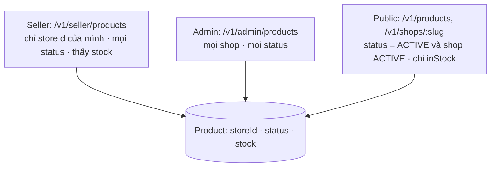

# Plan Sprint 9 — Seller Catalog · v1.2.0

> Sprint: [sprint-09.md](../sprints/sprint-09.md) *(draft: refine AC trước khi bắt đầu)* · Tổng quan v2: [README](../README.md)
>
> **Cách dùng plan:** đọc "Khái niệm" → tự làm → kẹt quá 30 phút mới mở Hint 1 → Hint 2 → Hint 3. Tự nghĩ test case trước khi mở đáp án.
>
> 🔒 S9-01 là phần phân quyền theo quyền sở hữu: Hint 3 chỉ có pseudo-code. PR của S9-01 và S9-05 chạy `/security-review`.

## 0. Trước khi bắt đầu

- Sprint 8 xong: có seller `ACTIVE` thật trên production (tạo một tài khoản seller thử nghiệm), ranh giới module chạy trong CI.
- Đọc trước:
  - OWASP API1:2023 Broken Object Level Authorization: https://owasp.org/API-Security/editions/2023/en/0xa1-broken-object-level-authorization/
  - OWASP API3:2023 Broken Object Property Level Authorization (lộ field nhạy cảm): https://owasp.org/API-Security/editions/2023/en/0xa3-broken-object-property-level-authorization/
- Ôn lại [plan Sprint 6 v1, PXM-39](../../v1/plans/sprint-06.md) (IDOR → 404) và [plan Sprint 5 v1, PXM-32](../../v1/plans/sprint-05.md) (bảng sản phẩm phân trang).

## 1. Bức tranh tổng

Ba "góc nhìn" lên cùng một bảng `Product`, mỗi góc có quy tắc riêng:



Sản phẩm hiển thị với khách khi và chỉ khi **cả hai** tầng cho phép:

| Shop \ Sản phẩm | DRAFT | ACTIVE | ARCHIVED |
|---|---|---|---|
| ACTIVE | ẩn | **hiện** | ẩn |
| SUSPENDED | ẩn | ẩn | ẩn |
| PENDING / REJECTED | ẩn | ẩn | ẩn |

## 2. Thứ tự & phụ thuộc

```
S9-01 seller product API ──▶ S9-03 public catalog ──▶ S9-04 trang shop (web)
          │                          └──▶ S9-05 khóa shop
          └──▶ S9-02 seller UI
```

- Viết **test ma trận phân quyền** của S9-01 trước mọi dòng code. Đây là tài sản dùng lại tới cuối v2 (S12-05).
- S9-02 là lần thứ hai làm bảng sản phẩm. Theo [rule 05](../../rules/05-working-with-claude.md), có thể giao Claude dựng khung UI rồi bạn review từng dòng.

---

## 3.1 S9-01 · API sản phẩm của seller (scoped theo shop)

### Khái niệm cần nắm
- **BOLA (Broken Object Level Authorization):** lỗ hổng số 1 trong OWASP API Top 10. Endpoint kiểm tra "bạn có phải seller không" (RBAC) nhưng quên kiểm tra "sản phẩm này có thuộc shop của bạn không" (ownership). Kẻ tấn công chỉ cần đổi id trong URL.
- **Scoping thay vì kiểm tra sau:** cách an toàn nhất là **mọi truy vấn của seller đều kèm điều kiện `storeId = <shop của người đang đăng nhập>`** ngay trong `where`. Không có nhánh "lấy ra rồi mới kiểm tra quyền". Không tìm thấy → 404 (giống PXM-39: không lộ sự tồn tại).
- **Lấy `storeId` từ đâu:** từ user đang đăng nhập (một lần tra DB, hoặc đưa `storeId` vào context của request qua guard). **Không bao giờ** từ body/query/URL. Body có `storeId` → schema strip nó đi (mass assignment).
- **Một chỗ duy nhất định nghĩa "shop của tôi":** một guard/decorator (ví dụ `@CurrentStore()`) resolve shop của seller, kiểm tra shop `ACTIVE` khi ghi, và gắn vào request. Controller seller nào cũng dùng nó → không ai quên.
- **Trạng thái sản phẩm + tồn kho:** `status` (`DRAFT | ACTIVE | ARCHIVED`) và `stock` (int ≥ 0). Xóa sản phẩm đã từng nằm trong đơn: v1 dùng `SetNull` trên `OrderItem.productId`, nên xóa cứng vẫn giữ được snapshot, nhưng seller mất lịch sử bán. v2 chọn: **đổi FK sang `onDelete: Restrict`** (migration). Xóa sản phẩm đã có đơn → DB từ chối (`P2003`) → 409 "hãy ngừng bán (ARCHIVED)". Nhờ vậy catalog **không cần hỏi module orders** (giữ đúng chiều phụ thuộc của S8-01), và không có race giữa "đếm đơn" và "xóa".
- **Endpoint admin cũ:** `/v1/admin/products` của v1 vẫn dùng cho admin, nay xem được mọi shop. Hai controller dùng chung service, khác nhau ở **scope** được truyền vào. Contract admin **phải thêm `status` và `stock`** (form admin cập nhật ở S9-02). Nếu không, sản phẩm admin tạo sau S9 sẽ mặc định `DRAFT`, `stock = 0`, tức là ẩn và không mua được.

### Hướng tiếp cận
1. Viết test ma trận (xem đáp án tham khảo) cho 5 endpoint × 5 vai trò.
2. Migration: `Product.stock` (int, default 0, `CHECK stock >= 0`), `Product.status` (enum, default `DRAFT`). Sản phẩm v1 hiện có → backfill `ACTIVE` và một giá trị `stock` hợp lý (ví dụ 100, ghi trong mô tả PR).
3. Guard/decorator `CurrentStore`: từ `req.user.id` → store của user. Không có store → 403. Với method ghi: store phải `ACTIVE`, nếu không → 403 kèm lý do `STORE_SUSPENDED`. (Shop `PENDING`/`REJECTED` không tới được bước này: chủ shop khi đó vẫn là `CUSTOMER` và bị chặn ở bước kiểm tra role.)
4. `SellerProductsController` + service nhận `scope = { storeId }`. Mọi `findFirst/updateMany/deleteMany` có `storeId` trong `where`.
5. Contract: `sellerProductSchema` (có `stock`, `status`), create/update schema **không có** `storeId`.
6. Xóa: đã có `OrderItem` tham chiếu → 409 kèm gợi ý "hãy ngừng bán (ARCHIVED)".

### File dự kiến tạo/sửa
`apps/api/prisma/schema.prisma` + migration, `packages/contracts/src/catalog/seller-product.ts`, `apps/api/src/stores/{current-store.guard.ts,current-store.decorator.ts,index.ts}`, `apps/api/src/catalog/{seller-products.controller.ts,products.service.ts}`, `apps/api/test/seller-products.e2e-spec.ts`.

### Tự nghĩ test case trước
Lập ma trận: vai trò (không token / khách / seller A / seller B / admin) × hành động (list, get, create, update, delete). Điền kết quả mong đợi trước khi mở đáp án.

<details><summary>Đáp án tham khảo</summary>

| | list | get(sp của A) | create | update(sp của A) | delete(sp của A) |
|---|---|---|---|---|---|
| Không token | 401 | 401 | 401 | 401 | 401 |
| Khách | 403 | 403 | 403 | 403 | 403 |
| Seller A | 200 (chỉ của A) | 200 | 201 (thuộc A) | 200 | 204/409 |
| Seller B | 200 (chỉ của B) | **404** | 201 (thuộc B) | **404** | **404** |
| Admin (không có shop) | 403 | 403 | 403 | 403 | 403 |

Thêm:
- Seller A gửi `storeId` của B trong body khi tạo → sản phẩm thuộc A.
- Shop của A bị `SUSPENDED` → create/update → 403 với lý do. List/get vẫn được (để seller xem).
- `stock: -1`, `stock: 1.5` → 400. Cập nhật đồng thời làm stock âm → DB `CHECK` chặn.
- Xóa sản phẩm đã có trong đơn → 409. Chưa có đơn → 204.
- Response seller có `stock`, `status`. Không có `ownerId` hay field nội bộ khác.
</details>

### Gợi ý
<details><summary>Hint 1: hướng đi</summary>

Viết test ma trận bằng `it.each` trên bảng ở trên. Chạy, thấy đỏ hết. Rồi cài đặt guard `CurrentStore` trước, vì nó làm xanh cùng lúc cả cột "Khách" và "Admin".
</details>

<details><summary>Hint 2: khái niệm/API</summary>

- `createParamDecorator` để lấy store đã resolve từ request. Guard chạy trước, gắn `req.store`.
- `updateMany({ where: { id, storeId }, data })` → `count === 0` → 404. Dùng `findFirst({ where: { id, storeId } })` cho get.
- Đổi FK `OrderItem.productId` sang `onDelete: Restrict` (migration). Khi xóa, bắt `P2003` → 409. **Đừng** gọi sang module `orders` để đếm đơn: đó là phụ thuộc ngược chiều (catalog → orders) tạo vòng với orders → catalog.
- `CHECK` constraint trong Postgres thêm bằng SQL trong migration (`--create-only`).
</details>

<details><summary>Hint 3: pseudo-code</summary>

```
CurrentStoreGuard.canActivate(ctx):
  user = req.user                              // JwtAuthGuard đã chạy
  if user.role != SELLER: throw 403
  store = stores.findByOwner(user.id)          // public API của module stores
  if !store: throw 403
  if method là ghi and store.status != ACTIVE: throw 403 { code: "STORE_" + store.status }
  req.store = { id: store.id, status: store.status }
  return true

SellerProductsService.update(scope, productId, input):
  n = db.product.updateMany(where { id: productId, storeId: scope.storeId }, data: pick(input, ALLOWED_FIELDS)).count
  if n == 0: throw NotFound
  return findFirst(where { id: productId, storeId: scope.storeId })
```
</details>

### Bẫy thường gặp
| Triệu chứng | Nguyên nhân | Cách tránh |
|---|---|---|
| Seller B sửa được sản phẩm của A | `update({ where: { id } })` không có `storeId` | Luôn scope trong `where`, test ma trận |
| Seller B nhận 403 thay vì 404 cho sản phẩm của A | "Lấy ra rồi kiểm tra quyền" | Query có scope → không thấy → 404 |
| Seller gửi `storeId` trong body và đổi được chủ sản phẩm | Truyền nguyên body vào Prisma | Schema không có `storeId`, map field tường minh |
| Một controller seller mới quên kiểm tra ownership | Kiểm tra rải rác trong từng handler | Một guard dùng chung cho mọi route `/v1/seller/*` |
| `stock` âm khi hai request cập nhật đồng thời | Chỉ validate ở Zod | `CHECK (stock >= 0)` ở DB |
| Sản phẩm v1 biến mất khỏi shop sau migration | Default `DRAFT` áp cho dữ liệu cũ | Backfill `ACTIVE` cho sản phẩm hiện có |

### Kiểm chứng AC
- [ ] Test ma trận xanh, đặc biệt các ô seller B → **404**.
- [ ] Test: `storeId` trong body bị bỏ qua.
- [ ] Test: shop không `ACTIVE` → không tạo/sửa được (403 có lý do).
- [ ] Test: `stock` âm/thập phân → 400.
- [ ] `/security-review` trên PR.

### Đọc thêm
- OWASP Authorization Cheat Sheet: https://cheatsheetseries.owasp.org/cheatsheets/Authorization_Cheat_Sheet.html
- NestJS guards & custom decorators: https://docs.nestjs.com/custom-decorators
- PostgreSQL CHECK constraints: https://www.postgresql.org/docs/current/ddl-constraints.html#DDL-CONSTRAINTS-CHECK-CONSTRAINTS

---

## 3.2 S9-02 · Seller UI quản lý sản phẩm

### Khái niệm cần nắm
- **Lần thứ hai làm bảng sản phẩm:** toàn bộ pattern có ở PXM-32 (bảng server-side, URL là nguồn sự thật, `parseMoneyInput`). Câu hỏi đáng giá ở ticket này là **cái gì nên tách ra dùng chung** giữa admin và seller (`ProductForm`? `DataTable`? hook phân trang?), không phải "làm thế nào".
- **Hành động theo trạng thái:** nút "Đăng bán" chỉ hiện khi `DRAFT`, "Ngừng bán" khi `ACTIVE`. UI suy ra từ `status`, nhưng **API vẫn là nơi quyết định** (cùng tinh thần guard client ở PXM-28).
- **Banner trạng thái shop:** shop `SUSPENDED` (S9-05) → hiện lý do, khóa các nút ghi. API cũng chặn, UI chỉ giúp người dùng hiểu.

### Hướng tiếp cận
1. Liệt kê những gì giống hệt bảng/form sản phẩm của admin. Quyết định tách gì vào `packages/ui` (nếu đã tạo ở S8-05).
2. `features/products` trong seller app: query list (key gồm `status`, `page`), mutation tạo/sửa/đổi trạng thái.
3. Form: category lấy từ `GET /v1/categories` (toàn sàn), giá dùng `parseMoneyInput`, `stock` là số nguyên.
3b. Form sản phẩm của **admin** (PXM-32) thêm `status` và `stock`. Nếu đã tách `ProductForm` dùng chung thì cả hai app nhận field mới cùng lúc.
4. Nhãn "Hết hàng" khi `stock === 0`, nhãn trạng thái.

### File dự kiến tạo/sửa
`apps/seller/src/features/products/**`, `apps/seller/src/routes/_authed/products.tsx`, (tùy chọn) `packages/ui/src/{data-table,product-form}.tsx`, `packages/api-client/src/seller.ts`.

### Tự nghĩ test case trước
<details><summary>Đáp án tham khảo</summary>

- Chỉ thấy sản phẩm của shop mình (đối chiếu với tài khoản seller thứ hai).
- Tạo sản phẩm → mặc định `DRAFT`, chưa xuất hiện trên storefront. "Đăng bán" → xuất hiện.
- Nhập `stock = 1.5` → lỗi field. Nhập giá `199.00` → API nhận đúng minor units.
- Lọc theo trạng thái, reload → giữ bộ lọc.
- Shop bị khóa → banner, nút ghi bị khóa.
</details>

### Gợi ý
<details><summary>Hint 1: hướng đi</summary>

Nếu giao Claude dựng khung, hãy đưa danh sách field, trạng thái và hành động rõ ràng, rồi review như review PR của người khác: tìm chỗ nào gọi nhầm endpoint admin, chỗ nào thiếu xử lý 403/409.
</details>

<details><summary>Hint 2: khái niệm/API</summary>

Component dùng chung nhận dữ liệu và callback qua props, **không** tự gọi API (để admin và seller dùng endpoint khác nhau).
</details>

<details><summary>Hint 3: khung</summary>

```
<ProductForm categories onSubmit defaultValues fields={["name","description","categoryId","price","imageUrl","stock"]} />
seller: onSubmit → api.seller.createProduct / updateProduct
admin:  onSubmit → api.admin.createProduct / updateProduct
```
</details>

### Bẫy thường gặp
| Triệu chứng | Nguyên nhân | Cách tránh |
|---|---|---|
| Seller app gọi nhầm `/v1/admin/products` | Copy hook từ admin | Hook nằm trong app, chỉ component trình bày được dùng chung |
| Component dùng chung có `if (isAdmin)` | Trừu tượng hóa sai chỗ | Khác biệt truyền qua props |
| Đổi trạng thái xong bảng không cập nhật | Key không gồm `status` filter | Invalidate theo prefix |

### Kiểm chứng AC
- [ ] Seller chỉ thấy sản phẩm của shop mình.
- [ ] Đổi trạng thái → bảng cập nhật. Sản phẩm `ACTIVE` xuất hiện trên storefront.
- [ ] `stock = 0` → nhãn "Hết hàng".

### Đọc thêm
- Kent C. Dodds, AHA Programming (Avoid Hasty Abstractions): https://kentcdodds.com/blog/aha-programming

---

## 3.3 S9-03 · Public catalog đa shop

### Khái niệm cần nắm
- **Một định nghĩa "được hiển thị công khai":** `product.status = ACTIVE AND store.status = ACTIVE`. Đặt điều kiện này **ở một chỗ** (một hàm tạo `where` trong service public), dùng cho list, chi tiết, `?ids=` của giỏ hàng, trang shop. Mỗi chỗ tự viết lại sẽ có chỗ quên.
- **Checkout v1 cũng phải dùng định nghĩa này:** từ v1.2.0 (sprint này) tới v1.3.0 (S10), production vẫn chạy checkout của PXM-37. Nếu không sửa, khách gọi thẳng API vẫn mua được sản phẩm `DRAFT`/`ARCHIVED` hoặc của shop `SUSPENDED`. S9-03 sửa checkout hiện tại: sản phẩm không thỏa `publicVisibility()` → 422. **Tồn kho** thì chưa được trừ cho tới S10-03: đây là khoảng trống được chấp nhận trong một sprint và đã ghi ở file sprint.
- **Endpoint trang shop thuộc module nào?** `GET /v1/shops/:slug` trả shop **kèm sản phẩm**. Đặt nó ở module `catalog` (catalog → stores là đúng chiều). Nếu đặt ở `stores` thì stores phải import catalog, tức là ngược chiều.
- **Không lộ dữ liệu kinh doanh:** `stock` chính xác là thông tin nhạy cảm với seller (đối thủ theo dõi được tốc độ bán). Public chỉ trả `inStock: boolean`. Không trả `commissionRateBps`, `ownerId` (OWASP API3).
- **`?ids=` cho giỏ hàng:** sản phẩm vừa bị ngừng bán hoặc shop vừa bị khóa → không có trong kết quả → giỏ hàng tự loại bỏ (logic PXM-36 vẫn đúng).
- **Trang shop:** `GET /v1/shops/:slug` trả thông tin shop + trang đầu sản phẩm, hoặc tách hai endpoint (`/v1/shops/:slug` và `/v1/products?shop=`). Chọn một và giữ nhất quán.

### Hướng tiếp cận
1. Hàm `publicVisibility()` trả về điều kiện `where` dùng chung.
2. Cập nhật mọi query public của PXM-33 để dùng nó. Thêm `include` shop (`name`, `slug`) và tính `inStock`.
3. Contract `publicProductSchema` thêm `shop` và `inStock` (chỉ thêm field, không phá client v1).
4. `GET /v1/shops/:slug` + `?shop=` filter.
5. Test cho bảng hiển thị ở mục 1.

### File dự kiến tạo/sửa
`apps/api/src/catalog/{products.service.ts,products.controller.ts,public-visibility.ts}`, `apps/api/src/catalog/shops.controller.ts`, `apps/api/src/orders/orders.service.ts` (checkout v1 dùng `publicVisibility`), `packages/contracts/src/catalog/public-product.ts`, `packages/contracts/src/stores/public-shop.ts`, `apps/api/test/public-catalog-multishop.e2e-spec.ts`.

### Tự nghĩ test case trước
<details><summary>Đáp án tham khảo</summary>

- Bảng 3 × 3 ở mục 1: mỗi ô là một test (list và chi tiết).
- `?ids=` chứa sản phẩm của shop bị khóa → không có trong kết quả.
- `GET /v1/shops/<slug của shop PENDING>` → 404.
- Response public không có key `stock`, `commissionRateBps`, `ownerId` (assert bằng `not.toHaveProperty`).
- Checkout hiện tại (PXM-37) với sản phẩm `DRAFT` hoặc của shop `SUSPENDED` → 422, không tạo đơn.
- `stock = 0` → `inStock: false`, sản phẩm **vẫn hiển thị** (để khách thấy "Hết hàng").
- `?shop=<slug>` → chỉ sản phẩm của shop đó.
</details>

### Gợi ý
<details><summary>Hint 1: hướng đi</summary>

Viết bảng test 3 × 3 trước. Khi cả bảng xanh, mọi endpoint public dùng chung một điều kiện là xong phần khó nhất.
</details>

<details><summary>Hint 2: khái niệm/API</summary>

- Prisma lọc theo quan hệ: `where: { status: 'ACTIVE', store: { status: 'ACTIVE' } }`.
- `select` tường minh thay vì `include` toàn bộ store, để không vô tình kéo `commissionRateBps` vào response.
- Response đi qua schema public (ZodSerializerDto) làm lớp bảo vệ thứ hai.
</details>

<details><summary>Hint 3: khung</summary>

```
publicVisibility() = { status: ACTIVE, store: { status: ACTIVE } }

listPublic(filters) → findMany(where { ...publicVisibility(), ...filters }, select { id, name, slug, priceMinor, currency, imageUrl, stock, store: { select: { name, slug } } })
                    → map: { ...p, shop: p.store, inStock: p.stock > 0 } (bỏ stock)
```
</details>

### Bẫy thường gặp
| Triệu chứng | Nguyên nhân | Cách tránh |
|---|---|---|
| Sản phẩm của shop bị khóa vẫn vào được giỏ | `?ids=` quên điều kiện store | Một hàm visibility dùng mọi nơi |
| Response public có `commissionRateBps` | `include: { store: true }` | `select` tường minh + response schema |
| Đối thủ đọc được tồn kho chính xác | Trả `stock` | Chỉ trả `inStock` |
| N+1 query khi lấy shop cho từng sản phẩm | Query shop trong vòng lặp | `select`/`include` trong cùng query |

### Kiểm chứng AC
- [ ] Test bảng hiển thị: sản phẩm `DRAFT`/`ARCHIVED` hoặc của shop `SUSPENDED` không có trong list, chi tiết trả 404.
- [ ] Test: shop không `ACTIVE` → `GET /v1/shops/:slug` trả 404.
- [ ] Test: response public không có `stock`, `commissionRateBps`, `ownerId`.

### Đọc thêm
- Prisma relation filters: https://www.prisma.io/docs/orm/prisma-client/queries/relation-queries#relation-filters
- Prisma select vs include: https://www.prisma.io/docs/orm/prisma-client/queries/select-fields

---

## 3.4 S9-04 · Trang shop & thông tin shop trên storefront

### Khái niệm cần nắm
- **Lặp lại pattern SSR + phân trang của PXM-34**, áp cho `/shops/[slug]`.
- **Trạng thái "hết hàng" ở UI:** khách vẫn xem được sản phẩm, nhưng nút "Thêm vào giỏ" bị vô hiệu. Đây chỉ là UX: tồn kho thật được kiểm tra lúc checkout (S10-03), vì giữa lúc xem và lúc mua có thể có người khác mua mất.
- **Cache và trạng thái shop:** trang chi tiết dùng ISR 60 giây (PXM-35). Shop vừa bị khóa có thể còn hiển thị tối đa 60 giây trên trang đã cache. Chấp nhận được không? Checkout từ chối sản phẩm không còn hiển thị công khai (từ S9-03), nên là chấp nhận được. Ghi lại.

### Hướng tiếp cận
1. `/shops/[slug]/page.tsx`: header shop + `ProductGrid` (dùng lại) + phân trang. `notFound()` khi 404.
2. `ProductCard` và trang chi tiết thêm link tên shop.
3. Nút thêm vào giỏ nhận `inStock`, hiển thị "Hết hàng" và disable.

### File dự kiến tạo/sửa
`apps/web/app/shops/[slug]/{page.tsx,loading.tsx}`, `apps/web/components/{product-card.tsx,shop-header.tsx,add-to-cart-button.tsx}`, `apps/web/app/products/[slug]/page.tsx`.

### Tự nghĩ test case trước
<details><summary>Đáp án tham khảo</summary>

- View source `/shops/<slug>` có HTML sản phẩm.
- Shop không tồn tại/bị khóa → 404.
- Sản phẩm `inStock = false` → nút disabled, nhãn "Hết hàng". Không thêm vào giỏ được bằng cách bấm.
- Link shop trên trang chi tiết dẫn đúng trang shop.
</details>

### Gợi ý
<details><summary>Hint 1: hướng đi</summary>

Copy cấu trúc trang category của PXM-34 rồi đổi nguồn dữ liệu. Phần mới duy nhất là header shop.
</details>

<details><summary>Hint 2: khái niệm/API</summary>

`generateMetadata` cho trang shop (tên shop, mô tả) giống PXM-35.
</details>

<details><summary>Hint 3: khung</summary>

```
ShopPage({ params, searchParams }):
  { slug } = await params                    // params là Promise ở Next.js 15+/16
  shop = await getShopOrNull(slug) ?? notFound()   // hàm này phải trả null khi API 404, không throw
  products = await api.listProducts({ shop: slug, page })
  <ShopHeader shop/> <ProductGrid items/> <Pagination/>
```
</details>

### Bẫy thường gặp
| Triệu chứng | Nguyên nhân | Cách tránh |
|---|---|---|
| Nút "Hết hàng" bị bypass bằng DevTools rồi đặt được hàng | Tin UI | Checkout kiểm tra tồn kho từ S10-03. Trong sprint này đây là khoảng trống đã được chấp nhận |
| Trang shop bị khóa vẫn hiện | ISR cache | Chấp nhận có thời hạn, checkout chặn (S9-03). Ghi lại quyết định |

### Kiểm chứng AC
- [ ] View source `/shops/[slug]` có HTML sản phẩm.
- [ ] Shop không tồn tại hoặc bị khóa → 404.
- [ ] Sản phẩm hết hàng không thêm vào giỏ được.

### Đọc thêm
- Next.js `generateMetadata`: https://nextjs.org/docs/app/api-reference/functions/generate-metadata

---

## 3.5 S9-05 · Admin tạm khóa / mở khóa shop

### Khái niệm cần nắm
- **State machine của Store** (xem mục 1 của [plan Sprint 8](sprint-08.md)): thêm hai chuyển `ACTIVE → SUSPENDED` và `SUSPENDED → ACTIVE`. Dùng lại cơ chế update có điều kiện. Không có chuyển nào khác hợp lệ.
- **Hiệu lực "ngay lập tức":** vì public catalog đọc `store.status` trong mọi query (S9-03), khóa shop có hiệu lực ngay ở API mà không cần sửa từng sản phẩm. Đây là lợi ích của việc **không** sao chép trạng thái shop xuống từng sản phẩm.
- **Audit:** ai khóa, lúc nào, vì lý do gì. Lưu `suspendedReason`, `suspendedAt`, `suspendedBy` (hoặc một bảng lịch sử trạng thái). Seller thấy lý do.

### Hướng tiếp cận
1. Endpoint suspend (lý do bắt buộc) / reactivate.
2. Trường audit trên Store hoặc bảng `StoreStatusHistory`.
3. Admin UI: nút trong trang `/stores` (S8-06), lọc `ACTIVE`/`SUSPENDED`.
4. Seller app: banner khi `SUSPENDED` (guard của S8-05 đã cho vào).

### File dự kiến tạo/sửa
`apps/api/src/stores/{admin-stores.controller.ts,store-status.service.ts}`, migration, `packages/contracts/src/stores/*.ts`, `apps/admin/src/features/stores/**`, `apps/seller/src/components/suspended-banner.tsx`, `apps/api/test/store-suspend.e2e-spec.ts`.

### Tự nghĩ test case trước
<details><summary>Đáp án tham khảo</summary>

- Khóa shop `ACTIVE` → 200. Sản phẩm của shop biến khỏi public list ngay (không chờ cache API).
- Khóa shop `PENDING` → 409. Khóa shop đã `SUSPENDED` → 409.
- Mở khóa → sản phẩm `ACTIVE` hiển thị lại. Sản phẩm `DRAFT` vẫn ẩn.
- Seller của shop bị khóa: đăng nhập được, list sản phẩm được, tạo/sửa → 403 `STORE_SUSPENDED`.
- Thiếu lý do → 400.
- Không phải admin → 403.
</details>

### Gợi ý
<details><summary>Hint 1: hướng đi</summary>

Dùng lại hàm chuyển trạng thái và bảng transition bạn đã viết cho approve/reject ở S8-04. Nếu phải viết lại logic từ đầu, đó là dấu hiệu chưa có "một bảng transition" cho Store.
</details>

<details><summary>Hint 2: khái niệm/API</summary>

`updateMany({ where: { id, status: 'ACTIVE' }, data: { status: 'SUSPENDED', suspendedReason, suspendedAt: now, suspendedBy } })`.
</details>

<details><summary>Hint 3: pseudo-code</summary>

```
STORE_TRANSITIONS = { PENDING: [ACTIVE, REJECTED], REJECTED: [PENDING], ACTIVE: [SUSPENDED], SUSPENDED: [ACTIVE] }

transition(storeId, from, to, audit):
  assert to in STORE_TRANSITIONS[from]
  n = updateMany(where { id: storeId, status: from }, data { status: to, ...audit }).count
  if n == 0:
    store = findStore(storeId)
    throw store ? Conflict : NotFound
```
</details>

### Bẫy thường gặp
| Triệu chứng | Nguyên nhân | Cách tránh |
|---|---|---|
| Khóa shop xong sản phẩm vẫn mua được | Checkout không kiểm tra trạng thái shop | Checkout dùng `publicVisibility()` (S9-03, và S10-02 giữ nguyên quy tắc này) |
| Mở khóa làm sản phẩm `DRAFT` hiện ra | Khóa bằng cách đổi status từng sản phẩm, mở khóa thì set lại `ACTIVE` hàng loạt | Không đụng tới sản phẩm, chỉ đổi trạng thái shop |
| Không biết ai khóa shop | Không lưu audit | Trường audit hoặc bảng lịch sử |

### Kiểm chứng AC
- [ ] Test: khóa shop → sản phẩm biến khỏi public API ngay.
- [ ] Test: mở khóa → sản phẩm `ACTIVE` hiển thị lại.
- [ ] Test: chuyển trạng thái không hợp lệ → 409.

### Đọc thêm
- OWASP Logging Cheat Sheet (audit events): https://cheatsheetseries.owasp.org/cheatsheets/Logging_Cheat_Sheet.html

---

## 4. Tự kiểm tra cuối sprint

1. BOLA là gì? Vì sao trả 404 an toàn hơn 403 khi seller truy cập sản phẩm không phải của mình?
<details><summary>Gợi ý</summary>

Truy cập được object của người khác chỉ bằng cách đổi id. 403 xác nhận object tồn tại (lộ thông tin, giúp dò). 404 không cho biết gì.
</details>

2. Vì sao "scope trong `where`" tốt hơn "lấy ra rồi kiểm tra `if (product.storeId !== myStoreId)`"?
<details><summary>Gợi ý</summary>

Không có đường code nào đọc được object của người khác. Cách kiểm tra sau dễ bị quên ở một handler mới, và dễ trả nhầm 403.
</details>

3. Vì sao public API trả `inStock` thay vì `stock`?
<details><summary>Gợi ý</summary>

Tồn kho chính xác là dữ liệu kinh doanh của seller. Khách chỉ cần biết còn hay hết. Đây là OWASP API3: lộ thuộc tính không cần thiết.
</details>

4. Khóa shop mà không sửa từng sản phẩm, vì sao vẫn có hiệu lực ngay?
<details><summary>Gợi ý</summary>

Mọi query public lọc theo `store.status`. Trạng thái nằm ở một chỗ, không bị sao chép, nên đổi một chỗ là đủ.
</details>

5. Khi nào nên tách component dùng chung giữa admin và seller, khi nào không?
<details><summary>Gợi ý</summary>

Tách khi hai nơi dùng **giống hệt** và thay đổi cùng nhau (component trình bày). Không tách khi chỉ "trông giống" nhưng có quy tắc khác (hook gọi API, quyền). Khác biệt truyền qua props.
</details>

6. Giữa lúc khách xem "còn hàng" và lúc bấm thanh toán, chuyện gì có thể xảy ra? Ai chịu trách nhiệm kiểm tra cuối cùng?
<details><summary>Gợi ý</summary>

Người khác mua hết, seller đổi giá hoặc ngừng bán, shop bị khóa. API checkout là nơi kiểm tra cuối cùng (S10).
</details>

## 5. Kịch bản demo

1. Seller A đăng nhập `seller.<domain>`, tạo sản phẩm (DRAFT) → chưa có trên storefront → "Đăng bán" → xuất hiện.
2. REST client: seller B gọi `PATCH /v1/seller/products/<id của A>` → 404.
3. Storefront: trang shop A, sản phẩm có link shop, sản phẩm hết hàng có nút disabled.
4. Admin khóa shop A → sản phẩm biến khỏi storefront. Seller A thấy banner lý do, không sửa được sản phẩm.
5. Admin mở khóa → sản phẩm trở lại.
