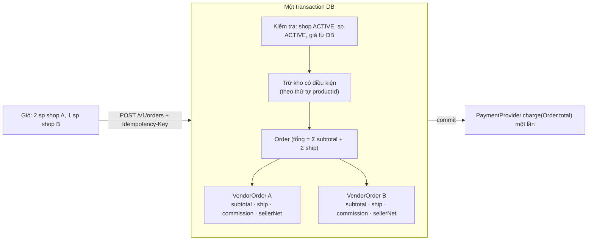

# Plan Sprint 10 — Multi-vendor Checkout · v1.3.0

> Sprint: [sprint-10.md](../sprints/sprint-10.md) *(draft: refine AC trước khi bắt đầu)* · Tổng quan v2: [README](../README.md)
>
> **Cách dùng plan:** đọc "Khái niệm" → tự làm → kẹt quá 30 phút mới mở Hint 1 → Hint 2 → Hint 3. Tự nghĩ test case trước khi mở đáp án.
>
> 🔒 **Sprint này là tiền + tồn kho**, business logic cốt lõi mà [rule 05](../../rules/05-working-with-claude.md) yêu cầu bạn tự viết. Hint 3 chỉ có **pseudo-code**. PR của S10-02 và S10-03 chạy `/security-review`.

## 0. Trước khi bắt đầu

- Sprint 9 xong: có ít nhất 2 shop `ACTIVE` với sản phẩm có `stock` trên môi trường test.
- Đọc lại [plan Sprint 6 v1](../../v1/plans/sprint-06.md): never trust the client, snapshot, idempotency + unique constraint, câu hỏi "charge trong hay ngoài transaction".
- Đọc [quy ước tiền của v2](../README.md#quy-ước-tiền-trong-v2): minor units, basis points, `floor` cho hoa hồng.
- Tạo Neon branch từ production để thử migration S10-01 trên đơn hàng thật.

**Câu hỏi cần trả lời được trước khi code:**
1. Aggregate root là gì? Trong đơn hàng multi-vendor, ai là aggregate root, và invariant nào nó phải bảo vệ?
2. Hai transaction cùng chạy `UPDATE product SET stock = stock - 1 WHERE id = X AND stock >= 1` khi `stock = 1`. Postgres (READ COMMITTED) xử lý thế nào? Bao nhiêu câu thành công?
3. 999 × 10% = 99,9. Đồng lẻ 0,9 đi đâu? Ai quyết định điều đó?

## 1. Bức tranh tổng



Ví dụ số (rate shop A = 1000 bps, shop B = 500 bps, ship = 15000 mỗi shop):

| | subtotal | ship | commission | sellerNet |
|---|---|---|---|---|
| VendorOrder A | 999 | 15 000 | floor(999 × 1000 / 10000) = **99** | 999 + 15 000 − 99 = 15 900 |
| VendorOrder B | 20 000 | 15 000 | floor(20 000 × 500 / 10000) = **1 000** | 34 000 |
| **Order** | | | Σ = 1 099 | **total = 50 999** = Σ sellerNet (49 900) + Σ commission (1 099) |

## 2. Thứ tự & phụ thuộc

```
S10-01 schema + migration ──▶ S10-02 checkout tách đơn ──▶ S10-03 trừ kho atomic
                                         └──▶ S10-04 giỏ nhóm theo shop (web) ──▶ S10-05 đơn của tôi
```

- S10-02 và S10-03 sửa **cùng một transaction**. Làm S10-02 trước (đúng tiền), rồi mới thêm trừ kho vào cùng transaction đó.
- Test đồng thời của S10-03 là test quan trọng nhất của cả v2. Viết nó đầu tiên khi bắt đầu S10-03.

---

## 3.1 S10-01 · Schema Order → VendorOrder + migration đơn v1

### Khái niệm cần nắm
- **Aggregate:** `Order` là **aggregate root**, `VendorOrder` và `OrderItem` là các phần tử bên trong. Mọi thay đổi đi qua root (hoặc ít nhất qua module `orders`), và root bảo vệ invariant: **`Order.total = Σ (subtotal + shippingFee)` của các VendorOrder**.
- **Snapshot ở mức VendorOrder:** `commissionRateBps` của shop có thể thay đổi sau này. VendorOrder lưu **cả tỷ lệ và số tiền** hoa hồng lúc đặt. Tương tự `shippingFeeMinor`. Lý do giống snapshot giá ở PXM-37.
- **Lưu số đã tính hay tính lại?** `sellerNet = subtotal + ship − commission` có thể tính lại từ các cột khác. Lưu luôn thì ledger (S11) và báo cáo đọc trực tiếp, nhưng phải đảm bảo nhất quán (một `CHECK` constraint hoặc test). Quyết định và ghi lại.
- **Migration dữ liệu đơn hàng thật:** mỗi Order v1 → một VendorOrder thuộc shop "PixelMart", `commission = 0`, `shippingFee = 0`, trạng thái lấy từ Order cũ, các `OrderItem` chuyển sang trỏ VendorOrder. Đây là migration **có rủi ro mất dữ liệu nếu viết sai**: phải có script đối soát trước/sau.
- **API chỉ thêm, không bớt:** response `GET /v1/orders/:id` giữ mọi field cũ (`items`, `status`, `totalMinor`) và **thêm** `vendorOrders[]`. Field cũ có thể được đánh dấu deprecated (xóa ở S12-05).

### Hướng tiếp cận
1. Vẽ lại ER của orders sau thay đổi (VendorOrder nằm giữa Order và OrderItem).
2. Viết **script đối soát** trước: đếm Order, OrderItem, tổng `totalMinor`, tổng `Σ unitPrice × qty`. Chạy trên Neon branch, lưu kết quả.
3. Migration (`--create-only` rồi sửa tay): tạo bảng `VendorOrder` → mỗi Order tạo một VendorOrder (store PixelMart) → thêm `vendorOrderId` vào `OrderItem` (nullable) → backfill → NOT NULL → (pha sau) bỏ `orderId` trực tiếp của OrderItem hoặc giữ làm cột phụ: quyết định.
4. Chạy migration trên Neon branch, chạy lại script đối soát, so sánh.
5. Cập nhật service đọc đơn: response có thêm `vendorOrders`. Field `status` của Order: tạm thời lấy từ VendorOrder duy nhất (đơn v1), trạng thái tổng hợp làm ở S11-01.

### File dự kiến tạo/sửa
`apps/api/prisma/schema.prisma`, `apps/api/prisma/migrations/<ts>_vendor_orders/migration.sql`, `apps/api/scripts/reconcile-orders.ts` (hoặc `.sql`), `packages/contracts/src/orders/order.ts`, `apps/api/src/orders/orders.service.ts`, `apps/api/test/orders-read.e2e-spec.ts`.

### Tự nghĩ test case trước
Migration và API đọc đơn có thể hỏng theo những cách nào?

<details><summary>Đáp án tham khảo</summary>

- Số Order trước = sau. Số OrderItem trước = sau. Số VendorOrder = số Order (với dữ liệu v1).
- Mỗi OrderItem có đúng một VendorOrder, VendorOrder đó thuộc đúng Order cũ.
- `Σ totalMinor` không đổi. Với mỗi Order: `total = Σ subtotal + Σ ship` của VendorOrder.
- `GET /v1/orders/:id` của đơn v1 vẫn có `items`, `status`, `totalMinor` như trước, có thêm `vendorOrders` (độ dài 1).
- Test IDOR của PXM-39 vẫn xanh.
- DB trống (CI) → migration chạy được.
</details>

### Gợi ý
<details><summary>Hint 1: hướng đi</summary>

Script đối soát là "test" của migration. Viết và chạy nó **trước** migration, để có số liệu gốc để so sánh.
</details>

<details><summary>Hint 2: khái niệm/API</summary>

- Tạo VendorOrder từ Order bằng một câu `INSERT … SELECT … FROM "Order"`. `id` của VendorOrder: dùng `gen_random_uuid()` trong SQL (UUIDv4 cho dữ liệu cũ là chấp nhận được), hoặc sinh trong một script TS.
- Gắn OrderItem: `UPDATE "OrderItem" oi SET "vendorOrderId" = vo.id FROM "VendorOrder" vo WHERE vo."orderId" = oi."orderId";`
- `CHECK ("sellerNetMinor" = "subtotalMinor" + "shippingFeeMinor" - "commissionMinor")` nếu bạn quyết định lưu `sellerNet`.
</details>

<details><summary>Hint 3: khung migration (SQL)</summary>

```sql
-- 1) EXPAND
CREATE TABLE "VendorOrder" ( ...cột theo schema của bạn... );
ALTER TABLE "OrderItem" ADD COLUMN "vendorOrderId" TEXT;

-- 2) BACKFILL: mỗi Order v1 → 1 VendorOrder của shop PixelMart
INSERT INTO "VendorOrder" ("id", "orderId", "storeId", "status", "subtotalMinor", "shippingFeeMinor",
                           "commissionRateBps", "commissionMinor", "sellerNetMinor", "createdAt")
SELECT gen_random_uuid(), o."id", (SELECT "id" FROM "Store" WHERE "slug" = 'pixelmart'),
       o."status"::text::"VendorOrderStatus", o."totalMinor", 0, 0, 0, o."totalMinor", o."createdAt"
FROM "Order" o;

UPDATE "OrderItem" oi SET "vendorOrderId" = vo."id"
FROM "VendorOrder" vo WHERE vo."orderId" = oi."orderId";

-- (tự viết) RAISE EXCEPTION nếu còn OrderItem chưa có vendorOrderId

-- 3) CONTRACT
ALTER TABLE "OrderItem" ALTER COLUMN "vendorOrderId" SET NOT NULL;
-- (tự viết) FK, index, CHECK
```
Tên bảng/cột, slug store, cách ép kiểu enum phải khớp schema thật của bạn.
</details>

### Bẫy thường gặp
| Triệu chứng | Nguyên nhân | Cách tránh |
|---|---|---|
| Một số đơn cũ hiển thị không có sản phẩm | Backfill bỏ sót OrderItem | Script đối soát + `RAISE EXCEPTION` trong migration |
| Ép kiểu enum lỗi (`OrderStatus` → `VendorOrderStatus`) | Hai enum khác nhau | Cast qua `text`, đảm bảo giá trị tồn tại ở enum mới |
| Web v1 (chưa deploy lại) lỗi trang "Đơn của tôi" | Đổi cấu trúc response | Chỉ thêm field, giữ field cũ |
| Migration chạy lâu, khóa bảng trên production | Nhiều dữ liệu | Với dữ liệu v1 thì nhỏ. Ghi chú: dữ liệu lớn cần backfill theo lô ngoài migration |

### Kiểm chứng AC
- [ ] Chạy script đối soát trước/sau migration trên Neon branch từ production → số liệu khớp (dán vào PR).
- [ ] Test: `GET /v1/orders/:id` vẫn đủ field cũ, có thêm `vendorOrders[]`.
- [ ] Trang "Đơn hàng của tôi" của v1 vẫn hoạt động.

### Đọc thêm
- Martin Fowler, DDD Aggregate: https://martinfowler.com/bliki/DDD_Aggregate.html
- Vaughn Vernon, Effective Aggregate Design (PDF, phần 1): https://www.dddcommunity.org/wp-content/uploads/files/pdf_articles/Vernon_2011_1.pdf
- PostgreSQL `INSERT … SELECT`: https://www.postgresql.org/docs/current/sql-insert.html

---

## 3.2 S10-02 · Checkout tách đơn theo shop

### Khái niệm cần nắm
- **Contract request không đổi:** khách vẫn gửi `[{ productId, quantity }]` + `Idempotency-Key` như v1. Việc nhóm theo shop là chuyện **bên trong** server. Client v1 vẫn đặt được hàng.
- **Quy tắc làm tròn là quyết định kinh doanh:** `commission = floor(subtotal × rateBps / 10000)`. Phần lẻ thuộc seller. Viết nó ở **một hàm thuần**, có bảng test, và ghi trong ADR. Tính bằng số nguyên (nhân trước, chia sau). Không bao giờ dùng `rateBps / 10000` ra số thực rồi nhân.
- **Invariant tiền:** `Σ sellerNet + Σ commission = Order.total`. Nếu invariant này đúng ở **mọi** đơn thì ledger ở S11 sẽ cân bằng. Kiểm tra trong code (assert trước khi ghi) **và** trong test (property-based hoặc ngẫu nhiên nhiều đơn).
- **Một lần thanh toán:** khách trả **một** khoản `Order.total`. Việc chia tiền cho seller là kế toán nội bộ (ledger), không phải nhiều lần charge.
- **Kiểm tra nghiệp vụ trước khi ghi:** shop `ACTIVE`, sản phẩm `ACTIVE`, giá lấy từ DB. Sai → 422 kèm **danh sách** sản phẩm lỗi (để UI hiển thị đúng sản phẩm, S10-04).
- **Ranh giới module:** `orders` cần đọc sản phẩm (catalog) và shop (stores) qua public API. Đừng để `orders` query thẳng bảng của module khác bằng Prisma: hãy để `catalog` cung cấp `getProductsForCheckout(ids)` trả đúng dữ liệu cần thiết. (Cân nhắc: transaction xuyên module cần truyền `tx`, như S8-04.)

### Hướng tiếp cận
1. Hàm thuần `computeCommission(subtotalMinor, rateBps)` + bảng test (TDD).
2. Hàm thuần `splitCart(lines, products, stores, shippingFee)` → danh sách VendorOrder (subtotal, ship, commission, sellerNet, items) + total. Unit test, gồm test invariant với dữ liệu ngẫu nhiên.
3. `catalog` export hàm lấy dữ liệu checkout (giá, tên, `storeId`, trạng thái sản phẩm và shop, `commissionRateBps` của shop).
4. Sửa `OrdersService.create`: dùng `splitCart`, tạo Order + VendorOrder + OrderItem trong một transaction, giữ nguyên toàn bộ logic idempotency của PXM-37.
5. `shippingFee` lấy từ cấu hình (env, validate bằng schema env).
6. Integration test theo bảng ví dụ ở mục 1.

### File dự kiến tạo/sửa
`apps/api/src/orders/{pricing.ts,pricing.test.ts,split-cart.ts,split-cart.test.ts,orders.service.ts}`, `apps/api/src/catalog/{index.ts,checkout-query.ts}`, `apps/api/src/config/env.ts`, `packages/contracts/src/orders/order.ts`, `apps/api/test/orders-create-multivendor.e2e-spec.ts`.

### Tự nghĩ test case trước
Ít nhất 10 case: tiền, làm tròn, trạng thái, idempotency.

<details><summary>Đáp án tham khảo</summary>

`computeCommission`:
- (999, 1000) → 99 · (1000, 1000) → 100 · (1, 1000) → 0 · (0, 1000) → 0 · (20000, 0) → 0 · (20000, 10000) → 20000.
- rate ngoài `0..10000` hoặc số âm → throw.

Checkout:
1. 3 sản phẩm của 2 shop → 1 Order, 2 VendorOrder, số liệu đúng bảng ở mục 1.
2. Cùng shop, 2 sản phẩm → 1 VendorOrder, phí ship tính **một lần**.
3. Đổi `commissionRateBps` của shop sau khi đặt → `GET` đơn cũ vẫn hiện commission cũ.
4. Sản phẩm của shop `SUSPENDED` → 422 với `errors[]` chỉ đúng sản phẩm, **không** có Order nào được tạo.
5. Sản phẩm `DRAFT`/`ARCHIVED` → 422.
6. Client gửi kèm `commissionMinor`, `shippingFeeMinor` → bị bỏ qua.
7. Cùng `Idempotency-Key` gửi tuần tự và đồng thời → cùng Order, không nhân đôi VendorOrder.
8. Invariant trên 200 giỏ ngẫu nhiên: `Σ sellerNet + Σ commission = total`, `total = Σ subtotal + Σ ship`.
9. `PaymentProvider.charge` được gọi **một lần** với `Order.total`.
10. Seller mua hàng của chính shop mình: cho phép hay không? Quyết định (thường là cho phép hoặc chặn để tránh gian lận đánh giá), viết test theo quyết định.
</details>

### Gợi ý
<details><summary>Hint 1: hướng đi</summary>

Tách phần **tính toán** (thuần, không DB) ra khỏi phần **ghi** (transaction). Phần tính toán test được bằng unit test nhanh và kỹ, phần ghi chỉ cần vài integration test.
</details>

<details><summary>Hint 2: khái niệm/API</summary>

- Phép chia nguyên trong JS: `Math.floor((subtotal * rateBps) / 10000)` là đúng khi mọi số là số nguyên dương và tích không vượt `Number.MAX_SAFE_INTEGER`. Kiểm tra giới hạn, hoặc dùng `BigInt` nếu muốn tuyệt đối an toàn.
- Nhóm theo shop: `Map<storeId, lines[]>`. Sắp xếp kết quả theo `storeId` để thứ tự ổn định (dễ test, dễ debug).
- Test ngẫu nhiên: viết vòng lặp tự sinh giỏ, hoặc dùng thư viện property-based testing (`fast-check`).
</details>

<details><summary>Hint 3: pseudo-code</summary>

```
computeCommission(subtotal, rateBps):
  assert isInt(subtotal) and subtotal >= 0 and isInt(rateBps) and 0 <= rateBps <= 10000
  return floor(subtotal * rateBps / 10000)

splitCart(lines, catalogInfo, shippingFee):
  errors = lines lọc sản phẩm không tồn tại / không ACTIVE / shop không ACTIVE
  if errors: throw Unprocessable(errors)
  groups = nhóm lines theo storeId (sắp xếp theo storeId)
  vendorOrders = groups.map(g →
      subtotal   = Σ price(p) * qty
      commission = computeCommission(subtotal, g.store.commissionRateBps)
      { storeId, items: snapshot(name, price, qty), subtotal, shippingFee, rateBps, commission,
        sellerNet: subtotal + shippingFee - commission })
  total = Σ (vo.subtotal + vo.shippingFee)
  assert Σ vo.sellerNet + Σ vo.commission == total
  return { vendorOrders, total }

createOrder(userId, key, lines):
  existing? → trả lại (như PXM-37)
  plan = splitCart(lines, catalog.getProductsForCheckout(ids), config.shippingFee)
  transaction(tx → tạo Order(total) + vendorOrders (nested create items))   // + trừ kho ở S10-03
  bắt unique (userId, key) → trả order đã có
  payment.charge(order.id, plan.total)
```
</details>

### Bẫy thường gặp
| Triệu chứng | Nguyên nhân | Cách tránh |
|---|---|---|
| Hoa hồng lệch 1 đồng ở một số đơn | Tính bằng số thực (`subtotal * 0.1`) rồi `Math.round` | Số nguyên, nhân trước chia sau, `floor`, bảng test |
| Tổng tiền đơn ≠ tổng tiền chia cho seller + sàn | Làm tròn từng item thay vì từng VendorOrder, hoặc tính total độc lập | Tính total từ chính các VendorOrder, assert invariant |
| Đơn cũ đổi hoa hồng khi admin đổi tỷ lệ shop | Đọc `rateBps` từ shop khi hiển thị | Snapshot `rateBps` + `commissionMinor` vào VendorOrder |
| Phí ship tính theo từng sản phẩm | Nhầm đơn vị | Phí ship theo **VendorOrder** |
| `orders` query thẳng `prisma.product` | Bỏ qua ranh giới module | Hàm public của `catalog`. CI (S8-01) sẽ bắt nếu import sâu |
| Retry cùng key tạo thêm VendorOrder | Idempotency chỉ bọc Order mà VendorOrder tạo ở bước riêng | Nested create trong cùng transaction với Order |

### Kiểm chứng AC
- [ ] Test: giỏ 3 sản phẩm của 2 shop → 1 Order, 2 VendorOrder, số liệu đúng.
- [ ] Test: đổi `commissionRateBps` sau khi đặt → hoa hồng đơn cũ không đổi.
- [ ] Unit test làm tròn: (999, 1000) → 99.
- [ ] Test invariant trên nhiều giỏ ngẫu nhiên.
- [ ] Test idempotency của v1 vẫn xanh (tuần tự và đồng thời).
- [ ] `/security-review` trên PR.

### Đọc thêm
- Martin Fowler, Money pattern (allocation & rounding): https://martinfowler.com/eaaCatalog/money.html
- fast-check (property-based testing): https://fast-check.dev/docs/introduction/
- Stripe, Connect: cách sàn thu phí và chia tiền (đọc để hiểu mô hình, không dùng ở v2): https://docs.stripe.com/connect/charges

---

## 3.3 S10-03 · Trừ tồn kho atomic, không oversell

### Khái niệm cần nắm
- **Oversell:** hai khách cùng mua món cuối cùng. Cách ngây thơ "đọc `stock`, nếu ≥ qty thì ghi `stock - qty`" cho cả hai cùng đọc thấy `1` và cùng ghi `0`: bán 2 món trong khi chỉ có 1.
- **Update có điều kiện là atomic:** `UPDATE product SET stock = stock - :qty WHERE id = :id AND stock >= :qty`. Ở READ COMMITTED, khi hai transaction cùng nhắm một dòng, transaction thứ hai **chờ** khóa dòng, rồi **đánh giá lại điều kiện `WHERE`** trên phiên bản mới nhất. Nó thấy `stock = 0`, điều kiện sai, 0 dòng bị ảnh hưởng. Không cần `SERIALIZABLE`, không cần `SELECT … FOR UPDATE`.
- **Tất cả hoặc không có gì:** đơn có 3 item, item thứ 3 thiếu hàng → item 1, 2 đã trừ phải được hoàn lại. Đặt toàn bộ việc trừ kho **trong cùng transaction** với việc tạo Order, và **throw** khi một item thất bại để rollback. (Ngược với bài học PXM-23: ở đây rollback là điều ta muốn.)
- **Deadlock:** khách X mua (A, B), khách Y mua (B, A) cùng lúc. X khóa A rồi chờ B, Y khóa B rồi chờ A. Postgres phát hiện deadlock và hủy một transaction. Phòng tránh bằng cách **luôn cập nhật theo một thứ tự cố định** (ví dụ sắp xếp theo `productId`). Vẫn nên xử lý lỗi deadlock bằng cách trả lỗi có thể retry.
- **Idempotency và tồn kho:** gửi lại cùng `Idempotency-Key` phải trả order cũ **trước khi** trừ kho, nếu không sẽ trừ hai lần.
- **Giới hạn của cách này:** mỗi lần mua khóa dòng sản phẩm trong thời gian transaction. Với flash sale hàng nghìn người mua một sản phẩm, dòng đó thành điểm nghẽn. Đó chính là bài toán của **v4** (Redis), và lý do ta đo trước khi tối ưu.

### Hướng tiếp cận
1. Viết test đồng thời **đầu tiên**: `stock = 1`, hai request với hai user khác nhau chạy `Promise.all` → đúng một 201, một 409, `stock` cuối = 0. Chạy nó với cài đặt ngây thơ để thấy nó **đỏ** (chứng minh test bắt được lỗi).
2. Trong transaction của S10-02: sắp xếp item theo `productId`, với mỗi item chạy update có điều kiện, kiểm tra `count`. Thiếu hàng → gom danh sách → throw `Conflict` (409) kèm danh sách sản phẩm (để rollback mọi thứ).
3. Gộp item trùng `productId` trước khi trừ (nếu contract cho phép trùng).
4. Bắt lỗi deadlock/serialization của Postgres (mã lỗi `40P01`) → trả 409/503 có thể retry, hoặc retry một lần phía server.

### File dự kiến tạo/sửa
`apps/api/src/catalog/{index.ts,inventory.ts}` (hàm trừ kho public nhận `tx`), `apps/api/src/orders/orders.service.ts`, `apps/api/test/orders-stock-concurrency.e2e-spec.ts`.

### Tự nghĩ test case trước
<details><summary>Đáp án tham khảo</summary>

1. `stock = 1`, 2 khách đặt đồng thời → 1 thành công, 1 nhận 409, `stock = 0`, đúng 1 Order.
2. `stock = 5`, 10 khách mỗi người mua 1, đồng thời → đúng 5 thành công, `stock = 0`, không bao giờ âm.
3. Đơn 2 item, item 2 thiếu hàng → 409 liệt kê item 2. `stock` của item 1 **không đổi**. Không có Order.
4. Cùng `Idempotency-Key` gửi lại → không trừ kho lần hai.
5. X mua (A, B), Y mua (B, A) đồng thời, mỗi sản phẩm đủ hàng → cả hai thành công (không deadlock nhờ sắp xếp).
6. Mua `quantity` lớn hơn `stock` (một người) → 409.
7. Sản phẩm `stock = 0` nhưng `ACTIVE` → 409 (không phải 422).
</details>

### Gợi ý
<details><summary>Hint 1: hướng đi</summary>

Chạy test 1 với cài đặt "đọc rồi ghi" để thấy nó **đỏ** (bán 2 món). Đây là bằng chứng rằng test của bạn có giá trị. Sau đó mới đổi sang update có điều kiện.
</details>

<details><summary>Hint 2: khái niệm/API</summary>

- Prisma: `tx.product.updateMany({ where: { id, stock: { gte: qty } }, data: { stock: { decrement: qty } } })` → `{ count }`.
- `CHECK (stock >= 0)` ở S9-01 là lưới an toàn cuối: nếu code sai, DB báo lỗi thay vì âm thầm âm kho.
- Để test đồng thời thật sự đồng thời trên một DB: cần hai kết nối khác nhau (pool của Prisma có nhiều kết nối) và `Promise.all`. Có thể thêm độ trễ nhỏ trong transaction (chỉ ở môi trường test) để tăng xác suất hai transaction chồng lên nhau.
- Mã lỗi Postgres: `40P01` deadlock_detected, `40001` serialization_failure.
</details>

<details><summary>Hint 3: pseudo-code</summary>

```
reserveStock(tx, lines):                       // public API của catalog, chạy trong tx của orders
  merged = gộp quantity theo productId, sắp xếp theo productId
  failed = []
  for (productId, qty) in merged:
    n = tx.product.updateMany(where { id: productId, stock >= qty }, data { stock: decrement qty }).count
    if n == 0: failed.push(productId)
  if failed: throw Conflict("Không đủ hàng", failed)   // throw → rollback toàn bộ transaction

createOrder(...):
  existing? → return existing                   // TRƯỚC khi trừ kho
  plan = splitCart(...)
  transaction(tx):
    catalog.reserveStock(tx, lines)
    tạo Order + VendorOrders
  …
```
</details>

### Bẫy thường gặp
| Triệu chứng | Nguyên nhân | Cách tránh |
|---|---|---|
| Bán vượt tồn kho khi có hai người mua cùng lúc | Đọc rồi ghi | Update có điều kiện trong `WHERE` |
| Item đầu bị trừ kho dù đơn thất bại | Trừ kho ngoài transaction, hoặc không throw khi thất bại | Cùng transaction, throw để rollback |
| Thỉnh thoảng lỗi 500 "deadlock detected" | Thứ tự cập nhật khác nhau giữa các đơn | Sắp xếp theo `productId`, xử lý mã `40P01` |
| Retry cùng key trừ kho hai lần | Kiểm tra idempotency sau khi trừ | Kiểm tra trước. Unique constraint vẫn rollback nếu hai request đồng thời |
| Test đồng thời luôn xanh kể cả với code sai | Hai request chạy tuần tự (một kết nối, hoặc `await` lần lượt) | `Promise.all`, kiểm tra test **đỏ** với code ngây thơ |
| Dùng `SERIALIZABLE` cho toàn bộ checkout | Lo lắng quá mức | Update có điều kiện đủ cho bài toán này, và rẻ hơn nhiều |

### Kiểm chứng AC
- [ ] Test đồng thời: `stock = 1`, 2 khách → đúng 1 đơn, 1 nhận 409, `stock = 0`.
- [ ] Test: item thứ hai thiếu hàng → không item nào bị trừ, không có Order.
- [ ] Test: gửi lại cùng `Idempotency-Key` → không trừ kho lần hai.
- [ ] `/security-review` trên PR.

### Đọc thêm
- PostgreSQL, Transaction Isolation (READ COMMITTED và việc đánh giá lại `WHERE`): https://www.postgresql.org/docs/current/transaction-iso.html#XACT-READ-COMMITTED
- PostgreSQL, Explicit Locking (deadlocks): https://www.postgresql.org/docs/current/explicit-locking.html#LOCKING-DEADLOCKS
- Prisma, atomic number operations: https://www.prisma.io/docs/orm/reference/prisma-client-reference#atomic-number-operations

---

## 3.4 S10-04 · Giỏ hàng nhóm theo shop + checkout UI

### Khái niệm cần nắm
- **Nhóm để hiển thị, không lưu thêm gì:** store giỏ hàng vẫn chỉ có `productId + quantity` (PXM-36). Việc nhóm theo shop dựa vào dữ liệu `shop` mà `?ids=` trả về (S9-03). Thêm `storeId` vào localStorage là dữ liệu có thể **cũ**.
- **Hiển thị số giống hệt server:** tạm tính và phí ship trên UI chỉ để hiển thị. Con số cuối cùng là của API. Lý tưởng là hiển thị **đúng** con số mà API sẽ tính: phí ship lấy từ API (một endpoint cấu hình công khai, hoặc trả kèm), không hardcode ở frontend.
- **Lỗi theo từng sản phẩm:** API trả 409 (hết hàng) hoặc 422 (ngừng bán) kèm danh sách. UI đánh dấu đúng sản phẩm, cho phép "Bỏ sản phẩm này" rồi đặt lại. Đổi giỏ → **key idempotency mới** (bài học PXM-38).
- **Migrate dữ liệu persist:** cấu trúc giỏ có thể không đổi. Nhưng nếu đổi (ví dụ thêm `addedAt`), tăng `version` và viết `migrate`. Khách có giỏ từ v1 không được mất giỏ.

### Hướng tiếp cận
1. Hook `useCartGroups()`: từ items + dữ liệu `?ids=` → nhóm theo `shop.slug`, tạm tính từng nhóm, phí ship từng nhóm, tổng.
2. Phí ship: lấy từ API (thêm vào response public hoặc một endpoint `GET /v1/checkout/config`). Ghi quyết định.
3. Trang `/cart` và `/checkout` hiển thị theo nhóm.
4. Xử lý lỗi 409/422 theo danh sách sản phẩm.
5. Kiểm tra giỏ v1 cũ (localStorage) vẫn hiển thị đúng.

### File dự kiến tạo/sửa
`apps/web/lib/cart/{store.ts,use-cart-groups.ts,use-cart-groups.test.ts}`, `apps/web/app/{cart,checkout}/page.tsx`, `apps/web/components/checkout/{shop-group.tsx,place-order-button.tsx}`.

### Tự nghĩ test case trước
<details><summary>Đáp án tham khảo</summary>

- Giỏ 2 shop → 2 nhóm, mỗi nhóm một phí ship. Tổng UI = `Order.total` API trả về.
- Một sản phẩm hết hàng lúc đặt → thông báo đúng sản phẩm, các sản phẩm khác còn nguyên, bỏ sản phẩm rồi đặt lại → thành công (key mới).
- Một shop bị khóa giữa chừng → 422, các sản phẩm của shop đó được đánh dấu.
- Giỏ trong localStorage dạng v1 → hiển thị đúng sau khi lên bản mới.
- Unit test `useCartGroups` (hoặc hàm thuần bên dưới nó) cho nhóm và tổng.
</details>

### Gợi ý
<details><summary>Hint 1: hướng đi</summary>

Tách hàm thuần `groupCart(items, products, shippingFee)` để unit test, hook chỉ ghép dữ liệu. Hàm này gần giống `splitCart` phía server nhưng **không** dùng chung code: server là nguồn sự thật, client chỉ hiển thị.
</details>

<details><summary>Hint 2: khái niệm/API</summary>

- `ApiError.errors` (PXM-16) mang danh sách `productId` lỗi. Dùng `Set` để tra nhanh khi render.
- Zustand persist: `version` + `migrate(persistedState, version)`.
</details>

<details><summary>Hint 3: khung</summary>

```
groupCart(items, productsById, shippingFee):
  groups = nhóm items theo productsById[id].shop.slug (bỏ id không có trong productsById)
  mỗi group: { shop, lines, subtotal, shippingFee }
  total = Σ (subtotal + shippingFee)
```
</details>

### Bẫy thường gặp
| Triệu chứng | Nguyên nhân | Cách tránh |
|---|---|---|
| Tổng UI khác tổng API | Phí ship hardcode ở frontend, lệch với cấu hình server | Lấy phí ship từ API |
| Bỏ sản phẩm lỗi rồi đặt lại → nhận về lỗi cũ | Dùng lại Idempotency-Key cũ, server trả lại kết quả cũ hoặc order cũ | Key mới khi giỏ đổi |
| Giỏ cũ của khách biến mất sau deploy | Đổi tên key persist hoặc cấu trúc mà không migrate | Giữ `name`, tăng `version` + `migrate` |

### Kiểm chứng AC
- [ ] Giỏ 2 shop → 2 nhóm, mỗi nhóm có phí ship, tổng khớp API.
- [ ] Sản phẩm vừa hết hàng → thông báo đúng sản phẩm, sản phẩm khác giữ nguyên.
- [ ] Giỏ từ v1 (localStorage cũ) vẫn hiển thị đúng.

### Đọc thêm
- Zustand persist, versioning & migrations: https://zustand.docs.pmnd.rs/integrations/persisting-store-data#version
- Baymard Institute, cart UX (tham khảo trải nghiệm giỏ nhiều người bán): https://baymard.com/blog/cart-page-ux

---

## 3.5 S10-05 · Đơn hàng của tôi (multi-vendor)

### Khái niệm cần nắm
- **Hiển thị aggregate:** một Order có nhiều VendorOrder, mỗi cái một trạng thái riêng. Trang chi tiết hiển thị từng khối shop. Trang danh sách hiển thị trạng thái **tổng hợp** (tính đầy đủ ở S11-01. Ở sprint này: "Đang xử lý" nếu còn VendorOrder chưa hoàn tất).
- **Vẫn là dữ liệu của tôi:** test IDOR của PXM-39 phải còn xanh. Query luôn lọc theo `userId` của Order (VendorOrder không có `userId` riêng, lọc qua quan hệ).

### Hướng tiếp cận
1. Response `GET /v1/orders` thêm `vendorCount` và trạng thái tổng hợp tạm thời.
2. Trang chi tiết: khối cho mỗi VendorOrder (tên shop, items snapshot, ship, trạng thái).
3. Chạy lại test IDOR.

### File dự kiến tạo/sửa
`apps/web/app/account/orders/{page.tsx,[id]/page.tsx}`, `apps/web/components/orders/vendor-order-card.tsx`, `apps/api/src/orders/orders.service.ts`, `packages/contracts/src/orders/order.ts`.

### Tự nghĩ test case trước
<details><summary>Đáp án tham khảo</summary>

- Đơn 2 shop → 2 khối, mỗi khối một trạng thái.
- Đơn v1 (1 VendorOrder) → hiển thị như trước, một khối shop "PixelMart".
- User B xem đơn của A → 404 (test cũ vẫn xanh).
- Danh sách sắp xếp mới nhất trước.
</details>

### Gợi ý
<details><summary>Hint 1: hướng đi</summary>

Ticket nhỏ. Phần lớn là UI, phần API chỉ là `include` thêm VendorOrder và shop.
</details>

<details><summary>Hint 2: khái niệm/API</summary>

`findFirst({ where: { id, userId }, include: { vendorOrders: { include: { items: true, store: { select: { name, slug } } } } } })`.
</details>

<details><summary>Hint 3: khung</summary>

```
<OrderDetail order>
  order.vendorOrders.map(vo → <VendorOrderCard shop=vo.store items=vo.items shipping=vo.shippingFee status=vo.status/>)
  <Total value=order.total/>
```
</details>

### Bẫy thường gặp
| Triệu chứng | Nguyên nhân | Cách tránh |
|---|---|---|
| Lộ `commissionMinor`/`sellerNet` cho khách | Trả nguyên VendorOrder | Response schema phía khách không có các field kế toán |
| Đơn v1 hiển thị lỗi | Giả định luôn có nhiều shop | Test với đơn đã migrate từ v1 |

### Kiểm chứng AC
- [ ] Đơn 2 shop hiển thị 2 khối, mỗi khối một trạng thái.
- [ ] Test IDOR của v1 vẫn xanh.

### Đọc thêm
- OWASP API3:2023 Broken Object Property Level Authorization: https://owasp.org/API-Security/editions/2023/en/0xa3-broken-object-property-level-authorization/

---

## 4. Tự kiểm tra cuối sprint

1. Aggregate root của đơn hàng multi-vendor là gì, và nó bảo vệ invariant nào?
<details><summary>Gợi ý</summary>

`Order`. Invariant: `total = Σ (subtotal + ship)` của VendorOrder, và `Σ sellerNet + Σ commission = total`. Mọi VendorOrder được tạo cùng Order trong một transaction.
</details>

2. Vì sao `floor(subtotal × rateBps / 10000)` mà không phải `Math.round(subtotal * 0.1)`?
<details><summary>Gợi ý</summary>

Số nguyên tránh sai số dấu phẩy động. `floor` là một quy tắc kinh doanh rõ ràng (phần lẻ về seller). Quy tắc nào cũng được, miễn là nhất quán, có test và được ghi lại.
</details>

3. Giải thích vì sao `UPDATE … WHERE stock >= qty` không oversell ở READ COMMITTED.
<details><summary>Gợi ý</summary>

Transaction thứ hai chờ khóa dòng, sau khi transaction thứ nhất commit, Postgres đánh giá lại điều kiện `WHERE` trên dòng mới nhất (`stock = 0`), nên không cập nhật.
</details>

4. Deadlock xảy ra thế nào trong checkout, và vì sao sắp xếp theo `productId` ngăn được?
<details><summary>Gợi ý</summary>

Hai transaction khóa hai dòng theo thứ tự ngược nhau rồi chờ nhau. Cùng một thứ tự khóa thì không thể có vòng chờ.
</details>

5. Vì sao kiểm tra Idempotency-Key phải nằm trước bước trừ kho?
<details><summary>Gợi ý</summary>

Nếu trừ kho trước, request lặp lại sẽ trừ kho thêm lần nữa rồi mới phát hiện order đã tồn tại. Với request đồng thời, unique constraint làm transaction thua rollback, kể cả phần trừ kho.
</details>

6. Cách trừ kho của sprint này sẽ gặp vấn đề gì trong flash sale, và v4 giải quyết thế nào?
<details><summary>Gợi ý</summary>

Mọi đơn tranh nhau khóa cùng một dòng sản phẩm, nên throughput bị giới hạn và độ trễ tăng. v4 dùng Redis (thao tác atomic trong bộ nhớ, Lua script) để giữ tồn kho cho các đợt bán lớn, sau khi đã đo bằng Prometheus/k6.
</details>

7. Vì sao migration đơn hàng cần một script đối soát riêng?
<details><summary>Gợi ý</summary>

Migration "chạy thành công" không có nghĩa là dữ liệu đúng. Đối soát số lượng và tổng tiền trước/sau là bằng chứng không mất dữ liệu.
</details>

## 5. Kịch bản demo

1. Kết quả script đối soát trước/sau migration trên Neon branch.
2. Storefront: giỏ có sản phẩm của 2 shop → nhóm theo shop, mỗi shop một phí ship.
3. Đặt hàng → "Đơn của tôi" hiển thị 2 khối shop.
4. REST client: `GET` đơn → `vendorOrders` với `commissionMinor`, `sellerNetMinor` đúng bảng ví dụ (dùng tài khoản admin hoặc log).
5. Chạy test đồng thời trên màn hình: `stock = 1`, hai khách → một thành công, một 409.
6. Admin đổi tỷ lệ hoa hồng shop → đơn cũ không đổi.
