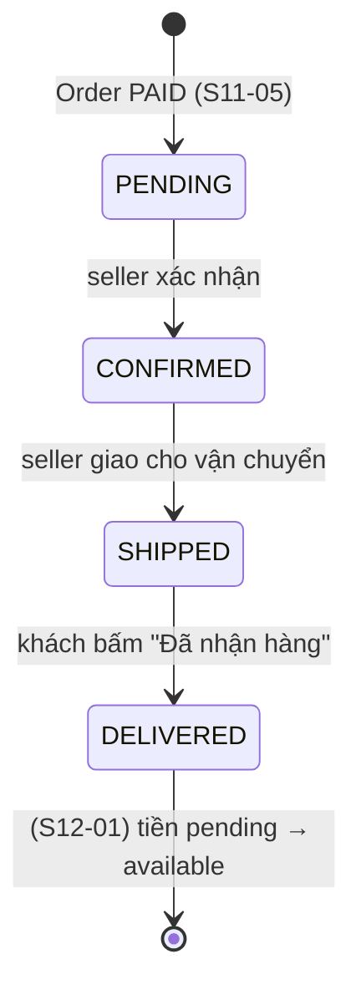

# Plan Sprint 11 — Fulfillment & Ledger · v1.4.0

> Sprint: [sprint-11.md](../sprints/sprint-11.md) *(draft: refine AC trước khi bắt đầu)* · Tổng quan v2: [README](../README.md)
>
> **Cách dùng plan:** đọc "Khái niệm" → tự làm → kẹt quá 30 phút mới mở Hint 1 → Hint 2 → Hint 3. Tự nghĩ test case trước khi mở đáp án.
>
> 🔒 State machine của đơn và ledger là business logic cốt lõi: Hint 3 chỉ có **pseudo-code**. PR của S11-04 và S11-05 chạy `/security-review`.

## 0. Trước khi bắt đầu

- Sprint 10 xong: đơn được tách thành VendorOrder, `Order.paymentStatus` (`UNPAID | PAID | FAILED`) được cập nhật sau khi charge.
- Đọc trước (30 phút, rất đáng):
  - Martin Fowler, Accounting Patterns: https://martinfowler.com/eaaDev/AccountingNarrative.html
  - Modern Treasury, "Accounting for Developers" (phần 1, 2): https://www.moderntreasury.com/journal/accounting-for-developers-part-i
- Đọc lại [plan Sprint 7 v1, PXM-40](../../v1/plans/sprint-07.md) (bảng transition + update có điều kiện).

**Câu hỏi cần trả lời được trước khi code:**
1. Vì sao không lưu `balance` của seller thành một cột rồi `UPDATE balance = balance + x`?
2. "Kế toán kép" nghĩa là gì? Vì sao tổng mọi bút toán của một giao dịch phải bằng 0?
3. Trạng thái của Order khi một shop đã giao, một shop chưa giao là gì? Có nên **lưu** nó không?

## 1. Bức tranh tổng

State machine của VendorOrder, mỗi chuyển có **một tác nhân** được phép:



Dòng tiền khi khách thanh toán một đơn 2 shop (dùng lại ví dụ của [plan Sprint 10](sprint-10.md)). Quy ước dấu ở bảng dưới: **dương = ghi Nợ (debit), âm = ghi Có (credit)**, và tổng mỗi giao dịch luôn bằng 0.

| Tài khoản | Loại | Bút toán `PAYMENT_CAPTURED` |
|---|---|---|
| `PLATFORM_CLEARING` | Tài sản (tiền sàn đang giữ) | **+50 999** |
| `SELLER_PENDING` của shop A | Nợ phải trả seller (chưa rút được) | **−15 900** |
| `SELLER_PENDING` của shop B | Nợ phải trả seller (chưa rút được) | **−34 000** |
| `PLATFORM_REVENUE` | Doanh thu của sàn | **−1 099** |
| **Tổng** | | **0** |

## 2. Thứ tự & phụ thuộc

```
S11-01 state machine API ──▶ S11-03 khách xác nhận nhận hàng ──▶ S11-02 seller UI
S11-04 ledger schema + post() ──▶ S11-05 bút toán khi thanh toán
```

- Hai nhánh độc lập, làm song song được. **Rủi ro lớn nhất là S11-04:** chốt thiết kế ledger bằng ADR-0009 (bạn quyết định, Claude viết ADR) **trước** khi code. Sai ở đây thì S12 phải làm lại.
- Module `ledger` là module mới, ở **dưới cùng** chuỗi phụ thuộc: `orders → ledger`, ledger không import module domain nào.

---

## 3.1 S11-01 · State machine VendorOrder

### Khái niệm cần nắm
- **Nhiều tác nhân:** mỗi chuyển trạng thái gắn với **ai** được làm nó. Seller: `PENDING → CONFIRMED → SHIPPED`. Khách: `SHIPPED → DELIVERED` (S11-03). Bảng transition không chỉ có `from → to` mà có `from → to → actor`.
- **Ownership cho seller:** `GET/PATCH /v1/seller/orders/...` chỉ trên VendorOrder có `storeId` = shop của người gọi **và** Order đã `PAID`. Dùng lại guard `CurrentStore` (S9-01). Không thuộc shop → 404.
- **Trạng thái tổng hợp (derived state):** trạng thái của Order là **hàm** của các VendorOrder: tất cả `DELIVERED` → "Hoàn tất", một phần `DELIVERED` → "Đã giao một phần", còn lại → "Đang xử lý". Hai lựa chọn:
  - **Tính khi đọc:** không lưu, luôn đúng. Lọc/sắp xếp theo trạng thái tổng hợp khó hơn.
  - **Lưu và cập nhật trong cùng transaction** với mỗi lần VendorOrder đổi trạng thái: query nhanh, nhưng phải đảm bảo không bao giờ lệch.
  - Chọn một và ghi lại. Với v2, tính khi đọc là đủ và an toàn hơn.
- **Admin confirm của v1 (PXM-40) trở thành dư thừa:** luồng xác nhận giờ thuộc seller. Đánh dấu endpoint admin cũ là deprecated (xóa ở S12-05). Trong thời gian chuyển tiếp, nó vẫn phải cập nhật VendorOrder (S10-01).

### Hướng tiếp cận
1. Bảng `VENDOR_ORDER_TRANSITIONS` gồm `from`, `to`, `actor` + hàm thuần `canTransition(from, to, actor)` + unit test.
2. Service `transitionVendorOrder(scope, id, to, actor)`: update có điều kiện `where { id, status: from, storeId? }`, `count = 0` → đọc lại → 404/409.
3. Controller seller: list (lọc status, phân trang, chỉ Order `PAID`), `confirm`, `ship`.
4. Hàm `deriveOrderStatus(vendorOrders)` + unit test. Response của khách dùng nó.
5. Đánh dấu `PATCH /v1/admin/orders/:id/confirm` là deprecated trong OpenAPI.

### File dự kiến tạo/sửa
`apps/api/src/orders/{vendor-order-status.ts,vendor-order-status.test.ts,seller-orders.controller.ts,vendor-orders.service.ts,derive-order-status.ts}`, `packages/contracts/src/orders/seller-order.ts`, `apps/api/test/seller-orders.e2e-spec.ts`.

### Tự nghĩ test case trước
Lập bảng `from × to × actor` và ma trận phân quyền trước khi mở đáp án.

<details><summary>Đáp án tham khảo</summary>

- `canTransition(PENDING, CONFIRMED, SELLER)` → true. `(PENDING, SHIPPED, SELLER)` → false. `(SHIPPED, DELIVERED, SELLER)` → false (chỉ khách). `(CONFIRMED, SHIPPED, CUSTOMER)` → false.
- Seller A confirm VendorOrder của shop B → 404.
- Seller list không thấy VendorOrder của Order `UNPAID`/`FAILED`.
- `PENDING → SHIPPED` qua API → 409.
- Hai request confirm đồng thời → một 200, một 409.
- `deriveOrderStatus`: [DELIVERED, DELIVERED] → COMPLETED. [DELIVERED, SHIPPED] → PARTIALLY_DELIVERED. [PENDING, CONFIRMED] → PROCESSING. Một phần tử → khớp trạng thái của nó.
- Khách gọi endpoint seller → 403.
</details>

### Gợi ý
<details><summary>Hint 1: hướng đi</summary>

Viết bảng transition và `deriveOrderStatus` dạng hàm thuần trước (unit test nhanh). Endpoint chỉ là lớp mỏng gọi hai hàm này cộng update có điều kiện.
</details>

<details><summary>Hint 2: khái niệm/API</summary>

- `updateMany({ where: { id, storeId, status: from, order: { paymentStatus: 'PAID' } }, data: { status: to, confirmedAt/shippedAt: now } })`. Prisma cho phép lọc theo quan hệ trong `where` của `updateMany`. Kiểm tra lại với phiên bản Prisma của bạn.
- Lưu thời điểm từng bước (`confirmedAt`, `shippedAt`, `deliveredAt`) hữu ích cho UI và cho đối soát sau này.
</details>

<details><summary>Hint 3: pseudo-code</summary>

```
VENDOR_ORDER_TRANSITIONS = [
  { from: PENDING,   to: CONFIRMED, actor: SELLER },
  { from: CONFIRMED, to: SHIPPED,   actor: SELLER },
  { from: SHIPPED,   to: DELIVERED, actor: CUSTOMER },
]

transitionAsSeller(storeId, vendorOrderId, to):
  rule = tìm rule có to và actor SELLER; không có → 409
  n = updateMany(where { id, storeId, status: rule.from, order.paymentStatus: PAID }, data { status: to, <to>At: now }).count
  if n == 0:
    vo = findFirst(where { id, storeId, order.paymentStatus: PAID })
    throw vo ? Conflict(`Không thể chuyển từ ${vo.status} sang ${to}`) : NotFound

deriveOrderStatus(statuses):
  if all DELIVERED: COMPLETED
  if any DELIVERED: PARTIALLY_DELIVERED
  return PROCESSING
```
</details>

### Bẫy thường gặp
| Triệu chứng | Nguyên nhân | Cách tránh |
|---|---|---|
| Seller thấy đơn chưa thanh toán | Quên điều kiện `paymentStatus = PAID` | Điều kiện nằm trong `where` của mọi query seller |
| Seller tự đánh dấu "đã giao tới khách" để nhận tiền sớm | Không phân biệt tác nhân | Bảng transition có `actor`. `DELIVERED` chỉ khách được làm |
| Trạng thái Order và VendorOrder lệch nhau | Lưu trạng thái tổng hợp nhưng quên cập nhật ở một nhánh | Tính khi đọc, hoặc cập nhật trong cùng transaction + test |
| Logic chuyển trạng thái rải rác giữa controller và UI | Không có một bảng duy nhất | Một bảng, một hàm `canTransition` |

### Kiểm chứng AC
- [ ] Test: seller A chuyển trạng thái đơn của shop B → 404.
- [ ] Test: `PENDING → SHIPPED` → 409.
- [ ] Unit test `deriveOrderStatus` cho trường hợp một shop đã giao, một shop chưa.
- [ ] Test đồng thời: hai `confirm` → một 200, một 409.

### Đọc thêm
- Martin Fowler, State Machine: https://martinfowler.com/bliki/StateMachine.html
- Prisma relation filters trong `where`: https://www.prisma.io/docs/orm/prisma-client/queries/relation-queries#relation-filters

---

## 3.2 S11-02 · Seller UI xử lý đơn

### Khái niệm cần nắm
- **UI hiển thị hành động theo trạng thái, API quyết định.** Nút "Xác nhận" chỉ hiện khi `PENDING`, "Giao hàng" khi `CONFIRMED`. Nếu trạng thái đổi ở tab khác, API trả 409 và UI tải lại.
- **Seller thấy "số tiền mình nhận":** `sellerNetMinor` (đã trừ hoa hồng, cộng phí ship). Đây là field của seller, không có trong response của khách (S10-01).
- **Lần thứ ba làm bảng có hành động** (sau PXM-40 và S8-06): theo [rule 05](../../rules/05-working-with-claude.md), có thể giao Claude viết, bạn review.

### Hướng tiếp cận
1. `features/orders` trong seller app: list theo `status` (URL search), chi tiết đơn, mutation `confirm`/`ship`.
2. Map hành động hợp lệ từ trạng thái (dùng cùng dữ liệu với bảng transition nếu export được qua contracts).
3. 409 → toast + invalidate.

### File dự kiến tạo/sửa
`apps/seller/src/features/orders/**`, `apps/seller/src/routes/_authed/orders.tsx`, `packages/contracts/src/orders/seller-order.ts` (có thể export danh sách transition cho UI), `packages/api-client/src/seller.ts`.

### Tự nghĩ test case trước
<details><summary>Đáp án tham khảo</summary>

- Đơn `PENDING` chỉ có nút "Xác nhận". `CONFIRMED` chỉ có "Giao hàng". `SHIPPED`/`DELIVERED` không có nút.
- Hai tab: tab 1 xác nhận, tab 2 bấm xác nhận → thông báo "đã được xử lý", dữ liệu tự cập nhật.
- Chi tiết đơn hiển thị đúng `sellerNet` (đối chiếu bảng ví dụ sprint 10).
- Lọc theo trạng thái, reload → giữ bộ lọc.
</details>

### Gợi ý
<details><summary>Hint 1: hướng đi</summary>

Nếu giao Claude viết, đưa rõ: danh sách cột, hành động theo trạng thái, xử lý 404/409. Review như PR của người khác: tìm chỗ gọi nhầm endpoint, chỗ hiển thị field kế toán ở nhầm nơi.
</details>

<details><summary>Hint 2: khái niệm/API</summary>

Export `VENDOR_ORDER_TRANSITIONS` (chỉ dữ liệu, không logic DB) từ `packages/contracts` để UI và API dùng chung một nguồn.
</details>

<details><summary>Hint 3: khung</summary>

```
actionsFor(status, actor=SELLER) = TRANSITIONS.filter(t → t.from == status && t.actor == actor).map(t → t.to)
<OrderRow> actionsFor(vo.status).map(to → <Button onClick={() → mutate({ id, to })}>{label(to)}</Button>)
```
</details>

### Bẫy thường gặp
| Triệu chứng | Nguyên nhân | Cách tránh |
|---|---|---|
| UI hiện nút mà API từ chối | Hai danh sách transition lệch nhau | Một nguồn trong contracts |
| 409 làm bảng đứng ở trạng thái cũ | Không invalidate khi lỗi | `onError` → invalidate |

### Kiểm chứng AC
- [ ] Chỉ hiện nút hợp lệ cho trạng thái hiện tại.
- [ ] 409 (đã chuyển ở tab khác) → thông báo + tải lại dữ liệu.

### Đọc thêm
- TanStack Query, mutations: https://tanstack.com/query/latest/docs/framework/react/guides/mutations

---

## 3.3 S11-03 · Khách xác nhận đã nhận hàng

### Khái niệm cần nắm
- **Ownership qua quan hệ lồng:** `PATCH /v1/orders/:orderId/vendor-orders/:id/received`. Phải kiểm tra **cả hai**: Order thuộc khách đang gọi, **và** VendorOrder thuộc đúng Order đó. Chỉ kiểm tra `orderId` mà không kiểm tra `vendorOrder.orderId` thì kẻ tấn công ghép `orderId` của mình với `vendorOrderId` của người khác.
- **Chuyển trạng thái có hệ quả tài chính:** từ S12-01, `SHIPPED → DELIVERED` sẽ kích hoạt chuyển tiền pending → available **trong cùng transaction**. Viết code ngay bây giờ sao cho dễ thêm bước đó: chuyển trạng thái nằm trong một transaction có tên rõ ràng.

### Hướng tiếp cận
1. Endpoint khách: update có điều kiện `where { id: vendorOrderId, orderId, status: SHIPPED, order: { userId: me } }`.
2. Nút "Đã nhận hàng" trên từng khối shop (S10-05), chỉ hiện khi `SHIPPED`.
3. Test ghép id chéo.

### File dự kiến tạo/sửa
`apps/api/src/orders/{orders.controller.ts,vendor-orders.service.ts}`, `apps/api/test/orders-received.e2e-spec.ts`, `apps/web/components/orders/vendor-order-card.tsx`.

### Tự nghĩ test case trước
<details><summary>Đáp án tham khảo</summary>

- Chủ đơn, VendorOrder `SHIPPED` → 200, `DELIVERED`.
- Khách khác → 404.
- Khách A ghép `orderId` của mình với `vendorOrderId` thuộc đơn của B → 404.
- VendorOrder chưa `SHIPPED` → 409. Đã `DELIVERED` → 409.
- Seller gọi endpoint khách cho đơn của shop mình → 404 (không phải chủ đơn).
</details>

### Gợi ý
<details><summary>Hint 1: hướng đi</summary>

Viết test "ghép id chéo" trước. Đây là lỗi BOLA điển hình của route lồng nhau.
</details>

<details><summary>Hint 2: khái niệm/API</summary>

Đặt cả `orderId` và `order: { userId }` vào `where` của `updateMany`. Một câu lệnh, không có nhánh "đọc rồi kiểm tra".
</details>

<details><summary>Hint 3: pseudo-code</summary>

```
markReceived(userId, orderId, vendorOrderId):
  transaction(tx):                                    // S12-01 sẽ thêm bút toán vào đây
    n = tx.vendorOrder.updateMany(where { id: vendorOrderId, orderId, status: SHIPPED, order: { userId } },
                                  data { status: DELIVERED, deliveredAt: now }).count
    if n == 0:
      vo = tx.vendorOrder.findFirst(where { id: vendorOrderId, orderId, order: { userId } })
      throw vo ? Conflict : NotFound
```
</details>

### Bẫy thường gặp
| Triệu chứng | Nguyên nhân | Cách tránh |
|---|---|---|
| Khách xác nhận nhận hàng cho đơn của người khác | Chỉ kiểm tra `orderId` thuộc mình | `where` gồm cả `orderId` và `order.userId` cho chính VendorOrder |
| Bấm 2 lần → lỗi 500 | Không xử lý trạng thái đã `DELIVERED` | Update có điều kiện → 409 |

### Kiểm chứng AC
- [ ] Test: khách khác gọi → 404. Đơn chưa `SHIPPED` → 409.
- [ ] Sau khi xác nhận, seller thấy đơn ở trạng thái `DELIVERED`.

### Đọc thêm
- OWASP API1:2023 BOLA (ví dụ route lồng nhau): https://owasp.org/API-Security/editions/2023/en/0xa1-broken-object-level-authorization/

---

## 3.4 S11-04 · Ledger: schema + dịch vụ ghi bút toán

### Khái niệm cần nắm
- **Vì sao không có cột `balance`:** `UPDATE balance = balance + x` mất lịch sử ("tiền này từ đâu ra?"), khó đối soát, và một bug ghi đè là mất tiền không dấu vết. Ledger lưu **từng sự kiện tiền** (append-only). Số dư = tổng các bút toán, luôn tái tạo được.
- **Kế toán kép (double-entry):** tiền không tự sinh ra hay mất đi, nó **di chuyển** giữa các tài khoản. Mỗi giao dịch có ít nhất 2 entry, **tổng bằng 0** (quy ước dấu ở mục 1: dương = Nợ, âm = Có). Nếu một giao dịch không cân bằng thì chắc chắn có bug.
- **Loại tài khoản và số dư "thuận":** tài sản (`PLATFORM_CLEARING`) tăng khi ghi Nợ (dương). Nợ phải trả (`SELLER_*`) và doanh thu (`PLATFORM_REVENUE`) tăng khi ghi Có (âm). Khi **hiển thị** số dư seller, đổi dấu (`−Σ`) để ra số dương. Lưu `normalBalance` (`DEBIT | CREDIT`) trên tài khoản để hàm hiển thị biết có đổi dấu không.
- **Append-only:** không `UPDATE`, không `DELETE` entry. Ghi sai thì sửa bằng **bút toán đảo** (reversal). Có thể bảo vệ thêm ở tầng DB (trigger từ chối update/delete, hoặc chỉ cấp quyền `INSERT, SELECT` cho role của app), nhưng tối thiểu: không có đường code nào làm việc đó, và có test.
- **Idempotent posting:** `LedgerTransaction` có khóa unique `(sourceType, sourceId, kind)`, ví dụ `(ORDER, <orderId>, PAYMENT_CAPTURED)`. Ghi lại cùng sự kiện → bắt unique → trả giao dịch đã có, không ghi trùng. Đây là cùng tư duy với Idempotency-Key.
- **Ranh giới module:** `ledger` là module độc lập, ở dưới cùng. Public API là `post(tx, { sourceType, sourceId, kind, entries })` và `balanceOf(accountRef)`. Ledger không biết "đơn hàng" là gì, nó chỉ biết tài khoản và số tiền.
- **Tài khoản của seller:** tạo khi shop được duyệt (S8-04, gọi ledger trong cùng transaction), hoặc tạo "lười" (upsert) lần đầu được ghi. Chọn một, ghi vào ADR-0009.

### Hướng tiếp cận
1. Bạn quyết định (ghi vào ADR-0009, Claude viết): quy ước dấu, danh sách tài khoản, `normalBalance`, khóa idempotency, cách tạo tài khoản seller.
2. Schema: `LedgerAccount` (`id`, `type`, `storeId?`, `normalBalance`, unique `(type, storeId)`), `LedgerTransaction` (`id`, `sourceType`, `sourceId`, `kind`, `description`, `createdAt`, unique `(sourceType, sourceId, kind)`), `LedgerEntry` (`id`, `transactionId`, `accountId`, `amountMinor` (int, ≠ 0), `createdAt`).
3. Hàm thuần `assertBalanced(entries)` + unit test.
4. `LedgerService.post(tx, input)`: assert cân bằng → tạo transaction + entries trong `tx` của bên gọi → bắt unique → trả bản đã có.
5. `balanceOf(account)` = `SUM(amountMinor)` (+ đổi dấu theo `normalBalance` khi hiển thị).
6. Test append-only: không có hàm update/delete trong module. (Tùy chọn: trigger DB từ chối `UPDATE`/`DELETE` trên `LedgerEntry`.)

### File dự kiến tạo/sửa
`apps/api/prisma/schema.prisma` + migration, `apps/api/src/ledger/{ledger.module.ts,index.ts,ledger.service.ts,balanced.ts,balanced.test.ts,accounts.ts}`, `apps/api/test/ledger.e2e-spec.ts`, ADR-0009 (Claude viết theo quyết định của bạn).

### Tự nghĩ test case trước
<details><summary>Đáp án tham khảo</summary>

- `assertBalanced([+100, −100])` → OK. `[+100, −99]` → lỗi. `[]` hoặc một entry → lỗi. Entry `0` → lỗi.
- `post` không cân bằng → throw, **không** có entry nào trong DB (kiểm tra cả bảng transaction).
- `post` hai lần cùng `(sourceType, sourceId, kind)` → một giao dịch duy nhất. Gửi đồng thời → vẫn một.
- `balanceOf` sau 3 giao dịch = tổng đúng. Số dư hiển thị của seller là số dương.
- Tổng **toàn bộ** `amountMinor` trong DB = 0 sau mọi test.
- Không tồn tại export nào để sửa/xóa entry (test trên public API của module, hoặc trigger DB từ chối).
</details>

### Gợi ý
<details><summary>Hint 1: hướng đi</summary>

Làm bảng ví dụ ở mục 1 bằng tay trên giấy cho 3 sự kiện (thanh toán, giao hàng, payout) trước khi thiết kế schema. Nếu mỗi sự kiện đều cân bằng và số dư seller đúng, thiết kế của bạn ổn.
</details>

<details><summary>Hint 2: khái niệm/API</summary>

- Prisma: `tx.ledgerTransaction.create({ data: { ..., entries: { create: [...] } } })` tạo cả giao dịch và entry trong một lệnh.
- Tổng: `tx.ledgerEntry.aggregate({ _sum: { amountMinor: true }, where: { accountId } })`. Với số lớn, cân nhắc `BigInt` (cột `BigInt` trong Prisma).
- Trigger chặn sửa (tùy chọn): `CREATE TRIGGER … BEFORE UPDATE OR DELETE ON "LedgerEntry" … RAISE EXCEPTION`.
</details>

<details><summary>Hint 3: pseudo-code</summary>

```
assertBalanced(entries):
  if entries.length < 2: throw
  if any entry.amount == 0 or !isInt(entry.amount): throw
  if Σ entry.amount != 0: throw Unbalanced

post(tx, { sourceType, sourceId, kind, description, entries }):
  assertBalanced(entries)
  existing = tx.ledgerTransaction.find(sourceType, sourceId, kind)
  if existing: return existing                                      // idempotent
  accounts = resolve/upsert từng account theo (type, storeId)
  return tx.ledgerTransaction.create({ sourceType, sourceId, kind, description, entries: create(map(accounts, amount)) })
  // Hai lần post đồng thời cùng khóa: một bên gặp lỗi unique và transaction của nó bị hủy → rollback toàn bộ
  // việc của bên gọi (ví dụ cập nhật PAID), và bên gọi retry/trả về kết quả đã có. Đừng nuốt lỗi unique BÊN TRONG tx.

displayBalance(account) = (account.normalBalance == CREDIT ? -1 : 1) * Σ amount
```
(Vì sao không `try/catch` lỗi unique ngay trong `post`: trong Postgres, một lỗi bên trong interactive transaction làm transaction đó bị hủy ("current transaction is aborted"), kể cả khi code đã bắt exception. Kiểm tra tồn tại trước cho trường hợp tuần tự. Trường hợp đồng thời để lỗi đi ra ngoài transaction rồi xử lý ở bên gọi, hoặc dùng `INSERT … ON CONFLICT DO NOTHING` / savepoint.)
</details>

### Bẫy thường gặp
| Triệu chứng | Nguyên nhân | Cách tránh |
|---|---|---|
| Số dư seller hiện số âm | Quên đổi dấu cho tài khoản thuận Có | `normalBalance` + hàm hiển thị |
| Ghi trùng bút toán khi retry | Không có khóa idempotency | Unique `(sourceType, sourceId, kind)` |
| Sau khi bắt lỗi unique, mọi query sau đó báo "current transaction is aborted" | Lỗi trong Postgres hủy cả transaction đang mở, kể cả khi code đã bắt exception | Kiểm tra tồn tại trước khi insert, `ON CONFLICT DO NOTHING`, hoặc savepoint |
| Có người "sửa nhanh" một entry sai bằng SQL | Không có quy ước/ràng buộc append-only | Bút toán đảo. Trigger hoặc quyền DB chặn UPDATE/DELETE |
| Tổng toàn hệ thống ≠ 0 | Một đường code ghi entry lẻ ngoài `post` | Chỉ `post` được tạo entry. Test invariant toàn DB |
| `ledger` import `orders` để lấy thông tin đơn | Sai chiều phụ thuộc | Bên gọi truyền `sourceType/sourceId/description`, ledger không cần biết đơn |

### Kiểm chứng AC
- [ ] Test: giao dịch không cân bằng → bị từ chối, không có entry nào được lưu.
- [ ] Test: ghi lại cùng `sourceType + sourceId (+ kind)` → không tạo bút toán trùng.
- [ ] Không có API/đường code update/delete `LedgerEntry` (test + review, tùy chọn trigger).
- [ ] Test: số dư = tổng entry của tài khoản.

### Đọc thêm
- Martin Fowler, Accounting Patterns: https://martinfowler.com/eaaDev/AccountingNarrative.html
- Modern Treasury, Accounting for Developers: https://www.moderntreasury.com/journal/accounting-for-developers-part-i
- Square, Books: An immutable double-entry accounting database service: https://developer.squareup.com/blog/books-an-immutable-double-entry-accounting-database-service/
- PostgreSQL `INSERT … ON CONFLICT`: https://www.postgresql.org/docs/current/sql-insert.html#SQL-ON-CONFLICT

---

## 3.5 S11-05 · Bút toán khi thanh toán thành công

### Khái niệm cần nắm
- **Bút toán phản ánh sự kiện đã xảy ra:** tiền chỉ thật sự vào khi charge thành công. Vì vậy bút toán `PAYMENT_CAPTURED` được ghi **sau** charge, trong một transaction mới cùng với `paymentStatus: UNPAID → PAID` (update có điều kiện). Không ghi lúc tạo đơn.
- **Khoảng hở giữa charge và ghi sổ:** nếu process chết sau khi charge thành công nhưng trước khi transaction "PAID + bút toán" commit, thì khách đã trả tiền nhưng hệ thống không ghi nhận. v2 chấp nhận rủi ro này (Fake provider, không có tiền thật) và ghi vào ADR-0009. **v5** giải quyết bằng outbox + worker đối soát, đây là lý do v5 tồn tại.
- **Charge thất bại:** `paymentStatus = FAILED`, không có bút toán. Seller không thấy đơn (S11-01 lọc `PAID`). Việc hoàn tồn kho của đơn thất bại thuộc v5. Ghi rõ là khoảng trống đã biết.
- **Idempotent theo Order:** khóa `(ORDER, orderId, PAYMENT_CAPTURED)`. Retry cùng Idempotency-Key (S10) không gọi lại charge hay ghi lại sổ.
- **Backfill đơn cũ:** đơn đã `PAID` trước khi có ledger (đơn v1 và đơn của S10) cần bút toán tương ứng để số dư và đối soát đúng. Viết một script/migration dữ liệu chạy **một lần**, idempotent nhờ cùng khóa.

### Hướng tiếp cận
1. Hàm thuần `paymentCapturedEntries(order, vendorOrders)` → danh sách entry (bảng ở mục 1) + unit test cân bằng.
2. Sửa luồng checkout: sau charge thành công → transaction: `updateMany({ id, paymentStatus: UNPAID } → PAID)` + `ledger.post(tx, ...)`. `count = 0` → đã được xử lý (idempotent), bỏ qua.
3. Script backfill: mọi Order `PAID` chưa có giao dịch `PAYMENT_CAPTURED` → ghi. Chạy trên Neon branch trước.
4. Test invariant toàn hệ thống trên nhiều đơn ngẫu nhiên.

### File dự kiến tạo/sửa
`apps/api/src/orders/{payment-entries.ts,payment-entries.test.ts,orders.service.ts}`, `apps/api/scripts/backfill-payment-ledger.ts`, `apps/api/test/ledger-payment.e2e-spec.ts`.

### Tự nghĩ test case trước
<details><summary>Đáp án tham khảo</summary>

- Đơn 2 shop (bảng ví dụ) → 1 giao dịch, 4 entry đúng số, tổng 0.
- Đơn 1 shop, hoa hồng 0 (PixelMart) → 2 entry (clearing +total, seller pending −total). Không ghi entry `PLATFORM_REVENUE` bằng 0.
- Retry cùng Idempotency-Key → vẫn 1 giao dịch.
- Charge thất bại → `FAILED`, không có giao dịch, seller list không có đơn.
- Backfill chạy 2 lần → không ghi trùng. Sau backfill: mỗi Order `PAID` có đúng một `PAYMENT_CAPTURED`.
- Invariant: sau 100 đơn ngẫu nhiên, Σ toàn DB = 0, và với mỗi shop `−Σ SELLER_PENDING = Σ sellerNet` của các đơn `PAID` chưa `DELIVERED`.
</details>

### Gợi ý
<details><summary>Hint 1: hướng đi</summary>

Hàm thuần sinh entry là phần quan trọng nhất và dễ test nhất. Phần ghi chỉ là gọi `ledger.post` trong đúng transaction.
</details>

<details><summary>Hint 2: khái niệm/API</summary>

- Bỏ qua entry có `amount = 0` (ví dụ commission 0) để không vi phạm `assertBalanced`.
- Fake provider cần chế độ "thất bại" điều khiển được trong test (env hoặc inject).
</details>

<details><summary>Hint 3: pseudo-code</summary>

```
paymentCapturedEntries(order, vendorOrders):
  entries = [{ account: PLATFORM_CLEARING, amount: +order.total }]
  for vo in vendorOrders:
    entries.push({ account: SELLER_PENDING(vo.storeId), amount: -vo.sellerNet })
    if vo.commission > 0: entries.push({ account: PLATFORM_REVENUE, amount: -vo.commission })
  return entries                                   // Σ = 0 theo invariant của S10

onChargeSucceeded(orderId):
  transaction(tx):
    n = tx.order.updateMany(where { id: orderId, paymentStatus: UNPAID }, data { paymentStatus: PAID, paidAt: now }).count
    if n == 0: return                               // đã xử lý rồi
    ledger.post(tx, { sourceType: ORDER, sourceId: orderId, kind: PAYMENT_CAPTURED, entries: paymentCapturedEntries(...) })
```
</details>

### Bẫy thường gặp
| Triệu chứng | Nguyên nhân | Cách tránh |
|---|---|---|
| Có bút toán tiền vào cho đơn mà charge thất bại | Ghi sổ lúc tạo đơn | Ghi sau charge thành công |
| Đơn `PAID` nhưng không có bút toán | Hai bước nằm ở hai transaction | `PAID` + `post` trong cùng một transaction |
| Số dư seller sai sau khi deploy | Đơn cũ chưa được backfill | Script backfill idempotent, chạy và kiểm tra trước release |
| `assertBalanced` từ chối đơn của PixelMart | Entry hoa hồng = 0 | Bỏ entry 0 |

### Kiểm chứng AC
- [ ] Test: đơn 2 shop → 1 giao dịch, cân bằng, khớp `sellerNet`/`commission`.
- [ ] Test: retry cùng Idempotency-Key → không ghi lần hai.
- [ ] Test: charge thất bại → `FAILED`, không có bút toán, seller không thấy đơn.
- [ ] Test invariant toàn hệ thống: tổng mọi entry = 0.

### Đọc thêm
- Stripe, payment intents lifecycle (tham khảo vì sao "đã thu tiền" là một sự kiện riêng): https://docs.stripe.com/payments/paymentintents/lifecycle
- microservices.io, Transactional outbox (đọc trước cho v5): https://microservices.io/patterns/data/transactional-outbox.html

---

## 4. Tự kiểm tra cuối sprint

1. Vì sao số dư được tính từ bút toán thay vì lưu thành cột?
<details><summary>Gợi ý</summary>

Có lịch sử đầy đủ, tái tạo và đối soát được, không có bug "ghi đè" làm mất tiền không dấu vết. Cột số dư (nếu có để tối ưu) chỉ là cache, nguồn sự thật luôn là bút toán.
</details>

2. Giải thích kế toán kép bằng ví dụ khách trả 50 999 cho đơn 2 shop.
<details><summary>Gợi ý</summary>

Tiền vào tài khoản sàn giữ (+50 999). Đồng thời sàn nợ shop A 15 900, nợ shop B 34 000, và ghi nhận doanh thu 1 099. Tổng các entry = 0: tiền chỉ di chuyển, không tự sinh ra.
</details>

3. Vì sao bút toán thanh toán không ghi lúc tạo đơn?
<details><summary>Gợi ý</summary>

Lúc đó tiền chưa thu. Ghi sớm thì đơn charge thất bại vẫn có tiền "ảo" trong sổ. Bút toán ghi lại sự kiện đã xảy ra.
</details>

4. Ghi sổ idempotent nghĩa là gì, và vì sao cần?
<details><summary>Gợi ý</summary>

Ghi lại cùng một sự kiện bao nhiêu lần cũng chỉ có một giao dịch, nhờ khóa unique theo nguồn sự kiện. Cần vì retry (mạng, Idempotency-Key, backfill chạy lại) là chuyện bình thường.
</details>

5. Vì sao `DELIVERED` chỉ khách được chuyển, không phải seller?
<details><summary>Gợi ý</summary>

`DELIVERED` kích hoạt việc seller nhận được tiền (S12-01). Nếu seller tự chuyển được, họ có thể nhận tiền cho hàng chưa giao.
</details>

6. Khoảng hở nào còn lại giữa "charge thành công" và "ghi sổ", và version nào giải quyết?
<details><summary>Gợi ý</summary>

Process chết giữa hai bước → khách trả tiền nhưng hệ thống không ghi nhận. v5 dùng outbox và worker đối soát để bảo đảm sự kiện không bị mất.
</details>

7. Vì sao bắt lỗi unique trong một interactive transaction của Postgres lại nguy hiểm?
<details><summary>Gợi ý</summary>

Lỗi làm transaction chuyển sang trạng thái aborted. Mọi lệnh sau đó trong cùng transaction đều thất bại, dù code đã bắt exception. Cần kiểm tra trước, dùng `ON CONFLICT`, hoặc savepoint.
</details>

## 5. Kịch bản demo

1. Khách đặt đơn 2 shop → DB: một `LedgerTransaction` `PAYMENT_CAPTURED` với 4 entry, tổng 0 (chiếu bảng ở mục 1).
2. Seller A xác nhận → giao hàng. Seller B chỉ xác nhận. Khách thấy "Đã giao một phần" sau khi xác nhận nhận hàng của shop A.
3. Seller B thử chuyển thẳng `PENDING → SHIPPED` qua API → 409. Seller B thử đánh dấu `DELIVERED` → 409 (sai tác nhân).
4. Cấu hình Fake provider thất bại → đơn `FAILED`, không có bút toán, seller không thấy.
5. Chạy query tổng toàn bộ `amountMinor` → 0.
