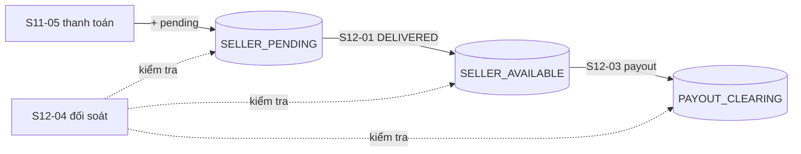

# Plan Sprint 12 — Payout & Release · v2.0.0

> Sprint: [sprint-12.md](../sprints/sprint-12.md) *(draft: refine AC trước khi bắt đầu)* · Tổng quan v2: [README](../README.md)
>
> **Cách dùng plan:** đọc "Khái niệm" → tự làm → kẹt quá 30 phút mới mở Hint 1 → Hint 2 → Hint 3. Tự nghĩ test case trước khi mở đáp án.
>
> 🔒 Chuyển tiền và payout là business logic: Hint 3 chỉ có **pseudo-code**. PR của S12-01, S12-03, S12-05 chạy `/security-review`.

## 0. Trước khi bắt đầu

- Sprint 11 xong: ledger có bút toán `PAYMENT_CAPTURED` cho mọi đơn `PAID` (kể cả đơn cũ đã backfill), khách xác nhận được `DELIVERED`.
- Giữ ~1 pt dự phòng. Nếu S11 còn dở, làm xong trước.
- Ôn lại [plan Sprint 11](sprint-11.md) mục 1 (quy ước dấu) và S11-04 (bẫy "current transaction is aborted").

**Câu hỏi cần trả lời được trước khi code:**
1. Hai admin cùng bấm "Chi trả 100 000" cho một shop có số dư khả dụng 150 000. Điều gì ngăn số dư âm 50 000?
2. "Đối soát" (reconciliation) kiểm tra điều gì mà test đơn vị không kiểm tra được?
3. Xóa một field khỏi API thì version tiếp theo phải là gì theo [rule 01](../../rules/01-git-branching.md#quy-tắc-đánh-version-semver), và cần ghi gì trong changelog?

## 1. Bức tranh tổng

Vòng đời một đồng tiền của shop A (tiếp ví dụ sprint 10–11, sellerNet = 15 900), dấu theo quy ước dương = Nợ, âm = Có:

| Sự kiện | `PLATFORM_CLEARING` | `SELLER_PENDING` A | `SELLER_AVAILABLE` A | `PAYOUT_CLEARING` | `PLATFORM_REVENUE` | Số dư hiển thị cho seller |
|---|---|---|---|---|---|---|
| Khách thanh toán (S11-05), phần của A | +15 999 (999 hàng + 15 000 ship) | −15 900 | | | −99 | pending 15 900 · available 0 |
| Khách nhận hàng (S12-01) | | +15 900 | −15 900 | | | pending 0 · available 15 900 |
| Admin chi trả 10 000 (S12-03) | | | +10 000 | −10 000 | | pending 0 · available 5 900 |

`PAYOUT_CLEARING` là tài khoản **thuận Có**: "tiền đã chi cho seller, chờ đối chiếu với sao kê ngân hàng". Với payout giả lập của v2 thì không có ngân hàng, nhưng tách tài khoản này giúp đối soát sau này. Tiền sàn thật sự còn giữ = **Σ thô** (chưa đổi dấu) của `PLATFORM_CLEARING` + `PAYOUT_CLEARING`, với ví dụ đầy đủ ở sprint 11 là 50 999 + (−10 000) = 40 999. Đừng áp `displayBalance` (đổi dấu) vào phép tính này.



## 2. Thứ tự & phụ thuộc

```
S12-01 pending → available ──▶ S12-02 số dư & sao kê ──▶ S12-03 payout ──▶ S12-04 đối soát
S12-05 audit + xóa API deprecated (độc lập, làm song song) ──▶ S12-06 release
```

- **Rủi ro lớn nhất:** S12-03 (tiền đi ra). Test đồng thời là bắt buộc.
- S12-05 là thay đổi phá vỡ API: chỉ merge khi web/admin/seller đã ngừng dùng các field/endpoint deprecated (kiểm tra bằng grep trong repo).
- Changelog và retro là tài liệu: Claude viết từ danh sách PR và ghi chú của bạn.

---

## 3.1 S12-01 · Chuyển tiền pending → available khi giao xong

### Khái niệm cần nắm
- **Sự kiện nghiệp vụ kéo theo bút toán, trong cùng transaction:** `SHIPPED → DELIVERED` (S11-03) và bút toán `DELIVERY_CONFIRMED` (source = VendorOrder) phải cùng thành công hoặc cùng thất bại. Nếu tách ra: đơn đã `DELIVERED` mà tiền vẫn pending (seller không rút được), hoặc ngược lại.
- **Idempotent theo VendorOrder:** khóa `(VENDOR_ORDER, vendorOrderId, DELIVERY_CONFIRMED)`. Nhưng ở đây còn có hàng rào sớm hơn: update có điều kiện `status = SHIPPED` chỉ thành công một lần, nên bút toán chỉ được ghi khi update thành công.
- **Ranh giới:** `orders` gọi `ledger.post(tx, …)`. Ledger không biết "giao hàng" là gì.
- **Backfill:** VendorOrder đã `DELIVERED` trước khi có tính năng này (từ S11-03 tới khi S12-01 lên production) cần bút toán tương ứng. Script idempotent, giống backfill của S11-05.

### Hướng tiếp cận
1. Hàm thuần `deliveryEntries(vendorOrder)` → `[SELLER_PENDING(store) +sellerNet, SELLER_AVAILABLE(store) −sellerNet]`.
2. Thêm `ledger.post` vào transaction `markReceived` của S11-03, **sau** update có điều kiện thành công.
3. Script backfill cho VendorOrder `DELIVERED` chưa có bút toán.
4. Test: thành công, 409 (không có bút toán), lặp lại.

### File dự kiến tạo/sửa
`apps/api/src/orders/{delivery-entries.ts,delivery-entries.test.ts,vendor-orders.service.ts}`, `apps/api/scripts/backfill-delivery-ledger.ts`, `apps/api/test/ledger-delivery.e2e-spec.ts`.

### Tự nghĩ test case trước
<details><summary>Đáp án tham khảo</summary>

- `SHIPPED → DELIVERED` → pending của shop giảm `sellerNet`, available tăng `sellerNet`, tổng toàn DB vẫn 0.
- VendorOrder đang `CONFIRMED` (chưa giao) → 409, **không** có bút toán.
- Gọi "đã nhận hàng" 2 lần → lần 2 trả 409, chỉ một bút toán.
- Đơn 2 shop, chỉ shop A giao → chỉ A có tiền available.
- Giả lập `ledger.post` lỗi → VendorOrder **vẫn** `SHIPPED` (rollback).
- Backfill chạy 2 lần → không trùng.
</details>

### Gợi ý
<details><summary>Hint 1: hướng đi</summary>

Ticket này chỉ thêm 2–3 dòng vào transaction có sẵn của S11-03. Công sức nằm ở test rollback và backfill.
</details>

<details><summary>Hint 2: khái niệm/API</summary>

Để test rollback, inject một `LedgerService` giả throw lỗi (Nest testing module `overrideProvider`). Kiểm tra trạng thái VendorOrder trong DB sau đó.
</details>

<details><summary>Hint 3: pseudo-code</summary>

```
markReceived(userId, orderId, vendorOrderId):
  transaction(tx):
    n = updateMany(where { id: vendorOrderId, orderId, status: SHIPPED, order.userId }, data { status: DELIVERED, deliveredAt }).count
    if n == 0: throw (404 | 409)
    vo = tx.vendorOrder.find(vendorOrderId)
    ledger.post(tx, { sourceType: VENDOR_ORDER, sourceId: vo.id, kind: DELIVERY_CONFIRMED, entries: deliveryEntries(vo) })
```
</details>

### Bẫy thường gặp
| Triệu chứng | Nguyên nhân | Cách tránh |
|---|---|---|
| Đơn `DELIVERED` nhưng seller không thấy tiền khả dụng | Bút toán ghi ngoài transaction và bị lỗi | Cùng transaction |
| Tiền available tăng 2 lần | Ghi bút toán trước khi kiểm tra update có điều kiện | Chỉ ghi khi `count = 1`, cộng khóa idempotency |
| Đơn giao từ tuần trước không có tiền available | Chưa backfill | Script backfill, kiểm tra bằng đối soát (S12-04) |

### Kiểm chứng AC
- [ ] Test: `DELIVERED` → pending giảm, available tăng đúng `sellerNet`.
- [ ] Test: chuyển trạng thái thất bại (409) → không có bút toán.
- [ ] Test: gọi lặp → không ghi trùng.

### Đọc thêm
- NestJS testing (testing module, `overrideProvider`): https://docs.nestjs.com/fundamentals/testing

---

## 3.2 S12-02 · Seller dashboard số dư & sao kê

### Khái niệm cần nắm
- **Số dư = truy vấn, không phải cột:** `pending = −Σ entry(SELLER_PENDING của shop)`, `available = −Σ entry(SELLER_AVAILABLE của shop)` (đổi dấu vì là tài khoản thuận Có, S11-04).
- **Sao kê (statement) với số dư lũy kế:** mỗi dòng là một entry của tài khoản `SELLER_AVAILABLE` (hoặc cả hai tài khoản, tùy thiết kế), kèm "số dư sau giao dịch". Tính bằng **window function** của SQL (`SUM(amount) OVER (ORDER BY createdAt, id)`), không tính trong vòng lặp ở app (sai khi phân trang).
- **Phân trang sao kê:** số dư lũy kế phải tính trên **toàn bộ** lịch sử rồi mới cắt trang. Nếu tính trên trang hiện tại thì trang 2 bắt đầu từ 0 là sai.
- **Ownership:** chỉ shop của người gọi (guard `CurrentStore`). Seller khác → 404/không có dữ liệu.
- **Hiệu năng (để ý, chưa cần tối ưu):** `SUM` trên toàn bộ entry chạy tốt với dữ liệu v2. Khi dữ liệu lớn, giải pháp là snapshot số dư định kỳ (một dạng cache có kiểm chứng). Đó là chuyện của v4, sau khi **đo**.

### Hướng tiếp cận
1. `GET /v1/seller/balance` → `{ pendingMinor, availableMinor, currency }`.
2. `GET /v1/seller/statement?page=&pageSize=` → entry của shop, mới nhất trước, có `balanceAfterMinor`, loại sự kiện, link tới đơn/payout. Index `(accountId, createdAt, id)` cho `LedgerEntry`.
3. Dashboard trong seller app: 2 thẻ số dư + bảng sao kê.

### File dự kiến tạo/sửa
`apps/api/src/ledger/{index.ts,statement.ts}`, `apps/api/src/orders/seller-finance.controller.ts` (đặt trong `orders`: `orders → ledger` đúng chiều. Đặt trong `stores` sẽ tạo phụ thuộc `stores → ledger` không có trong sơ đồ), `packages/contracts/src/ledger/*.ts`, `apps/seller/src/routes/_authed/index.tsx`, `apps/seller/src/features/finance/**`, migration (index).

### Tự nghĩ test case trước
<details><summary>Đáp án tham khảo</summary>

- Sau ví dụ ở mục 1: balance = pending 0, available 5 900.
- Sao kê tài khoản available có 2 dòng (giao hàng, payout): số dư sau từng dòng là 15 900 rồi 5 900, hiển thị mới nhất trước. Nếu hiển thị cả pending, mỗi tài khoản có số dư lũy kế **riêng** (`PARTITION BY "accountId"`), không cộng chung.
- Trang 2 của sao kê có `balanceAfter` đúng (không bắt đầu từ 0).
- Seller B gọi → chỉ thấy số liệu của B.
- So sánh `balance` với tính tay từ danh sách đơn `DELIVERED` − payout (test kiểm chứng chéo).
- Hai entry cùng `createdAt` → thứ tự ổn định nhờ `id`.
</details>

### Gợi ý
<details><summary>Hint 1: hướng đi</summary>

Viết câu SQL sao kê trong `psql` trước, kiểm tra với dữ liệu ví dụ, rồi mới đưa vào code (`$queryRaw` có tham số).
</details>

<details><summary>Hint 2: khái niệm/API</summary>

- Window function: `SUM(e."amountMinor") OVER (PARTITION BY e."accountId" ORDER BY e."createdAt", e."id")`. Bọc trong subquery rồi mới `ORDER BY … DESC LIMIT … OFFSET …`.
- Prisma `$queryRaw` với tagged template để tham số được escape đúng (không ghép chuỗi SQL).
- Kết quả `SUM` của Postgres trên `int` là `bigint`, Prisma trả `BigInt`: chuyển đổi trước khi trả JSON.
</details>

<details><summary>Hint 3: khung SQL (truy vấn đọc, được phép có khung)</summary>

```sql
SELECT * FROM (
  SELECT e."id", e."createdAt", e."amountMinor", t."kind", t."sourceType", t."sourceId",
         SUM(e."amountMinor") OVER (ORDER BY e."createdAt", e."id") AS "runningSum"
  FROM "LedgerEntry" e
  JOIN "LedgerTransaction" t ON t."id" = e."transactionId"
  WHERE e."accountId" = $1
) s
ORDER BY s."createdAt" DESC, s."id" DESC
LIMIT $2 OFFSET $3;
-- balanceAfter hiển thị cho seller = -runningSum (tài khoản thuận Có)
```
</details>

### Bẫy thường gặp
| Triệu chứng | Nguyên nhân | Cách tránh |
|---|---|---|
| Số dư lũy kế trang 2 bắt đầu lại từ 0 | Tính trong app trên dữ liệu đã phân trang | Window function trên toàn lịch sử, phân trang sau |
| Lỗi `Do not know how to serialize a BigInt` | `SUM` trả `bigint` | Chuyển sang `number` (khi chắc chắn an toàn) hoặc string |
| SQL injection trong `$queryRaw` | Ghép chuỗi | Tagged template / tham số |
| Số dư hiện âm | Quên đổi dấu | Dùng hàm hiển thị chung của ledger |

### Kiểm chứng AC
- [ ] Test: số dư khớp với tổng bút toán và với tính tay chéo.
- [ ] Test: seller A không xem được số dư/sao kê của B.
- [ ] Test: phân trang + `balanceAfter` đúng, thứ tự ổn định.

### Đọc thêm
- PostgreSQL window functions: https://www.postgresql.org/docs/current/tutorial-window.html
- Prisma raw queries (`$queryRaw`, an toàn với tham số): https://www.prisma.io/docs/orm/prisma-client/using-raw-sql/raw-queries

---

## 3.3 S12-03 · Admin chi trả cho seller (payout giả lập)

### Khái niệm cần nắm
- **Race condition trên số dư tính từ SUM:** "đọc available → nếu đủ thì ghi bút toán" có cùng lỗi với oversell (S10-03): hai payout đồng thời cùng đọc 150 000, cùng chi 100 000 → available −50 000. Nhưng khác S10-03: **không có một dòng nào** để `UPDATE … WHERE balance >= x`, vì số dư là tổng.
- **Khóa để tuần tự hóa theo shop:** trước khi đọc số dư, khóa một dòng đại diện cho shop: `SELECT "id" FROM "LedgerAccount" WHERE "key" = $1 FOR UPDATE` (với `key = 'SELLER_AVAILABLE:<storeId>'`. Tên bảng/cột phải có ngoặc kép vì Prisma tạo tên phân biệt hoa thường. Nếu so sánh với cột enum thì phải ép kiểu tham số, ví dụ `$1::"LedgerAccountType"`, cột `key` dạng text giúp tránh việc này). Payout thứ hai của **cùng shop** phải chờ, rồi đọc số dư **sau** khi payout đầu đã commit. Payout của shop khác không bị chặn. (Phương án khác: advisory lock theo `storeId`, hoặc isolation `SERIALIZABLE` + retry. Ghi lựa chọn vào ADR-0009.) Cơ chế "khóa rồi mới đọc tổng" đúng ở **READ COMMITTED** (mặc định), vì mỗi câu lệnh lấy snapshot mới sau khi có khóa. Ở `REPEATABLE READ`, payout thứ hai đọc snapshot từ đầu transaction và thấy số dư cũ.
- **Idempotency-Key cho payout:** admin bấm 2 lần hoặc mạng retry → cùng một Payout. Unique `(storeId, idempotencyKey)` (bài học PXM-37/S10).
- **Payout là bản ghi + bút toán:** bảng `Payout` (storeId, amountMinor, status `PAID`, createdBy, idempotencyKey) để có nghiệp vụ và hiển thị. Bút toán `PAYOUT` (source = Payout): `SELLER_AVAILABLE +x`, `PAYOUT_CLEARING −x`. Cả hai cùng transaction.
- **Ai được chi trả:** chỉ ADMIN. Seller không tự rút ở v2 (tự rút = thêm luồng yêu cầu/duyệt, ngoài phạm vi).

### Hướng tiếp cận
1. Viết test đồng thời **trước**: available 150 000, hai payout 100 000 song song → đúng một thành công, một 422, available cuối = 50 000. Chạy với cài đặt ngây thơ để thấy đỏ.
2. Schema `Payout` + migration.
3. Service: transaction → khóa dòng tài khoản available của shop → kiểm tra idempotency → tính available → đủ thì tạo Payout + `ledger.post` → không đủ thì 422.
4. Admin UI: danh sách shop có số dư khả dụng (query tổng hợp), form chi trả (dùng `parseMoneyInput`), lịch sử payout.
5. Seller thấy dòng payout trong sao kê (S12-02).

### File dự kiến tạo/sửa
`apps/api/prisma/schema.prisma` + migration, `apps/api/src/orders/payouts.service.ts` (đặt trong `orders`. Nếu muốn tách module `payouts` riêng thì phải cập nhật ADR-0008, sơ đồ module trong README v2 và rule CI của S8-01), `apps/api/src/ledger/{index.ts,locks.ts}`, `packages/contracts/src/payouts/*.ts`, `apps/admin/src/features/payouts/**`, `apps/api/test/payouts.e2e-spec.ts`.

### Tự nghĩ test case trước
<details><summary>Đáp án tham khảo</summary>

1. available 15 900, payout 10 000 → 201, available 5 900 (bảng mục 1).
2. Payout 20 000 > available → 422, không có Payout, không có bút toán.
3. Payout `0` hoặc âm hoặc thập phân → 400.
4. Hai payout 100 000 đồng thời, available 150 000 → một 201, một 422, available 50 000, **không bao giờ âm**.
5. Hai payout đồng thời cho **hai shop khác nhau** → cả hai thành công (khóa không chặn chéo shop).
6. Cùng `Idempotency-Key` gửi 2 lần (tuần tự và đồng thời) → cùng một Payout, một bút toán.
7. Cùng key nhưng số tiền khác → 422 (bài học v1 PXM-37).
8. Seller/khách gọi endpoint payout → 403.
9. Shop `SUSPENDED` có số dư → được chi trả hay không? Quyết định (thường: vẫn trả tiền đã giao thành công) và test.
</details>

### Gợi ý
<details><summary>Hint 1: hướng đi</summary>

Test 4 là trọng tâm. Nếu nó xanh ngay với cài đặt "đọc rồi ghi", test của bạn chưa thật sự đồng thời (xem bẫy test đồng thời ở plan sprint 10).
</details>

<details><summary>Hint 2: khái niệm/API</summary>

- Prisma không có API `FOR UPDATE`: dùng `tx.$queryRaw` với `SELECT … FOR UPDATE` bên trong interactive transaction.
- Advisory lock: `pg_advisory_xact_lock(hashtext(<key>))` (tự nhả khi transaction kết thúc). Hàm trả về `void`, một số phiên bản Prisma không đọc được kết quả `void` qua `$queryRaw`: dùng `$executeRaw`, hoặc `SELECT pg_advisory_xact_lock(...), 1`.
- Tài khoản available phải **tồn tại** thì mới khóa được: upsert theo `key` trước khi khóa (cùng cơ chế tạo "lười" của S11-04).
</details>

<details><summary>Hint 3: pseudo-code</summary>

```
createPayout(adminId, storeId, amount, key):
  validate amount: int > 0
  transaction(tx):
    if !stores.exists(storeId): throw 404
    accountKey = "SELLER_AVAILABLE:" + storeId
    ledger.ensureAccount(tx, accountKey)                          // upsert để chắc chắn có dòng để khóa
    tx.$queryRaw`SELECT "id" FROM "LedgerAccount" WHERE "key" = ${accountKey} FOR UPDATE`
    existing = tx.payout.find(storeId, key)
    if existing: return existing.amount == amount ? existing : throw 422 "Key đã dùng cho payout khác"
    available = ledger.displayBalance(tx, SELLER_AVAILABLE(storeId))     // đọc SAU khi đã giữ khóa
    if amount > available: throw 422 "Vượt số dư khả dụng"
    payout = tx.payout.create({ storeId, amount, status: PAID, createdBy: adminId, idempotencyKey: key })
    ledger.post(tx, { sourceType: PAYOUT, sourceId: payout.id, kind: PAYOUT,
                      entries: [SELLER_AVAILABLE(storeId) +amount, PAYOUT_CLEARING -amount] })
    return payout
```
</details>

### Bẫy thường gặp
| Triệu chứng | Nguyên nhân | Cách tránh |
|---|---|---|
| Số dư khả dụng âm sau hai payout đồng thời | Đọc tổng rồi ghi, không khóa | Khóa dòng tài khoản (`FOR UPDATE`) hoặc advisory lock theo shop |
| Payout của mọi shop bị xếp hàng chờ nhau | Khóa quá rộng (khóa cả bảng, hoặc một khóa chung) | Khóa theo shop |
| Đọc số dư trước khi lấy khóa | Thứ tự sai | Lấy khóa → rồi mới đọc |
| Bấm 2 lần chi trả 2 lần | Không có Idempotency-Key | Unique `(storeId, key)` |
| `SELECT … FOR UPDATE` không có tác dụng | Chạy ngoài transaction (autocommit nhả khóa ngay) | Chạy bằng `tx.$queryRaw` trong interactive transaction |

### Kiểm chứng AC
- [ ] Test: payout > available → 422, không có bút toán.
- [ ] Test đồng thời: tổng vượt available → chỉ cái hợp lệ thành công, số dư không bao giờ âm.
- [ ] Test: cùng `Idempotency-Key` → cùng một payout.
- [ ] `/security-review` trên PR.

### Đọc thêm
- PostgreSQL explicit locking (`FOR UPDATE`, advisory locks): https://www.postgresql.org/docs/current/explicit-locking.html
- Prisma, raw queries trong transaction: https://www.prisma.io/docs/orm/prisma-client/using-raw-sql/raw-queries

---

## 3.4 S12-04 · Đối soát (reconciliation)

### Khái niệm cần nắm
- **Đối soát ≠ test:** test kiểm tra code làm đúng với dữ liệu test. Đối soát kiểm tra **dữ liệu thật trên production** có nhất quán không: phát hiện bug đã lọt, dữ liệu bị sửa tay, backfill thiếu.
- **Hai loại kiểm tra:**
  - **Nội tại của ledger:** tổng mọi entry = 0. Mỗi giao dịch cân bằng.
  - **Chéo giữa ledger và dữ liệu nghiệp vụ:** với mỗi shop: `pending = Σ sellerNet của VendorOrder thuộc Order PAID, chưa DELIVERED`, `available = Σ sellerNet của VendorOrder DELIVERED − Σ Payout`. Toàn sàn: `PLATFORM_REVENUE = Σ VendorOrder.commission` (Order PAID), `PLATFORM_CLEARING = Σ Order.total` (Order PAID, so với Σ thô), `PAYOUT_CLEARING = −Σ Payout.amount` (Σ thô).
- **Đặt ở module nào:** kiểm tra chéo cần cả dữ liệu đơn lẫn ledger, nên nằm ở `orders` (orders → ledger là đúng chiều, xem [README v2](../README.md)).
- **Báo cáo phải chỉ ra chỗ lệch,** không chỉ "khớp/không khớp": shop nào, lệch bao nhiêu, ở tài khoản nào.

### Hướng tiếp cận
1. Viết các truy vấn đối soát bằng SQL trong `psql`, chạy trên dữ liệu thật của Neon branch.
2. `GET /v1/admin/reconciliation` → `{ ledgerTotal, ok, mismatches: [{ storeId, account, expected, actual, diff }] }`.
3. Trang admin hiển thị kết quả.
4. Test: dữ liệu bình thường → ok. Chèn một entry lệch (trực tiếp bằng SQL trong test) → báo đúng shop và tài khoản.

### File dự kiến tạo/sửa
`apps/api/src/orders/{reconciliation.service.ts,admin-reconciliation.controller.ts}`, `packages/contracts/src/orders/reconciliation.ts`, `apps/admin/src/routes/_authed/reconciliation.tsx`, `apps/api/test/reconciliation.e2e-spec.ts`.

### Tự nghĩ test case trước
<details><summary>Đáp án tham khảo</summary>

- Sau luồng ví dụ (thanh toán → giao → payout) → ok, không có mismatch.
- Chèn entry lệch vào `SELLER_AVAILABLE` của shop A (cùng một entry đối ứng để giao dịch vẫn cân bằng) → báo A lệch ở available, ledger total vẫn 0.
- Chèn một entry đơn lẻ (giao dịch không cân bằng) → ledger total ≠ 0, báo lỗi nội tại.
- VendorOrder `DELIVERED` chưa có bút toán (giả lập thiếu backfill) → báo lệch pending/available của shop đó.
- Endpoint chỉ admin được gọi.
</details>

### Gợi ý
<details><summary>Hint 1: hướng đi</summary>

Viết từng phép kiểm tra thành một câu SQL độc lập, mỗi câu trả về các dòng lệch. Service chỉ chạy các câu đó và gộp kết quả.
</details>

<details><summary>Hint 2: khái niệm/API</summary>

`FULL OUTER JOIN` giữa "số kỳ vọng theo shop" và "số thực tế theo shop" để bắt cả shop có trong ledger mà không có đơn và ngược lại. `COALESCE` các giá trị null về 0 trước khi so sánh.
</details>

<details><summary>Hint 3: pseudo-code</summary>

```
reconcile():
  mismatches = []
  if Σ all entries != 0: mismatches.push({ scope: LEDGER, diff })
  expectedPending   = theo shop: Σ sellerNet (Order PAID, VendorOrder != DELIVERED)
  expectedAvailable = theo shop: Σ sellerNet (VendorOrder DELIVERED) − Σ payout
  actual*           = theo shop: displayBalance(SELLER_PENDING/AVAILABLE)
  so sánh từng shop (full outer join) → mismatches.push({ storeId, account, expected, actual, diff })
  revenue:  Σ VendorOrder.commission (Order PAID)  vs displayBalance(PLATFORM_REVENUE)
  clearing: Σ Order.total (Order PAID)              vs Σ thô(PLATFORM_CLEARING)
  payout:   −Σ Payout.amount                         vs Σ thô(PAYOUT_CLEARING)
  return { ok: mismatches.empty, mismatches }
```
</details>

### Bẫy thường gặp
| Triệu chứng | Nguyên nhân | Cách tránh |
|---|---|---|
| Báo "khớp" dù có shop lệch | Join trong (inner join) bỏ qua shop chỉ có ở một phía | Full outer join + `COALESCE` |
| Đối soát chậm, timeout trên production | Tính lại mọi thứ mỗi lần mở trang | Chấp nhận ở v2 (dữ liệu nhỏ). v5 chuyển thành job định kỳ |
| Đối soát nằm trong `ledger` và import `orders` | Sai chiều phụ thuộc | Đặt ở `orders` |

### Kiểm chứng AC
- [ ] Test: dữ liệu bình thường → báo cáo "khớp".
- [ ] Test: chèn entry lệch → báo đúng shop lệch.

### Đọc thêm
- Modern Treasury, What is reconciliation: https://www.moderntreasury.com/learn/what-is-reconciliation
- PostgreSQL joins (FULL OUTER JOIN): https://www.postgresql.org/docs/current/queries-table-expressions.html#QUERIES-JOIN

---

## 3.5 S12-05 · Audit phân quyền + xóa API deprecated

### Khái niệm cần nắm
- **Audit có hệ thống, không phải đọc lướt:** liệt kê **mọi** endpoint `/v1/seller/*`, `/v1/admin/*`, `/v1/orders/*` và các route lồng nhau, mỗi endpoint × mỗi vai trò (không token, khách, seller đúng shop, seller khác shop, admin) → kết quả mong đợi → test nào chứng minh. Ô nào không có test là một lỗ hổng tiềm năng. Lấy danh sách endpoint từ OpenAPI JSON để không sót.
- **Xóa API deprecated = breaking change:** theo [rule 01](../../rules/01-git-branching.md#quy-tắc-đánh-version-semver), chỉ được làm ở sprint cuối của version lộ trình → `v2.0.0`. Danh sách v2: `storeId` của category (S8-03), endpoint admin confirm của v1 và dòng transition tạm của ADMIN (S11-01), field `status` cũ của Order (thay bằng `fulfillmentStatus`, S11-01), các field cũ khác của Order nếu đã deprecate ở S10-01.
- **Kiểm tra không còn ai dùng:** trước khi xóa, `grep` toàn repo (web, admin, seller, api-client) để chắc không client nào đọc field/endpoint đó. Contract trong `packages/contracts` đổi thì typecheck sẽ chỉ ra chỗ còn dùng.
- **Changelog `BREAKING CHANGE`:** commit `feat(api)!: …` với footer `BREAKING CHANGE:` (rule 02). Nội dung changelog do Claude viết từ danh sách PR.

### Hướng tiếp cận
1. Xuất danh sách endpoint từ `openapi.json`. Dựng bảng audit (endpoint × vai trò → mong đợi → test). Viết test cho ô còn trống.
2. Chạy `/security-review` toàn repo, xử lý mọi finding High.
3. Xóa field/endpoint deprecated trong contracts và API, chạy `pnpm turbo typecheck` để tìm chỗ còn dùng, sửa.
4. Commit theo Conventional Commits có `BREAKING CHANGE`.

### File dự kiến tạo/sửa
`packages/contracts/src/**` (xóa field deprecated), `apps/api/src/**` (xóa endpoint), `apps/api/test/authz-matrix.e2e-spec.ts`, mô tả PR có bảng audit (Claude soạn từ kết quả của bạn).

### Tự nghĩ test case trước
<details><summary>Đáp án tham khảo</summary>

- Một test "ma trận" duy nhất, sinh từ danh sách endpoint, chạy mọi vai trò. Endpoint mới thêm sau này mà không có trong bảng → test fail (buộc phải khai báo kỳ vọng).
- `GET /v1/categories` không còn `storeId`.
- `PATCH /v1/admin/orders/:id/confirm` → 404 (đã xóa).
- `pnpm turbo typecheck` xanh sau khi xóa (không client nào còn dùng).
</details>

### Gợi ý
<details><summary>Hint 1: hướng đi</summary>

Bảng audit chính là input của test: viết bảng dạng dữ liệu (mảng object) trong file test, rồi `it.each`.
</details>

<details><summary>Hint 2: khái niệm/API</summary>

Đọc `openapi.json` trong test để so sánh danh sách endpoint thực tế với bảng kỳ vọng. Thiếu ở bảng → fail.
</details>

<details><summary>Hint 3: khung</summary>

```
EXPECTED = [
  { method: PATCH, path: "/v1/seller/products/:id", anon: 401, customer: 403, sellerOwn: 200, sellerOther: 404, admin: 403 },
  ...
]
test "mọi endpoint trong openapi.json đều có trong EXPECTED"
it.each(EXPECTED × roles) → gọi endpoint với dữ liệu dựng sẵn → expect status
```
</details>

### Bẫy thường gặp
| Triệu chứng | Nguyên nhân | Cách tránh |
|---|---|---|
| Endpoint mới không được audit | Bảng viết tay, quên cập nhật | Test so khớp bảng với OpenAPI |
| Xóa field làm vỡ seller app trên production | Deploy API trước khi deploy client đã bỏ dùng field | Client bỏ dùng trước (đã làm trong các sprint trước), grep + typecheck |
| Changelog không nói rõ breaking change | Commit thiếu `!`/footer | Theo rule 02 |

### Kiểm chứng AC
- [ ] Bảng audit (endpoint × vai trò → mong đợi → test) không còn ô trống, nằm trong mô tả PR.
- [ ] Không còn finding High từ `/security-review`.
- [ ] OpenAPI không còn field deprecated.

### Đọc thêm
- OWASP API Security Top 10 (2023): https://owasp.org/API-Security/editions/2023/en/0x11-t10/
- Conventional Commits, breaking changes: https://www.conventionalcommits.org/en/v1.0.0/#commit-message-with-description-and-breaking-change-footer

---

## 3.6 S12-06 · Release v2.0.0 & retro

### Khái niệm cần nắm
- **Release major đầu tiên sau v1:** theo quy ước của PixelMart, `v2.0.0` đánh dấu kết thúc version lộ trình v2, và là release được phép chứa breaking change (S12-05).
- **Smoke test là kịch bản kinh doanh đầy đủ:** không chỉ "trang mở được", mà là toàn bộ luồng tiền: mở shop → bán → thanh toán → giao → số dư → payout → đối soát khớp.
- **Retro tổng của version:** velocity v2 so với v1, ước lượng đúng/sai ở đâu (đặc biệt các ticket tiền và migration), tech debt mang sang (hoàn kho đơn thất bại, khoảng hở charge/ghi sổ, đối soát thành job định kỳ: đều là input cho v5).
- **Phân công:** bạn chạy release và smoke test, cung cấp ghi chú + velocity. Claude viết changelog, GitHub Release notes, `docs/retro/sprint-12.md`, `docs/retro/v2.md`, và lập nội dung Epic v3.

### Hướng tiếp cận
1. Code freeze → release checklist ([rule 04](../../rules/04-sprint-lifecycle.md#release-checklist-ngày-13)).
2. Chạy migration và script backfill S12-01 trên production theo thứ tự, ghi lại. (Backfill S11-05 đã chạy ở release v1.4.0. Chạy lại để xác nhận, vì nó idempotent.)
3. PR `develop → main` (merge commit), tag `v2.0.0`, GitHub Release có mục BREAKING CHANGE.
4. Smoke test theo Exit criteria trong [README v2](../README.md#exit-criteria). Chạy đối soát trên production → phải khớp.
5. Cung cấp ghi chú retro cho Claude.

### File dự kiến tạo/sửa
Không có code mới. Claude viết: `docs/retro/sprint-12.md`, `docs/retro/v2.md`, cập nhật `docs/README.md` (trạng thái v2), nội dung GitHub Release.

### Tự nghĩ test case trước
Smoke test production cho release này gồm những bước nào? Liệt kê trước khi mở đáp án.

<details><summary>Đáp án tham khảo</summary>

1. Tài khoản mới đăng ký mở shop → admin duyệt → seller vào `seller.<domain>`.
2. Seller tạo 2 sản phẩm, đăng bán. Shop PixelMart (tài khoản seller chính hãng) vẫn bán bình thường.
3. Khách mua giỏ có hàng của 2 shop → 1 đơn, 2 VendorOrder, tồn kho giảm.
4. Mỗi seller xác nhận → giao. Khách xác nhận nhận hàng từng shop.
5. Seller thấy số dư available đúng `sellerNet`. Admin chi trả một phần → sao kê có dòng payout.
6. Đối soát trên production: khớp.
7. API deprecated đã xóa → client không lỗi (kiểm tra cả 3 app).
8. Sentry không có issue mới sau 30 phút.
</details>

### Gợi ý
<details><summary>Hint 1: hướng đi</summary>

Viết smoke test thành checklist trước ngày release (Claude có thể soạn từ Exit criteria), rồi tick từng bước trên production.
</details>

<details><summary>Hint 2: khái niệm/API</summary>

`gh release create v2.0.0 --generate-notes --notes-start-tag v1.0.0`, sau đó để Claude biên tập lại thành changelog có nhóm (Features, Breaking changes, Fixes).
</details>

<details><summary>Hint 3: khung</summary>

```
Ngày 13: freeze → CI xanh → migrate + backfill (staging = Neon branch trước) → PR release → merge commit → tag v2.0.0
Ngày 14: smoke test checklist → đối soát → demo video → ghi chú retro → Claude viết retro + Epic v3
```
</details>

### Bẫy thường gặp
| Triệu chứng | Nguyên nhân | Cách tránh |
|---|---|---|
| Số dư seller sai ngay sau release | Quên chạy backfill trên production | Backfill nằm trong release checklist, đối soát xác nhận |
| Seller app lỗi sau release | API xóa field trước khi client bỏ dùng | Grep + typecheck ở S12-05, deploy client trước |
| Retro chỉ toàn cảm xúc | Không có số liệu | Velocity, số bug sau release, số finding security, kết quả đối soát |

### Kiểm chứng AC
- [ ] Tag `v2.0.0`, GitHub Release có changelog đầy đủ kèm mục BREAKING CHANGE.
- [ ] `docs/retro/v2.md` đã có (Claude viết từ ghi chú của bạn), Epic v3 đã tạo trên Jira.

### Đọc thêm
- Keep a Changelog: https://keepachangelog.com/
- Semantic Versioning: https://semver.org/

---

## 4. Tự kiểm tra cuối sprint

1. Vì sao chuyển trạng thái `DELIVERED` và bút toán pending → available phải cùng một transaction?
<details><summary>Gợi ý</summary>

Một bước thành công còn bước kia thất bại thì trạng thái nghiệp vụ và sổ sách lệch nhau: đơn đã giao mà seller không có tiền, hoặc có tiền cho đơn chưa giao.
</details>

2. Số dư là tổng các bút toán, vậy làm sao chống chi trả vượt số dư khi có hai payout đồng thời?
<details><summary>Gợi ý</summary>

Tuần tự hóa theo shop: khóa dòng tài khoản (`FOR UPDATE`) hoặc advisory lock, rồi mới đọc số dư. Payout thứ hai chờ và thấy số dư sau khi payout đầu commit.
</details>

3. Sao kê có số dư lũy kế: vì sao phải dùng window function thay vì tính trong app?
<details><summary>Gợi ý</summary>

Số dư lũy kế phụ thuộc toàn bộ lịch sử trước đó. Tính trên dữ liệu đã phân trang thì mỗi trang bắt đầu sai. Window function tính trên toàn lịch sử rồi mới cắt trang.
</details>

4. Đối soát phát hiện được những lỗi nào mà test không phát hiện được?
<details><summary>Gợi ý</summary>

Lỗi trên dữ liệu thật: backfill thiếu, dữ liệu bị sửa tay, bug chỉ xuất hiện với dữ liệu production, bản ghi bị một đường code cũ ghi sai.
</details>

5. Vì sao xóa API deprecated chỉ làm ở sprint cuối của version?
<details><summary>Gợi ý</summary>

Đó là breaking change. Quy ước PixelMart: không phá vỡ API trong một version lộ trình, dồn thay đổi phá vỡ vào `vN.0.0` để client có thời gian chuyển đổi và changelog nói rõ.
</details>

6. Những khoảng trống nào của v2 sẽ được giải quyết ở v4 và v5?
<details><summary>Gợi ý</summary>

v4: trừ kho flash sale và hiệu năng số dư (đo bằng Prometheus, rồi tối ưu bằng Redis/snapshot). v5: hoàn kho cho đơn thanh toán thất bại, khoảng hở giữa charge và ghi sổ (outbox), đối soát định kỳ và payout tự động bằng job.
</details>

## 5. Kịch bản demo

Video **demo v2** (5 phút, đưa vào README/portfolio):
1. 30 giây: PixelMart từ một cửa hàng thành marketplace. Sơ đồ module và ER.
2. Mở shop → admin duyệt → seller đăng sản phẩm.
3. Khách mua giỏ 2 shop → mỗi seller xử lý đơn → khách xác nhận nhận hàng.
4. Seller dashboard: số dư pending → available, sao kê.
5. Admin payout → sao kê seller có dòng payout. Thử payout vượt số dư → bị từ chối.
6. Trang đối soát: khớp.
7. Kỹ thuật (30 giây): CI chặn import chéo module, test đồng thời oversell/payout, release `v2.0.0` có BREAKING CHANGE.
8. Kết: "Tiếp theo: v3 Self-host với Docker Compose và Nginx".
