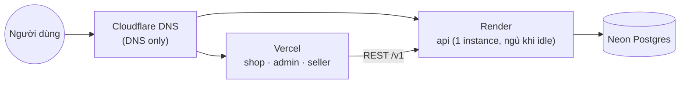
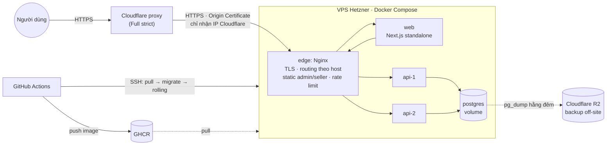

# v3 — Self-host · Release v3.0.0

- Sprint 13 → 15 · tag `v2.1.0` → `v2.2.0`, kết thúc bằng **`v3.0.0`** (quy ước ở [rule 01](../rules/01-git-branching.md#quy-tắc-đánh-version-semver))
- Tổng ước lượng: **~30 pts · 3 sprint** (khoảng 10 pts/sprint, chỉnh theo velocity thật của v2)
- Điều kiện bắt đầu: v2 đã phát hành `v2.0.0`, `docs/retro/v2.md` đã có, các sprint dưới đây đã được refine

## Vì sao có version này

Sau v2, PixelMart chạy trên ba dịch vụ PaaS miễn phí: Render (API), Vercel (web, admin, seller), Neon (Postgres). Mọi thứ chạy được, nhưng bắt đầu lộ giới hạn:

- **Cold start:** API trên Render free ngủ sau khi idle. Khách đầu tiên trong ngày chờ 30–60 giây mới thấy trang chủ.
- **Giới hạn và chi phí khi lớn lên:** Neon free giới hạn dung lượng và giờ compute. Lên gói trả phí cho cả ba dịch vụ thì tổng tiền cao hơn một VPS nhiều lần.
- **Không thấy, không chạm được hạ tầng:** không xem được log Nginx, không tự đặt rate limit theo IP thật, không tự quyết định backup giữ bao lâu. Từ v4 ta cần chạy Prometheus, Grafana, Redis, rồi RabbitMQ ở v5. PaaS free không chạy được những thứ này.

v3 chuyển **toàn bộ** PixelMart về một VPS Hetzner do bạn tự dựng: Docker Compose chạy mọi thành phần, **Nginx** tự viết làm cổng vào duy nhất, Postgres tự host có backup off-site, deploy tự động qua GitHub Actions → GHCR → SSH.

Đây là version "thủ công trước": bạn sẽ tự làm bằng tay những gì PaaS và Kubernetes làm hộ (TLS, routing theo domain, rolling update, health check, backup). Đến v7, khi chuyển sang Kubernetes, bạn sẽ hiểu chính xác từng thứ K8s tự động hóa giúp bạn.

## Kiến trúc: trước → sau

**Trước (v2):** ba nhà cung cấp, mỗi nhà một phần.

**Sau (v3):** một VPS, một cổng vào.

Một vài điểm cần để ý ngay từ đầu:
- **Chỉ `edge` mở cổng ra ngoài** (443, và 80 để redirect). Postgres, API, web chỉ nằm trong mạng nội bộ của Compose.
- **Tên miền không đổi:** `shop.`, `admin.`, `seller.`, `api.<domain>`. Cookie, CORS và mọi URL client đang dùng giữ nguyên. Khách hàng không cần biết hạ tầng đã đổi.
- **Hai replica API** để học load balancing và rolling update thủ công. `web` và `edge` chỉ có một replica: lúc thay chúng có gián đoạn vài giây, được đo và chấp nhận ở v3. Một VPS vẫn là một điểm lỗi duy nhất (single point of failure). Ta chấp nhận điều đó ở v3, và ghi rõ trong ADR.
- **Parallel run:** trong sprint 13–14, stack trên VPS chạy song song với PaaS ở các hostname preview (`next-shop.<domain>`…) với dữ liệu riêng. Production chỉ chuyển sang VPS ở sprint 15 (cutover).

## Học xong bạn làm được

1. Dựng và **hardening** một VPS Linux: user riêng, SSH chỉ bằng key, firewall (và vì sao UFW không chặn được port Docker đã publish), cập nhật bảo mật tự động.
2. Viết **image production** cho từng loại app: API Node, Next.js `standalone`, SPA tĩnh. Hiểu khác biệt giữa biến môi trường lúc build và lúc chạy.
3. Viết **Compose production**: mạng nội bộ, volume, healthcheck, restart policy, giới hạn tài nguyên, xoay log.
4. Tự viết **`nginx.conf`**: server block theo host, reverse proxy, load balancing hai upstream, SPA fallback, cache static, gzip, rate limit theo IP thật sau Cloudflare.
5. Cấu hình **TLS qua Cloudflare** (proxy + Origin Certificate + Full strict), và hiểu ACME/Let's Encrypt để tự cấp chứng chỉ khi không dùng Cloudflare.
6. Xây pipeline **CI build → GHCR → SSH deploy**: migration trước, rolling update từng replica, smoke test, rollback bằng tag image.
7. **Backup và restore Postgres** có kiểm chứng: backup off-site, retention, cảnh báo khi backup không chạy, diễn tập restore và đo RPO/RTO.
8. Lên kế hoạch và thực hiện **cutover production** có maintenance window, kiểm tra dữ liệu và phương án rollback.

## Kiến thức cần đọc trước

| File | Đọc khi nào |
|---|---|
| [docker.md](../knowledge/docker.md) (mục Compose production, GHCR) | Trước sprint 13 |
| [linux-vps.md](../knowledge/linux-vps.md) | Trước S13-01 |
| [nginx.md](../knowledge/nginx.md) | Trước S13-04 |
| [dns-tls.md](../knowledge/dns-tls.md) (có phần ACME/Let's Encrypt) | Trước S13-05 |
| [github-actions.md](../knowledge/github-actions.md) (mục deploy qua SSH) | Trước sprint 14 |
| [paas-vs-self-host.md](../knowledge/paas-vs-self-host.md) | Bất kỳ lúc nào, nên đọc trước khi viết ADR ở S15-04 |

## Hạ tầng & chi phí

| Thành phần | Dịch vụ | Chi phí (ước tính, kiểm tra lại khi đặt) |
|---|---|---|
| VPS | Hetzner Cloud, x86, ~4 vCPU / 8 GB RAM / 80 GB SSD (dòng CX hoặc CPX), Ubuntu 24.04 LTS | ~€6–12/tháng (Hetzner tăng giá từ 04/2026, một số gói có lúc hết hàng) |
| IPv4 | Đi kèm VPS | ~€0.5/tháng. **Bắt buộc**, xem bẫy IPv6 trong plan S13-01 |
| DNS, proxy, TLS edge | Cloudflare Free | 0đ |
| Backup off-site | Cloudflare R2 (free 10 GB-month, không tính egress) | 0đ ở quy mô PixelMart |
| Container registry | GHCR (repo public) | 0đ |
| Uptime monitor | Dịch vụ free (UptimeRobot, Better Stack… chọn ở S15-01) | 0đ |
| Error tracking | Sentry Developer (giữ từ v1) | 0đ |

Sau cutover (S15-04), Render, Vercel và Neon được dọn đi. Neon giữ thêm một khoảng thời gian làm phương án rollback trước khi xóa.

> **Chọn x86 (amd64), không chọn ARM (CAX).** Runner GitHub Actions mặc định là amd64. Build image cho ARM cần QEMU hoặc runner ARM, chậm và dễ dính lỗi `exec format error` (đã nhắc ở plan sprint 1). Muốn thử ARM thì để sau v3.

## Epics

| Epic | Phạm vi | Sprint |
|---|---|---|
| **Self-host Foundation** | VPS + hardening, image production, Compose production, Nginx edge, TLS Cloudflare | 13 |
| **Delivery Pipeline** | Build/push GHCR, deploy SSH, rolling update, rollback, hardening Nginx | 14 |
| **Data Safety** | Postgres backup off-site, restore drill | 14 |
| **Cutover** | Diễn tập chuyển dữ liệu, cutover production, dọn PaaS, uptime monitor | 15 |
| **Release v3.0** | Runbook vận hành, ADR, release, retro | 15 |

## Lộ trình sprint

| Sprint | Plan | Tag | Sprint Goal | Pts |
|---|---|---|---|---|
| [13](sprints/sprint-13.md) | [plan](plans/sprint-13.md) | v2.1.0 | Toàn bộ stack chạy trên VPS bằng Compose sau Nginx, HTTPS qua Cloudflare ở hostname preview | 10 |
| [14](sprints/sprint-14.md) | [plan](plans/sprint-14.md) | v2.2.0 | Merge vào `main` là VPS tự cập nhật không downtime; dữ liệu trên VPS được backup off-site và restore được | 10 |
| [15](sprints/sprint-15.md) | [plan](plans/sprint-15.md) | **v3.0.0** | Production chuyển hẳn sang VPS không mất dữ liệu; PaaS được dọn; phát hành v3.0.0 | 10 |

Mọi sprint của v3 là **draft**: refine (cập nhật AC, estimate lại theo velocity v2) ở buổi refinement trước khi kéo vào sprint.

## Release và môi trường trong v3

[Rule 01](../rules/01-git-branching.md#môi-trường--deploy) vẫn giữ nguyên: `develop` không deploy, `main` là production. Trong v3 có một giai đoạn chuyển tiếp:

| Giai đoạn | `main` deploy tới | Ghi chú |
|---|---|---|
| Sprint 13 | PaaS (như v2). VPS được cập nhật **bằng tay** | Stack VPS chạy ở hostname preview, dữ liệu seed |
| Sprint 14 | PaaS **và** VPS (preview), cùng một commit | Pipeline VPS chạy song song, chưa phục vụ khách. Giữa hai release, preview được deploy bằng `workflow_dispatch` (không bao giờ thử nghiệm bằng cách merge vào `main`) |
| Sprint 15, sau cutover | **Chỉ VPS** | Job deploy Render/Vercel bị xóa ở S15-04 |

Hostname preview (`next-shop.<domain>`, `next-admin.<domain>`, `next-seller.<domain>`, `next-api.<domain>`) là **một level** dưới domain gốc, để Origin Certificate wildcard `*.<domain>` phủ được (xem plan S13-05). Chúng bị gỡ sau cutover.

## Ngoài phạm vi

| Không làm ở v3 | Ghi chú |
|---|---|
| Nhiều VPS, failover, Postgres replication | Một VPS là đủ để học. HA thật cần K8s nhiều node hoặc DB managed, xem v7 |
| Prometheus, Grafana, alert theo metric | v4. v3 chỉ có uptime monitor bên ngoài và Sentry |
| Redis, cache | v4 |
| Kubernetes, Helm, Ingress-NGINX | v7. v3 cố tình làm tay để hiểu cái K8s thay thế |
| Coolify, CapRover, Dokku | Che mất đúng những thứ cần học. Chỉ so sánh trong [paas-vs-self-host.md](../knowledge/paas-vs-self-host.md) |
| Môi trường staging riêng | v7. Preview ở v3 chỉ tồn tại tới cutover |
| Point-in-time recovery (WAL archiving, pgBackRest) | Ghi vào backlog. v3 dùng `pg_dump` hằng đêm, RPO tối đa 24 giờ, ghi rõ trong ADR |
| Let's Encrypt/certbot trên VPS | Học lý thuyết ACME trong [dns-tls.md](../knowledge/dns-tls.md). Thực hành dùng Cloudflare Origin Certificate |
| VPN/bastion cho SSH (Tailscale, WireGuard) | Backlog. v3 dùng SSH key + hạn chế user |

## Exit criteria

- [ ] Mọi ticket sprint 13–15 Done theo [Definition of Done](../rules/06-definition-of-ready-and-done.md)
- [ ] `shop.`, `admin.`, `seller.`, `api.<domain>` phục vụ từ VPS qua Cloudflare, Full (strict); truy cập thẳng IP của VPS không trả nội dung PixelMart
- [ ] Quét port từ một máy ngoài (không thuộc Cloudflare): chỉ thấy 22. Cổng 80/443 chỉ mở cho dải IP Cloudflare. Postgres, API, web không lộ
- [ ] Merge vào `main` → VPS tự cập nhật. Trong pha rolling API, một script gọi `/v1/health` liên tục không nhận lỗi 5xx. Khoảng gián đoạn khi thay `edge`/`web` được đo và ghi trong ADR-0011
- [ ] Rollback về image của release trước trong ≤ 5 phút, có ghi lại thời gian thật
- [ ] Backup chạy hằng đêm lên R2. Đã diễn tập restore thành công, RPO/RTO đo được ghi trong runbook
- [ ] Sau cutover: số bản ghi các bảng chính và báo cáo đối soát ledger (S12-04) khớp giữa Neon và VPS
- [ ] Render, Vercel, Neon đã dọn (hoặc có ngày dọn ghi trong ADR)
- [ ] Tag `v3.0.0`, ADR self-host đã viết, `docs/retro/v3.md` đã có

## Mapping Jira

Ticket v3 sẽ được tạo trên Jira ở buổi refinement trước Sprint 13. Khi đó bảng mã tạm `S13-01…S15-05` → key `PXM-…` sẽ được điền ở đây.
