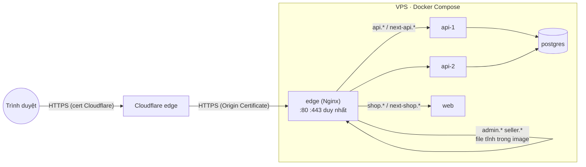

# Plan Sprint 13 — Self-host Foundation · v2.1.0

> Sprint: [sprint-13.md](../sprints/sprint-13.md) *(draft: refine AC trước khi bắt đầu)* · Tổng quan v3: [README](../README.md)
>
> **Cách dùng plan:** đọc "Khái niệm" → tự làm → kẹt quá 30 phút mới mở Hint 1 → Hint 2 → Hint 3. Tự nghĩ test case trước khi mở đáp án.
>
> v3 là version hạ tầng, không có business logic. Hint 3 được phép có cấu hình, nhưng với thứ bạn viết **lần đầu** (`nginx.conf`, Compose production) Hint 3 chỉ là **khung có chỗ trống**. Dockerfile web là Dockerfile thứ hai của bạn nên Hint 3 đầy đủ hơn ([rule 05](../../rules/05-working-with-claude.md)).

## 0. Trước khi bắt đầu

- v2 đã phát hành `v2.0.0`. Production đang chạy trên Render + Vercel + Neon.
- Đọc trước: [linux-vps.md](../../knowledge/linux-vps.md) (mục 1, 2, 4, checklist chọn VPS), [docker.md](../../knowledge/docker.md) (phần Compose production), [nginx.md](../../knowledge/nginx.md) (mục 1, 2, 4), [dns-tls.md](../../knowledge/dns-tls.md) (mục 1, 2).
- Tài khoản: Hetzner Cloud (hoặc nhà cung cấp bạn chọn, đối chiếu checklist), Cloudflare (đã có từ v1).
- Tạo SSH key **riêng cho VPS** trên máy bạn (`ed25519`). Key deploy cho CI sẽ tạo riêng ở sprint 14.
- Kiểm tra phiên bản Postgres của Neon: chạy `SHOW server_version;` trên Neon. Postgres trên VPS phải **cùng major hoặc mới hơn** (cutover ở sprint 15 dùng `pg_dump`/`pg_restore`, và restore vào server cũ hơn thì không được hỗ trợ).

**Câu hỏi cần trả lời được trước khi code:**
1. Trên PaaS, những việc nào đang được làm hộ bạn mà sau sprint này bạn phải tự làm? Liệt kê ít nhất 6 việc.
2. Biến `NEXT_PUBLIC_API_URL` được đọc lúc nào: lúc build hay lúc chạy? Điều đó có nghĩa gì khi một image dùng cho hai môi trường?
3. Khi một request đi `trình duyệt → Cloudflare → Nginx → API`, API thấy IP nào trong `req.ip` nếu không cấu hình gì?

## 1. Bức tranh tổng



Mạng trong Compose:

| Service | `internal` (`internal: true`, không ra Internet) | `public` (ra Internet) | Publish port ra host |
|---|---|---|---|
| `edge` | ✅ (tới api, web) | ✅ | 80, 443 (duy nhất) |
| `api-1`, `api-2` | ✅ (tới postgres) | ✅ (Sentry) | không |
| `web` | ✅ (tới api) | ✅ (Sentry, `next/image` tải ảnh từ URL ngoài) | không |
| `postgres` | ✅ | không | không |

Sau sprint này **chưa** có: deploy tự động (S14-02), backup (S14-04), rate limit và IP thật từ Cloudflare (S14-03). VPS được cập nhật bằng tay.

## 2. Thứ tự & phụ thuộc

```
S13-01 VPS ─────────────────────────────────────────────┐
S13-02 image web + runtime config ─▶ S13-03 compose ─▶ S13-04 edge ─▶ S13-05 TLS + preview
                                     (chạy local trước)                (lên VPS)
```

- S13-01 và S13-02 song song được: một bên làm trên VPS, một bên làm ở máy bạn.
- S13-03 và S13-04 làm và kiểm tra ở **local** trước (`docker compose -f compose.prod.yaml up` trên máy bạn, dùng hostname giả trong file hosts hoặc `curl -H "Host: …"`).
- Chỉ khi cả stack chạy ở local mới đưa lên VPS (S13-05). Tạm thời build image ngay trên VPS, hoặc `docker save | ssh … docker load`. Registry là việc của S14-01.

---

## 3.1 S13-01 · VPS: tạo máy + hardening + Docker

### Khái niệm cần nắm
- **VPS là máy của bạn, kể cả các lỗ hổng.** Bot quét SSH tìm máy mới chỉ trong vài phút sau khi máy có IP public. Hardening phải làm **trước** khi chạy bất cứ dịch vụ nào.
- **SSH key thay mật khẩu:** private key nằm trên máy bạn, public key nằm trong `~/.ssh/authorized_keys` trên VPS. Tắt đăng nhập bằng mật khẩu thì brute force mật khẩu trở nên vô nghĩa.
- **Không đăng nhập root:** làm việc bằng user thường có `sudo`. Lỡ tay một lệnh thì thiệt hại nhỏ hơn, và log ghi được ai làm gì.
- **Firewall ngoài VM vs UFW:** UFW chạy trong VM bằng iptables. Docker tự viết rule iptables cho port đã publish, nằm **trước** rule của UFW, nên UFW "deny" không chặn được container ([docs Docker](https://docs.docker.com/engine/network/packet-filtering-firewalls/)). Firewall của nhà cung cấp (Hetzner Cloud Firewall) lọc **trước khi** packet tới VM, nên không bị Docker vượt qua.
- **Nhóm `docker` = root:** user thuộc nhóm `docker` có thể mount `/` của host vào một container và làm mọi thứ. Thêm `deploy` vào nhóm `docker` là chấp nhận điều đó một cách có ý thức.
- **Cập nhật bảo mật tự động** (`unattended-upgrades`): bản vá OpenSSH, kernel, OpenSSL ra liên tục. Không ai nhớ `apt upgrade` mỗi tuần.
- **Swap:** VPS 8 GB vẫn có lúc hết RAM (build, pg_restore). Không có swap thì kernel OOM killer giết process, thường là Postgres.

### Hướng tiếp cận
1. Tạo VPS: Ubuntu 24.04, x86, có IPv4, chọn SSH key của bạn ngay ở bước tạo (không dùng mật khẩu root gửi qua email).
2. Tạo firewall ngoài VM: inbound chỉ 22, 80, 443. Gắn vào VPS **trước** khi làm gì khác.
3. SSH vào bằng root lần đầu → tạo user `deploy`, copy `authorized_keys`, cho `sudo`.
4. Mở **phiên SSH thứ hai** bằng `deploy` và giữ nó mở. Sau đó mới sửa cấu hình `sshd` (tắt root, tắt mật khẩu), kiểm tra cú pháp, reload. Thử đăng nhập bằng một phiên **mới**.
5. `unattended-upgrades`, timezone UTC, swap file, cập nhật hệ thống.
6. Cài Docker Engine + Compose plugin từ repo `download.docker.com`. Thêm `deploy` vào nhóm `docker`. Cấu hình `daemon.json` (log rotation).
7. Kiểm tra từ máy **bên ngoài**: `nmap` IP của VPS.
8. Ghi lại từng lệnh vào file ghi chú. Gửi cho Claude để viết `docs/runbooks/vps-setup.md`.

> **Nhà cung cấp không có firewall ngoài VM** (một số VPS Việt Nam): vẫn bật UFW cho các port của host (SSH), và lọc traffic tới container bằng chain `DOCKER-USER` ([linux-vps.md](../../knowledge/linux-vps.md), phần firewall). Kiểm tra bằng `nmap` từ máy ngoài là bắt buộc, không tin `ufw status`.

### File dự kiến tạo/sửa
Trên VPS: `/etc/ssh/sshd_config.d/*.conf`, `/etc/docker/daemon.json`, `/etc/apt/apt.conf.d/*` (unattended-upgrades), `/swapfile` + `/etc/fstab`. Trong repo: không có file code. Ghi chú lệnh → Claude viết `docs/runbooks/vps-setup.md`.

### Tự nghĩ test case trước
Làm sao chứng minh từng mục hardening thật sự có hiệu lực, chứ không chỉ "đã sửa file cấu hình"?

<details><summary>Đáp án tham khảo</summary>

- `ssh root@<ip>` → `Permission denied (publickey)`.
- `ssh -o PubkeyAuthentication=no -o PreferredAuthentications=password deploy@<ip>` → bị từ chối, không hiện prompt mật khẩu.
- `sudo sshd -T | grep -Ei 'permitrootlogin|passwordauthentication'` → giá trị **hiệu lực** (đã gộp mọi file include), không phải giá trị bạn nghĩ mình đã đặt.
- Từ máy ngoài: `nmap -Pn <ip>` → chỉ 22 mở. Chạy thử một container `-p 8080:80` → `nmap` vẫn **không** thấy 8080 (firewall ngoài VM chặn). Xóa container sau khi thử.
- `sudo unattended-upgrade --dry-run --debug` → không lỗi.
- `free -h` thấy swap. `timedatectl` → UTC.
- `sudo reboot` → sau khi lên lại, `docker ps` chạy được bằng `deploy`, không cần `sudo`.
- `docker info | grep -A3 'Logging Driver'` và `cat /etc/docker/daemon.json` → có `max-size`.
</details>

### Gợi ý
<details><summary>Hint 1: hướng đi</summary>

Thứ tự là tất cả: firewall ngoài VM → user + key → phiên SSH thứ hai → mới sửa `sshd`. Nếu lỡ khóa mình ra ngoài, dùng **console web** của nhà cung cấp (Hetzner: Console trong Cloud Console) để vào lại. Hãy thử mở console một lần ngay từ đầu để chắc chắn nó hoạt động.
</details>

<details><summary>Hint 2: khái niệm/API</summary>

- Ubuntu 24.04 đọc thêm `/etc/ssh/sshd_config.d/*.conf`. Image cloud có thể có sẵn file (ví dụ `50-cloud-init.conf`) đặt `PasswordAuthentication yes`. Với `sshd`, **giá trị đầu tiên được đọc sẽ thắng**, nên đặt file của bạn với tên đứng trước theo thứ tự chữ cái (ví dụ `00-hardening.conf`), rồi kiểm tra bằng `sshd -T`.
- `sshd -t` kiểm tra cú pháp trước khi reload. Trên Ubuntu 24.04, service tên là `ssh` (socket-activated). Kiểm tra docs/`systemctl status ssh` để reload đúng cách.
- Docker: làm theo trang "Install Docker Engine on Ubuntu" (repo apt chính thức), **không** dùng `snap install docker` hay gói `docker.io` của Ubuntu.
- `daemon.json`: `log-driver` `json-file` (hoặc `local`) với `log-opts` `max-size`, `max-file`. Chỉ áp dụng cho container **tạo mới** sau khi restart Docker.
</details>

<details><summary>Hint 3: khung cấu hình</summary>

```text
# /etc/ssh/sshd_config.d/00-hardening.conf (khung — tự điền giá trị và giải thích từng dòng trong ghi chú)
PermitRootLogin ...
PasswordAuthentication ...
KbdInteractiveAuthentication ...
PubkeyAuthentication ...
AllowUsers ...
```

`/etc/docker/daemon.json` (khung; JSON không cho phép comment, đừng chép dòng chú thích vào file):

```json
{
  "log-driver": "...",
  "log-opts": { "max-size": "...", "max-file": "..." }
}
```
Giá trị cụ thể (log giữ bao nhiêu, user nào được SSH) là quyết định của bạn. Ghi lý do vào runbook.
</details>

### Bẫy thường gặp
| Triệu chứng | Nguyên nhân | Cách tránh |
|---|---|---|
| Tự khóa mình ra ngoài sau khi reload `sshd` | Sửa cấu hình mà không giữ phiên thứ hai, hoặc `AllowUsers` sai tên | Luôn giữ một phiên mở. Biết đường vào console web |
| Đã đặt `PasswordAuthentication no` mà vẫn đăng nhập bằng mật khẩu được | File trong `sshd_config.d/` đặt giá trị khác và được đọc trước | Kiểm tra bằng `sshd -T`, đặt tên file của bạn đứng trước |
| `ufw deny 5432` nhưng từ ngoài vẫn kết nối được Postgres | Docker vượt qua UFW với port đã publish | Không publish port DB. Dùng firewall ngoài VM. Kiểm tra bằng `nmap` từ ngoài |
| SSH từ GitHub Actions không tới được VPS (sprint 14) | Tạo VPS chỉ có IPv6 để tiết kiệm. Runner GitHub-hosted không có IPv6 | Giữ IPv4 |
| `permission denied while trying to connect to the Docker daemon socket` | Vừa thêm vào nhóm `docker` nhưng phiên cũ chưa nhận nhóm mới | Đăng xuất rồi đăng nhập lại (hoặc `newgrp docker`) |
| Ổ đĩa đầy sau vài tuần | Log container không giới hạn, image cũ không dọn | `daemon.json` giới hạn log. Dọn image ở script deploy (S14-02) |
| Postgres bị kill lúc restore dữ liệu lớn | Hết RAM, không có swap | Swap file 2–4 GB, giới hạn bộ nhớ cho từng container (S13-03) |
| Snap Docker hành xử lạ (đường dẫn, quyền) | Cài Docker bằng snap | Gỡ, cài từ repo chính thức |

### Kiểm chứng AC
- [ ] Ba lệnh SSH ở "Đáp án tham khảo" cho kết quả đúng.
- [ ] `nmap -Pn <ip>` từ máy ngoài: chỉ 22.
- [ ] `docker run --rm hello-world` bằng `deploy`. Reboot → Docker tự lên.
- [ ] `cat /etc/docker/daemon.json` có giới hạn log.
- [ ] Runbook do Claude viết từ ghi chú của bạn. Bạn đọc lại và xác nhận đủ để dựng một VPS mới từ đầu.

### Đọc thêm
- [linux-vps.md](../../knowledge/linux-vps.md)
- Install Docker Engine on Ubuntu: https://docs.docker.com/engine/install/ubuntu/
- Docker và firewall: https://docs.docker.com/engine/network/packet-filtering-firewalls/
- Hetzner Cloud Firewalls: https://docs.hetzner.com/cloud/firewalls/
- Ubuntu automatic updates: https://documentation.ubuntu.com/server/how-to/software/automatic-updates/

---

## 3.2 S13-02 · Image production cho web + cấu hình lúc chạy (runtime config)

### Khái niệm cần nắm
- **Build once, deploy anywhere:** image là sản phẩm bất biến. Image đã test ở preview phải **chính là** image chạy production. Nếu mỗi môi trường build một image riêng thì bạn đang deploy thứ chưa từng được test.
- **Biến lúc build vs lúc chạy:**
  - `NEXT_PUBLIC_*` (Next.js) và `VITE_*` (Vite) được **thay thẳng vào bundle JS** lúc build. Đổi env khi chạy container không có tác dụng gì với code chạy trong trình duyệt.
  - Code chạy trên server (Server Component, Route Handler, `proxy.ts` của Next.js) đọc `process.env` lúc chạy được, **với điều kiện** trang được render động, không bị prerender thành HTML tĩnh lúc build.
- **Runtime config cho frontend:** các cách phổ biến:
  - **Server đọc env rồi truyền xuống client** (Next.js): layout server đọc `process.env.API_URL`, truyền qua props/context cho client component.
  - **File cấu hình sinh lúc container khởi động** (SPA): ví dụ `/config.js` gán `window.__APP_CONFIG__`, được sinh từ env khi container start (image Nginx chính thức có cơ chế template + `envsubst` sẵn). `index.html` tải file này trước bundle.
  - **Cùng origin, đường dẫn tương đối:** frontend gọi `/v1/...` cùng domain, proxy chuyển sang API. Không cần biết URL API, nhưng thay đổi kiến trúc domain/cookie/CORS của v1. Ghi vào ADR như một phương án đã cân nhắc.
- **Next.js `output: 'standalone'`:** `next build` sinh thư mục `.next/standalone` gồm `server.js` và **chỉ** những file trong `node_modules` thật sự được dùng (output file tracing). Image nhỏ hơn nhiều so với copy toàn bộ `node_modules`.
- **Monorepo + standalone:** tracing phải biết gốc của monorepo để lấy cả `packages/*` (`outputFileTracingRoot`). Khi đó `server.js` nằm trong `.next/standalone/apps/web/`.
- **Không phải mọi thứ đều tự được copy:** `public/` và `.next/static/` phải copy thủ công vào đúng chỗ bên cạnh `server.js`.

### Hướng tiếp cận
1. Liệt kê mọi biến môi trường mà web/admin/seller đang dùng. Đánh dấu biến nào khác nhau giữa preview và production, biến nào được dùng ở trình duyệt.
2. Viết ADR-0010 (bạn quyết định, Claude viết): so sánh ít nhất 2 cách runtime config, chọn một cho web (Next.js) và một cho SPA (admin/seller, đóng gói ở S13-04). Cân nhắc: admin/seller **vẫn chạy trên Vercel** cho tới cutover, nên cách bạn chọn phải chạy được ở cả hai nơi.
3. Sửa code web theo quyết định: bỏ phụ thuộc vào `NEXT_PUBLIC_*` cho các giá trị khác nhau giữa môi trường.
4. Bật `output: 'standalone'`, viết `apps/web/Dockerfile` (dựa trên Dockerfile API của v1).
5. Build với `--platform linux/amd64`. Chạy cùng image với 2 bộ env, kiểm tra Network tab.
6. Kiểm tra lại image API: platform, kích thước, `HEALTHCHECK`, user.

### File dự kiến tạo/sửa
`apps/web/next.config.ts`, `apps/web/Dockerfile`, các file trong `apps/web/src` đang đọc `NEXT_PUBLIC_*`, `apps/api/Dockerfile` (healthcheck), `.dockerignore`. ADR-0010 do Claude viết từ quyết định của bạn.

### Tự nghĩ test case trước
Làm sao chứng minh image **không** chứa URL của môi trường nào bị "đóng băng"?

<details><summary>Đáp án tham khảo</summary>

- Build image **không** truyền env môi trường nào. Chạy với `API_URL=https://next-api.example` → Network tab gọi `next-api`. Chạy lại **cùng image** với `API_URL=http://localhost:3000` → gọi localhost.
- `docker run --rm --entrypoint sh <image> -c "grep -rl 'api.<domain>' /app || echo clean"` → `clean`.
- Trang được prerender lúc build (ví dụ trang tĩnh) không chứa URL API trong HTML.
- `docker run … id` → không phải `uid=0`.
- `docker inspect --format '{{.State.Health.Status}}' <container>` → `healthy` sau vài giây.
- Thiếu env bắt buộc lúc chạy → container thoát ngay với log rõ ràng (fail fast).
</details>

### Gợi ý
<details><summary>Hint 1: hướng đi</summary>

Làm cho `pnpm --filter web build && node .next/standalone/apps/web/server.js` chạy được **ngoài Docker** trước. Khi lệnh này chạy và trang có CSS, ảnh, bạn đã hiểu cần copy những gì vào image.
</details>

<details><summary>Hint 2: khái niệm/API</summary>

- Next.js docs: `output: 'standalone'`, `outputFileTracingRoot`, và mục "Environment Variables → Runtime Environment Variables" (đọc env trên server trong render động).
- Server Component đọc `process.env` sẽ bị đóng băng nếu trang được prerender. Kiểm tra output của `next build` (ký hiệu trang tĩnh/động), và tìm hiểu cách buộc render động (ví dụ `await connection()` hoặc dùng dữ liệu động như `cookies()`).
- `server.js` của standalone nghe theo env `PORT` và `HOSTNAME`. Trong container phải nghe `0.0.0.0`, nếu không `edge` sẽ không kết nối được.
- `next/image` với ảnh từ URL ngoài (ADR-0007): trên VPS, việc tối ưu ảnh chạy trên **server của bạn** và ghi cache vào `.next/cache`. User non-root phải có quyền ghi thư mục này.
- Image `node:*-alpine` không có `curl`. `HEALTHCHECK` dùng `wget` của busybox hoặc một lệnh `node -e` nhỏ.
</details>

<details><summary>Hint 3: Dockerfile web (Dockerfile thứ hai của bạn, giải thích những gì khác API)</summary>

```dockerfile
# syntax=docker/dockerfile:1
ARG NODE_VERSION=24-alpine

FROM node:${NODE_VERSION} AS base
RUN corepack enable
WORKDIR /repo

FROM base AS prune
COPY . .
RUN pnpm dlx turbo@2 prune web --docker

FROM base AS build
COPY --from=prune /repo/out/json/ .
RUN --mount=type=cache,id=pnpm,target=/root/.local/share/pnpm/store \
    pnpm install --frozen-lockfile
COPY --from=prune /repo/out/full/ .
# KHÔNG truyền ARG/ENV URL môi trường nào ở đây → không có gì bị đóng băng
RUN pnpm turbo run build --filter=web

FROM node:${NODE_VERSION} AS runtime
ENV NODE_ENV=production PORT=3000 HOSTNAME=0.0.0.0
WORKDIR /app
# standalone đã gồm server.js + node_modules tối thiểu (traced)
COPY --from=build --chown=node:node /repo/apps/web/.next/standalone ./
# hai thư mục standalone KHÔNG tự copy: đặt cạnh server.js theo cấu trúc monorepo
COPY --from=build --chown=node:node /repo/apps/web/.next/static ./apps/web/.next/static
COPY --from=build --chown=node:node /repo/apps/web/public ./apps/web/public
USER node
EXPOSE 3000
HEALTHCHECK --interval=15s --timeout=3s --start-period=20s --retries=3 \
  CMD wget -qO- http://127.0.0.1:3000/ >/dev/null || exit 1
CMD ["node", "apps/web/server.js"]
```
Đường dẫn phụ thuộc `outputFileTracingRoot` và cấu trúc repo của bạn: chạy `ls` trong stage `build` để xác nhận. Healthcheck nên gọi một route nhẹ, không gọi API (nếu API chết, web vẫn "sống" và trả trang lỗi đẹp). Biến Sentry/URL API đọc lúc chạy theo cách bạn chọn trong ADR-0010.
</details>

### Bẫy thường gặp
| Triệu chứng | Nguyên nhân | Cách tránh |
|---|---|---|
| Image preview chạy production vẫn gọi `next-api` | `NEXT_PUBLIC_API_URL` bị inline lúc build | Runtime config (ADR-0010). Kiểm tra bằng `grep` trong image |
| Đã đọc `process.env` trên server mà giá trị vẫn là lúc build | Trang bị prerender tĩnh | Buộc render động cho trang cần env, xem output `next build` |
| Trang không có CSS, `/_next/static/...` 404 | Quên copy `.next/static` (hoặc sai thư mục trong monorepo) | Copy cạnh `server.js` đúng cấu trúc |
| `Cannot find module` khi chạy `server.js` | Thiếu `outputFileTracingRoot`, package workspace không được trace | Đặt về gốc monorepo |
| Container chạy nhưng `edge` báo `connection refused` | Next nghe `localhost` trong container | `HOSTNAME=0.0.0.0` |
| `EACCES` ghi `.next/cache/images` | User non-root không có quyền ghi | `--chown` khi copy, hoặc tạo thư mục với quyền đúng |
| `exec format error` trên VPS | Build trên máy ARM (Mac M-series) | `--platform linux/amd64`. CI ở sprint 14 sẽ build amd64 |
| Admin/seller trên Vercel hỏng sau khi đổi runtime config | Cách mới chỉ chạy được trong Nginx | Thiết kế để chạy ở cả hai nơi cho tới cutover (ADR-0010) |

### Kiểm chứng AC
- [ ] Một image, hai bộ env → hai URL API khác nhau trong Network tab (chụp màn hình vào PR).
- [ ] `grep` URL production trong image → không có.
- [ ] `id` trong container ≠ root. Healthcheck `healthy`.
- [ ] `docker images` → web < 300 MB. Ghi kích thước web và API vào PR.
- [ ] ADR-0010 đã merge (bạn quyết định, Claude viết).

### Đọc thêm
- Next.js `output: 'standalone'`: https://nextjs.org/docs/app/api-reference/config/next-config-js/output
- Next.js environment variables (runtime): https://nextjs.org/docs/app/guides/environment-variables
- Next.js self-hosting: https://nextjs.org/docs/app/guides/self-hosting
- The Twelve-Factor App, III. Config: https://12factor.net/config

---

## 3.3 S13-03 · Compose production

### Khái niệm cần nắm
- **Compose dev ≠ Compose production:** file dev của v1 build từ source, mount code, publish port DB cho tiện debug. File production dùng **image có sẵn**, không mount source, không publish gì ngoài `edge`, có restart policy và giới hạn tài nguyên.
- **Mạng Compose:** mỗi service có DNS nội bộ theo tên service (`postgres`, `api-1`…). Mạng khai báo `internal: true` không có đường ra Internet. Postgres chỉ cần nói chuyện nội bộ nên chỉ nằm ở mạng đó. API và web cần ra Internet (Sentry, `next/image` tải ảnh từ URL ngoài) nên nằm thêm ở một mạng thường. `edge` nằm ở cả hai.
- **`healthcheck` + `depends_on: condition: service_healthy`:** "container đã chạy" khác "ứng dụng đã sẵn sàng". Postgres mất vài giây để nhận kết nối. API khởi động trước đó sẽ crash.
- **Restart policy:** `unless-stopped`/`always` tự khởi động lại container khi process chết hoặc khi VPS reboot. Lưu ý: dừng container bằng tay (`docker stop`, `docker kill`) được coi là "chủ động dừng", Docker sẽ không tự bật lại cho tới khi daemon restart.
- **Hai replica API bằng hai service:** `api-1`, `api-2` cùng image, cùng env. Tên riêng giúp Nginx và script deploy (S14-02) điều khiển từng replica. Dùng YAML anchor (`x-api: &api` + `<<: *api`) để không lặp cấu hình.
- **Pool kết nối:** mỗi replica API có pool riêng (pool `pg` mặc định 10 kết nối với `@prisma/adapter-pg`). 2 replica × pool + migration + bạn đang `psql` + backup phải nhỏ hơn `max_connections` của Postgres (mặc định 100).
- **Secret:** `.env` nằm trên VPS, quyền `600`, owner `deploy`. File Compose trong repo chỉ tham chiếu tên biến.

### Hướng tiếp cận
1. Liệt kê service, mạng, volume, port cần publish (chỉ `edge`).
2. Viết `compose.prod.yaml` ở root (hoặc `deploy/`), image lấy từ biến (`${IMAGE_TAG}`) để sprint 14 chỉ cần đổi tag.
3. Healthcheck cho từng service: Postgres (`pg_isready`), API (`/v1/health`), web (S13-02), edge (S13-04).
4. `depends_on` theo healthy. Giới hạn bộ nhớ cho từng service (tổng < RAM VPS, chừa cho OS và page cache).
5. Viết `.env.production.example` liệt kê đủ biến (giá trị giả).
6. Chạy ở local: `docker compose -f compose.prod.yaml --env-file .env.prod.local up -d`. Chạy migration + seed (tạm thời bằng tay, S14-02 sẽ tự động hóa).
7. Thử các tình huống trong AC.

### File dự kiến tạo/sửa
`compose.prod.yaml`, `.env.production.example`, có thể `deploy/README` ngắn do Claude viết. `.gitignore` (bỏ qua `.env.prod*`).

### Tự nghĩ test case trước
Liệt kê các tình huống Compose production phải chịu được, và cách bạn sẽ thử từng tình huống.

<details><summary>Đáp án tham khảo</summary>

- `down` rồi `up` → dữ liệu còn (named volume). `down -v` → mất (biết để **không** chạy trên VPS).
- Process API chết đột ngột: từ host, `sudo kill -9 $(docker inspect -f '{{.State.Pid}}' <api-1>)` → container tự lên lại (restart policy). `docker kill` thì **không** thử được điều này (bị coi là chủ động dừng).
- Reboot VPS → mọi service tự lên, đúng thứ tự (Postgres healthy trước API).
- Postgres chưa sẵn sàng → API chờ, không crash loop.
- Từ máy ngoài: `nc -vz <ip> 5432`, `nc -vz <ip> 3000` → không kết nối được.
- `docker compose config` → in cấu hình đã gộp env. Chạy với `.env.production.example` → không có secret thật nào.
- Một container vượt giới hạn bộ nhớ → chỉ container đó bị kill, các service khác sống.
- Kiểm tra pool: `SELECT count(*) FROM pg_stat_activity;` khi cả 2 API chạy và có tải nhẹ.
</details>

### Gợi ý
<details><summary>Hint 1: hướng đi</summary>

Bắt đầu chỉ với `postgres` + `api-1`, chạy được rồi mới thêm `api-2`, `web`, `edge`. Dùng `docker compose ps` (cột STATUS có `healthy`) và `docker compose logs -f <service>` liên tục.
</details>

<details><summary>Hint 2: khái niệm/API</summary>

- Compose spec: `networks.<name>.internal`, `deploy.resources.limits.memory` (hoặc `mem_limit`), `healthcheck.start_period`, `depends_on.<svc>.condition: service_healthy`.
- `env_file` đưa biến vào **container**. Biến dùng để **thay thế trong file Compose** (`${IMAGE_TAG}`) lấy từ shell hoặc `--env-file`. Hai cơ chế khác nhau, dễ nhầm.
- Image Postgres chính thức: `POSTGRES_PASSWORD`, `POSTGRES_USER`, `POSTGRES_DB` chỉ có tác dụng **lần đầu** khi volume còn trống. Đổi mật khẩu sau đó phải làm bằng SQL.
- Kiểm tra docs image Postgres về đường dẫn dữ liệu (`PGDATA`) và điểm mount volume của phiên bản major bạn chọn trước khi viết volume.
</details>

<details><summary>Hint 3: khung Compose (lần đầu viết Compose production: chỉ có cấu trúc, tự điền)</summary>

```yaml
# compose.prod.yaml (khung)
x-api: &api
  image: ghcr.io/<owner>/pixelmart-api:${IMAGE_TAG:?set IMAGE_TAG}
  env_file: .env
  restart: ...
  networks: [...]
  depends_on:
    postgres:
      condition: ...
  healthcheck:
    test: [...]
  deploy:
    resources:
      limits:
        memory: ...

services:
  postgres:
    image: postgres:<major>
    # volume, healthcheck, networks, KHÔNG có ports
  api-1:
    <<: *api
  api-2:
    <<: *api
  web:
    # image, env_file, healthcheck, networks
  edge:
    # image, ports (DUY NHẤT ở đây), depends_on web + api, volume cho cert (S13-05)

networks:
  internal:
    internal: true
  public: {}

volumes:
  pgdata: {}
```
Service nào cần nằm ở mạng nào là bài tập chính: vẽ ra trước khi điền.
</details>

### Bẫy thường gặp
| Triệu chứng | Nguyên nhân | Cách tránh |
|---|---|---|
| API crash loop lúc khởi động `ECONNREFUSED postgres:5432` | `depends_on` không chờ healthy | `condition: service_healthy` + healthcheck Postgres |
| Đổi `POSTGRES_PASSWORD` trong `.env` mà đăng nhập không được | Biến init chỉ dùng khi volume trống | Đổi bằng `ALTER ROLE`, hoặc (chỉ ở local) xóa volume |
| Mất hết dữ liệu sau `docker compose down -v` | `-v` xóa named volume | Không bao giờ dùng `-v` trên VPS. Ghi vào runbook |
| API/web không gửi được lỗi lên Sentry, ảnh ngoài không tải được | Service chỉ nằm trong mạng `internal: true` | Cho API và web vào thêm mạng có đường ra ngoài |
| Port 5432 lộ ra Internet dù đã "chặn" | Còn `ports:` cho Postgres từ file dev | File production không có `ports` cho DB. Kiểm tra bằng `nmap` |
| `too many clients already` | Pool × replica vượt `max_connections` | Tính trước, giới hạn pool bằng env |
| Healthcheck API luôn `unhealthy` | Image alpine không có `curl` | `wget -qO-` hoặc `node -e "fetch(...)"` |
| `${IMAGE_TAG}` rỗng, Compose kéo `:latest` hoặc lỗi khó hiểu | Biến thay thế chưa được set | Cú pháp `${VAR:?message}` để fail sớm |

### Kiểm chứng AC
- [ ] `docker compose ps` → mọi service `healthy`. Migration + seed chạy được.
- [ ] `nc -vz` từ ngoài vào 5432, 3000 → thất bại.
- [ ] `down` + `up` → dữ liệu còn.
- [ ] Kill PID của API từ host → tự khởi động lại.
- [ ] `docker compose config` với file example → không có secret thật.

### Đọc thêm
- [docker.md](../../knowledge/docker.md), phần Compose production
- Compose file reference: https://docs.docker.com/reference/compose-file/
- Compose startup order: https://docs.docker.com/compose/how-tos/startup-order/
- Postgres Docker image: https://hub.docker.com/_/postgres
- Restart policies: https://docs.docker.com/engine/containers/start-containers-automatically/

---

## 3.4 S13-04 · Nginx edge: routing theo host, load balancing, static SPA

### Khái niệm cần nắm
- **Reverse proxy:** client chỉ nói chuyện với Nginx. Nginx chọn backend dựa trên `Host` và đường dẫn, rồi chuyển tiếp request. Backend không cần (và không nên) lộ ra ngoài.
- **`server` block + `server_name`:** Nginx chọn server block theo header `Host`. Không khớp block nào → rơi vào `default_server`. Không khai báo thì block **đầu tiên** là default, và đó thường là shop của bạn trả lời cho mọi host lạ.
- **`upstream`:** nhóm backend. Mặc định round-robin. `max_fails`/`fail_timeout` đánh dấu tạm thời một backend lỗi (passive health check). `proxy_next_upstream` thử backend khác khi lỗi, nhưng **không** thử lại POST đã gửi đi (non-idempotent).
- **Keepalive tới upstream:** cần `proxy_http_version 1.1` và xóa header `Connection`, nếu không mỗi request mở kết nối TCP mới tới API.
- **DNS trong Docker:** Nginx resolve `api-1` **một lần lúc khởi động**. Container `api-1` bị tạo lại có thể nhận IP mới, Nginx vẫn gửi tới IP cũ → 502. Ở sprint 14, script deploy phải reload Nginx (hoặc dùng cơ chế resolve động, xem [nginx.md](../../knowledge/nginx.md)).
- **SPA fallback:** `/products/123` không phải file trên đĩa. `try_files $uri /index.html` trả `index.html` để router phía client xử lý. Thiếu nó → reload trang con bị 404.
- **Cache asset có hash:** `main.a1b2c3.js` không bao giờ đổi nội dung → cache 1 năm + `immutable`. `index.html` trỏ tới hash mới mỗi lần deploy → **không** được cache, nếu không người dùng kẹt ở bản cũ.
- **`trust proxy` trong API:** Express chỉ tin `X-Forwarded-For`/`X-Forwarded-Proto` khi được bảo là có proxy phía trước. Không cấu hình → `req.ip` là IP của `edge`, throttler chặn **mọi người** cùng lúc, và cookie `Secure` có thể không được set vì Express nghĩ request là HTTP.
- **Template của image Nginx chính thức:** file trong `/etc/nginx/templates/*.template` được `envsubst` khi container khởi động → dùng env cho `server_name`. Biến Nginx (`$host`, `$uri`) cũng có dấu `$`, cần giới hạn biến được thay thế.

### Hướng tiếp cận
1. Vẽ bảng: host → loại (proxy/static) → backend → quy tắc cache.
2. Viết `nginx.conf` cho **một** host (`api.`) với upstream 2 backend. Chạy ở local bằng `curl -H "Host: …"`.
3. Thêm `shop.` (proxy tới web, cache `/_next/static/`), rồi `admin.`/`seller.` (static + SPA fallback).
4. Default server cho host lạ.
5. Đưa hostname vào env qua template. Kiểm tra `nginx -t` ngay trong Dockerfile.
6. Viết `deploy/edge/Dockerfile` multi-stage: build admin + seller, copy dist + cấu hình vào `nginx:<version>-alpine`. Runtime config cho SPA theo ADR-0010.
7. Bật `trust proxy` trong API, số lớp đọc từ env (ví dụ `TRUST_PROXY_HOPS`): code này lên production **Render** ở v2.1.0, nơi số lớp proxy khác VPS. Ghi lại vì sao chọn từng giá trị (giá trị cho VPS sẽ xem lại ở S14-03 khi có Cloudflare phía trước).
8. Access log có `request_time`, `upstream_addr`, `upstream_response_time`.

### File dự kiến tạo/sửa
`deploy/edge/Dockerfile`, `deploy/edge/nginx.conf`, `deploy/edge/templates/*.conf.template`, có thể `deploy/edge/config.js.template` (runtime config SPA), `compose.prod.yaml` (service `edge`), `apps/api/src/main.ts` (`trust proxy`).

### Tự nghĩ test case trước
Mỗi quy tắc trong `nginx.conf` của bạn phải có một lệnh `curl` chứng minh. Liệt kê chúng.

<details><summary>Đáp án tham khảo</summary>

- `for i in $(seq 20); do curl -s -H "Host: api.local" localhost/v1/health >/dev/null; done` → log edge: `upstream_addr` xen kẽ 2 IP.
- Dừng `api-1` (`docker compose stop api-1`) → 20 request vẫn 200. Bật lại.
- `curl -s -o /dev/null -w '%{http_code}' -H "Host: admin.local" localhost/products/123` → 200, nội dung là `index.html`.
- `curl -I -H "Host: admin.local" localhost/assets/<file có hash>.js` → `Cache-Control: max-age=31536000, immutable`.
- `curl -I -H "Host: admin.local" localhost/` → `Cache-Control: no-cache`.
- `curl -I -H "Host: admin.local" localhost/khong-ton-tai.js` → 404 (file asset thiếu **không** được trả `index.html`).
- `curl -H "Host: la.example" localhost` → kết nối bị đóng (`444`) hoặc không có nội dung PixelMart.
- `curl -I --compressed -H "Host: api.local" localhost/v1/products` → `Content-Encoding: gzip`.
- Log API: IP client là IP máy bạn (hoặc gateway Docker khi gọi từ host), không phải IP `edge`.
</details>

### Gợi ý
<details><summary>Hint 1: hướng đi</summary>

Đừng viết cả file rồi mới chạy. Một host, một `location`, `nginx -t`, `curl`. Mỗi lần thêm một quy tắc. `docker compose exec edge nginx -T` in ra cấu hình **đã gộp và đã thay biến** mà Nginx đang dùng. Đó là lệnh debug quan trọng nhất.
</details>

<details><summary>Hint 2: khái niệm/API</summary>

- `proxy_pass http://api;` (không có `/` cuối) giữ nguyên URI. `proxy_pass http://api/;` (có `/`) **thay** phần `location` khớp. Bẫy kinh điển.
- `add_header` trong một `location` làm mất **toàn bộ** `add_header` ở cấp cha. Header cache cho asset và header khác phải được khai báo lại, hoặc dùng `include`.
- Image Nginx chính thức: biến `NGINX_ENVSUBST_FILTER` (hoặc chỉ dùng tên biến rõ ràng) để `envsubst` không thay `$host`, `$uri`. Đọc mục "Using environment variables in nginx configuration" của image.
- `try_files $uri $uri/ /index.html;` cho route. Asset trong `/assets/` nên có `location` riêng **không** fallback.
- Default server: `listen 80 default_server; return 444;`. Với 443, `ssl_reject_handshake on;` từ chối handshake cho SNI lạ mà không cần cert.
- NestJS trên Express: `app.set('trust proxy', <số lớp>)` (qua `NestExpressApplication`). Đọc docs Express "behind proxies" để hiểu vì sao nên dùng số lớp thay vì `true`.
</details>

<details><summary>Hint 3: khung nginx (lần đầu viết nginx.conf: khung có chỗ trống)</summary>

```nginx
# templates/api.conf.template (khung — tự điền phần "...")
upstream api_backend {
    server api-1:3000 ...;
    server api-2:3000 ...;
    keepalive ...;
}

server {
    listen 80;
    server_name ${API_HOST};

    location / {
        proxy_pass http://api_backend;
        proxy_http_version 1.1;
        proxy_set_header Connection "";
        proxy_set_header Host ...;
        proxy_set_header X-Forwarded-For ...;
        proxy_set_header X-Forwarded-Proto ...;
        proxy_next_upstream ...;
        # timeout: connect / read / send
    }
}

# templates/admin.conf.template (khung)
server {
    listen 80;
    server_name ${ADMIN_HOST};
    root /usr/share/nginx/html/admin;

    location /assets/ {
        # cache dài hạn, KHÔNG fallback
    }
    location / {
        # SPA fallback + index.html không cache
    }
}
```
Block cho `shop.`, default server, gzip và `log_format` là phần bạn tự viết. TLS (`listen 443 ssl`) thêm ở S13-05.
</details>

### Bẫy thường gặp
| Triệu chứng | Nguyên nhân | Cách tránh |
|---|---|---|
| Host lạ hoặc IP trần trả trang shop | Không có `default_server`, block đầu tiên được chọn | Default server `return 444` |
| `/v1/v1/products` hoặc `/products` thiếu prefix ở API | `proxy_pass` có/không có `/` cuối | Hiểu quy tắc, kiểm tra log API |
| 502 sau khi tạo lại container API | Nginx giữ IP cũ của `api-1` | Reload Nginx sau deploy (S14-02) hoặc resolve động |
| Reload trang con của admin → 404 | Thiếu SPA fallback | `try_files … /index.html` |
| Asset 404 trả `index.html` với status 200, trình duyệt báo lỗi MIME | Fallback áp dụng cho cả `/assets/` | `location /assets/` riêng, không fallback |
| Deploy mới nhưng người dùng vẫn thấy bản cũ | `index.html` bị cache | `Cache-Control: no-cache` cho `index.html` |
| Header cache biến mất ở một `location` | Quy tắc kế thừa `add_header` | Khai báo lại trong `location`, hoặc `include` file chung |
| `envsubst` thay mất `$host`, `$uri` → cấu hình hỏng | Template thay mọi `$VAR` | Giới hạn biến được thay |
| Throttler của API chặn tất cả người dùng cùng lúc | `req.ip` là IP của `edge` | `trust proxy` đúng số lớp |

### Kiểm chứng AC
- [ ] Log edge: 20 request chia cho 2 `upstream_addr`.
- [ ] Dừng `api-1` → không có 502 kéo dài.
- [ ] Reload route con admin/seller → 200.
- [ ] Header cache đúng cho asset có hash và `index.html`.
- [ ] Host lạ → không có nội dung PixelMart.
- [ ] Log API (local, chưa qua Cloudflare) ghi đúng IP client.
- [ ] `nginx -t` chạy trong bước build image `edge`.

### Đọc thêm
- [nginx.md](../../knowledge/nginx.md)
- Nginx: How nginx processes a request: https://nginx.org/en/docs/http/request_processing.html
- `ngx_http_upstream_module`: https://nginx.org/en/docs/http/ngx_http_upstream_module.html
- `ngx_http_proxy_module`: https://nginx.org/en/docs/http/ngx_http_proxy_module.html
- Image Nginx chính thức (templates, envsubst): https://hub.docker.com/_/nginx
- Express behind proxies: https://expressjs.com/en/guide/behind-proxies.html

---

## 3.5 S13-05 · TLS qua Cloudflare + hostname preview

### Khái niệm cần nắm
- **Hai chặng TLS:** khi bản ghi DNS là **proxied** (đám mây cam), trình duyệt kết nối TLS tới Cloudflare (Cloudflare tự cấp cert), rồi Cloudflare mở một kết nối **khác** tới VPS của bạn. Chế độ SSL quyết định chặng thứ hai:
  - **Flexible:** Cloudflare → VPS bằng HTTP. Trình duyệt thấy ổ khóa nhưng chặng sau không mã hóa. Dễ gây vòng lặp redirect. **Không dùng.**
  - **Full:** HTTPS nhưng không kiểm tra cert của VPS (cert tự ký cũng qua).
  - **Full (strict):** HTTPS và cert của VPS phải hợp lệ (cert công khai hoặc **Cloudflare Origin Certificate**). Đây là chế độ đúng.
- **Origin Certificate:** do Cloudflare Origin CA cấp, **chỉ Cloudflare tin**, trình duyệt thì không. Có thể chọn thời hạn dài. Phủ được `<domain>` và **wildcard một cấp** `*.<domain>`. Vì vậy hostname preview là `next-shop.<domain>`, không phải `shop.next.<domain>` (hai cấp, không được phủ).
- **Private key** của Origin Certificate chỉ được hiển thị một lần lúc tạo. Nó là secret: nằm trên VPS (quyền `600`), mount vào `edge` lúc chạy, không nằm trong image hay repo.
- **Lỗi 526:** Cloudflare ở Full (strict) không chấp nhận cert của origin (hết hạn, sai hostname, tự ký). **521/522:** Cloudflare không kết nối được tới origin (firewall, Nginx không nghe 443).
- **ACME/Let's Encrypt:** cách cấp cert được trình duyệt tin, tự động gia hạn. Không dùng ở v3 vì đã có Cloudflare, nhưng bạn **phải hiểu** để tự làm khi không có Cloudflare. Đọc phần ACME trong [dns-tls.md](../../knowledge/dns-tls.md).

### Hướng tiếp cận
1. Cloudflare → SSL/TLS → Origin Server → tạo Origin Certificate cho `<domain>` và `*.<domain>`. Lưu cert và key **thẳng vào VPS** (không lưu vào thư mục repo trên máy bạn).
2. Thêm `listen 443 ssl` vào các server block, trỏ tới cert/key được mount từ VPS. Port 80 chỉ redirect sang HTTPS.
3. Tạo 4 bản ghi DNS proxied `next-shop`, `next-admin`, `next-seller`, `next-api` → IP VPS.
4. `.env` trên VPS: hostname `next-*` cho Nginx template, runtime config, `CORS_ORIGINS`.
5. Đưa stack lên VPS (tạm thời: build trên VPS, hoặc `docker save | ssh deploy@… docker load`). `docker compose up -d`, migration + seed.
6. SSL mode Full (strict). Mode này áp dụng cho **cả zone**: trước khi đổi, kiểm tra mọi bản ghi proxied khác (apex, `www`…) có origin HTTPS hợp lệ, hoặc dùng Configuration Rule để đặt theo hostname. Kiểm tra toàn bộ luồng trên `next-shop`.
7. Kiểm tra lại production PaaS: không bị ảnh hưởng.

### File dự kiến tạo/sửa
`deploy/edge/templates/*.conf.template` (listen 443, redirect), `compose.prod.yaml` (mount cert), `.env.production.example` (đường dẫn cert, hostname), `.gitignore` (`*.pem`, `*.key`). Trên VPS: thư mục cert với quyền chặt.

### Tự nghĩ test case trước
Làm sao kiểm tra chặng Cloudflare → VPS **thật sự** dùng Origin Certificate, và cert đó không lộ?

<details><summary>Đáp án tham khảo</summary>

- `curl -vk https://<ip> -H "Host: next-shop.<domain>"` (hoặc `--resolve next-shop.<domain>:443:<ip>`) → `issuer` là Cloudflare Origin CA. Bỏ `-k` → lỗi verify (đúng như mong đợi: trình duyệt không tin cert này).
- `curl -vk https://<ip>` không có SNI hợp lệ → handshake bị từ chối hoặc không có nội dung PixelMart.
- Trình duyệt mở `https://next-shop.<domain>` → cert do Cloudflare cấp cho edge (không phải Origin CA).
- Chuyển SSL mode Full (strict) → không có 526.
- `curl -I http://next-shop.<domain>` → 301 sang `https://`.
- `git ls-files | grep -Ei '\.(pem|key|crt)$'` → rỗng. `docker history`/`docker run … ls` trong image `edge` → không có key.
- Production `https://shop.<domain>` vẫn trả từ Vercel (`curl -I` thấy header của Vercel).
</details>

### Gợi ý
<details><summary>Hint 1: hướng đi</summary>

Làm cho `https://next-api.<domain>/v1/health` chạy trước (một host, không có trình duyệt, chỉ `curl`). Khi chặng TLS hoạt động với một host, các host khác chỉ là lặp lại.
</details>

<details><summary>Hint 2: khái niệm/API</summary>

- Nginx: `ssl_certificate`, `ssl_certificate_key`, `listen 443 ssl;` và `http2 on;` (cú pháp mới, thay cho `listen … http2`). Kiểm tra phiên bản Nginx bạn dùng.
- Mount cert vào container ở chế độ chỉ đọc (`:ro`). Container Nginx đọc key bằng master process (root) trước khi hạ quyền worker, nên key có thể để quyền `600` owner root trên host.
- Cloudflare: Edge Certificates → "Always Use HTTPS" làm redirect ở edge. Bạn vẫn nên redirect ở Nginx cho request đi thẳng tới origin.
- Cloudflare Origin CA docs: phạm vi hostname, thời hạn cert, cách thu hồi.
</details>

<details><summary>Hint 3: khung</summary>

```nginx
# khung — áp dụng cho mỗi host
server {
    listen 80;
    server_name ${SHOP_HOST};
    return 301 https://$host$request_uri;
}

server {
    listen 443 ssl;
    http2 on;
    server_name ${SHOP_HOST};
    ssl_certificate     /etc/nginx/certs/...;
    ssl_certificate_key /etc/nginx/certs/...;
    # ... các location từ S13-04
}
```
Cân nhắc gom phần `ssl_*` chung vào một file `include` để không lặp ở 4 host.
</details>

### Bẫy thường gặp
| Triệu chứng | Nguyên nhân | Cách tránh |
|---|---|---|
| Vòng lặp redirect vô hạn | SSL mode Flexible + Nginx redirect HTTP → HTTPS | Full (strict) |
| 526 Invalid SSL certificate | Cert origin không phủ hostname, hoặc cert tự ký với Full (strict) | Origin Certificate phủ `*.<domain>`, kiểm tra bằng `curl -vk` |
| `shop.next.<domain>` lỗi cert ở trình duyệt | Wildcard chỉ phủ một cấp (cả Universal SSL của Cloudflare lẫn Origin cert) | Dùng `next-shop.<domain>` |
| 521/522 | Firewall chưa mở 443, hoặc `edge` không nghe 443 | `ss -tlnp` trên VPS, kiểm tra firewall ngoài VM |
| Bật DNS-only (đám mây xám) để debug → trình duyệt báo cert không tin cậy | Origin cert chỉ Cloudflare tin | Bình thường. Debug bằng `curl -k --resolve` thay vì tắt proxy |
| Key lỡ commit vào git | Lưu cert trong thư mục repo trên máy | Thu hồi cert trên Cloudflare, tạo cert mới. Xóa khỏi git **không** đủ (key đã nằm trong lịch sử) |
| Đăng nhập trên `next-shop` không giữ được phiên | Cookie/CORS vẫn cấu hình cho hostname production | `.env` của stack VPS dùng hostname `next-*` |

### Kiểm chứng AC
- [ ] `https://next-shop.<domain>`: đăng ký, đăng nhập, đặt đơn thành công.
- [ ] SSL mode Full (strict), không có 526.
- [ ] `curl -vk https://<ip>` → không phải nội dung PixelMart.
- [ ] `git ls-files` không có file cert/key.
- [ ] Production `shop.<domain>` vẫn ở PaaS, hoạt động bình thường.

### Đọc thêm
- [dns-tls.md](../../knowledge/dns-tls.md) (có phần ACME/Let's Encrypt)
- Cloudflare SSL/TLS encryption modes: https://developers.cloudflare.com/ssl/origin-configuration/ssl-modes/
- Cloudflare Origin CA: https://developers.cloudflare.com/ssl/origin-configuration/origin-ca/
- Nginx HTTPS: https://nginx.org/en/docs/http/configuring_https_servers.html

---

## 4. Tự kiểm tra cuối sprint

1. Vì sao UFW không chặn được port của container đã publish, và v3 xử lý thế nào?
<details><summary>Gợi ý</summary>

Docker tự thêm rule iptables (NAT + chain `DOCKER`) mà traffic tới container đi qua trước khi gặp rule của UFW. v3 dùng firewall ngoài VM (lọc trước khi tới máy), chỉ publish port của `edge`, và kiểm tra bằng `nmap` từ ngoài. Không có firewall ngoài VM thì lọc ở chain `DOCKER-USER`.
</details>

2. "Build once, deploy anywhere" nghĩa là gì, và `NEXT_PUBLIC_*` phá vỡ nó thế nào?
<details><summary>Gợi ý</summary>

Cùng một image được test ở preview rồi chạy production, chỉ khác env lúc chạy. `NEXT_PUBLIC_*` bị thay thẳng vào bundle lúc build, nên image mang theo giá trị của môi trường lúc build. Phải đưa cấu hình phụ thuộc môi trường vào lúc chạy.
</details>

3. Nginx chọn server block thế nào khi `Host` không khớp `server_name` nào? Vì sao cần `default_server`?
<details><summary>Gợi ý</summary>

Rơi vào `default_server` của cổng đó, không khai báo thì là block đầu tiên. Không có default riêng, một host lạ (hoặc bot truy cập bằng IP) sẽ nhận nội dung của site đầu tiên, có thể bị lập chỉ mục dưới domain lạ.
</details>

4. Vì sao `index.html` không được cache, còn `main.a1b2c3.js` thì cache được một năm?
<details><summary>Gợi ý</summary>

File có hash trong tên không bao giờ đổi nội dung: bản mới có tên mới. `index.html` luôn cùng tên và trỏ tới hash mới. Cache `index.html` thì người dùng tiếp tục tải bundle cũ sau deploy.
</details>

5. Cloudflare Full và Full (strict) khác nhau thế nào? Origin Certificate khác Let's Encrypt ở điểm nào?
<details><summary>Gợi ý</summary>

Full mã hóa chặng Cloudflare → origin nhưng không kiểm tra cert. Strict kiểm tra cert hợp lệ. Origin Certificate chỉ Cloudflare tin, thời hạn dài, không cần gia hạn tự động thường xuyên. Let's Encrypt được mọi trình duyệt tin, thời hạn ngắn, phải tự động gia hạn qua ACME, dùng được cả khi không có Cloudflare.
</details>

6. Không cấu hình `trust proxy`, những gì trong API sẽ sai?
<details><summary>Gợi ý</summary>

`req.ip` là IP của proxy nên rate limit và log sai. `req.protocol` là `http` nên logic dựa vào HTTPS (cookie `Secure`, redirect) có thể sai. Đặt `true` một cách mù quáng thì ngược lại: client giả `X-Forwarded-For` được.
</details>

7. Vì sao `docker kill` không phải cách đúng để thử restart policy?
<details><summary>Gợi ý</summary>

Docker coi container bị dừng bằng tay (`stop`, `kill`) là chủ động dừng và không áp restart policy cho tới khi daemon khởi động lại. Muốn mô phỏng crash thì kill process từ host bằng PID.
</details>

## 5. Kịch bản demo

1. `nmap` từ máy ngoài: chỉ 22, 80, 443. Thử `ssh root@…` → bị từ chối.
2. `docker compose ps` trên VPS: 5 service `healthy`.
3. Chạy cùng image web với 2 bộ env ở local → 2 URL API khác nhau.
4. Gọi `next-api.<domain>/v1/health` 20 lần → log edge chia đều. Dừng `api-1` → vẫn 200.
5. `next-admin.<domain>/products/<id>` → reload không 404.
6. `curl -vk https://<ip>` → không phải PixelMart.
7. Toàn luồng mua hàng trên `next-shop.<domain>`. Production `shop.<domain>` vẫn chạy trên PaaS.
