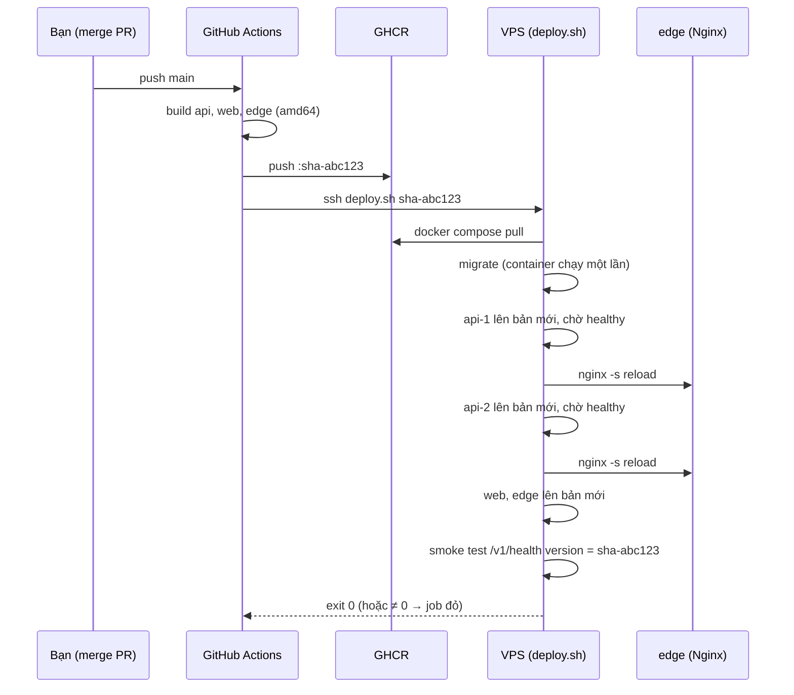
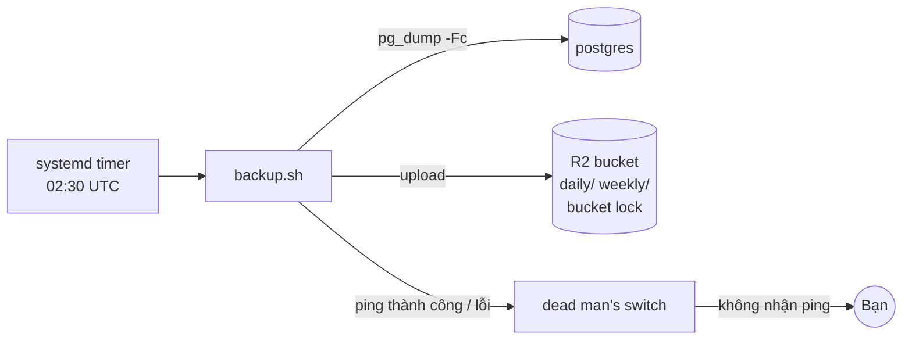

# Plan Sprint 14 — Delivery Pipeline & Data Safety · v2.2.0

> Sprint: [sprint-14.md](../sprints/sprint-14.md) *(draft: refine AC trước khi bắt đầu)* · Tổng quan v3: [README](../README.md)
>
> **Cách dùng plan:** đọc "Khái niệm" → tự làm → kẹt quá 30 phút mới mở Hint 1 → Hint 2 → Hint 3. Tự nghĩ test case trước khi mở đáp án.
>
> Workflow deploy qua SSH và script deploy là **lần đầu** bạn viết: Hint 3 chỉ có khung các bước. Workflow build image là workflow thứ hai (sau CI của v1) nên Hint 3 chi tiết hơn.

## 0. Trước khi bắt đầu

- Sprint 13 xong: stack chạy trên VPS ở `next-*.<domain>`, cập nhật bằng tay.
- Đọc trước: [github-actions.md](../../knowledge/github-actions.md) (phần GHCR và deploy qua SSH), [docker.md](../../knowledge/docker.md) (tag bất biến, digest, dọn ổ đĩa), [nginx.md](../../knowledge/nginx.md) (real IP, `limit_req`, security headers), [linux-vps.md](../../knowledge/linux-vps.md) (systemd timer).
- Ôn lại: expand/contract ([plan Sprint 2 v1](../../v1/plans/sprint-02.md)), báo cáo đối soát ledger ([plan Sprint 12 v2](../../v2/plans/sprint-12.md), S12-04).
- Tài khoản: Cloudflare R2 (bật trong dashboard Cloudflare, cần thẻ thanh toán dù dùng trong free tier), một dịch vụ dead man's switch (ví dụ healthchecks.io).

**Câu hỏi cần trả lời được trước khi code:**
1. Vì sao deploy bằng tag `latest` là ý tưởng tồi? Rollback sẽ khó ở đâu?
2. Trong lúc rolling update, phiên bản API cũ và mới cùng chạy. Migration nào an toàn, migration nào làm phiên bản cũ lỗi?
3. "Có backup" và "restore được" khác nhau thế nào? RPO và RTO là gì?

## 1. Bức tranh tổng



Backup:



## 2. Thứ tự & phụ thuộc

```
S14-01 build/push GHCR ─▶ S14-02 deploy SSH ─▶ S14-03 hardening Nginx
S14-04 backup + restore drill (độc lập, bắt đầu ngay ngày đầu: cần 2 đêm để kiểm AC)
```

- Bắt đầu S14-04 sớm vì AC cần backup chạy qua 2 đêm.
- S14-03 có thể khóa chính bạn ra ngoài (firewall chỉ cho Cloudflare). Làm sau khi deploy tự động đã chạy, để mọi thay đổi cấu hình Nginx đi qua pipeline.

---

## 3.1 S14-01 · CI build và push image lên GHCR

### Khái niệm cần nắm
- **Container registry:** kho chứa image, giống npm registry cho package. GHCR (`ghcr.io`) đi kèm GitHub, workflow đăng nhập bằng `GITHUB_TOKEN` với quyền `packages: write`.
- **Tag bất biến:** `sha-abc123` luôn trỏ tới đúng một image. `latest` bị ghi đè mỗi lần build: hôm nay và ngày mai `latest` là hai thứ khác nhau, nên không biết production đang chạy gì và không rollback được. **Digest** (`@sha256:…`) còn chặt hơn tag: không ai ghi đè được.
- **Build trên runner, chạy trên VPS:** VPS không tốn RAM/CPU để build, image đã test là image chạy. Runner GitHub mặc định là amd64, khớp với VPS.
- **Cache layer:** runner là máy mới mỗi lần chạy. Không cấu hình cache thì mỗi build cài lại mọi dependency. Buildx hỗ trợ cache backend của GitHub Actions (`type=gha`).
- **OCI labels:** `org.opencontainers.image.source` nối package GHCR với repo, `org.opencontainers.image.revision` ghi commit. Nhìn image là biết nó từ đâu ra.
- **Source map cho Sentry:** trước đây Vercel/Render build và plugin Sentry upload source map. Giờ build ở CI, nên token Sentry (`SENTRY_AUTH_TOKEN`) là secret của GitHub, và source map **không** nên nằm trong image public.

### Hướng tiếp cận
1. Quyết định: một workflow riêng (`release.yml`) hay thêm job vào `ci.yml` (`needs: ci`)? Nếu tách workflow, image chỉ nên được push khi CI của cùng commit đã xanh. Build image chạy ở PR (không push), ở `develop` và `main` (push).
2. Dùng matrix cho 3 image (`api`, `web`, `edge`) để không lặp.
3. Tag bằng `docker/metadata-action`: `sha-<short>` cho `develop`/`main`. Khi push tag `vX.Y.Z`: **không build lại**, gắn thêm tag cho image `sha-…` đã có (`docker buildx imagetools create`). Build lại sẽ tạo digest khác và ghi đè tag `sha-…` vốn phải bất biến.
4. Bật cache `type=gha` với `scope` khác nhau cho mỗi image.
5. Upload source map lên Sentry trong bước build (đọc docs Sentry cho Next.js và Vite). Đảm bảo file `.map` không nằm trong image cuối (hoặc chấp nhận có lý do). Token Sentry đưa vào bằng **build secret** (`secrets:` của build-push-action + `RUN --mount=type=secret`), không bằng `build-arg`: image public, mọi build-arg đọc được từ lịch sử image.
6. Package GHCR: đặt **public** (repo public) để VPS pull không cần đăng nhập, hoặc tạo token chỉ đọc cho VPS.

### File dự kiến tạo/sửa
`.github/workflows/release.yml` (hoặc job mới trong `ci.yml`), Dockerfile của 3 image (label, `ARG` cho version), cấu hình Sentry của web/admin/seller.

### Tự nghĩ test case trước
Workflow này có những nhánh nào cần thử? (PR, `main`, tag, Dockerfile lỗi…)

<details><summary>Đáp án tham khảo</summary>

- PR sửa code → build cả 3 image, **không** push (kiểm tra trong log: không có bước push, GHCR không có tag mới).
- PR làm Dockerfile hỏng → job đỏ.
- Merge vào `develop` → 3 image với tag `sha-<short>` khớp `git rev-parse --short HEAD`.
- Push tag `v2.2.0` → image có thêm tag `v2.2.0`, **cùng digest** với `sha-…` của commit đó (vì chỉ gắn tag, không build lại).
- `docker history --no-trunc` image web → không có token Sentry.
- Build lần 2 không đổi dependency → bước install `CACHED`, thời gian giảm rõ.
- `docker inspect` image → label `revision` đúng commit.
- Trên VPS (không đăng nhập): `docker pull ghcr.io/<owner>/pixelmart-api:sha-…` thành công.
- Lỗi thử trên `next-shop` → Sentry hiển thị stack trace với tên file/dòng TS gốc.
</details>

### Gợi ý
<details><summary>Hint 1: hướng đi</summary>

Làm cho **một** image (`api`) push được lên GHCR trước, kiểm tra trên trang Packages của GitHub. Sau đó mới thêm matrix, cache và metadata.
</details>

<details><summary>Hint 2: khái niệm/API</summary>

- Action chính thức của Docker: `docker/setup-buildx-action`, `docker/login-action`, `docker/metadata-action`, `docker/build-push-action`. Kiểm tra major version hiện hành trên trang GitHub của từng action.
- `permissions: { contents: read, packages: write }` ở cấp job. Thiếu `packages: write` → `denied: permission_denied`.
- `build-push-action`: `push: ${{ github.event_name != 'pull_request' }}`, `platforms: linux/amd64`, `cache-from`/`cache-to` `type=gha,scope=<image>`.
- Tên image GHCR phải viết thường (`ghcr.io/<owner-lowercase>/...`). Owner có chữ hoa sẽ gây lỗi.
- Package mới tạo trên GHCR mặc định **private** kể cả khi repo public. Đổi visibility trong Package settings.
- `/v1/health` cần trả version của image (S14-02 kiểm tra). Truyền qua `build-args` (ví dụ `APP_VERSION`) rồi thành `ENV` trong image.
</details>

<details><summary>Hint 3: khung workflow (workflow thứ hai của bạn)</summary>

```yaml
# .github/workflows/release.yml (khung — kiểm tra version các action trước khi dùng)
name: release
on:
  push:
    branches: [develop, main]
    tags: ['v*'] # job riêng: gắn tag vX.Y.Z cho image đã có, KHÔNG build lại
  workflow_dispatch: # S14-02: deploy tay lên VPS preview
  pull_request:

jobs:
  image:
    runs-on: ubuntu-latest
    permissions:
      contents: read
      packages: write
    strategy:
      matrix:
        include:
          - name: api
            file: apps/api/Dockerfile
          - name: web
            file: apps/web/Dockerfile
          - name: edge
            file: deploy/edge/Dockerfile
    steps:
      - uses: actions/checkout@v6
      - uses: docker/setup-buildx-action@<version>
      - uses: docker/login-action@<version>
        if: github.event_name != 'pull_request'
        with:
          registry: ghcr.io
          username: ${{ github.actor }}
          password: ${{ secrets.GITHUB_TOKEN }}
      - id: meta
        uses: docker/metadata-action@<version>
        with:
          images: ghcr.io/<owner>/pixelmart-${{ matrix.name }}
          tags: |
            # chỉ sha ngắn (tự tra cú pháp `type=sha`, prefix `sha-`); tag vX.Y.Z gắn ở job riêng
      - uses: docker/build-push-action@<version>
        with:
          context: .
          file: ${{ matrix.file }}
          platforms: linux/amd64
          push: ${{ github.event_name != 'pull_request' }}
          tags: ${{ steps.meta.outputs.tags }}
          labels: ${{ steps.meta.outputs.labels }}
          # build-args: APP_VERSION=...
          # cache-from / cache-to: type=gha, scope theo matrix.name
```
Job deploy (S14-02) sẽ `needs: image`, chạy trên `main` và khi `workflow_dispatch`.
</details>

### Bẫy thường gặp
| Triệu chứng | Nguyên nhân | Cách tránh |
|---|---|---|
| `denied: permission_denied` khi push | Thiếu `packages: write` | Khai báo `permissions` ở job |
| `invalid reference format: repository name must be lowercase` | Owner GitHub có chữ hoa | Đổi sang chữ thường (metadata-action tự làm) |
| VPS pull báo `unauthorized` dù repo public | Package GHCR mặc định private | Đổi visibility, hoặc token chỉ đọc trên VPS |
| Cache không có tác dụng giữa 3 image | Cùng `scope` cache, các image ghi đè nhau | `scope` riêng mỗi image |
| PR từ fork không push được (và không nên) | `GITHUB_TOKEN` của fork chỉ đọc | Chỉ push trên `main`/tag |
| Stack trace Sentry toàn code đã minify | Source map không được upload, hoặc sai `release` | Upload trong CI, `release` khớp giữa build và runtime |
| Token Sentry đọc được bằng `docker history` | Truyền token qua `build-arg` | Build secret (`--mount=type=secret`) |
| Tag `sha-…` trỏ sang digest khác sau khi tạo release | Workflow build lại khi push tag | Gắn tag bằng `docker buildx imagetools create` |
| File `.map` công khai trên `admin.` | Source map được copy vào image `edge` | Xóa `.map` sau khi upload, hoặc chặn ở Nginx |

### Kiểm chứng AC
- [ ] Merge vào `develop` → 3 image `sha-…` trên GHCR (ảnh chụp trang Packages vào PR).
- [ ] PR với Dockerfile lỗi → đỏ, không push.
- [ ] Ghi thời gian build lần 1 và lần 2 vào PR.
- [ ] `docker pull` từ VPS thành công.
- [ ] Lỗi thử → Sentry có stack trace đọc được.

### Đọc thêm
- [github-actions.md](../../knowledge/github-actions.md), phần GHCR
- Publishing Docker images (GitHub docs): https://docs.github.com/en/actions/tutorials/publish-packages/publish-docker-images
- Working with the Container registry: https://docs.github.com/en/packages/working-with-a-github-packages-registry/working-with-the-container-registry
- Docker build cache in GitHub Actions: https://docs.docker.com/build/ci/github-actions/cache/
- OCI image annotations: https://github.com/opencontainers/image-spec/blob/main/annotations.md

---

## 3.2 S14-02 · Deploy qua SSH: migrate → rolling update → smoke test → rollback

### Khái niệm cần nắm
- **Deploy = chuỗi bước có điểm dừng.** Mỗi bước phải thành công thì mới sang bước sau. Script dùng `set -euo pipefail` để dừng ngay khi một lệnh lỗi, kể cả lỗi giữa một pipe.
- **Migration trước, code sau:** schema mới phải có trước khi code mới cần nó. Nhưng trong lúc rolling, **code cũ cũng chạy trên schema mới**. Vì vậy mọi migration phải tương thích ngược (expand). Phần phá vỡ (contract: xóa cột, đổi tên) làm ở một release **sau**, khi không còn code cũ nào dùng.
- **Container chạy một lần (one-off):** `docker compose run --rm <service> <lệnh>` chạy migration trong mạng nội bộ, kết nối thẳng tới Postgres, rồi tự xóa. Image runtime của API không có Prisma CLI (devDependency), nên cần một **target riêng** trong Dockerfile (ví dụ `migrate`) có CLI, `schema.prisma`, thư mục migrations và `prisma.config.ts`.
- **Rolling update thủ công:** thay từng replica. Khi `api-1` đang khởi động lại, Nginx chuyển request sang `api-2` (S13-04). Sau khi `api-1` healthy với IP mới, **reload Nginx** để nó resolve lại tên. Rồi mới tới `api-2`.
- **Graceful shutdown:** Docker gửi SIGTERM, chờ (mặc định 10 giây), rồi SIGKILL. NestJS với `enableShutdownHooks()` ngừng nhận kết nối mới và hoàn tất request đang chạy. Thiếu bước này thì request đang xử lý bị cắt giữa chừng.
- **Smoke test:** kiểm tra nhanh sau deploy rằng hệ thống sống **và** đúng phiên bản. `/v1/health` trả `version` = tag vừa deploy.
- **Rollback = deploy tag cũ.** Vì image bất biến và migration tương thích ngược, rollback chỉ là chạy lại script với tag trước. **Không** rollback migration (không có "down migration" trong Prisma). Rollback code, giữ schema.
- **GitHub Environment:** nhóm secret (SSH key, host) và quy tắc (chỉ branch `main`) cho một môi trường. Secret của environment chỉ job khai báo `environment:` mới đọc được.
- **`known_hosts`:** lần đầu SSH, client hỏi "có tin host key này không". Trong CI không có ai trả lời. `StrictHostKeyChecking=no` = tin mọi thứ, kể cả máy giả mạo. Cách đúng: lưu host key của VPS vào secret, ghi ra `~/.ssh/known_hosts`.
- **Concurrency:** hai deploy liên tiếp chạy đồng thời trên cùng VPS → trạng thái không xác định. `concurrency` của GitHub Actions xếp hàng chúng.
- **`workflow_dispatch` cho preview:** `main` chỉ nhận merge lúc release ([rule 01](../../rules/01-git-branching.md)). Để thử pipeline trong sprint (migration lỗi, rollback, deploy liên tiếp), job deploy chạy được bằng tay: chọn một ref (build + deploy ref đó) hoặc một tag đã có (rollback). Đích luôn là **VPS preview**. Không bao giờ thử lỗi bằng cách merge vào `main`: `main` vẫn deploy PaaS và chạy migration trên Neon production.

### Hướng tiếp cận
1. Thêm target `migrate` vào `apps/api/Dockerfile`. Đẩy image này lên GHCR cùng 3 image kia (S14-01, thêm một mục matrix hoặc một target).
2. Tạo SSH key **chỉ để deploy** (`ed25519`, không passphrase), thêm public key vào `deploy@VPS`. Lấy host key bằng `ssh-keyscan` **từ mạng bạn tin**, đối chiếu fingerprint với `ssh-keygen -lf` trên chính VPS (qua console).
3. GitHub → Settings → Environments → `production-vps` (hoặc `vps`): secret `SSH_PRIVATE_KEY`, `SSH_HOST`, `SSH_KNOWN_HOSTS`. Giới hạn branch `main`.
4. Viết `deploy/deploy.sh <tag>` theo các bước trong sprint. Chạy tay trên VPS cho tới khi ổn.
5. Job `deploy` trong workflow: `needs: image`, `environment`, `concurrency`, chạy khi push `main` và khi `workflow_dispatch`. Secret SSH đưa vào bước `run` qua `env:` (không nội suy `${{ secrets.* }}` thẳng vào lệnh). `SSH_HOST` là IP của VPS (hoặc bản ghi DNS-only): SSH không đi qua proxy Cloudflare. Copy `compose.prod.yaml` + `deploy.sh` lên VPS (scp/rsync), rồi `ssh deploy@… ./deploy.sh sha-…`.
6. Chạy vòng lặp `curl` trong pha rolling API, lưu log. Sửa tới khi không còn 5xx. Đo riêng khoảng gián đoạn khi thay `edge`/`web` (một replica).
7. Thử migration lỗi (branch thử + `workflow_dispatch` lên preview) và rollback. Ghi thời gian.

### File dự kiến tạo/sửa
`apps/api/Dockerfile` (target `migrate`), `deploy/deploy.sh`, `.github/workflows/release.yml` (job `deploy`), `compose.prod.yaml` (service `migrate` với `profiles` để không tự chạy), `apps/api/src/main.ts` (`enableShutdownHooks` nếu chưa có), `apps/api` health trả `APP_VERSION`.

### Tự nghĩ test case trước
Liệt kê các cách deploy có thể thất bại, và trạng thái hệ thống **sau** mỗi thất bại phải là gì.

<details><summary>Đáp án tham khảo</summary>

- Pull image thất bại (tag sai, GHCR lỗi) → dừng trước migration. Bản cũ vẫn chạy.
- Migration lỗi → dừng, chưa đổi container nào. `/v1/health` trả version cũ. Job đỏ.
- `api-1` mới không healthy sau N giây → dừng, **không** đụng `api-2`. Một replica cũ vẫn phục vụ. Rollback `api-1` về tag cũ (script tự làm, hoặc ghi rõ cần chạy rollback).
- Smoke test sai version → job đỏ, cảnh báo.
- SSH không kết nối được (VPS tắt, key sai) → job đỏ ngay, không có trạng thái nửa vời.
- Hai deploy liên tiếp → cái thứ hai chờ.
- Deploy cùng tag hai lần → idempotent, không lỗi, và `PREVIOUS_TAG` không bị ghi đè bằng chính tag đang chạy.
- Rollback: `deploy.sh <tag cũ>` → `/v1/health` trả version cũ trong ≤ 5 phút.
- Sau 10 lần deploy: `docker system df` không tăng mãi.
</details>

### Gợi ý
<details><summary>Hint 1: hướng đi</summary>

Viết `deploy.sh` và chạy **tay trên VPS** trước, với tag bạn đã push ở S14-01. Khi chạy tay ổn rồi, phần GitHub Actions chỉ là "SSH vào và chạy đúng lệnh đó". Debug script qua CI rất chậm.
</details>

<details><summary>Hint 2: khái niệm/API</summary>

- Chờ healthy: lặp `docker inspect -f '{{.State.Health.Status}}' <container>` cho tới `healthy` hoặc hết thời gian. `docker compose up -d --wait` cũng chờ healthy, đọc docs để biết nó trả về khi nào.
- Thay một replica: `IMAGE_TAG=<tag> docker compose up -d --no-deps api-1`. `--no-deps` để không kéo theo restart service khác.
- Reload Nginx không mất kết nối: `docker compose exec edge nginx -t` **rồi** `nginx -s reload` (master process giữ socket, worker cũ hoàn tất request rồi mới thoát). `-s reload` chỉ gửi tín hiệu và trả 0 kể cả khi cấu hình mới không nạp được (lỗi chỉ nằm trong log), nên phải `-t` trước.
- Ghi tag đang chạy vào file (ví dụ `/srv/pixelmart/CURRENT_TAG`) **sau** khi smoke test thành công. Rollback đọc file `PREVIOUS_TAG`. Chỉ cập nhật `PREVIOUS_TAG` khi tag mới khác tag đang chạy, nếu không deploy lại cùng tag sẽ làm mất đích rollback.
- `concurrency: { group: deploy-vps, cancel-in-progress: false }`: **không** hủy deploy đang chạy giữa chừng.
- `stop_grace_period` trong Compose nếu shutdown của API cần hơn 10 giây.
- Vòng lặp kiểm tra: `while true; do curl -s -o /dev/null -w '%{http_code}\n' https://next-api.<domain>/v1/health; sleep 0.2; done | sort | uniq -c`.
</details>

<details><summary>Hint 3: khung deploy.sh (lần đầu viết: chỉ có các bước, tự điền lệnh)</summary>

```bash
#!/usr/bin/env bash
# deploy/deploy.sh <tag> (khung — mỗi bước là một hoặc vài lệnh bạn tự viết)
set -euo pipefail
TAG="${1:?usage: deploy.sh <tag>}"
cd /srv/pixelmart

# 0. Nếu TAG khác CURRENT_TAG: lưu CURRENT_TAG thành PREVIOUS_TAG (để rollback)
# 1. Pull mọi image của TAG. Lỗi → thoát (set -e lo)
# 2. Migration: chạy service "migrate" với TAG, --rm. Lỗi → thoát
# 3. for svc in api-1 api-2:
#      - up -d --no-deps $svc với TAG
#      - chờ healthy (có timeout) → quá hạn: in log của $svc, thoát ≠ 0
#      - nginx -t, rồi reload nginx trong edge
# 4. up -d --no-deps web, rồi edge (một replica: có gián đoạn ngắn, đo và ghi lại)
# 5. Smoke test: /v1/health trả version == TAG (gọi qua edge, có retry ngắn)
# 6. Ghi CURRENT_TAG = TAG
# 7. Dọn image cũ (giữ lại vài tag gần nhất để rollback nhanh)
```

```yaml
# job deploy (khung)
deploy:
  needs: image
  if: github.ref == 'refs/heads/main' || github.event_name == 'workflow_dispatch'
  runs-on: ubuntu-latest
  environment: ...
  concurrency: ...
  steps:
    # checkout (để có compose.prod.yaml, deploy.sh)
    # ghi SSH key + known_hosts từ secrets, truyền qua env: (quyền 600)
    # scp/rsync compose.prod.yaml, deploy/deploy.sh lên VPS
    # ssh deploy@host "/srv/pixelmart/deploy.sh sha-<short>"
```
Phần tính `sha-<short>` phải khớp đúng tag do metadata-action tạo ở S14-01.
</details>

### Bẫy thường gặp
| Triệu chứng | Nguyên nhân | Cách tránh |
|---|---|---|
| Thử migration lỗi làm hỏng production | Thử bằng cách merge vào `main` (vẫn deploy PaaS + migrate Neon) | Thử bằng `workflow_dispatch` lên preview |
| `nginx -s reload` "thành công" nhưng Nginx vẫn chạy cấu hình cũ | Cấu hình mới lỗi, reload chỉ gửi tín hiệu | `nginx -t` trước, xem log `edge` |
| 502 vài giây sau mỗi lần thay replica | Nginx giữ IP cũ của container | Reload Nginx sau khi replica mới healthy |
| 502 khi replica cũ đang dừng | API không xử lý SIGTERM, request đang chạy bị cắt | `enableShutdownHooks()`, `stop_grace_period` đủ dài |
| Bản cũ lỗi `column does not exist` trong lúc rolling | Migration xóa/đổi tên cột trong cùng release | Expand/contract: xóa ở release sau |
| `prisma: not found` khi migrate | Image runtime không có Prisma CLI | Target `migrate` riêng |
| Migrate báo không đọc được `DATABASE_URL` | Prisma 7 không tự đọc `.env`, `prisma.config.ts` dùng `dotenv` | Truyền env vào container `migrate` (`env_file`) |
| Script "thành công" dù một lệnh trong pipe lỗi | Thiếu `pipefail` | `set -euo pipefail` |
| `Host key verification failed` trong CI | Chưa có `known_hosts` | Lưu host key vào secret |
| Ai đó đổi VPS (rebuild) → CI không SSH được | Host key mới | Cập nhật secret **sau khi** đã xác minh fingerprint, không tắt kiểm tra |
| Ổ đĩa đầy sau vài tuần | Mỗi deploy kéo image mới, image cũ không dọn | `docker image prune` có điều kiện trong script |
| Hai deploy đè nhau, trạng thái lộn xộn | Không có `concurrency` | `concurrency` group, `cancel-in-progress: false` |

### Kiểm chứng AC
- [ ] Log vòng lặp `curl` trong pha rolling API: chỉ có `200`. Ghi khoảng gián đoạn khi thay `edge`/`web`.
- [ ] Migration cố tình lỗi (branch thử, `workflow_dispatch` lên preview) → job đỏ, `/v1/health` trả version cũ.
- [ ] Rollback: ghi thời gian từ lúc chạy lệnh tới khi `/v1/health` trả version cũ.
- [ ] Hai lần deploy liên tiếp → lần thứ hai ở trạng thái "Waiting".
- [ ] Workflow không có `StrictHostKeyChecking=no`.
- [ ] `docker system df` sau nhiều lần deploy không tăng mãi.

### Đọc thêm
- [github-actions.md](../../knowledge/github-actions.md), phần deploy qua SSH
- GitHub Environments: https://docs.github.com/en/actions/how-tos/deploy/configure-and-manage-deployments/manage-environments
- GitHub Actions concurrency: https://docs.github.com/en/actions/how-tos/write-workflows/choose-when-workflows-run/control-workflow-concurrency
- Prisma `migrate deploy`: https://www.prisma.io/docs/orm/prisma-client/deployment/deploy-database-changes-with-prisma-migrate
- NestJS lifecycle events (shutdown hooks): https://docs.nestjs.com/fundamentals/lifecycle-events
- Nginx controlling (reload): https://nginx.org/en/docs/control.html

---

## 3.3 S14-03 · Nginx hardening: chỉ nhận Cloudflare, IP thật, rate limit, security headers

### Khái niệm cần nắm
- **Origin bị lộ:** Cloudflare chỉ bảo vệ được traffic đi **qua** nó. Ai biết IP của VPS (lịch sử DNS, cert transparency, quét IP) có thể đánh thẳng vào origin, bỏ qua mọi thứ Cloudflare làm. Chặn ở firewall: 80/443 chỉ nhận từ dải IP của Cloudflare.
- **IP thật sau CDN:** request tới Nginx từ IP của Cloudflare. IP khách nằm trong header `CF-Connecting-IP`. Module `real_ip` của Nginx thay `$remote_addr` bằng giá trị header **chỉ khi** request đến từ IP nằm trong `set_real_ip_from`. Tin header từ mọi nguồn = ai cũng giả được IP.
- **Chuỗi tin cậy:** sau S14-03, `edge` là proxy đầu tiên **bạn kiểm soát**. `edge` nên gửi cho API một `X-Forwarded-For` mà nó tự tạo từ IP thật, thay vì nối thêm vào header client gửi lên. Kiểm tra lại `trust proxy` của API (S13-04) cho khớp.
- **Rate limit ở hai tầng:** Nginx (`limit_req`) chặn sớm, rẻ, trước khi request tới Node. `@nestjs/throttler` của API hiểu ngữ cảnh (user, endpoint). Quyết định: tầng nào chặn gì, ngưỡng bao nhiêu. Ghi vào PR.
- **Request SSR:** khi `web` render trang, nó gọi API **từ container `web`**. Mọi request SSR có cùng một IP. Nếu throttler của API tính theo IP, người dùng sẽ bị chặn vì "web" gọi quá nhiều. Các hướng: SSR gọi API qua mạng nội bộ và throttler bỏ qua IP nội bộ đáng tin; hoặc `web` chuyển tiếp IP khách trong header mà API chỉ tin khi đến từ mạng nội bộ. Bạn chọn và giải thích.
- **Security headers:** `X-Content-Type-Options: nosniff`, `Referrer-Policy`, `Content-Security-Policy: frame-ancestors` (chống clickjacking), `Permissions-Policy`. **HSTS** mạnh nhưng khó gỡ: bắt đầu với `max-age` ngắn, **không** dùng `preload` khi chưa chắc mọi subdomain đều có HTTPS.
- **Authenticated Origin Pulls** (tùy chọn): Cloudflare trình client certificate khi kết nối tới origin, Nginx chỉ nhận kết nối có cert đó. Chặt hơn chặn theo IP (IP của Cloudflare dùng chung cho mọi khách hàng của họ).

### Hướng tiếp cận
1. **Trước khi** đổi firewall: chắc chắn bạn biết cách vào lại qua console web, và giữ SSH (22) mở như cũ.
2. Viết danh sách IP Cloudflare vào cấu hình Nginx (`set_real_ip_from`) và firewall. Viết script lấy danh sách từ `https://www.cloudflare.com/ips-v4` và `ips-v6`, so sánh với cấu hình hiện tại (chạy định kỳ hoặc khi cần).
3. Firewall: 80/443 chỉ từ dải Cloudflare. Kiểm tra từ máy ngoài.
4. `real_ip_header CF-Connecting-IP`, xem log Nginx/API có IP thật.
5. `limit_req_zone` theo `$binary_remote_addr` (sau real_ip), áp cho `/v1/auth/*`, `limit_req_status 429`.
6. Xử lý vấn đề SSR + throttler theo hướng bạn chọn.
7. Security headers cho `shop.`, `admin.`, `seller.`. `client_max_body_size` và timeout.
8. Tất cả thay đổi Nginx đi qua PR → pipeline (S14-02), không sửa tay trên VPS.

> **Không có firewall ngoài VM:** chặn theo IP Cloudflare ở chain `DOCKER-USER` (traffic tới container đã qua DNAT, nên dùng `conntrack --ctorigdstport` để khớp cổng gốc). Xem [linux-vps.md](../../knowledge/linux-vps.md). Nginx `allow`/`deny` cũng là một lớp, nhưng TCP vẫn mở.

### File dự kiến tạo/sửa
`deploy/edge/nginx.conf` (`real_ip`, `limit_req_zone`, `log_format`), `deploy/edge/cloudflare-ips.conf` (sinh bằng script), `deploy/edge/templates/*.template` (headers, `limit_req`), `deploy/scripts/update-cloudflare-ips.sh`, `apps/api` (`trust proxy`, cấu hình throttler cho request nội bộ), `apps/web` (cách gọi API khi SSR, nếu đổi).

### Tự nghĩ test case trước
Mỗi biện pháp bảo vệ có thể bị vượt qua thế nào? Viết test cho từng cách vượt qua.

<details><summary>Đáp án tham khảo</summary>

- Gọi thẳng IP origin: `curl -k --resolve next-api.<domain>:443:<ip> https://next-api.<domain>/v1/health` → timeout.
- Giả IP: (ở local hoặc tạm cho IP của bạn qua firewall) `curl -H "CF-Connecting-IP: 1.2.3.4" …` → log ghi IP thật của bạn, không phải `1.2.3.4`.
- Giả `X-Forwarded-For` gửi thẳng tới API qua edge → API không tin giá trị client gửi.
- Brute force login: 30 request/phút từ một IP → `429`. Cùng lúc, một máy khác (4G điện thoại) đăng nhập được.
- SSR: `for i in $(seq 50); do curl -s -o /dev/null -w '%{http_code}\n' https://next-shop.<domain>/products/<slug>; done | sort | uniq -c` → toàn `200`.
- Body quá lớn: `curl -X POST --data-binary @file-lon …` → `413`.
- `curl -I https://next-shop.<domain>` → đủ security headers đã chọn. Asset trong `/assets/` vẫn có header cache (bẫy `add_header`).
- Cloudflare thêm dải IP mới → script phát hiện khác biệt.
</details>

### Gợi ý
<details><summary>Hint 1: hướng đi</summary>

Làm `real_ip` trước và xác nhận bằng log. Rate limit theo IP chỉ có ý nghĩa khi IP đúng. Firewall làm sau cùng, khi mọi thứ khác đã chạy, và kiểm tra ngay lập tức.
</details>

<details><summary>Hint 2: khái niệm/API</summary>

- `ngx_http_realip_module`: `set_real_ip_from <cidr>;` (một dòng mỗi dải, cả IPv4 và IPv6), `real_ip_header CF-Connecting-IP;`.
- `limit_req_zone $binary_remote_addr zone=auth:10m rate=…r/m;` ở `http`. `limit_req zone=auth burst=… nodelay;` trong `location ^~ /v1/auth/`. Hiểu `burst` và `nodelay` trước khi chọn số.
- `add_header … always;` để header có cả trên response lỗi (4xx/5xx).
- Hetzner: rule firewall nhận nhiều dải IP trong một rule. Có CLI `hcloud` và API để cập nhật bằng script.
- Throttler NestJS: đọc docs về `skipIf`/guard tùy biến, và cách throttler lấy key (tracker) từ request.
</details>

<details><summary>Hint 3: khung</summary>

```nginx
# trong http {} (khung)
include /etc/nginx/cloudflare-ips.conf;   # các dòng set_real_ip_from ...
real_ip_header CF-Connecting-IP;

limit_req_zone $binary_remote_addr zone=auth:10m rate=...;
limit_req_status 429;

# trong server của API
location ^~ /v1/auth/ {
    limit_req zone=auth burst=... nodelay;
    # các proxy_* như location / (cân nhắc include file chung)
}
```
Ngưỡng cụ thể và cách thống nhất với throttler là quyết định của bạn.
</details>

### Bẫy thường gặp
| Triệu chứng | Nguyên nhân | Cách tránh |
|---|---|---|
| Tự khóa mình ra ngoài | Đổi rule cho cả cổng 22 | Chỉ đổi 80/443. Giữ console web sẵn sàng |
| Log vẫn là IP Cloudflare | Thiếu dải IPv6 trong `set_real_ip_from`, hoặc sai header | Đủ cả v4 + v6, header `CF-Connecting-IP` |
| Ai cũng giả được IP | `set_real_ip_from 0.0.0.0/0` | Chỉ dải Cloudflare |
| Mọi người bị `429` cùng lúc | Rate limit theo IP của Cloudflare (real_ip chưa chạy) | Làm `real_ip` trước, kiểm tra log |
| Trang sản phẩm thỉnh thoảng lỗi khi đông khách | Throttler đếm mọi request SSR là một IP | Hướng xử lý SSR ở mục Khái niệm |
| Header bảo mật mất ở `/assets/` | `add_header` trong `location` xóa header của cấp cha | `include` file headers trong mọi `location` có `add_header` |
| Site không vào được nữa trên một số trình duyệt sau khi thử HSTS | `max-age` dài + `includeSubDomains` + subdomain chưa có HTTPS | Bắt đầu `max-age` ngắn, tăng dần |
| Một ngày Cloudflare đổi dải IP, khách ở một vùng không vào được | Danh sách IP cứng, không cập nhật | Script kiểm tra định kỳ |

### Kiểm chứng AC
- [ ] `curl --resolve … <ip>` từ máy ngoài → timeout.
- [ ] Log Nginx và API có IP thật (so với trang "what is my IP").
- [ ] Header `CF-Connecting-IP` giả không được tin.
- [ ] 30 login/phút → `429`, máy khác vẫn đăng nhập được.
- [ ] 50 request SSR liên tiếp → không có `429`.
- [ ] Kết quả `curl -I` (hoặc securityheaders.com) trong PR.

### Đọc thêm
- [nginx.md](../../knowledge/nginx.md)
- Cloudflare IP ranges: https://www.cloudflare.com/ips/
- Cloudflare: restoring original visitor IPs: https://developers.cloudflare.com/support/troubleshooting/restoring-visitor-ips/restoring-original-visitor-ips/
- `ngx_http_realip_module`: https://nginx.org/en/docs/http/ngx_http_realip_module.html
- `ngx_http_limit_req_module`: https://nginx.org/en/docs/http/ngx_http_limit_req_module.html
- Cloudflare Authenticated Origin Pulls: https://developers.cloudflare.com/ssl/origin-configuration/authenticated-origin-pull/
- OWASP Secure Headers Project: https://owasp.org/www-project-secure-headers/

---

## 3.4 S14-04 · Backup Postgres off-site + diễn tập restore

### Khái niệm cần nắm
- **Backup chưa restore thử = không có backup.** Lỗi thường gặp: file rỗng, thiếu bảng, sai encoding, không ai biết mật khẩu giải mã. Chỉ phát hiện khi cần restore thật.
- **Quy tắc 3-2-1:** 3 bản sao dữ liệu, trên 2 loại lưu trữ, 1 bản ở nơi khác (off-site). Volume Docker trên VPS + file dump trên VPS **cùng chết** khi VPS hỏng. R2 là bản off-site.
- **RPO (Recovery Point Objective):** tối đa mất bao nhiêu dữ liệu. Backup hằng đêm → RPO tối đa 24 giờ. **RTO (Recovery Time Objective):** từ lúc sự cố tới lúc chạy lại mất bao lâu. Hai con số này phải **đo được**, không đoán.
- **`pg_dump` định dạng custom (`-Fc`):** nén, restore chọn lọc được (`pg_restore -t`), restore song song (`-j`). Là snapshot **nhất quán** của database tại thời điểm bắt đầu dump, không khóa ghi.
- **Snapshot VPS ≠ backup DB:** snapshot đĩa lúc Postgres đang ghi có thể không nhất quán. Dùng làm lưới an toàn cho cả máy, không thay `pg_dump`.
- **Bucket lock (R2):** chặn xóa/ghi đè object trong một khoảng thời gian, kể cả với token có quyền ghi. Nếu VPS bị chiếm, kẻ tấn công không xóa được backup mới. Bucket lock **ưu tiên hơn** lifecycle rule.
- **Retention:** lifecycle rule theo prefix: `daily/` xóa sau ~8 ngày, `weekly/` xóa sau ~5 tuần. Bản weekly là bản của một ngày cố định trong tuần, upload thêm vào `weekly/`.
- **Dead man's switch:** dịch vụ chờ "ping" sau mỗi lần backup thành công. Không nhận ping đúng hạn → cảnh báo. Bắt được cả trường hợp **script không chạy** (timer hỏng, VPS tắt), điều mà log lỗi không bắt được.
- **systemd timer** thay cron: log vào `journalctl`, `Persistent=true` chạy bù nếu VPS tắt đúng giờ backup, xem lần chạy kế tiếp bằng `systemctl list-timers`.

### Hướng tiếp cận
1. R2: tạo bucket, API token loại **Object Read & Write** chỉ trên bucket đó (không dùng token Admin: nó sửa được bucket lock/lifecycle). Lifecycle rule cho `daily/`, `weekly/`. Bucket lock cho `daily/` (ví dụ 7 ngày).
2. Cài công cụ upload trên VPS (rclone có provider Cloudflare R2, hoặc AWS CLI với endpoint R2). Credential nằm trong file quyền `600`.
3. Viết `deploy/backup/backup.sh`: dump → upload → (nếu đúng ngày) upload bản weekly → ping thành công. Lỗi bất kỳ → ping thất bại, thoát ≠ 0.
4. `pixelmart-backup.service` + `pixelmart-backup.timer`. Chạy tay một lần bằng `systemctl start`.
5. Tạo check trên dịch vụ dead man's switch, chu kỳ 1 ngày + thời gian ân hạn.
6. Restore drill: tải bản mới nhất về, chạy Postgres tạm (container riêng, không đụng production), `pg_restore`, so sánh số bản ghi, chạy đối soát ledger. Bấm giờ từ lúc "bắt đầu" tới lúc "dữ liệu dùng được".
7. Gửi ghi chú + số liệu cho Claude viết `docs/runbooks/restore-postgres.md`.

### File dự kiến tạo/sửa
`deploy/backup/backup.sh`, `deploy/backup/pixelmart-backup.service`, `deploy/backup/pixelmart-backup.timer`, `deploy/backup/restore-drill.sh` (tùy chọn), `.env.production.example` (biến R2, URL ping, **không** có giá trị thật). Runbook do Claude viết.

### Tự nghĩ test case trước
Backup có thể hỏng theo những cách nào **mà script vẫn báo thành công**? Viết cách phát hiện từng cách.

<details><summary>Đáp án tham khảo</summary>

- `pg_dump` lỗi nhưng pipe vẫn trả 0 → file rỗng được upload. Phát hiện: `set -o pipefail`, kiểm tra kích thước file > ngưỡng, `pg_restore -l` đọc được mục lục.
- Dump đúng nhưng upload lỗi im lặng → kiểm tra exit code của lệnh upload, liệt kê object sau khi upload.
- Timer không chạy (VPS reboot, unit lỗi) → dead man's switch.
- Ổ đĩa VPS đầy, dump bị cắt giữa chừng → kiểm tra dung lượng trống trước khi dump, xóa file tạm sau khi upload.
- Dump được nhưng restore lỗi (role, extension) → chỉ restore drill mới phát hiện.
- Restore được nhưng thiếu dữ liệu → so sánh số bản ghi, đối soát ledger.
- Token R2 bị lộ → thử xóa object đang bị lock → bị từ chối.
- Retention sai, R2 phình ra → xem dung lượng bucket sau 2 tuần.
</details>

### Gợi ý
<details><summary>Hint 1: hướng đi</summary>

Chạy từng lệnh bằng tay trước: một lệnh dump ra file, một lệnh upload, một lệnh liệt kê, một lệnh tải về, một lệnh restore vào container tạm. Khi cả chuỗi chạy tay được, gói vào script rồi mới gói vào systemd.
</details>

<details><summary>Hint 2: khái niệm/API</summary>

- Dump từ container: `docker compose exec -T postgres pg_dump -U <user> -d <db> -Fc > file.dump`. `-T` tắt TTY, nếu không file nhị phân bị hỏng.
- Restore vào container tạm: `docker run --rm -d --name pg-drill -e POSTGRES_PASSWORD=… postgres:<major>`, rồi `pg_restore --no-owner --no-privileges -d …`. Đọc kỹ lỗi của `pg_restore`: nó **tiếp tục** khi gặp lỗi và trả exit code khác 0 ở cuối. `--exit-on-error` khi diễn tập để thấy lỗi đầu tiên.
- R2 endpoint S3: `https://<account_id>.r2.cloudflarestorage.com`. rclone: provider `Cloudflare`. Đọc docs R2 về token, lifecycle và bucket lock.
- rclone với token chỉ có quyền object: đặt `no_check_bucket = true`, nếu không rclone thử kiểm tra/tạo bucket và bị từ chối.
- healthchecks.io: ping URL thành công, `/fail` khi lỗi, `/start` khi bắt đầu (đo thời gian chạy).
- systemd: `OnCalendar=*-*-* 02:30:00 UTC`, `Persistent=true`, `Type=oneshot`. `systemd-analyze calendar '…'` kiểm tra biểu thức.
- So sánh dữ liệu: đếm từng bảng (`SELECT count(*)`) trên cả hai nơi, xuất ra file, `diff`.
</details>

<details><summary>Hint 3: khung</summary>

```bash
#!/usr/bin/env bash
# deploy/backup/backup.sh (khung)
set -euo pipefail
trap '<ping thất bại>' ERR

TS="$(date -u +%Y%m%dT%H%M%SZ)"
FILE="/var/backups/pixelmart/pixelmart-${TS}.dump"

# 1. ping /start
# 2. kiểm tra dung lượng đĩa trống
# 3. pg_dump -Fc từ container postgres → $FILE
# 4. kiểm tra: kích thước > ngưỡng, pg_restore -l "$FILE" đọc được
# 5. upload $FILE → daily/
# 6. nếu hôm nay là <ngày weekly> → upload thêm vào weekly/
# 7. xóa $FILE local
# 8. ping thành công
```

```ini
# deploy/backup/pixelmart-backup.timer (khung)
[Unit]
Description=...

[Timer]
OnCalendar=...
Persistent=...

[Install]
WantedBy=timers.target
```
</details>

### Bẫy thường gặp
| Triệu chứng | Nguyên nhân | Cách tránh |
|---|---|---|
| File backup 0 byte trên R2, script báo thành công | Thiếu `pipefail`, lỗi `pg_dump` bị nuốt | `set -euo pipefail`, kiểm tra kích thước + `pg_restore -l` |
| Restore lỗi `invalid input` / file hỏng | `docker compose exec` không có `-T`, TTY làm hỏng dữ liệu nhị phân | Luôn `-T` khi pipe/redirect |
| `pg_restore: error: role "…" does not exist` | Dump mang theo owner/quyền | `--no-owner --no-privileges` |
| Backup không chạy sau khi VPS reboot | Timer chưa `enable` | `systemctl enable --now …timer`, kiểm tra `list-timers` |
| Giờ chạy lệch | `OnCalendar` theo timezone hệ thống | Ghi rõ `UTC` |
| Không xóa được bucket để làm lại từ đầu | Bucket lock đang có rule | Bình thường: lock hoạt động. Gỡ rule trước (chỉ khi thật sự muốn) |
| R2 tốn tiền dần | Không có lifecycle, hoặc lock dài hơn ý định | Lifecycle theo prefix, lock ngắn hơn retention |
| Credential R2 nằm trong log journald | Script `echo` biến môi trường, hoặc `set -x` | Không `set -x` trong script có secret |

### Kiểm chứng AC
- [ ] Sau 2 đêm: ≥ 2 object trong `daily/`, tên có timestamp UTC.
- [ ] Làm script lỗi (ví dụ sai tên DB) → nhận cảnh báo. Tắt timer → nhận cảnh báo sau thời gian ân hạn.
- [ ] Restore drill: bảng số bản ghi khớp, đối soát "khớp", RTO đo được.
- [ ] Xóa object đang bị lock bằng token trên VPS → bị từ chối.
- [ ] Runbook restore được bạn đọc lại và xác nhận làm theo được.

### Đọc thêm
- PostgreSQL `pg_dump`: https://www.postgresql.org/docs/current/app-pgdump.html
- PostgreSQL `pg_restore`: https://www.postgresql.org/docs/current/app-pgrestore.html
- Cloudflare R2 bucket locks: https://developers.cloudflare.com/r2/buckets/bucket-locks/
- Cloudflare R2 object lifecycles: https://developers.cloudflare.com/r2/buckets/object-lifecycles/
- rclone Cloudflare R2: https://rclone.org/s3/#cloudflare-r2
- systemd.timer: https://www.freedesktop.org/software/systemd/man/latest/systemd.timer.html
- healthchecks.io docs: https://healthchecks.io/docs/

---

## 4. Tự kiểm tra cuối sprint

1. Vì sao không deploy bằng tag `latest`?
<details><summary>Gợi ý</summary>

`latest` bị ghi đè mỗi lần build: không biết production đang chạy commit nào, không rollback về "latest hôm qua" được, và hai máy pull vào hai thời điểm có thể chạy hai bản khác nhau. Tag theo SHA (hoặc digest) là bất biến.
</details>

2. Vì sao trong rolling update, migration phải tương thích ngược? Cho một ví dụ migration không an toàn và cách tách nó.
<details><summary>Gợi ý</summary>

Bản cũ và bản mới chạy cùng lúc trên schema mới. Đổi tên cột `name` → `title` trong một release: bản cũ còn đọc `name` → lỗi. Tách: release 1 thêm `title`, ghi cả hai, backfill. Release 2 đọc `title`. Release 3 xóa `name`.
</details>

3. Vì sao Nginx phải được reload sau khi thay một container API?
<details><summary>Gợi ý</summary>

Nginx resolve tên upstream lúc khởi động/reload. Container mới có thể có IP khác. Không reload → Nginx gửi request tới IP cũ (không còn ai nghe hoặc là container khác) → lỗi. Reload là graceful: worker cũ hoàn tất request rồi mới thoát.
</details>

4. `StrictHostKeyChecking=no` nguy hiểm thế nào trong pipeline deploy?
<details><summary>Gợi ý</summary>

CI sẽ SSH vào bất kỳ máy nào trả lời ở địa chỉ đó, kể cả máy của kẻ tấn công (DNS bị chiếm, man-in-the-middle). Máy đó nhận lệnh deploy và có thể nhận cả secret được truyền qua phiên SSH. Lưu host key đã xác minh vào `known_hosts`.
</details>

5. Vì sao `set_real_ip_from` phải giới hạn đúng dải IP Cloudflare?
<details><summary>Gợi ý</summary>

Nginx chỉ thay IP bằng giá trị header khi request đến từ nguồn được tin. Tin mọi nguồn → client gửi `CF-Connecting-IP` bất kỳ và vượt qua rate limit, làm sai log, hoặc giả IP của người khác.
</details>

6. RPO và RTO của PixelMart sau sprint này là bao nhiêu? Muốn giảm RPO xuống vài phút thì cần gì?
<details><summary>Gợi ý</summary>

RPO tối đa ~24 giờ (backup hằng đêm). RTO là số bạn đo được ở restore drill. Giảm RPO: WAL archiving liên tục (point-in-time recovery) bằng công cụ như pgBackRest/WAL-G, hoặc dùng DB managed có PITR. Đổi lại là độ phức tạp và chi phí.
</details>

7. Dead man's switch bắt được loại lỗi nào mà log lỗi không bắt được?
<details><summary>Gợi ý</summary>

Script không chạy: timer bị tắt, VPS tắt, cron sai cú pháp, unit chưa enable. Không có lần chạy thì không có log lỗi. Chỉ việc "thiếu tín hiệu thành công" mới phát hiện được.
</details>

## 5. Kịch bản demo

1. Chạy `workflow_dispatch` (hoặc xem lần deploy của release) → build 3 image → deploy → smoke test. Mở GHCR thấy tag `sha-…`.
2. Màn hình chia đôi: vòng lặp `curl /v1/health` (toàn `200`) và log deploy chạy.
3. Rollback về tag trước, bấm giờ.
4. `curl --resolve … <ip>` từ máy ngoài → timeout. Log có IP thật.
5. Spam login → `429`. Điện thoại 4G vẫn đăng nhập được.
6. Mở R2: `daily/` có bản backup. Thử xóa → bị từ chối.
7. Trình bày kết quả restore drill: bảng số bản ghi, đối soát "khớp", RTO.
