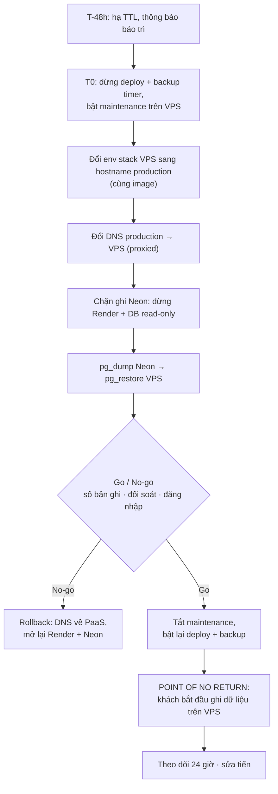

# Plan Sprint 15 — Cutover & Release v3.0 · v3.0.0

> Sprint: [sprint-15.md](../sprints/sprint-15.md) *(draft: refine AC trước khi bắt đầu)* · Tổng quan v3: [README](../README.md)
>
> **Cách dùng plan:** đọc "Khái niệm" → tự làm → kẹt quá 30 phút mới mở Hint 1 → Hint 2 → Hint 3. Tự nghĩ test case trước khi mở đáp án.
>
> ⚠️ S15-03 thao tác trên **dữ liệu production**. Mọi lệnh có tác động (đổi DNS, chặn ghi Neon, xóa/restore DB) do **bạn tự chạy**, theo runbook đã diễn tập. Claude có thể đọc runbook cùng bạn và nhắc bước tiếp theo, nhưng không chạy thay ([rule 05](../../rules/05-working-with-claude.md#6-an-toàn)).

## 0. Trước khi bắt đầu

- Sprint 14 xong: pipeline VPS chạy, backup hằng đêm có cảnh báo, restore drill đã làm.
- Đọc lại: [dns-tls.md](../../knowledge/dns-tls.md) (TTL, proxied vs DNS-only), [nginx.md](../../knowledge/nginx.md) (maintenance mode), [paas-vs-self-host.md](../../knowledge/paas-vs-self-host.md) (trước S15-04).
- Lấy danh sách **mọi** biến môi trường đang chạy trên Render và Vercel (production). Đối chiếu với `.env` trên VPS. Đặc biệt: JWT secret, cookie secret, `OFFICIAL_SELLER_*`, Sentry.
- Xem lại các bản ghi DNS production hiện tại trên Cloudflare (loại, giá trị, proxied hay DNS-only, TTL). Chụp lại làm mốc rollback.

**Câu hỏi cần trả lời được trước khi code:**
1. Trong lúc chuyển dữ liệu, nếu một khách đặt đơn trên Render **sau** khi bạn đã dump Neon thì đơn đó đi đâu? Làm sao để điều này không xảy ra?
2. "Point of no return" của cutover là thời điểm nào? Sau thời điểm đó, vì sao rollback về PaaS lại nguy hiểm?
3. Bản ghi DNS proxied và DNS-only khác nhau thế nào khi bạn đổi giá trị? Người dùng thấy thay đổi sau bao lâu?

## 1. Bức tranh tổng



Thời gian của cutover thật = thời gian đo được ở diễn tập (S15-02) + khoảng dự phòng.

## 2. Thứ tự & phụ thuộc

```
S15-01 maintenance + uptime ─▶ S15-02 diễn tập (≥ 1 lần thành công) ─▶ (≥ 1 ngày) ─▶ S15-03 cutover
                                                                                         └─▶ S15-04 dọn PaaS + ADR ─▶ S15-05 runbook + release
```

- Không làm S15-03 nếu diễn tập chưa thành công từ đầu đến cuối ít nhất một lần.
- S15-04 chỉ bắt đầu sau 24–48 giờ production ổn định trên VPS.

---

## 3.1 S15-01 · Maintenance mode + uptime monitor

### Khái niệm cần nắm
- **Maintenance mode** là công tắc ở tầng proxy: mọi request nhận trang tĩnh "đang bảo trì" với status `503 Service Unavailable` và header `Retry-After`. `503` (không phải `200`) để bot tìm kiếm và monitor hiểu đây là tạm thời.
- **Bật/tắt không cần deploy:** công tắc là một file trên VPS (mount vào `edge`). Nginx kiểm tra file tồn tại với mỗi request. Không build image, không restart container, nên bật được trong vài giây, kể cả khi pipeline đang hỏng.
- **Lối đi riêng cho người vận hành:** trong lúc bảo trì, bạn cần kiểm tra hệ thống thật trước khi mở cho khách. Các cách: cho phép theo IP (IP thật, sau `real_ip`), hoặc theo header/cookie bí mật. Mỗi cách có rủi ro riêng (IP nhà mạng đổi, header lộ).
- **Trang bảo trì phải tự đứng được:** không tải JS bundle, không gọi API, không font/ảnh từ app. Nếu nó phụ thuộc vào app, nó sẽ hỏng đúng lúc app không chạy.
- **Uptime monitor bên ngoài:** kiểm tra từ Internet, giống khách thật. Monitor chạy **trên** VPS sẽ chết cùng VPS. Kiểm tra nội dung (keyword/JSON) chứ không chỉ status code: trang lỗi đẹp vẫn trả `200`.
- **Một số dịch vụ free giới hạn mục đích phi thương mại** hoặc tần suất kiểm tra. Đọc điều khoản khi chọn.

### Hướng tiếp cận
1. Viết `maintenance.html` tĩnh (CSS inline). Đưa vào image `edge`.
2. Trong mỗi server block (trừ default): nếu file cờ tồn tại và request không thuộc lối đi riêng → trả `503` với trang bảo trì.
3. Chọn cách cho lối đi riêng, giải thích trong PR.
4. Mount thư mục cờ từ VPS vào `edge` (chỉ đọc). Viết lệnh bật/tắt vào runbook.
5. Uptime monitor cho `next-*` (sau cutover đổi sang hostname production): 4 monitor, kênh cảnh báo email/chat. Thử bằng cách dừng `edge`.

### File dự kiến tạo/sửa
`deploy/edge/maintenance.html`, `deploy/edge/templates/*.template` (logic bảo trì, có thể gom vào một file `include`), `compose.prod.yaml` (mount thư mục cờ), `deploy/edge/Dockerfile`.

### Tự nghĩ test case trước
Maintenance mode có thể "rò" ở đâu (một số request vẫn tới app)?

<details><summary>Đáp án tham khảo</summary>

- Mọi host (`shop`, `admin`, `seller`, `api`) đều bị chặn, không sót host nào.
- Mọi phương thức: `POST /v1/orders` cũng nhận `503`, không chỉ `GET /`.
- Asset tĩnh của admin/seller: chặn hoặc cho qua đều được, nhưng **API thì phải chặn**.
- `/v1/health` qua edge khi bảo trì → `503`. Healthcheck **bên trong** Docker (gọi thẳng container) vẫn `healthy`.
- Lối đi riêng: bạn vào được. Một máy khác (4G) nhận `503`.
- `Retry-After` có trên response.
- Tắt cờ → bình thường ngay, `docker compose ps` không có container nào restart.
- Trang bảo trì: DevTools Network chỉ có một request.
</details>

### Gợi ý
<details><summary>Hint 1: hướng đi</summary>

Làm cho một host trước bằng `curl`. Khi logic đúng, chuyển vào một file `include` dùng chung cho mọi server block để không lặp và không sót.
</details>

<details><summary>Hint 2: khái niệm/API</summary>

- `if (-f /path/to/flag)` kiểm tra file tồn tại. `if` trong Nginx có nhiều giới hạn ("if is evil" khi dùng trong `location`). Dùng `if` chỉ với `return`/`set` là an toàn.
- `geo $var { … }` để đánh dấu IP được phép (dùng `$remote_addr` sau `real_ip`). `map` để kết hợp nhiều điều kiện thành một biến.
- `error_page 503 @maintenance;` với **named location**. Nếu dùng `error_page 503 /maintenance.html`, Nginx chuyển hướng nội bộ tới URI đó, chạy lại các lệnh `if`/`return` ở cấp `server`, gặp lại `return 503`, và (vì `recursive_error_pages` mặc định tắt) trả trang 503 mặc định của Nginx thay vì trang của bạn. Kiểm tra bằng `curl`.
- `add_header Retry-After … always;` (thiếu `always` → header không có trên response `503`).
</details>

<details><summary>Hint 3: khung</summary>

```nginx
# http {} (khung)
geo $maint_bypass {
    default 0;
    # IP/dải được đi lối riêng → 1
}

# include trong mỗi server block (khung)
set $maint 0;
if (-f /etc/nginx/maintenance/on) { set $maint 1; }
# kết hợp $maint và $maint_bypass (gợi ý: set thêm biến, hoặc map ở http {})
# nếu đang bảo trì và không bypass → return 503;

error_page 503 @maintenance;
location @maintenance {
    root ...;                          # thư mục chứa maintenance.html
    rewrite ^ /maintenance.html break;
    add_header Retry-After ... always;
    add_header Cache-Control "no-store" always;
}
```
</details>

### Bẫy thường gặp
| Triệu chứng | Nguyên nhân | Cách tránh |
|---|---|---|
| Bật bảo trì nhưng API vẫn nhận đơn | Quên server block `api.` | Một file `include` cho mọi host, test từng host |
| Trang bảo trì trắng tinh | Trang tải CSS/JS từ app đang bị chặn | CSS inline, không phụ thuộc gì |
| Cloudflare hiển thị trang lỗi của họ thay vì trang của bạn | Response lỗi bị Cloudflare thay thế trong một số cấu hình | Kiểm tra qua Cloudflare thật, không chỉ `curl` thẳng origin |
| Người dùng vẫn thấy trang bảo trì sau khi đã tắt | Trang bảo trì bị cache (trình duyệt/Cloudflare) | `Cache-Control: no-store` |
| Lối đi riêng theo IP không hoạt động | `geo` dùng IP Cloudflare vì `real_ip` cấu hình sai | Kiểm tra log có IP thật trước |
| Monitor báo "up" dù app lỗi | Chỉ kiểm tra status code | Kiểm tra nội dung |

### Kiểm chứng AC
- [ ] Bật cờ: `curl -I` mọi host → `503` + `Retry-After`. Tắt cờ: bình thường, không restart.
- [ ] Lối đi riêng hoạt động, máy khác nhận `503`.
- [ ] Dừng `edge` → nhận cảnh báo. Bật lại → nhận thông báo phục hồi.
- [ ] Trang bảo trì: một request duy nhất trong Network tab.

### Đọc thêm
- [nginx.md](../../knowledge/nginx.md)
- Nginx `if` (và "If is evil"): https://nginx.org/en/docs/http/ngx_http_rewrite_module.html#if
- `ngx_http_geo_module`: https://nginx.org/en/docs/http/ngx_http_geo_module.html
- MDN `503` và `Retry-After`: https://developer.mozilla.org/en-US/docs/Web/HTTP/Reference/Status/503

---

## 3.2 S15-02 · Diễn tập cutover trên bản sao dữ liệu thật

### Khái niệm cần nắm
- **Diễn tập (rehearsal / dry run):** chạy toàn bộ quy trình trên bản sao dữ liệu thật, giống hệt ngày thật, trừ bước đổi DNS. Mục tiêu: phát hiện lỗi khi chưa có áp lực, và **đo thời gian** để biết maintenance window cần bao lâu.
- **`pg_dump` từ Neon:**
  - Dùng **kết nối direct**, không qua pooler (PgBouncer ở chế độ transaction không hỗ trợ đầy đủ những gì `pg_dump` cần).
  - Phiên bản `pg_dump` phải **bằng hoặc mới hơn** phiên bản server. Cách dễ nhất: chạy `pg_dump` trong container `postgres:<major>` trên VPS.
  - Dump từ VPS: dữ liệu đi Neon → VPS trực tiếp, không qua máy bạn.
- **Khác biệt giữa Neon và Postgres tự host:** tên role/owner khác (ví dụ `neondb_owner`), có thể có extension hoặc quyền mà server của bạn không có. `--no-owner --no-privileges` khi restore, đọc **toàn bộ** log lỗi của `pg_restore`.
- **`_prisma_migrations`:** bảng lịch sử migration đi cùng dữ liệu. Restore vào database **trống** (không chạy `migrate deploy` trước), sau đó `prisma migrate status` phải báo "up to date". Nếu chạy migrate trước rồi restore dữ liệu lên trên → xung đột bảng, khóa chính.
- **Sequence:** dump custom gồm cả giá trị hiện tại của sequence (`setval`). Nếu bảng dùng ID tự tăng, sau restore phải tạo bản ghi mới được mà không trùng khóa. Thử tạo một đơn mới là cách kiểm tra.
- **Dữ liệu thật trên hostname preview:** sau khi restore bản sao production vào VPS, `next-*` chứa dữ liệu và tài khoản thật. Giữ maintenance bật cho preview (chỉ lối đi riêng vào được) cho tới cutover.
- **Đóng băng thay đổi:** trong lúc diễn tập (và cutover), tạm dừng pipeline deploy VPS và kiểm tra backup timer không chạy trùng.
- **Collation:** Neon và image Postgres có thể dùng collation khác nhau. Khác collation thì thứ tự sắp xếp chuỗi khác, checksum có `ORDER BY` trên text lệch dù dữ liệu giống, và thứ tự hiển thị trong app đổi sau cutover. Tạo database trên VPS với collation khớp Neon.
- **Kiểm chứng dữ liệu:** đếm số bản ghi là tối thiểu. Mạnh hơn: checksum theo bảng (ví dụ `md5(string_agg(id::text, ',' ORDER BY id))`), và chạy **đối soát ledger** (S12-04): nó kiểm tra cả tính toàn vẹn nghiệp vụ, không chỉ số lượng.
- **Phiên đăng nhập sau cutover:** refresh token nằm trong DB (đi theo dữ liệu). Nếu JWT secret trên VPS **khác** Render, mọi access token đang dùng bị từ chối. Tùy thiết kế refresh của bạn, có thể mọi người bị đăng xuất. Quyết định: copy secret y hệt, hay chấp nhận đăng xuất toàn bộ (và thông báo trước).
- **Go/no-go:** danh sách kiểm tra có tiêu chí đạt/không đạt rõ ràng, quyết định trước khi bắt đầu. Ngày thật không phải lúc để tranh luận "lệch 2 bản ghi có sao không".

### Hướng tiếp cận
1. Viết bản nháp runbook: từng bước, lệnh, người làm (bạn), thời gian dự kiến, cách kiểm tra, cách rollback ở bước đó.
2. Tạo một **Neon branch** từ production (bản sao tức thời, không đụng production) làm nguồn diễn tập.
3. Trên VPS: tạm dừng deploy và kiểm tra backup timer, bật maintenance, dừng `api-1`, `api-2` (không ai ghi vào DB). So sánh `SELECT datname, datcollate, datctype FROM pg_database;` giữa Neon và VPS. Xóa và tạo lại database của preview với collation khớp Neon.
4. `pg_dump` từ Neon branch → `pg_restore` vào VPS. Bấm giờ từng bước.
5. Kiểm chứng theo danh sách go/no-go: số bản ghi + checksum, đối soát ledger, `migrate status`, đăng nhập bằng tài khoản thật (của bạn), tạo đơn mới end-to-end.
6. Ghi mọi lỗi gặp phải và cách sửa vào runbook. Làm lại từ đầu cho tới khi chạy trơn tru **một lần không sửa gì**.
7. Gửi ghi chú cho Claude viết `docs/runbooks/cutover-v3.md`.

### File dự kiến tạo/sửa
`deploy/cutover/dump-neon.sh`, `deploy/cutover/restore.sh`, `deploy/cutover/verify.sql` (đếm + checksum), có thể `deploy/cutover/compare.sh`. Runbook do Claude viết.

### Tự nghĩ test case trước
Danh sách go/no-go của bạn gồm những kiểm tra nào? Mỗi kiểm tra: lệnh gì, kết quả "đạt" là gì?

<details><summary>Đáp án tham khảo</summary>

- Số bản ghi của **mọi** bảng nghiệp vụ (User, Store, Category, Product, Order, VendorOrder, OrderItem, RefreshToken/Session, LedgerAccount, LedgerTransaction, LedgerEntry, Payout…): Neon = VPS, lệch 0.
- Checksum ID theo bảng: Neon = VPS.
- Đối soát ledger trên VPS: "khớp", tổng mọi entry = 0.
- `prisma migrate status`: up to date, không có migration nào lạ.
- Đăng nhập bằng tài khoản tạo trước cutover: thành công.
- Seller chính hãng đăng nhập vào `seller.`: thấy sản phẩm và số dư như trên production.
- Tạo đơn mới end-to-end: ID mới không trùng, ledger vẫn khớp sau đơn mới.
- Log `pg_restore` không có lỗi nào chưa được giải thích.
- Thời gian dump + restore + kiểm chứng: ghi lại.
</details>

### Gợi ý
<details><summary>Hint 1: hướng đi</summary>

Lần diễn tập đầu tiên sẽ thất bại, và đó là mục đích. Ghi lại từng lỗi. Ước lượng thời gian thực chỉ đáng tin từ lần chạy **trơn tru** cuối cùng.
</details>

<details><summary>Hint 2: khái niệm/API</summary>

- Neon: connection string direct (không có `-pooler` trong host), Neon branching để có bản sao tức thời.
- `docker run --rm postgres:<major> pg_dump "<neon direct url>" -Fc > neon.dump` (mạng mặc định vì cần ra Internet tới Neon; mạng `internal` của Compose không ra được Internet). Restore từ file trên host: `docker compose exec -T postgres pg_restore … < neon.dump` (qua stdin nên không dùng `-j` được; muốn `-j` thì copy file vào container trước). đọc kỹ cách truyền URL có mật khẩu mà không để lộ trong `ps`/history (biến môi trường, `PGPASSWORD`, hoặc file `.pgpass`).
- `pg_restore --no-owner --no-privileges --exit-on-error -d <vps db>` khi diễn tập. Nếu có lỗi về extension/role, `pg_restore -l neon.dump > list` rồi chỉnh danh sách và dùng `-L list`.
- `pg_restore -j <n>` restore song song (nhanh hơn với dữ liệu lớn, không dùng được với stdin).
- `prisma migrate status` chạy bằng container `migrate` của S14-02.
</details>

<details><summary>Hint 3: khung verify.sql</summary>

```sql
-- deploy/cutover/verify.sql (khung — chạy trên cả Neon và VPS, so sánh output)
-- Với mỗi bảng nghiệp vụ:
SELECT '<Bảng>' AS t, count(*) AS n, md5(string_agg(id::text, ',' ORDER BY id::text COLLATE "C")) AS h FROM "<Bảng>"
UNION ALL
-- ... lặp cho mọi bảng
;
```
`COLLATE "C"` để thứ tự không phụ thuộc collation của từng database. Bảng không có cột `id` đơn (khóa ghép) cần biểu thức khác. Thứ tự output phải cố định để `diff` được.
</details>

### Bẫy thường gặp
| Triệu chứng | Nguyên nhân | Cách tránh |
|---|---|---|
| `pg_dump: error: aborting because of server version mismatch` | Client cũ hơn server | Chạy `pg_dump` trong image `postgres:<major của Neon hoặc mới hơn>` |
| Checksum khác nhau dù dữ liệu giống | Collation khác nhau giữa Neon và VPS | `COLLATE "C"` trong checksum, tạo DB với collation khớp Neon |
| Dump lỗi/treo qua URL pooler | Kết nối qua PgBouncer | URL direct |
| `role "neondb_owner" does not exist` | Dump mang owner của Neon | `--no-owner --no-privileges` |
| `relation "_prisma_migrations" already exists` | Đã chạy `migrate deploy` trước khi restore | Restore vào DB trống |
| Tạo đơn mới lỗi `duplicate key` | Sequence không được restore đúng | Kiểm tra `setval` trong dump, tạo bản ghi thử sau restore |
| Mọi người bị đăng xuất sau cutover | JWT/cookie secret khác Render | Quyết định trước, copy secret hoặc thông báo |
| Mật khẩu Neon xuất hiện trong `history`/log CI | URL có mật khẩu truyền thẳng trên dòng lệnh | Biến môi trường, `.pgpass`, `HISTCONTROL=ignorespace` |
| Diễn tập "thành công" nhưng ngày thật lâu gấp đôi | Neon branch nhỏ hơn hoặc nhanh hơn production lúc cao điểm | Diễn tập gần ngày thật, cộng dự phòng 50% |

### Kiểm chứng AC
- [ ] Runbook có số liệu thời gian từ lần diễn tập trơn tru.
- [ ] Output `verify.sql` của Neon và VPS: `diff` rỗng.
- [ ] Đối soát ledger: "khớp".
- [ ] `prisma migrate status`: up to date.
- [ ] Runbook có mục rollback và bảng go/no-go với tiêu chí đạt.

### Đọc thêm
- Neon: migrate data with `pg_dump`/`pg_restore`: https://neon.com/docs/import/migrate-from-postgres
- Neon branching: https://neon.com/docs/introduction/branching
- PostgreSQL `pg_dump` (phần notes về phiên bản): https://www.postgresql.org/docs/current/app-pgdump.html
- Prisma `migrate status`: https://www.prisma.io/docs/orm/reference/prisma-cli-reference#migrate-status

---

## 3.3 S15-03 · Cutover production

### Khái niệm cần nắm
- **Chặn ghi là bắt buộc.** Từ lúc bắt đầu dump tới lúc VPS mở cho khách, **không được có bất kỳ ghi nào** vào Neon. Một đơn ghi vào Neon sau khi dump sẽ biến mất.
  - **Vì sao đổi DNS chưa đủ:** client (trình duyệt, resolver của nhà mạng) có thể còn nhớ bản ghi cũ trong thời gian TTL và tiếp tục gọi Render. Bản ghi DNS-only có TTL do bạn đặt. Với bản ghi proxied, Cloudflare đổi gần như tức thì ở edge, nhưng production v1–v2 đang là bản ghi DNS-only trỏ tới Render/Vercel.
  - **Vì vậy chặn ở nguồn:** tạm dừng (suspend) service API trên Render, **và** đặt database Neon chỉ đọc (ví dụ `ALTER DATABASE … SET default_transaction_read_only = on`, rồi ngắt các kết nối đang mở để phiên mới nhận cấu hình). Hai lớp, vì mỗi lớp đều có thể sót.
- **Hạ TTL trước:** đổi TTL các bản ghi production xuống thấp **24–48 giờ trước** (TTL cũ phải hết hạn trước thì TTL mới mới có tác dụng). Sau cutover nâng lại.
- **Point of no return:** khi tắt maintenance, khách bắt đầu ghi dữ liệu mới trên VPS. Quay về PaaS sau thời điểm này nghĩa là **mất** dữ liệu mới, hoặc phải chuyển ngược dữ liệu. Vì vậy: trước điểm này thì rollback, sau điểm này thì **sửa tiến** (fix forward) trên VPS.
- **Cùng image, đổi env:** chuyển từ hostname `next-*` sang hostname production chỉ là đổi `.env` (Nginx template, runtime config, `CORS_ORIGINS`) rồi `up -d`. Đây là lúc nguyên tắc "build once, deploy anywhere" (S13-02) được chứng minh. Đổi env **trước** khi đổi DNS (lúc maintenance đang bật): nếu DNS đã trỏ về VPS mà `edge` chưa có `server_name` production, request rơi vào default server, handshake bị từ chối và khách thấy lỗi 525 của Cloudflare thay vì trang bảo trì.
- **24 giờ đầu:** lỗi thường không xuất hiện ngay mà ở luồng ít dùng (payout, đối soát, email chưa có…), ở giờ cao điểm, hoặc ở backup đêm đầu tiên. Theo dõi chủ động.

### Hướng tiếp cận
1. **T-48h:** hạ TTL các bản ghi production. Thông báo maintenance window (banner trên site, nếu có kênh).
2. **T-1h:** kiểm tra lại: pipeline VPS xanh, backup đêm qua thành công, runbook in sẵn/mở sẵn, ghi chép thời gian sẵn sàng.
3. **T0:** làm theo runbook, ghi thời điểm từng bước:
   - Tạm dừng deploy (khóa environment hoặc tắt workflow) và backup timer.
   - Bật maintenance trên VPS. Đổi `.env` sang hostname production, `up -d`. Kiểm tra bằng `--resolve`: host production trả trang bảo trì, lối đi riêng vào được.
   - Đổi DNS production sang VPS (proxied).
   - Suspend API trên Render. Neon read-only, ngắt kết nối.
   - Dump → restore → kiểm chứng (go/no-go).
   - Go: tắt maintenance. Bật lại deploy và backup timer.
4. Kiểm tra bên ngoài: `curl -I` thấy header Cloudflare, `/v1/health` đúng version. Uptime monitor đổi sang hostname production.
5. Một đơn end-to-end thật (bạn làm khách và seller).
6. Theo dõi 24 giờ: Sentry, log, uptime, backup đêm đầu tiên trên dữ liệu production.
7. Neon giữ ở trạng thái read-only (hoặc dừng compute), **không xóa**.

### File dự kiến tạo/sửa
Không có code mới (mọi thứ đã có từ S15-01, S15-02). `.env` trên VPS. Bản ghi DNS trên Cloudflare. Ghi chép thời gian → Claude cập nhật runbook và đưa số liệu vào retro.

### Tự nghĩ test case trước
Viết danh sách kiểm tra **sau** khi tắt maintenance. Những gì phải đúng trong 15 phút đầu? Trong 24 giờ đầu?

<details><summary>Đáp án tham khảo</summary>

**15 phút đầu:**
- `dig +short shop.<domain>` trả IP của Cloudflare (proxied), không phải Vercel.
- `curl -I https://shop.<domain>` có `server: cloudflare`, không có header của Vercel. Tương tự `admin.`, `seller.`, `api.`.
- `/v1/health` → version đúng tag.
- Đăng nhập bằng tài khoản cũ, đặt một đơn, seller xử lý, khách xác nhận nhận hàng.
- Đối soát ledger → "khớp".
- Uptime monitor (hostname production) xanh. Sentry không có lỗi mới.
- Log Render: không có request ghi nào sau thời điểm chặn ghi.

**24 giờ đầu:**
- Backup đêm đầu tiên chạy, có trong R2, dead man's switch nhận ping.
- Không có cảnh báo uptime.
- Sentry: mọi lỗi mới đã được xem xét.
- `docker stats`: RAM/CPU trong giới hạn lúc cao điểm.
- Nâng TTL trở lại.
</details>

### Gợi ý
<details><summary>Hint 1: hướng đi</summary>

Ngày cutover **không phải** lúc để nghĩ. Mọi lệnh đã nằm trong runbook, đã chạy ở diễn tập. Nếu gặp điều gì runbook không có, dừng lại ở trạng thái an toàn gần nhất (maintenance đang bật), ghi lại, rồi mới quyết định.
</details>

<details><summary>Hint 2: khái niệm/API</summary>

- Cloudflare: đổi bản ghi `CNAME → Render/Vercel` thành `A → IP VPS` với proxy bật. Kiểm tra cả bản ghi apex (nếu có redirect apex → `shop.`).
- Vercel/Render vẫn giữ custom domain trong cấu hình của họ cho tới S15-04. Không ảnh hưởng gì vì DNS không còn trỏ tới đó.
- Neon: sau khi đặt read-only ở cấp database, các phiên **đang mở** vẫn giữ cấu hình cũ. Xem `pg_stat_activity` và `pg_terminate_backend` (chỉ với kết nối của ứng dụng). Kiểm tra lại bằng một lệnh ghi thử → phải bị từ chối.
- `dig @1.1.1.1 shop.<domain>` và `dig @8.8.8.8 shop.<domain>` để thấy resolver công cộng đã nhận giá trị mới chưa.
</details>

<details><summary>Hint 3: khung bảng ghi chép (điền trong lúc làm)</summary>

```text
| Bước                         | Dự kiến (diễn tập) | Bắt đầu (UTC) | Kết thúc | Kết quả / ghi chú |
|------------------------------|--------------------|---------------|----------|-------------------|
| Dừng deploy + backup timer   |                    |               |          |                   |
| Bật maintenance              |                    |               |          |                   |
| Đổi env production + up      |                    |               |          |                   |
| Đổi DNS                      |                    |               |          |                   |
| Suspend Render + Neon RO     |                    |               |          |                   |
| Dump                         |                    |               |          |                   |
| Restore                      |                    |               |          |                   |
| Kiểm chứng (go/no-go)        |                    |               |          |                   |
| Tắt maintenance (NO RETURN)  |                    |               |          |                   |
```
</details>

### Bẫy thường gặp
| Triệu chứng | Nguyên nhân | Cách tránh |
|---|---|---|
| Đơn của khách "biến mất" sau cutover | Khách còn gọi Render (DNS cũ) sau lúc dump, chưa chặn ghi | Suspend Render + Neon read-only **trước** khi dump |
| Một số người vẫn vào Vercel cả giờ sau | TTL cũ dài, chưa hạ trước | Hạ TTL 24–48 giờ trước |
| CORS lỗi trên `shop.` sau cutover | `.env` vẫn là `next-*` | Bước "đổi env production" trong runbook, kiểm tra trước khi tắt maintenance |
| Cookie đăng nhập không được set | Domain/`Secure`/`trust proxy` khác giữa preview và production | Đã diễn tập với cấu hình gần production nhất có thể. Kiểm tra bằng lối đi riêng trước khi mở |
| Khách thấy lỗi 525 của Cloudflare thay vì trang bảo trì | DNS trỏ về VPS trước khi `edge` có `server_name` production | Đổi env trước, đổi DNS sau |
| Deploy hoặc backup chạy giữa lúc restore | Pipeline/timer vẫn bật | Tạm dừng cả hai trong runbook |
| Neon vẫn nhận ghi dù đã đặt read-only | Kết nối mở từ trước giữ cấu hình cũ | Ngắt kết nối của ứng dụng, ghi thử để xác nhận |
| Hoảng loạn, rollback sau khi đã mở cho khách | Không xác định point of no return trước | Quyết định trong runbook, tuân theo |

### Kiểm chứng AC
- [ ] `curl -I` 4 host production: header Cloudflare. `/v1/health` đúng version.
- [ ] `verify.sql`: Neon (sau chặn ghi) và VPS `diff` rỗng. Đối soát "khớp".
- [ ] Đăng nhập tài khoản cũ + một đơn end-to-end mới thành công.
- [ ] Bảng ghi chép: thời gian bảo trì thật ≤ ước lượng + 50%.
- [ ] Log Render/thống kê Neon: không có ghi sau thời điểm chặn.

### Đọc thêm
- [dns-tls.md](../../knowledge/dns-tls.md), phần TTL
- Cloudflare DNS TTL: https://developers.cloudflare.com/dns/manage-dns-records/reference/ttl/
- Cloudflare proxied vs DNS-only: https://developers.cloudflare.com/dns/proxy-status/
- PostgreSQL `default_transaction_read_only`: https://www.postgresql.org/docs/current/runtime-config-client.html
- Google SRE Book, chương "Managing Critical State" và "Postmortem Culture" (đọc để viết retro): https://sre.google/sre-book/table-of-contents/

---

## 3.4 S15-04 · Dọn PaaS + ADR self-host + so sánh chi phí

### Khái niệm cần nắm
- **Dọn có thứ tự:** gỡ những gì có thể gây nhầm lẫn trước (job deploy cũ có thể vô tình deploy, hostname preview có thể bị lập chỉ mục), xóa tài nguyên tốn tiền hoặc chứa dữ liệu sau cùng, khi đã chắc không cần nữa.
- **Dữ liệu cũ là trách nhiệm:** Neon còn dữ liệu khách hàng. Giữ một bản dump cuối (mã hóa phía server bởi R2) và một mốc ngày xóa rõ ràng tốt hơn để một bản sao bị quên trên một dịch vụ khác.
- **ADR ghi lại đánh đổi, không chỉ quyết định:** "chuyển sang VPS" là quyết định. ADR có giá trị khi ghi rõ thứ **đã chấp nhận mất**: single point of failure, RPO 24 giờ, thời gian vận hành của bạn, và điều kiện nào sẽ khiến ta xem lại quyết định (ví dụ: cần HA, cần staging → v7).
- **Chi phí thật gồm cả thời gian:** bảng so sánh nên có cả tiền (theo hóa đơn thật) và số giờ bạn bỏ ra trong v3 cho vận hành.

### Hướng tiếp cận
1. Xóa job/step deploy Render/Vercel khỏi workflow. Kiểm tra bằng một merge nhỏ.
2. Gỡ hostname `next-*`: bản ghi DNS, server block (nếu không dùng chung template), `CORS_ORIGINS`, uptime monitor.
3. Vercel: gỡ domain khỏi 3 project, rồi xóa project. Render: xóa service. Ghi lại ngày.
4. Neon: dump cuối → R2 (prefix riêng, ví dụ `archive/`), giữ project N ngày, đặt lịch xóa.
5. Giới hạn `workflow_dispatch`: environment chỉ cho branch `main`, dispatch chỉ deploy tag đã có (rollback), không build ref bất kỳ lên production.
6. Gom số liệu: hóa đơn VPS, chi phí PaaS nếu đã/sẽ phải lên gói trả phí, số giờ vận hành. Gửi cho Claude cùng các quyết định để viết ADR-0011.

### File dự kiến tạo/sửa
`.github/workflows/*.yml` (xóa deploy PaaS), `.env.production.example`, có thể `vercel.json`/`turbo-ignore` cấu hình cũ (xóa nếu không còn dùng). ADR-0011 do Claude viết.

### Tự nghĩ test case trước
Sau khi dọn, làm sao chắc chắn không còn "tàn dư" nào?

<details><summary>Đáp án tham khảo</summary>

- `grep -rniE "onrender|render\.com|vercel" .github/ turbo.json apps/*/package.json .env.production.example` (và `vercel.json` nếu còn) → chỉ còn những chỗ có chủ đích. Không grep `render` trong `apps/**/*.ts`: chữ "render" xuất hiện khắp code SSR.
- `grep -rn "next-" deploy/ .env.production.example` → rỗng.
- Cloudflare DNS: không còn bản ghi `next-*`. `dig next-shop.<domain>` → NXDOMAIN.
- Merge một PR → chỉ job deploy VPS chạy.
- Dashboard Vercel/Render: không còn project/service (hoặc ghi rõ ngày xóa).
- R2 `archive/` có bản dump cuối của Neon.
</details>

### Gợi ý
<details><summary>Hint 1: hướng đi</summary>

Làm theo thứ tự: code (workflow) → DNS → dịch vụ → dữ liệu. Mỗi bước một commit hoặc một ghi chú, để biết đã dọn tới đâu nếu bị gián đoạn.
</details>

<details><summary>Hint 2: khái niệm/API</summary>

- Cloudflare dashboard → DNS → xóa bản ghi. Sau đó Origin Certificate vẫn phủ `*.<domain>`, không cần đổi.
- Vercel: Settings → Domains → Remove trước, rồi Settings → General → Delete Project.
- Neon: xem docs về xóa project và thời gian dữ liệu còn khôi phục được sau khi xóa (nếu có).
- ADR: Claude dùng template ADR của dự án, bạn cung cấp: lý do, các phương án đã cân nhắc (ở lại PaaS trả phí, Coolify, K8s ngay), chi phí, rủi ro chấp nhận, điều kiện xem lại.
</details>

<details><summary>Hint 3: khung bảng chi phí cho ADR</summary>

```text
| Hạng mục             | PaaS (v2, free) | PaaS nếu lên gói trả phí | VPS (v3, thực tế) |
|----------------------|-----------------|--------------------------|-------------------|
| Compute API          |                 |                          |                   |
| Frontend (3 app)     |                 |                          |                   |
| Postgres             |                 |                          |                   |
| Backup off-site      |                 |                          |                   |
| Giới hạn đáng chú ý  | cold start, …   |                          | 1 máy, RPO 24h, … |
| Giờ vận hành / tháng |                 |                          |                   |
```
</details>

### Bẫy thường gặp
| Triệu chứng | Nguyên nhân | Cách tránh |
|---|---|---|
| Một merge vô tình deploy lên Render đã "dọn" | Job deploy cũ còn trong workflow khác | `grep` toàn bộ `.github/` |
| Domain không gắn được vào dịch vụ khác sau này | Domain còn được "giữ" trong project Vercel cũ | Gỡ domain khỏi Vercel trước khi xóa project |
| Bản dump Neon cuối cùng bị lifecycle xóa | Lưu chung prefix `daily/` | Prefix `archive/` riêng, không có lifecycle xóa sớm |
| ADR chỉ có "vì VPS rẻ hơn" | Thiếu đánh đổi | Ghi rủi ro đã chấp nhận và điều kiện xem lại |

### Kiểm chứng AC
- [ ] Merge PR → chỉ deploy VPS.
- [ ] `grep` `next-` trong `deploy/`, `.env.production.example`, workflow → rỗng. `dig next-shop.<domain>` → NXDOMAIN.
- [ ] ADR-0011 đã merge, có bảng chi phí thật và ngày dọn Neon.

### Đọc thêm
- [paas-vs-self-host.md](../../knowledge/paas-vs-self-host.md)
- Michael Nygard, Documenting Architecture Decisions: https://cognitect.com/blog/2011/11/15/documenting-architecture-decisions

---

## 3.5 S15-05 · Runbook vận hành + Release v3.0.0 + retro

### Khái niệm cần nắm
- **Runbook:** hướng dẫn từng bước cho một tình huống vận hành, viết để **người đang mệt lúc 3 giờ sáng** làm theo được. Cấu trúc: dấu hiệu nhận biết → kiểm tra → xử lý → xác nhận đã hết → báo cáo.
- **Runbook chưa thử là giả thuyết.** Mỗi runbook phải được bạn chạy thử ít nhất một lần (trên VPS, giờ thấp điểm, hoặc mô phỏng).
- **Xoay secret (rotation):** thay secret định kỳ hoặc khi nghi bị lộ. Khó ở chỗ thứ tự: secret mới phải được hệ thống chấp nhận **trước** khi secret cũ bị bỏ, nếu không sẽ có downtime hoặc mọi người bị đăng xuất. Mỗi loại secret có cách xoay khác nhau.
- **Release của version hạ tầng:** không có tính năng mới cho khách. Changelog nói rõ: thay đổi hạ tầng, không có thay đổi phá vỡ API, đường dẫn tới ADR.

### Hướng tiếp cận
1. Với mỗi tình huống trong sprint: tạo lại tình huống (hoặc mô phỏng), xử lý, ghi lệnh và kết quả.
   - API restart liên tục: ví dụ đặt sai một biến env bắt buộc trên một replica.
   - Ổ đĩa đầy: tạo file lớn tạm (`fallocate`), quan sát triệu chứng, dọn. **Xóa file tạm ngay.**
   - Xoay mật khẩu Postgres, SSH key deploy, token R2. JWT secret: thiết kế cách xoay không đăng xuất mọi người (nếu được) hoặc ghi rõ tác động.
   - Origin Certificate: tạo cert mới, thay, reload, thu hồi cert cũ.
2. Gửi ghi chú cho Claude viết `docs/runbooks/*.md`.
3. Release `develop → main` theo [rule 01](../../rules/01-git-branching.md), tag `v3.0.0`. Claude viết changelog/GitHub Release.
4. Smoke test toàn luồng marketplace trên production.
5. Retro sprint 15 + retro tổng v3 (số liệu: thời gian bảo trì, RTO, thời gian rollback, chi phí, giờ vận hành). Claude viết `docs/retro/v3.md` từ ghi chú của bạn. Lập backlog v4.

### File dự kiến tạo/sửa
Không có code mới (có thể sửa nhỏ script nếu runbook phát hiện vấn đề). Runbook, changelog, retro do Claude viết.

### Tự nghĩ test case trước
Với runbook "ổ đĩa đầy": những thứ gì trên VPS có thể làm đầy đĩa, và lệnh nào cho bạn biết thứ nào đang chiếm chỗ?

<details><summary>Đáp án tham khảo</summary>

- Log container (nếu giới hạn log chưa áp dụng cho container cũ): `docker system df -v`, `du -sh /var/lib/docker/containers/*`.
- Image cũ: `docker image ls`, `docker system df`.
- Volume Postgres phình (dữ liệu, WAL): `du -sh` thư mục volume, `SELECT pg_size_pretty(pg_database_size(...))`.
- File dump tạm của backup không được xóa: `ls -la /var/backups/pixelmart`.
- journald: `journalctl --disk-usage`.
- Tổng quan: `df -h`, `du -xh / --max-depth=2 | sort -h | tail`.
- Triệu chứng khi đầy: Postgres từ chối ghi/dừng, Nginx không ghi được log, deploy lỗi khi pull image.
</details>

### Gợi ý
<details><summary>Hint 1: hướng đi</summary>

Đừng viết runbook từ trí nhớ. Mở hai cửa sổ: một cửa sổ terminal làm thật, một file ghi chú chép lại **từng lệnh và output quan trọng**. Ghi chú đó là nguyên liệu tốt nhất cho Claude viết runbook.
</details>

<details><summary>Hint 2: khái niệm/API</summary>

- Xoay mật khẩu Postgres không downtime: `ALTER ROLE … PASSWORD …`, cập nhật `.env`, thay từng replica API (giống rolling deploy). Kết nối đang mở vẫn dùng phiên đã xác thực.
- Xoay SSH key deploy: thêm key mới vào `authorized_keys` → cập nhật secret GitHub → deploy thử → xóa key cũ.
- Xoay JWT secret: nếu API chấp nhận cả secret cũ và mới trong một khoảng thời gian (verify bằng danh sách key), người dùng không bị đăng xuất. Đây là thay đổi code: nếu muốn làm, tạo ticket riêng cho v4.
</details>

<details><summary>Hint 3: khung một runbook</summary>

```text
# Runbook: <tên tình huống>
Dấu hiệu: (alert nào, người dùng thấy gì)
Mức độ: (ảnh hưởng tới ai)
Kiểm tra:
  1. <lệnh> → kết quả bình thường là ...
Xử lý:
  1. <lệnh>
Xác nhận đã hết:
  - <lệnh/kiểm tra>
Sau sự cố: (ghi vào đâu, cần ticket gì)
```
</details>

### Bẫy thường gặp
| Triệu chứng | Nguyên nhân | Cách tránh |
|---|---|---|
| Runbook thiếu bước, lúc cần thì không làm theo được | Viết từ trí nhớ, chưa thử | Thử từng runbook, ghi lệnh thật |
| Tạo file lớn để thử "đĩa đầy" rồi quên xóa | Mô phỏng trên production | Thử ở giờ thấp điểm, xóa ngay, có người (hoặc checklist) nhắc |
| Xoay secret gây downtime | Bỏ secret cũ trước khi secret mới có hiệu lực | Thêm mới → chuyển → bỏ cũ |
| Changelog v3.0.0 làm người đọc nghĩ có breaking change | "Major" bị hiểu theo SemVer thuần | Ghi rõ "Major = mốc lộ trình, không có thay đổi phá vỡ API" |

### Kiểm chứng AC
- [ ] Mỗi runbook đủ 4 phần (dấu hiệu, kiểm tra, xử lý, xác nhận) và đã được thử ít nhất một lần.
- [ ] Tag `v3.0.0`, GitHub Release có changelog.
- [ ] `docs/retro/v3.md` có số liệu. Epic v4 đã tạo trên Jira.

### Đọc thêm
- Google SRE Workbook, On-Call (phần playbook): https://sre.google/workbook/on-call/
- PagerDuty incident response docs: https://response.pagerduty.com/

---

## 4. Tự kiểm tra cuối sprint

1. Vì sao đổi DNS sang VPS chưa đủ để ngăn ghi vào Neon trong lúc cutover?
<details><summary>Gợi ý</summary>

Resolver và trình duyệt còn cache bản ghi cũ trong thời gian TTL, nên một số khách vẫn gọi Render. Phải chặn ghi ở nguồn: dừng API trên Render và đặt DB chỉ đọc. Hạ TTL trước giúp thời gian "lai" ngắn lại, nhưng không thay được việc chặn ghi.
</details>

2. Point of no return là gì? Vì sao sau thời điểm đó nên "fix forward"?
<details><summary>Gợi ý</summary>

Là lúc hệ thống mới bắt đầu nhận dữ liệu mà hệ thống cũ không có (tắt maintenance, khách đặt đơn trên VPS). Rollback sau đó làm mất dữ liệu mới hoặc phải chuyển ngược dữ liệu, rủi ro hơn sửa lỗi tại chỗ.
</details>

3. Vì sao phải diễn tập trên bản sao dữ liệu thật, không phải dữ liệu seed?
<details><summary>Gợi ý</summary>

Dữ liệu thật có kích thước thật (thời gian dump/restore), owner/role/extension thật của Neon, dữ liệu lịch sử từ v1 đã qua nhiều migration, và trường hợp biên mà seed không có. Seed chỉ chứng minh quy trình chạy được trên dữ liệu bạn tự tạo.
</details>

4. Ngoài số bản ghi, kiểm tra nào cho biết dữ liệu sau restore đúng?
<details><summary>Gợi ý</summary>

Checksum ID theo bảng (phát hiện bản ghi khác nhau dù cùng số lượng), đối soát ledger (toàn vẹn nghiệp vụ), `migrate status`, đăng nhập bằng tài khoản thật, tạo bản ghi mới (sequence đúng).
</details>

5. Một VPS là single point of failure. Bạn đã chấp nhận rủi ro nào, và khi nào nên xem lại quyết định này?
<details><summary>Gợi ý</summary>

VPS hỏng → toàn bộ hệ thống ngừng, RTO bằng thời gian dựng máy mới + restore (đã đo), RPO tối đa 24 giờ. Xem lại khi: downtime gây thiệt hại không chấp nhận được, cần staging thật, cần scale ngang, hoặc team lớn hơn (v7: K8s nhiều node).
</details>

6. So với PaaS, bạn đã phải tự làm những gì trong v3? Việc nào bạn sẽ muốn tự động hóa đầu tiên?
<details><summary>Gợi ý</summary>

TLS, routing, load balancing, rolling deploy, rollback, health check, backup/restore, firewall, cập nhật OS, xoay secret, monitoring cơ bản. Câu trả lời phần sau là của bạn, và là đầu vào cho v4 (monitoring) và v7 (K8s tự động hóa rolling/health/scale).
</details>

## 5. Kịch bản demo

1. Bật maintenance: mọi host `503`, bạn vẫn vào được bằng lối đi riêng. Tắt: không restart container.
2. Trình bày runbook cutover và bảng ghi chép thời gian thật so với diễn tập.
3. `curl -I` 4 host production: header Cloudflare. `dig` cho thấy IP Cloudflare.
4. `diff` output `verify.sql` Neon ↔ VPS: rỗng. Đối soát ledger "khớp".
5. Một đơn end-to-end trên production (VPS).
6. Bảng chi phí trong ADR-0011.
7. Dừng `edge` 5 phút → cảnh báo uptime. Mở một runbook và làm theo để khôi phục.
